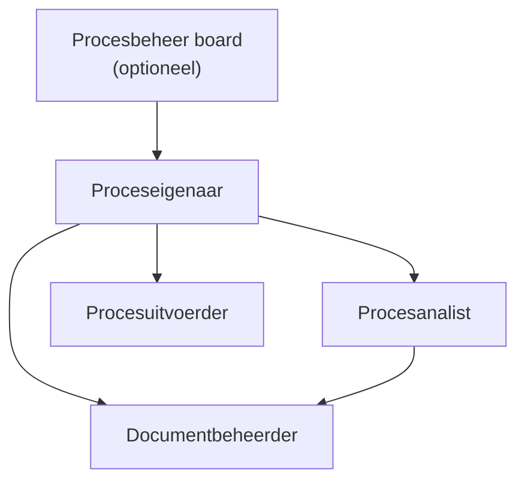

#### Rollen en verantwoordelijkheden

Binnen het Procesdocumentatiemodel (PDM) zijn rollen en verantwoordelijkheden essentieel om eigenaarschap, kwaliteit en consistentie van procesdocumentatie te waarborgen.

Elke rol heeft een duidelijk gedefinieerde verantwoordelijkheid binnen zowel procesuitvoering als procesdocumentatie.

#### Kernrollen

Toelichting
- beheer board stuurt op hoofdlijnen
- Proceseigenaar is centrale schakel
- Analist, uitvoerder en documentbeheerder werken onder eigenaarschap van proceseigenaar
- Analist heeft functionele relatie met documentbeheer (kwaliteit/structuur)

##### Proceseigenaar

De proceseigenaar is eindverantwoordelijk voor het proces.

Verantwoordelijkheden:
- eindverantwoordelijk voor procesresultaat  
- goedkeuren van proceswijzigingen  
- bewaken van procesprestaties  
- prioriteren van verbeterinitiatieven  

##### Procesanalist

De procesanalist is verantwoordelijk voor het modelleren en documenteren van processen.

Verantwoordelijkheden:
- opstellen en onderhouden van procesmodellen  
- vertalen van procesinformatie naar PDM-structuur  
- ondersteunen bij procesanalyse  
- bewaken van modelleerconventies  

##### Procesuitvoerder
De procesuitvoerder voert de operationele processtappen uit.

Verantwoordelijkheden:
- uitvoeren van procesactiviteiten  
- signaleren van afwijkingen  
- rapporteren van knelpunten  

##### Documentbeheerder
De documentbeheerder beheert de procesdocumentatie binnen het PDM.

Verantwoordelijkheden:
- versiebeheer van procesdocumentatie  
- publicatie van goedgekeurde versies  
- archiveren van verouderde processen  
- bewaken van documentstructuur en consistentie  

##### Procesbeheer board (optioneel)

Een beheer board bewaakt de strategische samenhang van processen.

Verantwoordelijkheden:
- prioriteren van procesverbeteringen  
- bewaken van architectuurconsistentie  
- goedkeuren van grote proceswijzigingen 

#### RACI-Matrix

|Activiteit / Rol|Proceseigenaar|Procesanalist|Procesuitvoerder|Documentbeheerder|beheer board|
|---|---|---|---|---|---|
|Procesdoel vaststellen|A|C|I|I|C|
|Proces modelleren (PDM)|C|R|I|C|I|
|Proces uitvoeren|A|I|R|I|I|
|Procesdocumentatie beheren|C|C|I|R|I|
|Versies publiceren|A|C|I|R|I|
|Procesverbeteringen initiëren|A|R|C|C|C|
|Grote proceswijzigingen goedkeuren|A|C|I|I|R|
|Architectuur bewaken (PDM consistentie)|C|R|I|C|A|