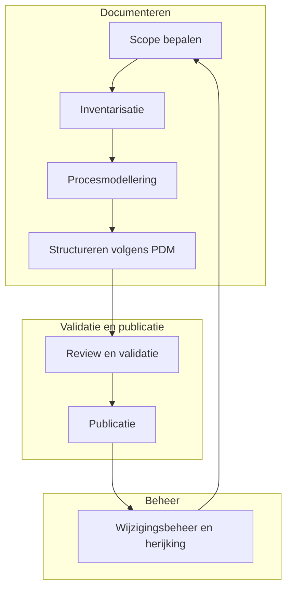

Procesdocumentatie ontstaat niet in één stap. Het is een iteratief proces waarin informatie wordt verzameld, gestructureerd, gevalideerd en onderhouden.

Binnen de werkwijze van de Procesdocumentalist wordt procesdocumentatie gezien als een cyclisch proces. Documentatie wordt opgesteld, gevalideerd en gepubliceerd, maar daarna ook periodiek herijkt om te voorkomen dat informatie veroudert.

Dit proces zorgt ervoor dat procesdocumentatie:

- consistent wordt opgebouwd
- gevalideerd is door proceseigenaren
- toegankelijk is voor de organisatie
- actueel blijft bij veranderingen

De procesdocumentatiecyclus bestaat uit zeven stappen.

#### Scope en context bepalen

Voordat een proces wordt gedocumenteerd, wordt eerst vastgesteld:

- welk proces wordt beschreven
- wat het doel van de documentatie is
- welke afbakening wordt gehanteerd

Dit voorkomt dat processen te breed of te gedetailleerd worden beschreven.
#### Inventarisatie van procesinformatie

In deze fase wordt informatie verzameld uit verschillende bronnen, zoals:

- interviews met procesbetrokkenen
- workshops met stakeholders
- bestaande documentatie
- werkinstructies en systemen

De verzamelde informatie vormt de basis voor het procesmodel.
#### Procesmodellering

Op basis van de verzamelde informatie wordt het proces gemodelleerd.

Dit gebeurt doorgaans met een procesdiagram, bijvoorbeeld in BPMN.  
Het model maakt zichtbaar:

- processtappen
- volgorde van activiteiten
- rollen en verantwoordelijkheden
- beslismomenten
#### Structureren volgens het PDM

De procesinformatie wordt vervolgens vastgelegd volgens het Procesdocumentatiemodel (PDM).

Hierbij worden onder andere vastgelegd:

- procesdoel
- procescontext
- activiteiten
- rollen
- uitzonderingen en varianten

Dit zorgt voor consistente procesdocumentatie.
#### 5. Review en validatie

Het conceptproces wordt vervolgens gereviewd door:

- de proceseigenaar
- procesuitvoerders
- relevante stakeholders

Tijdens deze stap wordt gecontroleerd of:

- het proces correct is beschreven
- belangrijke stappen niet ontbreken
- verantwoordelijkheden juist zijn vastgelegd

Zie ook: [02.01.03 Reviewproces](02.01.03%20Reviewproces.md) voor details omtrent het reviewproces. 
#### Publicatie

Na goedkeuring wordt de procesdocumentatie gepubliceerd in het documentatieplatform van de organisatie.

Dit kan bijvoorbeeld een:

- kennisbank
- procesrepository
- documentmanagementsysteem

zijn.

Zie: [02.01.04 Publicatieproces](02.01.04%20Publicatieproces.md) voor details omtrent het publicatieproces.
#### 7. Beheer en periodieke herijking

Processen veranderen voortdurend. Daarom wordt procesdocumentatie periodiek herzien.

Herijking kan plaatsvinden:

- bij proceswijzigingen
- tijdens audits
- op vaste reviewmomenten

Hiermee blijft de documentatie actueel en bruikbaar.

Zie: [02.01.05 Wijzigingsbeheer](02.01.05%20Wijzigingsbeheer.md) voor details omtrent het wijzigingsproces. 