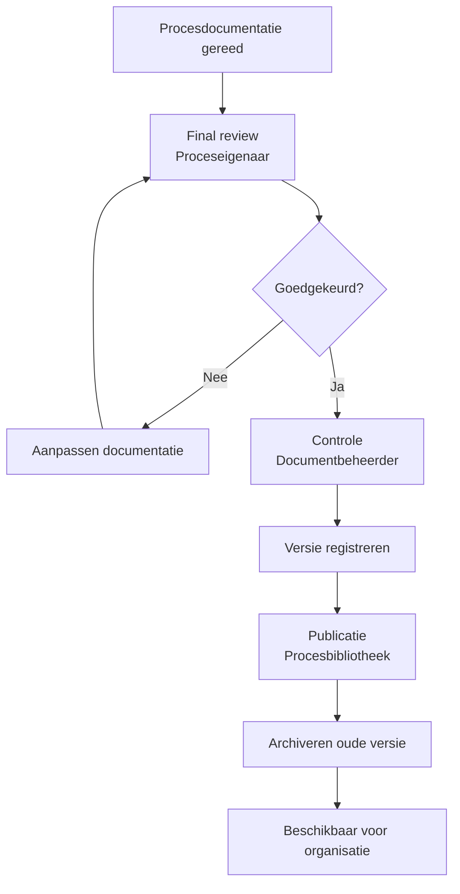

Het publicatieproces beschrijft hoe goedgekeurde procesdocumentatie formeel wordt vrijgegeven binnen de organisatie en beschikbaar wordt gesteld aan gebruikers.

Binnen het Procesdocumentatiemodel (PDM) vormt publicatie de laatste stap van de documentatiecyclus. Pas na publicatie wordt procesinformatie beschouwd als de geldende, officiële versie.

Het publicatieproces zorgt er daarmee voor dat procesdocumentatie betrouwbaar, traceerbaar en consistent beschikbaar is.

#### Doel

Het publicatieproces waarborgt dat alleen:

- goedgekeurde  
- gevalideerde  
- actuele  

procesdocumentatie beschikbaar is voor gebruikers.

Daarnaast zorgt het proces ervoor dat:

- de herkomst van documentatie traceerbaar blijft  
- eerdere versies beheerd worden gearchiveerd  
- gebruikers altijd toegang hebben tot de laatst geldende versie

#### Publicatiestappen

De publicatie van procesdocumentatie verloopt via een aantal vaste stappen.

1. Final review door proceseigenaar  
2. Controle door documentbeheerder  
3. Versiebevestiging en registratie  
4. Publicatie in centrale procesbibliotheek  
5. Intrekking van oude versie (archivering)  
6. Communicatie naar gebruikers (indien relevant)

Deze stappen zorgen ervoor dat publicatie gecontroleerd en reproduceerbaar plaatsvindt.

#### Publicatieproces

Het diagram laat zien dat publicatie pas plaatsvindt nadat de proceseigenaar de documentatie heeft goedgekeurd en de documentbeheerder de formele controle heeft uitgevoerd.

#### Publicatieregels

Om de betrouwbaarheid van procesdocumentatie te waarborgen gelden de volgende regels:

- alleen goedgekeurde versies worden gepubliceerd
- publicatie gebeurt altijd via het formele publicatieproces
- oude versies blijven gearchiveerd beschikbaar
- publicatie is volledig traceerbaar
- elke publicatie heeft een unieke versie-ID
- elke publicatie bevat publicatiedatum en verantwoordelijke rol

Hiermee ontstaat een gecontroleerde en auditbare documentatieomgeving.

#### Publicatiekanalen

Procesdocumentatie wordt gepubliceerd via één of meerdere centrale kanalen:

- centrale procesrepository
- intranet of kennisplatform
- procesmanagementtool (bijvoorbeeld BPM-tooling)

Organisaties streven idealiter naar één centrale bron van waarheid (single source of truth) voor procesdocumentatie.

#### Rollen en verantwoordelijkheden

Publicatie van procesdocumentatie is een samenwerking tussen verschillende rollen binnen de organisatie.

|Rol|Verantwoordelijkheid|
|---|---|
|Proceseigenaar|Goedkeuren van de definitieve procesdocumentatie|
|Procesanalist|Opleveren van de definitieve documentatie|
|Documentbeheerder|Controle op structuur, metadata en versiebeheer|
|Procesbeheer|Bewaken van standaarden en publicatiebeleid|
|Gebruikers|Raadplegen en toepassen van de gepubliceerde documentatie|

#### RACI-matrix

|Activiteit|Proceseigenaar|Procesanalist|Documentbeheerder|Procesbeheer|
|---|---|---|---|---|
|Opleveren procesdocumentatie|C|R|I|I|
|Final review|A|R|I|C|
|Documentcontrole|I|C|R|C|
|Versiebeheer|I|I|R|C|
|Publicatie|A|I|R|C|
|Archivering oude versie|I|I|R|C|
|Communicatie over publicatie|A|C|R|C|

R = Responsible  
A = Accountable  
C = Consulted  
I = Informed

#### Relatie met andere beheerprocessen

Het publicatieproces staat niet op zichzelf. Het is nauw verbonden met:

- het reviewproces, waarin procesdocumentatie wordt gevalideerd
- wijzigingsbeheer, waarin wijzigingen worden geregistreerd en beoordeeld
- modelleringstandaarden, die zorgen voor consistente documentatie

Samen vormen deze processen het beheerkader van het Procesdocumentatiemodel.

#### Resultaat van het publicatieproces

Na succesvolle afronding van het publicatieproces:

- is procesdocumentatie formeel vastgesteld
- is één actuele versie beschikbaar voor de organisatie
- zijn eerdere versies veilig gearchiveerd
- is de publicatie volledig traceerbaar

Hiermee ontstaat een betrouwbare en beheersbare procesbibliotheek.