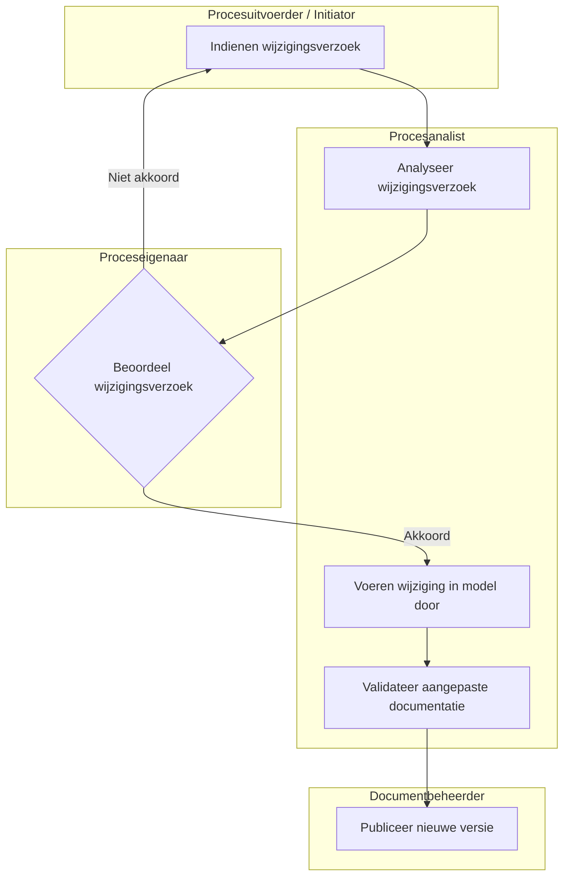

Wijzigingsbeheer binnen het Procesdocumentatiemodel (PDM) regelt hoe wijzigingen in procesdocumentatie gecontroleerd, beoordeeld en doorgevoerd worden.

Het doel is om te voorkomen dat procesdocumentatie inconsistent of ongecontroleerd verandert.

#### Principes

Wijzigingsbeheer is gebaseerd op de volgende principes:

- elke wijziging is traceerbaar  
- wijzigingen worden vooraf beoordeeld  
- goedkeuring is verplicht vóór publicatie  
- eerdere versies blijven beschikbaar  
- wijzigingen zijn gedocumenteerd  

#### Wijzigingstypes

##### Kleine wijziging
- tekstuele correcties  
- verduidelijking zonder procesimpact  

##### Middelgrote wijziging
- aanpassing in werkinstructies  
- wijziging in verantwoordelijkheden  

##### Grote wijziging
- wijziging in procesflow  
- impact op systemen of KPI’s  
- herontwerp van processtappen  

#### Wijzigingsproces

Toelichting

- Het initiatief ligt bij procesuitvoerder
- De analyse en de modellering liggen bij procesanalist
- Het besluit ligt bij proceseigenaar
- De publicatie ligt bij documentbeheerder
- Een feedback-loop bij afwijzing terug naar start

#####

|Activiteit|Procesuitvoerder|Procesanalist|Proceseigenaar|Documentbeheerder|beheer board|
|---|---|---|---|---|---|
|Wijzigingsverzoek indienen|R|I|I|I|I|
|Wijzigingsverzoek analyseren|C|R|I|I|I|
|Beoordeling wijzigingsverzoek|I|C|A|I|C|
|Doorvoeren wijziging in model|I|R|C|I|I|
|Validatie van documentatie|I|R|C|C|I|
|Publicatie nieuwe versie|I|C|A|R|I|

#### Versiebeheer

Elke wijziging resulteert in een nieuwe versie van het procesdocument:

- v0.x = conceptfase  
- v1.0 = eerste goedgekeurde versie  
- v1.x = kleine wijzigingen  
- v2.0 = structurele herziening  