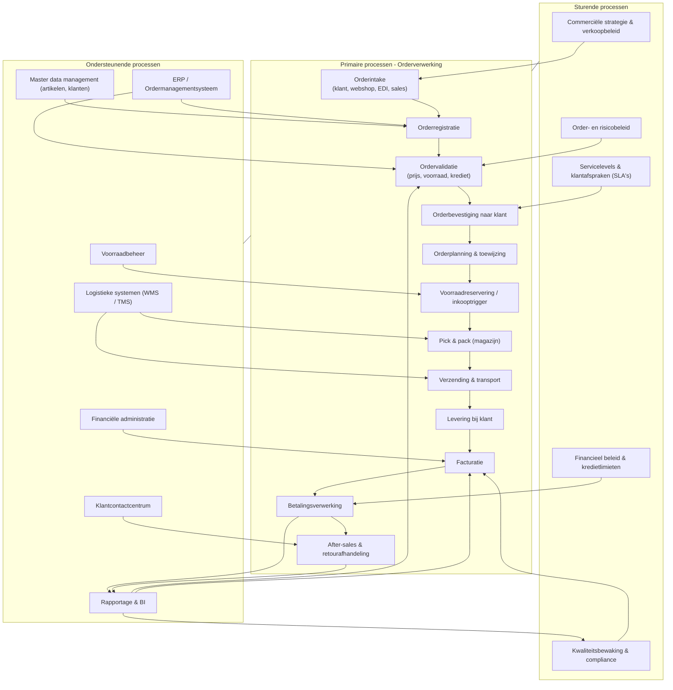

De proceslandkaart is een visuele representatie van alle processen binnen een organisatie, gegroepeerd in samenhangende procesgebieden.

#### Doel

De proceslandkaart heeft als doel om:

- het volledige proceslandschap inzichtelijk te maken  
- samenhang tussen processen te visualiseren  
- strategische en operationele processen te onderscheiden  
- communicatie over processen te vereenvoudigen  
- 
#### Procescategorieën

Binnen de meeste organisaties worden processen gegroepeerd in:

##### Primaire processen

Processen die direct waarde leveren aan de klant.

- orderverwerking  
- productie  
- levering  
- serviceverlening  

##### Ondersteunende processen

Processen die primaire processen ondersteunen.

- HR  
- IT  
- finance  
- facility management  
##### Sturende processen
Processen die richting en controle geven.

- strategie  
- beheer  
- kwaliteitsmanagement  
#### Belang van de proceslandkaart

De proceslandkaart zorgt voor:

- overzicht op organisatieniveau  
- betere procesafstemming  
- identificatie van afhankelijkheden  
- ondersteuning van procesoptimalisatie  

#### Voorbeeld proceslandkaart van een orderverwerkingsproces

