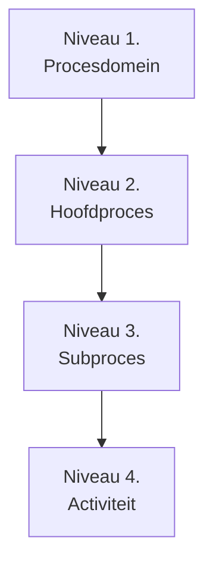

Proceshiërarchie beschrijft de gelaagde opbouw van processen binnen een organisatie, van strategisch niveau tot operationeel detailniveau.
#### Doel

De proceshiërarchie heeft als doel om:

- structuur aan te brengen in procescomplexiteit  
- processen logisch te decomponeren  
- consistentie in detailniveau te waarborgen  
- navigatie door procesdocumentatie te ondersteunen  
#### Hiërarchische niveaus

##### Niveau 1: Procesdomein
Grote procesgebieden binnen de organisatie.

- Order-to-Cash  
- Hire-to-Retire  
- Procure-to-Pay  
##### Niveau 2: Hoofdproces
Belangrijke end-to-end processen binnen een domein.

- Orderverwerking  
- Facturatie  
- Inkoopproces  
##### Niveau 3: Subproces
Deel van een hoofdproces met een specifieke functie.

- ordervalidatie  
- voorraadcontrole  
- levering vrijgave  
##### Niveau 4: Activiteiten
Concrete processtappen.

- klantgegevens controleren  
- order registreren  
- verzending aanmaken  
#### Belangrijk principe

Elke laag in de hiërarchie:

- heeft een eigen consistent detailniveau  
- draagt bij aan het bovenliggende proces  
- kan zelfstandig worden beschreven binnen het PDM  
#### Relatie met procesmodellering

Proceshiërarchie vormt de basis voor:

- BPMN-modellen  
- procesdiagrammen  
- werkinstructies  
- procesdocumentatie-structuur  