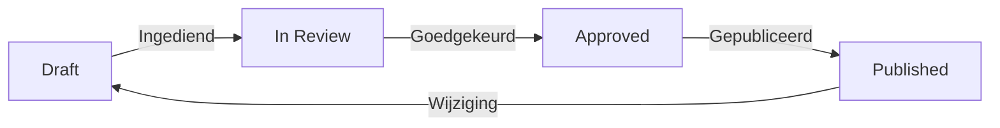

#### Inleiding

Dit template beschrijft hoe de procesdocumentatie voor {{procesnaam}} wordt beheerd, onderhouden en geactualiseerd. Het doel is om ervoor te zorgen dat de documentatie accuraat, actueel en toegankelijk blijft voor alle betrokkenen. Dit template is bedoeld voor proceseigenaren, procesanalisten, reviewboards en systeembeheerders.

#### Eigenschappen

| Veld           | Waarde                | Toelichting                                                                              |
| -------------- | --------------------- | ---------------------------------------------------------------------------------------- |
| PMD-nummer | 03.01.00              | Uniek identificatienummer voor dit proces in het Proces Management Document (PMD).       |
| Versie     | 1                     | Huidige versie van dit document. Wordt geüpdaterd bij elke wijziging.                    |
| Status     | concept               | Mogelijke statussen: *concept*, *in review*, *goedgekeurd*, *gepubliceerd*, *verouderd*. |
| Auteur     | [Naam]                | De persoon of afdeling die dit document heeft opgesteld.                                 |
| Eigenaar   | [Naam proceseigenaar] | Verantwoordelijk voor de inhoud en actualiteit van het proces.                           |
| Datum      | 17/04/2026            | Datum van de laatste update.                                                             |

#### 1. Doel en Scope

Doel:  
Zorgdragen voor een gestructureerd en consistent beheer van de procesdocumentatie, zodat:

- Medewerkers toegang hebben tot betrouwbare en actuele informatie.
- Wijzigingen gecontroleerd en traceerbaar worden doorgevoerd.
- De documentatie voldoet aan de organisatiestandaarden (bijv. PDM-structuur).

Scope:  
Dit template is van toepassing op alle procesdocumentatie binnen {{organisatienaam}}, inclusief:

- Procesbeschrijvingen
- Werkinstructies
- Stroomdiagrammen (bijv. BPMN)
- Handleidingen en templates

#### 2. Beheerorganisatie

##### Rollen en Verantwoordelijkheden

| Rol                | Verantwoordelijkheid                                                                         | Contact         |
| ------------------ | -------------------------------------------------------------------------------------------- | --------------- |
| Proceseigenaar | Eindverantwoordelijk voor de inhoud en actualiteit van het proces.                           | [Naam/afdeling] |
| Procesanalist  | Ondersteunt bij het analyseren, documenteren en optimaliseren van processen.                 | [Naam/afdeling] |
| Reviewboard    | Beoordeelt wijzigingen op inhoudelijke juistheid en haalbaarheid.                            | [Leden]         |
| Systeembeheer  | Zorgt voor technische publicatie en versiebeheer in systemen (bijv. Confluence, SharePoint). | [Naam/afdeling] |

#### 3. Wijzigingsbeheer

Beschrijf hier hoe wijzigingen in de procesdocumentatie worden aangemeld, beoordeeld en geïmplementeerd.

##### Stappenplan Wijzigingsproces

1. Wijzigingsverzoek
  - Indienen via [systeem/email/formulier].
  - Vermeld: reden, impact, gewenste wijziging, en deadline.
1. Impactanalyse
  - Beoordelen door procesanalist: wat verandert er? (bijv. processen, systemen, rollen).
  - Risico’s en afhankelijkheden in kaart brengen.
1. Review
  - Reviewboard beoordeelt de wijziging op:
    - Inhoudelijke juistheid
    - Haalbaarheid
    - Compliance (bijv. wet- en regelgeving)
1. Goedkeuring
  - Proceseigenaar keurt de wijziging schriftelijk goed.
1. Publicatie
  - Systeembeheer publiceert de update in [systeemnaam] en communiceert dit naar betrokkenen.

#### 4. Reviewcyclus

| Type Review   | Frequentie                                                     | Verantwoordelijke | Doel                                                         |
| ------------- | -------------------------------------------------------------- | ----------------- | ------------------------------------------------------------ |
| Periodiek | Jaarlijks / Halfjaarlijks                                      | Proceseigenaar    | Zorgdragen voor actualiteit en verbeterpunten identificeren. |
| Ad hoc    | Bij grote wijzigingen (bijv. nieuwe wetgeving, systeemupdates) | Procesanalist     | Directe aanpassingen doorvoeren waar nodig.                  |

#### 5. Publicatieproces

- Draft: Werkversie, alleen zichtbaar voor auteurs en reviewers.
- In Review: Onder beoordeling door reviewboard.
- Approved: Goedgekeurd, wachtend op publicatie.
- Published: Beschikbaar voor alle betrokkenen.

#### 6. Standaarden en Richtlijnen

Verplicht:

- Gebruik van de PDM-structuur (Proces Management Document).
- Versiebeheer volgens [organisatiestandaard].
- Documentatie in Confluence/SharePoint met correcte metadata.

Niet toegestaan:

- Afwijkingen van de PDM-structuur zonder schriftelijke goedkeuring van de proceseigenaar.
- Publicatie van conceptversies zonder review.

#### 7. Bijlagen en Referenties

- [Link naar PDM-handboek]
- [Link naar template voor wijzigingsverzoek]
- [Reviewproces](02.01.03%20Reviewproces.md)
#### 8. Versiehistorie

| Versie        | Datum      | Wijziging       | Auteur |
| ------------- | ---------- | --------------- | ------ |
| 1.0           | 17/04/2026 | Initiële versie | [Naam] |
| </canvaentity | &nbsp;     | &nbsp;          | &nbsp; |

