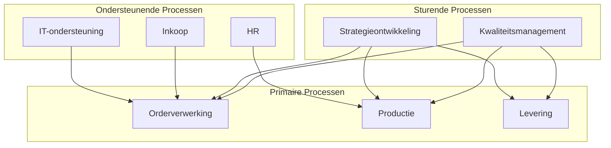

#### Inleiding

Een proceslandkaart is een visueel en structuurgevend overzicht van alle processen binnen {{organisatienaam}}. Het doel is om:  
- Inzicht te bieden in de hoofdprocessen en hun onderlinge relaties.  
- Een startpunt te creëren voor verdere procesdocumentatie, analyse en optimalisatie.  
- Stakeholders (management, teams, externe partijen) een helder beeld te geven van de processtructuur van de organisatie.  
- Consistentie te waarborgen in de benaming en indeling van processen.

#### Eigenschappen

| Veld           | Waarde                            | Toelichting                                                                                  |
| -------------- | --------------------------------- | -------------------------------------------------------------------------------------------- |
| PMD-nummer | 03.04.01                          | Uniek identificatienummer voor deze proceslandkaart in het Proces Management Document (PMD). |
| Versie     | 1                                 | Huidige versie van dit document. Wordt geüpdaterd bij elke wijziging.                        |
| Status     | concept                           | Mogelijke statussen: *concept*, *in review*, *goedgekeurd*, *gepubliceerd*, *verouderd*.     |
| Auteur     | [Naam]                            | De persoon of afdeling die dit document heeft opgesteld (meestal de procesanalist).          |
| Eigenaar   | [Naam proceseigenaar/organisatie] | Verantwoordelijk voor de inhoud en actualiteit van de proceslandkaart.                       |
| Datum      | 17/04/2026                        | Datum van de laatste update.                                                                 |

#### 1. Wat is een Proceslandkaart?

Een proceslandkaart is een hoogniveau-overzicht dat:

- Alle hoofdprocessen van de organisatie in kaart brengt.
- Categorieën gebruikt om processen te groeperen (bijv. primair, ondersteunend, sturend).
- Relaties tussen processen visueel maakt (bijv. input/output, afhankelijkheden).
- Eenduidige terminologie bevordert voor alle betrokkenen.

Doelgroep:

- Management: Voor strategische besluitvorming en overzicht.
- Procesanalisten: Als basis voor verdere detaillering.
- Medewerkers: Om hun eigen proces in de context van de organisatie te plaatsen.
- Externe partijen: Voor inzicht in hoe de organisatie werkt.

#### 2. Structuur van een Proceslandkaart

Processen worden ingedeeld in drie hoofdcategorieën:

| Categorie     | Definitie                                                                | Voorbeelden                                         | Doel                                       |
| ----------------- | ---------------------------------------------------------------------------- | ------------------------------------------------------- | ---------------------------------------------- |
| Primair       | Processen die direct waarde toevoegen voor de klant of externe partijen. | Orderverwerking, Productie, Klantenservice              | Creëren van producten/diensten voor de klant.  |
| Ondersteunend | Processen die de primaire processen faciliteren.                         | IT-ondersteuning, HR, Inkoop                            | Zorgen voor de benodigde middelen en diensten. |
| Sturend       | Processen die richting en controle bieden aan de organisatie.            | Strategieontwikkeling, Kwaliteitsmanagement, Compliance | Zorgen voor sturing, beleid en naleving.       |

#### 3. Proceslandkaart Template

Vul de onderstaande tabel in met de hoofdprocessen van de organisatie. Beperk je tot 10–20 hoofdprocessen voor overzichtelijkheid.

| Procescategorie | Procesnaam | Beschrijving                                                                     | Proceseigenaar | Gerelateerde processen         | PMD-nummer |
| ------------------- | -------------- | ------------------------------------------------------------------------------------ | ------------------ | ---------------------------------- | -------------- |
| Primair             | [Naam]         | [Korte beschrijving, bijv. "Beheer van klantorders van ontvangst tot levering"]      | [Naam/afdeling]    | [Lijst van gerelateerde processen] | [PMD-nummer]   |
| Primair             | [Naam]         | [Korte beschrijving]                                                                 | [Naam/afdeling]    | [Lijst]                            | [PMD-nummer]   |
| Ondersteunend       | [Naam]         | [Korte beschrijving, bijv. "Beheer van IT-infrastructuur"]                           | [Naam/afdeling]    | [Lijst]                            | [PMD-nummer]   |
| Ondersteunend       | [Naam]         | [Korte beschrijving]                                                                 | [Naam/afdeling]    | [Lijst]                            | [PMD-nummer]   |
| Sturend             | [Naam]         | [Korte beschrijving, bijv. "Ontwikkeling en implementatie van organisatiestrategie"] | [Naam/afdeling]    | [Lijst]                            | [PMD-nummer]   |
| Sturend             | [Naam]         | [Korte beschrijving]                                                                 | [Naam/afdeling]    | [Lijst]                            | [PMD-nummer]   |

#### 4. Visuele Weergave

Gebruik een visueel diagram (bijv. in Mermaid) om de proceslandkaart grafisch weer te geven. Dit maakt de samenhang tussen processen direct inzichtelijk.

Voorbeeld:

#### 5. Relaties tussen Processen

Beschrijf hier de belangrijkste relaties tussen processen, zoals:

- Input/Output: Welke processen leveren input voor andere processen?
- Afhankelijkheden: Welke processen zijn afhankelijk van elkaar?
- Sturing: Welke sturende processen beïnvloeden primaire/ondersteunende processen?

| Proces A | Relatietype | Proces B | Beschrijving                                                       |
| ------------ | --------------- | ------------ | ---------------------------------------------------------------------- |
| [Naam]       | Input →         | [Naam]       | [Beschrijving, bijv. "Levert klantgegevens voor orderverwerking"]      |
| [Naam]       | Afhankelijk van | [Naam]       | [Beschrijving]                                                         |
| [Naam]       | Sturing →       | [Naam]       | [Beschrijving, bijv. "Bepaalt de richtlijnen voor productiekwaliteit"] |

#### 6. Stakeholders en Verantwoordelijkheden

Geef hier een overzicht van de belangrijkste stakeholders en hun rol in de proceslandkaart.

| Stakeholder          | Rol       | Verantwoordelijkheid                  | Betrokkenheid  |
| ------------------------ | ------------- | ----------------------------------------- | ------------------ |
| [Bijv. "Directie"]       | Strategisch   | Goedkeuring van de proceslandkaart        | Jaarlijks review   |
| [Bijv. "Proceseigenaar"] | Tactisch      | Zorgen voor actualiteit van processen     | Maandelijks update |
| [Bijv. "Procesanalist"]  | Operationeel  | Opstellen en onderhouden van de landkaart | Continu            |
| [Bijv. "IT-afdeling"]    | Ondersteunend | Technische integratie van processen       | Ad hoc             |

#### 7. Tips voor een Effectieve Proceslandkaart

🔹 Beperk de omvang: Houd de landkaart beperkt tot 10–20 hoofdprocessen om overzichtelijkheid te behouden.  
🔹 Gebruik duidelijke namen: Kies eenduidige en begrijpelijke procesnamen (bijv. "Orderverwerking" in plaats van "Proces A").  
🔹 Vermijd te veel detail: De landkaart is een hoogniveau-overzicht; details horen in procesbeschrijvingen.  
🔹 Gebruik visuele hulpmiddelen: Diagrammen (bijv. Mermaid, Lucidchart) maken de samenhang inzichtelijk.  
🔹 Betrek stakeholders: Zorg dat alle proceseigenaren de landkaart valideren.  
🔹 Koppel aan PMD: Zorg dat elk proces een uniek PMD-nummer heeft voor traceerbaarheid.  
🔹 Houd het actueel: Update de landkaart minimaal jaarlijks of bij grote organisatieveranderingen.

#### 8. Gerelateerde Documenten

Lijst hier alle gerelateerde documenten, zoals:

- [Link naar gedetailleerde procesbeschrijvingen]
- [Link naar BPMN-diagrammen]
- [Link naar procesarchitectuur]
- [Link naar wijzigingslogs]

#### 9. Versiehistorie

| Versie | Datum  | Wijziging   | Auteur |
| ---------- | ---------- | --------------- | ---------- |
| 1.0        | 17/04/2026 | Initiële versie | [Naam]     |

#### 10. Instructies voor Gebruik

1. Start met een brainstorm:
  - Betrek proceseigenaren en stakeholders om alle hoofdprocessen in kaart te brengen.
1. Categoriseer processen:
  - Deel processen in in primair, ondersteunend en sturend.
1. Definieer relaties:
  - Bepaal input/output en afhankelijkheden tussen processen.
1. Valideer met stakeholders:
  - Laat de landkaart reviewen door management en proceseigenaren.
1. Visualiseer:
  - Maak een visueel diagram (bijv. met Mermaid of een BPMN-tool).
1. Publiceer en communiceer:
  - Deel de landkaart met alle betrokkenen (bijv. via Confluence of SharePoint).

#### 11. Voorbeeld: Ingevulde Proceslandkaart (Fictieve Organisatie)

| Procescategorie | Procesnaam        | Beschrijving                                   | Proceseigenaar | Gerelateerde processen          | PMD-nummer |
| ------------------- | --------------------- | -------------------------------------------------- | ------------------ | ----------------------------------- | -------------- |
| Primair             | Orderverwerking       | Beheer van klantorders van ontvangst tot levering. | Sales              | Inkoop, Productie, Levering         | PMD-01.01.00   |
| Primair             | Productie             | Fabricage van producten volgens specificaties.     | Productie          | Orderverwerking, Kwaliteitscontrole | PMD-01.02.00   |
| Ondersteunend       | IT-ondersteuning      | Beheer van IT-systemen en infrastructuur.          | IT                 | Orderverwerking, HR                 | PMD-02.01.00   |
| Ondersteunend       | HR                    | Beheer van personeel en organisatieontwikkeling.   | HR                 | IT-ondersteuning, Strategie         | PMD-02.02.00   |
| Sturend             | Strategieontwikkeling | Ontwikkeling van organisatiestrategie en doelen.   | Directie           | HR, Financiën                       | PMD-03.01.00   |
| Sturend             | Kwaliteitsmanagement  | Zorgen voor naleving van kwaliteitsnormen.         | Kwaliteit          | Productie, Orderverwerking          | PMD-03.02.00   |