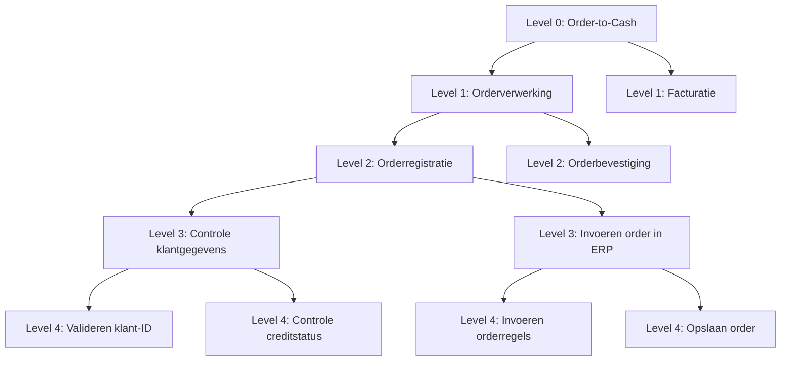

#### Inleiding

Een proceshiërarchie beschrijft de gestructureerde opbouw van processen binnen een organisatie, opgedeeld in verschillende detailniveaus. Dit template helpt om:  
- Inzicht te bieden in hoe processen opgebouwd zijn, van hoog naar laag niveau.  
- Consistentie te waarborgen in de benaming en indeling van processen.  
- Basis te leggen voor gedetailleerde procesdocumentatie (bijv. BPMN-diagrammen, werkinstructies).  
- Stakeholders (management, procesanalisten, uitvoerende teams) een duidelijk overzicht te geven van de processtructuur.

#### Eigenschappen

| Veld           | Waarde                | Toelichting                                                                                   |
| -------------- | --------------------- | --------------------------------------------------------------------------------------------- |
| PMD-nummer | 03.04.02              | Uniek identificatienummer voor deze proceshiërarchie in het Proces Management Document (PMD). |
| Versie     | 1                     | Huidige versie van dit document. Wordt geüpdaterd bij elke wijziging.                         |
| Status     | concept               | Mogelijke statussen: *concept*, *in review*, *goedgekeurd*, *gepubliceerd*, *verouderd*.      |
| Auteur     | [Naam]                | De persoon of afdeling die dit document heeft opgesteld (meestal de procesanalist).           |
| Eigenaar   | [Naam proceseigenaar] | Verantwoordelijk voor de inhoud en actualiteit van de proceshiërarchie.                       |
| Datum      | 17/04/2026            | Datum van de laatste update.                                                                  |

#### 1. Wat is een Proceshiërarchie?

Een proceshiërarchie is een gestructureerde weergave van processen, opgedeeld in niveaus met toenemend detail. Dit helpt om:

- Complexe processen te ontleden in beheersbare onderdelen.
- Verantwoordelijkheden duidelijk toe te wijzen per niveau.
- Documentatie te koppelen aan specifieke procesniveaus (bijv. werkinstructies op niveau 4).
- Analyse en optimalisatie gerichter uit te voeren.

Doelgroep:

- Management: Voor overzicht en strategische besluitvorming.
- Procesanalisten: Als basis voor verdere detaillering en modelleren (bijv. BPMN).
- Uitvoerende teams: Om hun eigen taken in de context van het gehele proces te plaatsen.

#### 2. Typische Hiërarchie en Niveaus

Hieronder een standaardindeling van procesniveaus, met voorbeelden. Pas deze aan op basis van de complexiteit en behoeften van je organisatie.

| Niveau  | Type          | Beschrijving                                                     | Voorbeeld                                  | Documentatietype    | Verantwoordelijke |
| ----------- | ----------------- | -------------------------------------------------------------------- | ---------------------------------------------- | ----------------------- | --------------------- |
| Level 0 | Organisatieproces | End-to-end proces dat waarde levert aan de klant of organisatie. | Order-to-Cash, Hire-to-Retire                  | Strategisch document    | Directie              |
| Level 1 | Hoofdproces       | Hoofdstappen binnen een organisatieproces.                       | Orderverwerking, Facturatie                    | Procesbeschrijving      | Proceseigenaar        |
| Level 2 | Deelproces        | Subprocessen die een hoofdproces ondersteunen.                   | Orderregistratie, Creditcheck                  | Processtroomdiagram     | Procesanalist         |
| Level 3 | Activiteit        | Specifieke taken binnen een deelproces.                          | Controle klantgegevens, Goedkeuring order      | Werkinstructie          | Teamleider            |
| Level 4 | Werkinstructie    | Detaillere stappen voor uitvoering van een activiteit.           | Invoeren order in ERP, Sturen bevestigingsmail | Stappenplan/Handleiding | Medewerker            |

Opmerking:

- Level 0 is optioneel en wordt vaak gebruikt voor end-to-end processen die meerdere afdelingen overspannen.
- Level 4 is het laagste niveau en bevat uitvoerbare instructies.

#### 3. Proceshiërarchie Template

Vul de onderstaande tabel in voor het hoofdproces waarvoor je de hiërarchie beschrijft. Gebruik één rij per procesniveau.

| Niveau | Procesnaam           | Beschrijving                                              | Parent Proces | PMD-nummer | Verantwoordelijke | Gerelateerde documenten | BPMN-diagram |
| ---------- | ------------------------ | ------------------------------------------------------------- | ----------------- | -------------- | --------------------- | --------------------------- | ---------------- |
| Level 0    | [Naam organisatieproces] | [Beschrijving, bijv. "End-to-end proces voor klantorders"]    | -                 | [PMD-nummer]   | [Naam]                | [Link]                      | [Link/Ja/Nee]    |
| Level 1    | [Naam hoofdproces]       | [Beschrijving, bijv. "Beheer van klantorders"]                | [Parent Proces]   | [PMD-nummer]   | [Naam]                | [Link]                      | [Link/Ja/Nee]    |
| Level 2    | [Naam deelproces]        | [Beschrijving, bijv. "Registratie van nieuwe orders"]         | [Parent Proces]   | [PMD-nummer]   | [Naam]                | [Link]                      | [Link/Ja/Nee]    |
| Level 3    | [Naam activiteit]        | [Beschrijving, bijv. "Controle van klantgegevens"]            | [Parent Proces]   | [PMD-nummer]   | [Naam]                | [Link]                      | [Link/Ja/Nee]    |
| Level 4    | [Naam werkinstructie]    | [Beschrijving, bijv. "Invoeren ordergegevens in ERP-systeem"] | [Parent Proces]   | [PMD-nummer]   | [Naam]                | [Link]                      | [Link/Ja/Nee]    |

#### 4. Visuele Weergave van de Hiërarchie

Gebruik een hiërarchisch diagram (bijv. in Mermaid) om de proceshiërarchie visueel weer te geven. Dit maakt de structuur en relaties direct inzichtelijk.

Voorbeeld:

#### 5. Relaties tussen Niveaus

Beschrijf hier hoe de verschillende niveaus met elkaar samenhangen. Gebruik de onderstaande tabel om input/output en afhankelijkheden tussen niveaus weer te geven.

| Niveau | Proces       | Input van                     | Output naar                          | Afhankelijkheden                  |
| ---------- | ---------------- | --------------------------------- | ---------------------------------------- | ------------------------------------- |
| Level 1    | Orderverwerking  | [Bijv. "Klantverzoek (Level 0)"]  | [Bijv. "Orderbevestiging (Level 2)"]     | [Bijv. "Beschikbaarheid ERP-systeem"] |
| Level 2    | Orderregistratie | [Bijv. "Klantgegevens (Level 1)"] | [Bijv. "Geregistreerde order (Level 3)"] | [Bijv. "Creditcheck goedgekeurd"]     |

#### 6. Documentatie per Niveau

Geef hier aan welke documentatie gekoppeld is aan elk niveau. Dit zorgt voor traceerbaarheid en consistentie.

| Niveau | Type Documentatie | Voorbeeld                                | Locatie               |
| ---------- | --------------------- | -------------------------------------------- | ------------------------- |
| Level 0    | Strategisch document  | Visie en scope van het organisatieproces     | Confluence/SharePoint     |
| Level 1    | Procesbeschrijving    | Stappen en verantwoordelijkheden hoofdproces | Confluence                |
| Level 2    | Processtroomdiagram   | BPMN-diagram van het deelproces              | BPMN-tool (bijv. Camunda) |
| Level 3    | Werkinstructie        | Stappenplan voor activiteiten                | SharePoint                |
| Level 4    | Handleiding           | Gedetailleerde instructies                   | Confluence                |

#### 7. Stakeholders en Verantwoordelijkheden per Niveau

Geef hier een overzicht van wie verantwoordelijk is voor elk niveau in de hiërarchie.

| Niveau | Rol        | Verantwoordelijkheid                  | Betrokkenheid  |
| ---------- | -------------- | ----------------------------------------- | ------------------ |
| Level 0    | Directie       | Goedkeuring en strategische sturing       | Jaarlijks review   |
| Level 1    | Proceseigenaar | Eigenaar van het hoofdproces              | Maandelijks update |
| Level 2    | Procesanalist  | Ontwerp en documentatie van deelprocessen | Continu            |
| Level 3    | Teamleider     | Uitvoering en monitoring van activiteiten | Wekelijks          |
| Level 4    | Medewerker     | Uitvoering van werkinstructies            | Dagelijks          |

#### 8. Tips voor een Effectieve Proceshiërarchie

- Houd het overzichtelijk: Beperk de hiërarchie tot maximaal 5 niveaus om complexiteit te vermijden.  
- Gebruik consistente benaming: Zorg voor eenduidige procesnamen (bijv. werkwoorden gebruiken: "Verwerken order" in plaats van "Orderverwerking").  
- Koppel aan BPMN: Gebruik BPMN-diagrammen om de hiërarchie visueel te ondersteunen.  
- Documenteer per niveau: Zorg dat elk niveau passende documentatie heeft (bijv. werkinstructies op niveau 4).  
- Valideer met stakeholders: Laat de hiërarchie reviewen door proceseigenaren en uitvoerende teams.  
- Houd het actueel: Update de hiërarchie bij wijzigingen in processen of organisatie.

#### 9. Gerelateerde Documenten

Lijst hier alle gerelateerde documenten, zoals:

- [Link naar proceslandkaart]
- [Link naar BPMN-diagrammen]
- [Link naar werkinstructies]
- [Link naar wijzigingslogs]

#### 10. Versiehistorie

| Versie | Datum  | Wijziging   | Auteur |
| ---------- | ---------- | --------------- | ---------- |
| 1.0        | 17/04/2026 | Initiële versie | [Naam]     |

#### 11. Instructies voor Gebruik

1. Start met Level 0:
  - Definieer het organisatieproces (indien van toepassing).
1. Werk naar beneden toe:
  - Vul eerst Level 1 (hoofdprocessen) in, gevolgd door Level 2, 3 en 4.
1. Gebruik parent-child relaties:
  - Zorg dat elk proces één parent proces heeft (behalve Level 0).
1. Koppel documentatie:
  - Voeg links toe naar gerelateerde documenten (bijv. BPMN-diagrammen, werkinstructies).
1. Visualiseer:
  - Maak een hiërarchisch diagram (bijv. met Mermaid) voor overzicht.
1. Valideer:
  - Laat de hiërarchie reviewen door proceseigenaren en stakeholders.

#### 12. Voorbeeld: Ingevulde Proceshiërarchie (Order-to-Cash)

| Niveau | Procesnaam         | Beschrijving                                                                   | Parent Proces      | PMD-nummer     | Verantwoordelijke | Gerelateerde documenten | BPMN-diagram |
| ---------- | ---------------------- | ---------------------------------------------------------------------------------- | ---------------------- | ------------------ | --------------------- | --------------------------- | ---------------- |
| Level 0    | Order-to-Cash          | End-to-end proces voor het afhandelen van klantorders, van ontvangst tot betaling. | -                      | PMD-01.00.00       | Directie              | [Link]                      | Ja               |
| Level 1    | Orderverwerking        | Beheer van klantorders, van ontvangst tot bevestiging.                             | Order-to-Cash          | PMD-01.01.00       | Sales Manager         | [Link]                      | Ja               |
| Level 2    | Orderregistratie       | Registratie en validatie van nieuwe orders.                                        | Orderverwerking        | PMD-01.01.01       | Order Team            | [Link]                      | Ja               |
| Level 3    | Controle klantgegevens | Controle of klantgegevens compleet en correct zijn.                                | Orderregistratie       | PMD-01.01.01.01    | Teamleider Orders     | [Link]                      | Nee              |
| Level 4    | Valideren klant-ID     | Controleren of de klant-ID geldig is in het CRM-systeem.                           | Controle klantgegevens | PMD-01.01.01.01.01 | Medewerker Orders     | [Link]                      | Nee              |