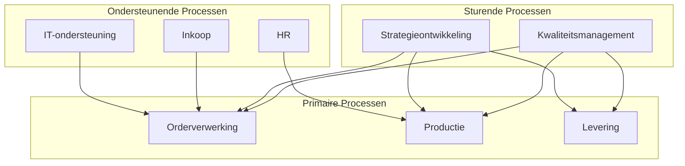

#### Inleiding

Een procesinventarisatie is een uitgebreid overzicht van alle processen binnen {{organisatienaam}}. Het doel is om:  
- Alle processen in kaart te brengen, zodat niets over het hoofd wordt gezien.  
- Inzicht te bieden in doel, verantwoordelijkheden, en samenhang tussen processen.  
- Een basis te leggen voor verdere analyse, optimalisatie, en automatisering.  
- Compliance en risicobeheer te ondersteunen door kritische processen te identificeren.

#### Eigenschappen

| Veld           | Waarde                            | Toelichting                                                                                       |
| -------------- | --------------------------------- | ------------------------------------------------------------------------------------------------- |
| PMD-nummer | 03.04.03                          | Uniek identificatienummer voor deze procesinventarisatie in het Proces Management Document (PMD). |
| Versie     | 1                                 | Huidige versie van dit document. Wordt geüpdaterd bij elke wijziging.                             |
| Status     | concept                           | Mogelijke statussen: *concept*, *in review*, *goedgekeurd*, *gepubliceerd*, *verouderd*.          |
| Auteur     | [Naam]                            | De persoon of afdeling die dit document heeft opgesteld (meestal de procesanalist).               |
| Eigenaar   | [Naam proceseigenaar/organisatie] | Verantwoordelijk voor de inhoud en actualiteit van de inventarisatie.                             |
| Datum      | 17/04/2026                        | Datum van de laatste update.                                                                      |

#### 1. Wat is een Procesinventarisatie?

Een procesinventarisatie is een systematisch overzicht van alle processen binnen een organisatie. Het omvat:

- Naam en beschrijving van elk proces.
- Doel en toegevoegde waarde van het proces.
- Verantwoordelijke afdeling en eigenaar.
- Input, output, en afhankelijkheden.
- Frequentie en kritikaliteit voor prioritering.

Doelgroep:

- Management: Voor strategische besluitvorming en overzicht.
- Procesanalisten: Als basis voor verdere detaillering en optimalisatie.
- Auditors: Voor compliance- en risicoanalyses.
- IT-afdeling: Voor systeemontwikkeling en integratie.

#### 2. Template voor Procesinventarisatie

Vul de onderstaande tabel in voor alle processen binnen de organisatie. Gebruik één rij per proces voor overzichtelijkheid.

| Procesnaam | Doel                                                        | Beschrijving     | Afdeling    | Proceseigenaar | PMD-nummer | Categorie                 | Input            | Output                 | Frequentie      | Kritikaliteit  | Gerelateerde processen         | Documentatie         |
| -------------- | --------------------------------------------------------------- | -------------------- | --------------- | ------------------ | -------------- | ----------------------------- | -------------------- | -------------------------- | ------------------- | ------------------ | ---------------------------------- | ------------------------ |
| [Naam]         | [Kort doel, bijv. "Zorgen voor tijdige levering van producten"] | [Korte beschrijving] | [Naam afdeling] | [Naam]             | [PMD-nummer]   | Primair/Ondersteunend/Sturend | [Bijv. "Klantorder"] | [Bijv. "Bevestigingsmail"] | [Bijv. "Dagelijks"] | [Hoog/Middel/Laag] | [Lijst van gerelateerde processen] | [Link naar documentatie] |

Toelichting velden:

- Doel: Wat wil het proces bereiken? (Bijv. "Klanttevredenheid verhogen", "Efficiëntie verbeteren").
- Categorie: Kies uit Primair, Ondersteunend, of Sturend (zie sectie 3).
- Frequentie: Hoe vaak wordt het proces uitgevoerd? (Bijv. "Dagelijks", "Wekelijks", "Maandelijks", "Ad hoc").
- Kritikaliteit: Hoe cruciaal is het proces voor de organisatie? (Hoog/Middel/Laag).
- Gerelateerde processen: Welke andere processen zijn afhankelijk van of beïnvloeden dit proces?

#### 3. Categorieën van Processen

Gebruik de volgende categorieën om processen te klassificeren:

| Categorie     | Definitie                                                                | Voorbeelden                                         |
| ----------------- | ---------------------------------------------------------------------------- | ------------------------------------------------------- |
| Primair       | Processen die direct waarde toevoegen voor de klant of externe partijen. | Orderverwerking, Productie, Klantenservice              |
| Ondersteunend | Processen die de primaire processen faciliteren.                         | IT-ondersteuning, HR, Inkoop                            |
| Sturend       | Processen die richting en controle bieden aan de organisatie.            | Strategieontwikkeling, Kwaliteitsmanagement, Compliance |

#### 4. Kritikaliteit en Prioritering

Gebruik de onderstaande kritikaliteitsmatrix om processen te prioriteren. Dit helpt bij het focus aanbrengen op de meest belangrijke processen.

| Kritikaliteit | Definitie                                                                                                       | Actie                                 |
| ----------------- | ------------------------------------------------------------------------------------------------------------------- | ----------------------------------------- |
| Hoog          | Proces is essentieel voor de organisatie (bijv. wettelijke verplichting, klanttevredenheid, financiële impact). | Direct documenteren en optimaliseren. |
| Middel        | Proces is belangrijk, maar niet kritiek voor de kernactiviteiten.                                               | Documenteren en periodiek reviewen.   |
| Laag          | Proces heeft beperkte impact op de organisatie.                                                                 | Documenteren indien nodig.            |

#### 5. Frequentie van Processen

Geef aan hoe vaak processen worden uitgevoerd, om inzicht te krijgen in de werkbelasting en automatiseringsmogelijkheden.

| Frequentie    | Definitie                                    | Voorbeeld                               |
| ----------------- | ------------------------------------------------ | ------------------------------------------- |
| Continu       | Proces loopt 24/7 of altijd beschikbaar. | Serverbeheer, Klantenservice (chatbots)     |
| Dagelijks     | Proces wordt dagelijks uitgevoerd.           | Orderverwerking, Facturatie                 |
| Wekelijks     | Proces wordt wekelijks uitgevoerd.           | Rapportage, Inventariscontrole              |
| Maandelijks   | Proces wordt maandelijks uitgevoerd.         | Salarisadministratie, Financiële afsluiting |
| Kwartaallijks | Proces wordt per kwartaal uitgevoerd.        | Strategische reviews, Audits                |
| Jaarlijks     | Proces wordt jaarlijks uitgevoerd.           | Budgetopstelling, Jaarverslag               |
| Ad hoc        | Proces wordt onregelmatig uitgevoerd.        | Incidentbeheer, Projecten                   |

#### 6. Visuele Weergave (Optioneel)

Gebruik een visueel diagram (bijv. in Mermaid) om de samenhang tussen processen weer te geven. Dit is met name nuttig voor complexe organisaties.

Voorbeeld:

#### 7. Stakeholders en Verantwoordelijkheden

Geef hier een overzicht van wie betrokken is bij de procesinventarisatie.

| Rol            | Verantwoordelijkheid                                                        | Betrokkenheid |
| ------------------ | ------------------------------------------------------------------------------- | ----------------- |
| Proceseigenaar | Verantwoordelijk voor de inhoud en actualiteit van de procesinventarisatie. | Continu           |
| Procesanalist  | Inventariseert en documenteert alle processen.                              | Continu           |
| Afdelingshoofd | Valideert de processen binnen zijn/haar afdeling.                           | Per afdeling      |
| Management     | Goedkeurt de complete inventarisatie.                                       | Jaarlijks         |
| IT-afdeling    | Ondersteunt bij het in kaart brengen van systemen en automatisering.        | Ad hoc            |

#### 8. Tips voor een Effectieve Procesinventarisatie

- Betrek alle afdelingen: Zorg dat alle afdelingen meewerken om een volledig overzicht te krijgen.  
- Gebruik workshops: Organiseer sessies met proceseigenaren om processen te identificeren.  
- Wees consistent: Gebruik eenduidige terminologie en categorisatie.  
- Prioriteer: Focus eerst op kritische processen (hoogste kritikaliteit).  
- Documenteer alles: Zorg dat elk proces een PMD-nummer en documentatie heeft.  
- Houd het actueel: Update de inventarisatie minimaal jaarlijks of bij grote veranderingen.  
- Gebruik tools: Overweeg het gebruik van Confluence, SharePoint, of gespecialiseerde BPM-software voor centrale opslag.

#### 9. Gerelateerde Documenten

Lijst hier alle gerelateerde documenten, zoals:

- [Link naar proceslandkaart]
- [Link naar proceshiërarchie]
- [Link naar BPMN-diagrammen]
- [Link naar wijzigingslogs]

#### 10. Versiehistorie

| Versie | Datum  | Wijziging   | Auteur |
| ---------- | ---------- | --------------- | ---------- |
| 1.0        | 17/04/2026 | Initiële versie | [Naam]     |

#### 11. Instructies voor Gebruik

1. Start met een brainstorm:
  - Betrek proceseigenaren en afdelingshoofden om alle processen in kaart te brengen.
1. Categoriseer processen:
  - Deel processen in in Primair, Ondersteunend, Sturend.
1. Vul alle velden in:
  - Zorg dat doel, input, output, frequentie, en kritikaliteit voor elk proces zijn gedocumenteerd.
1. Valideer met stakeholders:
  - Laat de inventarisatie reviewen door management en proceseigenaren.
1. Visualiseer (optioneel):
  - Maak een diagram om de samenhang tussen processen inzichtelijk te maken.
1. Publiceer en communiceer:
  - Deel de inventarisatie met alle betrokkenen (bijv. via Confluence of SharePoint).

#### 12. Voorbeeld: Ingevulde Procesinventarisatie (Fictieve Organisatie)

| Procesnaam        | Doel                                                        | Beschrijving                                          | Afdeling | Proceseigenaar | PMD-nummer | Categorie | Input        | Output        | Frequentie | Kritikaliteit | Gerelateerde processen | Documentatie |
| --------------------- | --------------------------------------------------------------- | --------------------------------------------------------- | ------------ | ------------------ | -------------- | ------------- | ---------------- | ----------------- | -------------- | ----------------- | -------------------------- | ---------------- |
| Orderverwerking       | Zorgen voor tijdige en accurate verwerking van klantorders.     | Ontvangst, validatie, en registratie van klantorders.     | Sales        | Jan de Vries       | PMD-01.01.00   | Primair       | Klantorder       | Bevestigingsmail  | Dagelijks      | Hoog              | Inkoop, Productie          | [Link]           |
| Productie             | Produceren van producten volgens klantspecificaties.            | Fabricage en kwaliteitscontrole van producten.            | Productie    | Piet Jensen        | PMD-01.02.00   | Primair       | Ordergegevens    | Afgewerkt product | Dagelijks      | Hoog              | Orderverwerking, Levering  | [Link]           |
| IT-ondersteuning      | Zorgen voor beschikbaarheid en functionaliteit van IT-systemen. | Beheer en onderhoud van hardware, software, en netwerken. | IT           | Lisa van der Meer  | PMD-02.01.00   | Ondersteunend | Systeemverzoeken | Opgeloste tickets | Continu        | Hoog              | Orderverwerking, HR        | [Link]           |
| Strategieontwikkeling | Bepalen van de langetermijnvisie en doelen van de organisatie.  | Ontwikkeling en implementatie van strategische plannen.   | Directie     | Mark Bakker        | PMD-03.01.00   | Sturend       | Marktanalyses    | Strategisch plan  | Jaarlijks      | Hoog              | Financiën, HR              | [Link]           |
| Inkoop                | Zorgen voor tijdige levering van benodigde materialen.          | Aankoop en beheer van voorraden en leveranciers.          | Inkoop       | Sarah Koning       | PMD-02.02.00   | Ondersteunend | Orderverzoek     | Inkooporder       | Wekelijks      | Middel            | Productie, Financiën       | [Link]           |