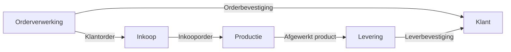

#### Inleiding

Dit Procesinteractie-template beschrijft de koppeling, afhankelijkheden en overdracht tussen twee of meer processen binnen {{organisatienaam}}. Het doel is om:  
- Inzicht te bieden in hoe processen met elkaar samenhangen.  
- Afhankelijkheden en interfaces tussen processen duidelijk in kaart te brengen.  
- Risico’s in de procesketen te identificeren en mitigeren.  
- Efficiëntie te verbeteren door knelpunten in de interactie op te lossen.

#### Eigenschappen

| Veld           | Waarde                | Toelichting                                                                                   |
| -------------- | --------------------- | --------------------------------------------------------------------------------------------- |
| PMD-nummer | 03.04.04              | Uniek identificatienummer voor deze procesinteractie in het Proces Management Document (PMD). |
| Versie     | 1                     | Huidige versie van dit document. Wordt geüpdaterd bij elke wijziging.                         |
| Status     | concept               | Mogelijke statussen: *concept*, *in review*, *goedgekeurd*, *gepubliceerd*, *verouderd*.      |
| Auteur     | [Naam]                | De persoon of afdeling die dit document heeft opgesteld (meestal de procesanalist).           |
| Eigenaar   | [Naam proceseigenaar] | Verantwoordelijk voor de inhoud en actualiteit van de procesinteractie.                       |
| Datum      | 17/04/2026            | Datum van de laatste update.                                                                  |

#### 1. Algemeen Overzicht

Geef hier een kort overzicht van de processen die met elkaar interageren.

| Veld                   | Waarde                                                                        |
| -------------------------- | --------------------------------------------------------------------------------- |
| Hoofdproces            | [Naam van het hoofdproces, bijv. "Orderverwerking"]                               |
| Gerelateerde processen | [Lijst van processen die interageren, bijv. "Inkoop, Productie, Facturatie"]      |
| Scope                  | [Beschrijf de reikwijdte, bijv. "Interactie tussen Orderverwerking en Productie"] |

#### 2. Doel van deze Interactie

Beschrijf hier waarom deze koppeling tussen processen bestaat. Geef aan:

- Waarde voor de organisatie: Wat levert deze interactie op? (Bijv. "Zorgt voor tijdige levering van producten aan klanten").
- Waarde voor de klant: Hoe draagt deze interactie bij aan klanttevredenheid? (Bijv. "Verkort de levertijd").
- Wettelijke/Compliance-eisen: Zijn er verplichtingen (bijv. GDPR, ISO-normen) die deze interactie noodzakelijk maken?

Voorbeeld:

> *"De interactie tussen Orderverwerking en Productie zorgt ervoor dat klantorders tijdig en accuraat worden omgezet in productieopdrachten. Dit is essentieel voor het nakomen van leverafspraken en het waarborgen van klanttevredenheid. Daarnaast voldoet deze koppeling aan de ISO 9001-eis voor traceerbaarheid van orders."*

#### 3. Upstream Processen

Beschrijf hier welke processen input leveren aan het hoofdproces. Gebruik de onderstaande tabel voor overzichtelijkheid.

| Procesnaam | Type Input                            | Beschrijving Input                                     | Frequentie      | Verantwoordelijke | PMD-nummer | Kwaliteitseisen                |
| -------------- | ----------------------------------------- | ---------------------------------------------------------- | ------------------- | --------------------- | -------------- | ---------------------------------- |
| [Naam]         | [Bijv. "Data", "Document", "Goedkeuring"] | [Korte beschrijving, bijv. "Klantorder met specificaties"] | [Bijv. "Dagelijks"] | [Naam/afdeling]       | [PMD-nummer]   | [Bijv. "Compleet en geverifieerd"] |

Toelichting:

- Type Input: Geef aan of het gaat om data, documenten, goedkeuringen, of fysieke input (bijv. materialen).
- Kwaliteitseisen: Wat zijn de minimale eisen waaraan de input moet voldoen? (Bijv. "Geverifieerde klantgegevens", "Goedgekeurde offerte").

#### 4. Downstream Processen

Beschrijf hier welke processen de output gebruiken van het hoofdproces.

| Procesnaam | Type Output                       | Beschrijving Output                                   | Afhankelijkheid                                  | Verantwoordelijke | PMD-nummer | Kwaliteitseisen          |
| -------------- | ------------------------------------- | --------------------------------------------------------- | ---------------------------------------------------- | --------------------- | -------------- | ---------------------------- |
| [Naam]         | [Bijv. "Product", "Document", "Data"] | [Korte beschrijving, bijv. "Bevestigingsmail naar klant"] | [Bijv. "Output moet binnen 24 uur beschikbaar zijn"] | [Naam/afdeling]       | [PMD-nummer]   | [Bijv. "Accuraat en tijdig"] |

Toelichting:

- Type Output: Geef aan of het gaat om fysieke producten, documenten, data, of diensten.
- Afhankelijkheid: Wat zijn de condities waaraan de output moet voldoen om door het downstream proces gebruikt te kunnen worden?

#### 5. Interfaces

Beschrijf hier hoe de overdracht tussen processen plaatsvindt. Gebruik de onderstaande tabel.

| Interface | Type                                                   | Beschrijving                                                            | Verantwoordelijke | Systeem/Tool            | Frequentie      | Automatisering |
| ------------- | ---------------------------------------------------------- | --------------------------------------------------------------------------- | --------------------- | --------------------------- | ------------------- | ------------------ |
| [Naam]        | [Bijv. "Systeemkoppeling", "Handmatige overdracht", "API"] | [Korte beschrijving, bijv. "Automatische synchronisatie tussen CRM en ERP"] | [Naam/afdeling]       | [Bijv. "SAP", "Salesforce"] | [Bijv. "Real-time"] | [Ja/Nee]           |

Toelichting types interfaces:

- Systeemkoppeling: Automatische overdracht via geïntegreerde systemen (bijv. ERP, CRM).
- Handmatige overdracht: Overdracht via e-mail, Excel, of papier.
- API / Workflow: Overdracht via automatische workflows (bijv. Zapier, Power Automate).
- Fysieke overdracht: Overdracht van fysieke goederen of documenten (bijv. transport, post).

#### 6. Risico’s in de Keten

Identificeer hier potentiële risico’s in de interactie tussen processen. Gebruik de onderstaande tabel om risico’s, oorzaken, impact, en mitigerende maatregelen te beschrijven.

| Risico                 | Oorzaak                                   | Impact                                | Kans           | Mitigerende Maatregel                 | Verantwoordelijke | Status                    |
| -------------------------- | --------------------------------------------- | ----------------------------------------- | ------------------ | ----------------------------------------- | --------------------- | ----------------------------- |
| [Bijv. "Vertraging"]       | [Bijv. "Handmatige overdracht duurt te lang"] | [Bijv. "Levertijd overschrijdt afspraak"] | [Hoog/Middel/Laag] | [Bijv. "Automatiseren van overdracht"]    | [Naam/afdeling]       | [Open/In uitvoering/Opgelost] |
| [Bijv. "Dataverlies"]      | [Bijv. "Fout in systeemkoppeling"]            | [Bijv. "Onjuiste ordergegevens"]          | [Hoog/Middel/Laag] | [Bijv. "Back-up procedure implementeren"] | [Naam/afdeling]       | [Open/In uitvoering/Opgelost] |
| [Bijv. "Misinterpretatie"] | [Bijv. "Onduidelijke werkinstructies"]        | [Bijv. "Fouten in productie"]             | [Hoog/Middel/Laag] | [Bijv. "Training medewerkers"]            | [Naam/afdeling]       | [Open/In uitvoering/Opgelost] |

Toelichting:

- Kans: Schat in hoe groot de kans is dat het risico zich voordoet (Hoog/Middel/Laag).
- Impact: Wat is de gevolg als het risico zich voordoet? (Bijv. financieel verlies, klantontevredenheid, compliance-risico).
- Mitigerende Maatregel: Wat kan worden gedaan om het risico te verminderen of voorkomen?

#### 7. Visuele Weergave (Optioneel)

Gebruik een visueel diagram (bijv. in Mermaid) om de interactie tussen processen weer te geven. Dit maakt de stroom van input naar output direct inzichtelijk.

Voorbeeld:

#### 8. Stakeholders en Verantwoordelijkheden

Geef hier een overzicht van wie betrokken is bij de procesinteractie.

| Rol                         | Verantwoordelijkheid                                  | Betrokkenheid |
| ------------------------------- | --------------------------------------------------------- | ----------------- |
| Proceseigenaar (Upstream)   | Zorgt voor tijdige en correcte input.                 | Continu           |
| Proceseigenaar (Downstream) | Zorgt voor correcte verwerking van output.            | Continu           |
| Procesanalist               | Documenteert en analyseert de interactie.             | Ad hoc            |
| IT-afdeling                 | Ondersteunt bij systeemkoppelingen en automatisering. | Ad hoc            |
| Kwaliteitsmanager           | Monitort de kwaliteit van input/output.               | Periodiek         |

#### 9. Tips voor Effectieve Procesinteractie

- Minimaliseer handmatige overdracht: Automatiseer waar mogelijk om fouten en vertragingen te voorkomen.  
- Documenteer interfaces: Zorg voor duidelijke beschrijvingen van hoe overdracht plaatsvindt.  
- Identificeer kritische afhankelijkheden: Focus op hoogriskico-interacties (bijv. handmatige stappen, complexe systemen).  
- Gebruik standaardformaten: Zorg dat input en output in gestandaardiseerde formaten worden geleverd (bijv. CSV, JSON, XML).  
- Monitor risico’s: Houd risico’s in de keten regelmatig onder de loep en pas maatregelen aan waar nodig.  
- Betrek stakeholders: Zorg dat alle betrokken partijen op de hoogte zijn van de interactie en hun rol daarin.

#### 10. Gerelateerde Documenten

Lijst hier alle gerelateerde documenten, zoals:

- [Link naar procesbeschrijvingen]
- [Link naar BPMN-diagrammen]
- [Link naar proceslandkaart]
- [Link naar risicoanalyses]

#### 11. Versiehistorie

| Versie | Datum  | Wijziging   | Auteur |
| ---------- | ---------- | --------------- | ---------- |
| 1.0        | 17/04/2026 | Initiële versie | [Naam]     |

#### 12. Instructies voor Gebruik

1. Identificeer de processen:
  - Bepaal welke processen met elkaar interageren.
1. Beschrijf het doel:
  - Leg uit waarom deze interactie bestaat en wat de waarde is.
1. Vul upstream en downstream in:
  - Documenteer alle input en output tussen de processen.
1. Beschrijf de interfaces:
  - Geef aan hoe overdracht plaatsvindt (systeem, handmatig, API).
1. Identificeer risico’s:
  - Breng potentiële problemen in kaart en bedenk mitigerende maatregelen.
1. Valideer met stakeholders:
  - Laat de interactie reviewen door proceseigenaren en betrokken teams.
1. Visualiseer (optioneel):
  - Maak een diagram om de interactie inzichtelijk te maken.

#### 13. Voorbeeld: Ingevulde Procesinteractie (Orderverwerking ↔ Productie)

##### Algemeen Overzicht

| Veld                   | Waarde                                                                                               |
| -------------------------- | -------------------------------------------------------------------------------------------------------- |
| Hoofdproces            | Orderverwerking                                                                                          |
| Gerelateerde processen | Productie, Inkoop                                                                                        |
| Scope                  | Interactie tussen Orderverwerking en Productie voor het omzetten van klantorders in productieopdrachten. |

##### Doel van deze Interactie

De koppeling tussen Orderverwerking en Productie zorgt ervoor dat klantorders tijdig en accuraat worden omgezet in productieopdrachten. Dit is essentieel voor:

- Het nakomen van leverafspraken met klanten.
- Het verminderen van fouten in de productie door correcte ordergegevens.
- Het voldoen aan ISO 9001-eisen voor traceerbaarheid.

##### Upstream Processen

| Procesnaam  | Type Input | Beschrijving Input               | Frequentie | Verantwoordelijke | PMD-nummer | Kwaliteitseisen      |
| --------------- | -------------- | ------------------------------------ | -------------- | --------------------- | -------------- | ------------------------ |
| Orderverwerking | Data           | Klantorder met product-specificaties | Dagelijks      | Sales Team            | PMD-01.01.00   | Compleet en geverifieerd |

##### Downstream Processen

| Procesnaam | Type Output   | Beschrijving Output            | Afhankelijkheid                       | Verantwoordelijke | PMD-nummer | Kwaliteitseisen |
| -------------- | ----------------- | ---------------------------------- | ----------------------------------------- | --------------------- | -------------- | ------------------- |
| Productie      | Productieopdracht | Bevestigde opdracht voor productie | Output moet binnen 1 uur beschikbaar zijn | Productie Team        | PMD-01.02.00   | Accuraat en tijdig  |

##### Interfaces

| Interface        | Type         | Beschrijving                                   | Verantwoordelijke | Systeem/Tool | Frequentie | Automatisering |
| -------------------- | ---------------- | -------------------------------------------------- | --------------------- | ---------------- | -------------- | ------------------ |
| Order naar Productie | Systeemkoppeling | Automatische overdracht van ordergegevens naar ERP | IT-afdeling           | SAP ERP          | Real-time      | Ja                 |

##### Risico’s in de Keten

| Risico       | Oorzaak                       | Impact                 | Kans | Mitigerende Maatregel                  | Verantwoordelijke | Status    |
| ---------------- | --------------------------------- | -------------------------- | -------- | ------------------------------------------ | --------------------- | ------------- |
| Vertraging       | Handmatige controle duurt te lang | Levering komt te laat      | Middel   | Automatische validatie implementeren       | IT-afdeling           | In uitvoering |
| Dataverlies      | Fout in systeemkoppeling          | Onjuiste productieopdracht | Laag     | Dagelijkse back-up en validatie            | IT-afdeling           | Opgelost      |
| Misinterpretatie | Onduidelijke order-specificaties  | Fouten in productie        | Hoog     | Training medewerkers in orderinterpretatie | Productie Team        | Open          |