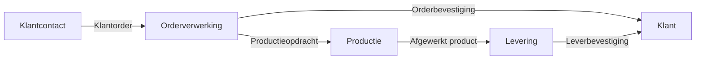

Dit Procesdoel-template beschrijft waarom een proces bestaat, welke waarde het levert, en hoe het bijdraagt aan de strategische doelstellingen van {{organisatienaam}}. Het doel is om:  

- Duidelijkheid te scheppen over de reden van bestaan van het proces.  
- Alignement te waarborgen tussen het proces en de organisatiestrategie.  
- Meetbare en kwalitatieve succescriteria te definiëren voor evaluatie.  
- Afbakening te bieden ten opzichte van andere processen.

#### Eigenschappen

| Veld           | Waarde                | Toelichting                                                                              |
| -------------- | --------------------- | ---------------------------------------------------------------------------------------- |
| PMD-nummer | 03.03.00              | Uniek identificatienummer voor dit procesdoel in het Proces Management Document (PMD).   |
| Versie     | 1                     | Huidige versie van dit document. Wordt bijgewerkt bij elke wijziging.                    |
| Status     | concept               | Mogelijke statussen: *concept*, *in review*, *goedgekeurd*, *gepubliceerd*, *verouderd*. |
| Auteur     | [Naam]                | De persoon of afdeling die dit document heeft opgesteld (meestal de procesanalist).      |
| Eigenaar   | [Naam proceseigenaar] | Verantwoordelijk voor de inhoud en actualiteit van het procesdoel.                       |
| Datum      | 17/04/2026            | Datum van de laatste update.                                                             |

#### 1. Algemeen Overzicht

Geef hier een kort overzicht van het proces waarvoor dit doel wordt gedefinieerd.

| Veld            | Waarde                                     |
| ------------------- | ---------------------------------------------- |
| Procesnaam      | [Naam van het proces, bijv. "Orderverwerking"] |
| Procescategorie | [Primair / Ondersteunend / Sturend]            |
| PMD-nummer      | [PMD-nummer van het proces]                    |

#### 2. Doel van het Proces

Beschrijf hier waarom dit proces bestaat. Beantwoord de volgende vragen:

- Welk probleem wordt opgelost?  
(Bijv. "Voorkomen van vertragingen in de levering van producten aan klanten.")
- Welke waarde levert het proces op?  
(Bijv. "Zorgt voor tijdige en accurate verwerking van klantorders, wat leidt tot hogere klanttevredenheid.")
- Voor wie wordt het proces uitgevoerd?  
(Bijv. "Voor klanten, sales teams, en productieafdelingen.")

Voorbeeld:

> *"Het proces 'Orderverwerking' lost het probleem op van onduidelijke en vertraagde orderafhandeling. Het levert waarde door tijdige en accurate verwerking van klantorders, wat resulteert in hogere klanttevredenheid en efficiëntere productieplanning. Het proces wordt uitgevoerd voor klanten, sales teams, en de productieafdeling."*

#### 3. Functionele Bijdrage

Beschrijf hier wat de rol is van dit proces binnen de organisatie.

| Aspect                   | Beschrijving                                                                     |
| ---------------------------- | ------------------------------------------------------------------------------------ |
| Type proces              | [Kernproces / Ondersteunend proces / Stuurproces]                                    |
| Bijdrage aan de keten    | [Bijv. "Zorgt voor een soepele doorstroom van orders van sales naar productie."]     |
| Bijdrage aan klantwaarde | [Bijv. "Verhoogt de klanttevredenheid door snelle en betrouwbare orderafhandeling."] |

Toelichting types processen:

- Kernproces (Primair): Processen die direct waarde toevoegen voor de klant (bijv. Orderverwerking, Productie).
- Ondersteunend proces: Processen die kernprocessen faciliteren (bijv. IT-ondersteuning, HR).
- Stuurproces: Processen die richting en controle bieden (bijv. Strategieontwikkeling, Kwaliteitsmanagement).

#### 4. Strategische Koppeling

Beschrijf hier hoe dit proces bijdraagt aan de strategische doelstellingen van de organisatie.

| Strategisch doel                      | Bijdrage van het proces                                   | KPI’s of resultaten                 | Verantwoordelijke |
| ----------------------------------------- | ------------------------------------------------------------- | --------------------------------------- | --------------------- |
| [Bijv. "Verhogen klanttevredenheid"]      | [Bijv. "Zorgt voor tijdige levering van producten"]           | [Bijv. "Klanttevredenheidsscore (NPS)"] | [Naam/afdeling]       |
| [Bijv. "Verminderen operationele kosten"] | [Bijv. "Automatiseert handmatige stappen in orderverwerking"] | [Bijv. "Kostenbesparing per order"]     | [Naam/afdeling]       |

Toelichting:

- Strategisch doel: Welke organisatiedoelstellingen worden ondersteund door dit proces?
- Bijdrage van het proces: Hoe draagt het proces concreet bij aan dit doel?
- KPI’s of resultaten: Welke meetbare resultaten worden beïnvloed?

#### 5. Succescriteria

Definieer hier wanneer het proces succesvol is. Gebruik zowel kwantitatieve (meetbare) als kwalitatieve criteria.

##### Meetbare Criteria (KPI’s)

| KPI                                | Doelwaarde     | Meetfrequentie  | Verantwoordelijke | Bron                    |
| -------------------------------------- | ------------------ | ------------------- | --------------------- | --------------------------- |
| [Bijv. "Doorlooptijd orderverwerking"] | [Bijv. "< 24 uur"] | [Bijv. "Dagelijks"] | [Naam/afdeling]       | [Bijv. "ERP-systeem"]       |
| [Bijv. "Aantal fouten per order"]      | [Bijv. "< 1%"]     | [Bijv. "Wekelijks"] | [Naam/afdeling]       | [Bijv. "Kwaliteitsrapport"] |

##### Kwalitatieve Criteria

| Criterium               | Beschrijving                                             | Meetmethode                     | Verantwoordelijke |
| --------------------------- | ------------------------------------------------------------ | ----------------------------------- | --------------------- |
| [Bijv. "Klanttevredenheid"] | [Bijv. "Klant ervaart het proces als soepel en betrouwbaar"] | [Bijv. "Klantfeedback en enquêtes"] | [Naam/afdeling]       |
| [Bijv. "Compliance"]        | [Bijv. "Proces voldoet aan ISO 9001-normen"]                 | [Bijv. "Interne audits"]            | [Naam/afdeling]       |

#### 6. Niet-doelen

Beschrijf hier wat expliciet buiten de scope van dit proces valt. Dit voorkomt misverstanden en dubbel werk.

| Niet-doel                   | Toelichting                                                                                          | Verantwoordelijk proces               |
| ------------------------------- | -------------------------------------------------------------------------------------------------------- | ----------------------------------------- |
| [Bijv. "Inkoop van materialen"] | [Bijv. "Dit proces behandelt alleen de verwerking van orders, niet de inkoop van benodigde materialen."] | [Bijv. "Inkoopproces (PMD-02.01.00)"]     |
| [Bijv. "Facturatie"]            | [Bijv. "Facturatie valt onder het Financiële proces."]                                                   | [Bijv. "Facturatieproces (PMD-01.03.00)"] |

#### 7. Relatie met Andere Processen

Beschrijf hier hoe dit proces samenhangt met andere processen binnen de organisatie.

##### Input-processen

| Procesnaam         | Type Input       | Beschrijving                                       | PMD-nummer | Verantwoordelijke |
| ---------------------- | -------------------- | ------------------------------------------------------ | -------------- | --------------------- |
| [Bijv. "Klantcontact"] | [Bijv. "Klantorder"] | [Bijv. "Ontvangen klantorder via telefoon of webshop"] | [PMD-nummer]   | [Naam/afdeling]       |

##### Output-processen

| Procesnaam      | Type Output             | Beschrijving                             | PMD-nummer | Verantwoordelijke |
| ------------------- | --------------------------- | -------------------------------------------- | -------------- | --------------------- |
| [Bijv. "Productie"] | [Bijv. "Productieopdracht"] | [Bijv. "Bevestigde opdracht voor productie"] | [PMD-nummer]   | [Naam/afdeling]       |

##### Afhankelijkheden

| Afhankelijkheid                   | Type  | Beschrijving                                                               | Impact bij uitval  | Mitigerende maatregel                             |
| ------------------------------------- | --------- | ------------------------------------------------------------------------------ | ---------------------- | ----------------------------------------------------- |
| [Bijv. "Beschikbaarheid ERP-systeem"] | [Systeem] | [Bijv. "Orderverwerking is afhankelijk van het ERP-systeem voor registratie."] | [Bijv. "Proces stopt"] | [Bijv. "Back-up procedure en handmatige registratie"] |

#### 8. Visuele Weergave (Optioneel)

Gebruik een visueel diagram (bijv. in Mermaid) om de relaties tussen processen weer te geven.

Voorbeeld:

#### 9. Stakeholders en Verantwoordelijkheden

Geef hier een overzicht van wie betrokken is bij het proces en hun rol.

| Rol               | Verantwoordelijkheid                                   | Betrokkenheid |
| --------------------- | ---------------------------------------------------------- | ----------------- |
| Proceseigenaar    | Verantwoordelijk voor het behalen van de procesdoelen. | Continu           |
| Procesanalist     | Documenteert en optimaliseert het proces.              | Ad hoc            |
| Uitvoerend team   | Voert het proces uit volgens de gedefinieerde stappen. | Dagelijks         |
| Management        | Zorgt voor alignement met strategische doelstellingen. | Periodiek         |
| Kwaliteitsmanager | Monitort de KPI’s en succescriteria.                   | Maandelijks       |

#### 10. Tips voor het Definiëren van Procesdoelen

- Wees specifiek: Vermijd vage doelstellingen. Gebruik SMART-criteria (Specifiek, Meetbaar, Acceptabel, Realistisch, Tijdgebonden).  
- Koppel aan strategie: Zorg dat het procesdoel alignt met organisatiedoelen.  
- Betrek stakeholders: Laat proceseigenaren, uitvoerende teams, en management meedenken over de doelen.  
- Meetbaarheid is key: Definieer KPI’s om het succes van het proces te meten.  
- Afbakenen is belangrijk: Maak duidelijk wat wel en niet tot het proces behoort.  
- Houd het actueel: Review de procesdoelen minimaal jaarlijks of bij grote veranderingen.

#### 11. Gerelateerde Documenten

Lijst hier alle gerelateerde documenten, zoals:

- [Link naar procesbeschrijving]
- [Link naar BPMN-diagram]
- [Link naar proceslandkaart]
- [Link naar KPI-dashboard]

#### 12. Versiehistorie

| Versie | Datum  | Wijziging   | Auteur |
| ---------- | ---------- | --------------- | ---------- |
| 1.0        | 17/04/2026 | Initiële versie | [Naam]     |

#### 13. Instructies voor Gebruik

1. Start met het proces: Kies het proces waarvoor je het doel wilt definieren.
2. Beschrijf het doel: Beantwoord de vragen: Welk probleem wordt opgelost?, Welke waarde levert het op?, Voor wie?.
3. Bepaal de functionele bijdrage: Geef aan of het een kernproces, ondersteunend proces, of stuurproces is.
4. Koppel aan strategie: Beschrijf hoe het proces bijdraagt aan organisatiedoelen en welke KPI’s worden beïnvloed.
5. Definieer succescriteria: Stel meetbare (KPI’s) en kwalitatieve criteria op.
6. Baken af: Beschrijf wat buiten de scope valt (niet-doelen).
7. Beschrijf relaties: Geef aan welke processen input leveren en welke processen output gebruiken.
8. Valideer met stakeholders: Laat het procesdoel reviewen door proceseigenaren en management.

#### 14. Voorbeeld: Ingevuld Procesdoel (Orderverwerking)

##### Algemeen Overzicht

| Veld            | Waarde      |
| ------------------- | --------------- |
| Procesnaam      | Orderverwerking |
| Procescategorie | Primair         |
| PMD-nummer      | PMD-01.01.00    |

##### Doel van het Proces

Het proces Orderverwerking lost het probleem op van onduidelijke en vertraagde afhandeling van klantorders. Het levert waarde door:

- Tijdige en accurate verwerking van klantorders.
- Vermindering van fouten in de orderafhandeling.
- Verhoging van klanttevredenheid door snelle bevestiging en levering.

Het proces wordt uitgevoerd voor klanten, sales teams, en de productieafdeling.

##### Functionele Bijdrage

| Aspect                   | Beschrijving                                                                   |
| ---------------------------- | ---------------------------------------------------------------------------------- |
| Type proces              | Kernproces (Primair)                                                               |
| Bijdrage aan de keten    | Zorgt voor een soepele doorstroom van orders van sales naar productie en levering. |
| Bijdrage aan klantwaarde | Verhoogt de klanttevredenheid door betrouwbare en snelle orderafhandeling.         |

##### Strategische Koppeling

| Strategisch doel            | Bijdrage van het proces                         | KPI’s of resultaten       | Verantwoordelijke |
| ------------------------------- | --------------------------------------------------- | ----------------------------- | --------------------- |
| Verhogen klanttevredenheid      | Zorgt voor tijdige levering van producten           | Klanttevredenheidsscore (NPS) | Sales Manager         |
| Verminderen operationele kosten | Automatiseert handmatige stappen in orderverwerking | Kostenbesparing per order     | Financiële Afdeling   |

##### Succescriteria

Meetbare Criteria (KPI’s):

| KPI                      | Doelwaarde | Meetfrequentie | Verantwoordelijke | Bron          |
| ---------------------------- | -------------- | ------------------ | --------------------- | ----------------- |
| Doorlooptijd orderverwerking | < 24 uur       | Dagelijks          | Order Team            | ERP-systeem       |
| Aantal fouten per order      | < 1%           | Wekelijks          | Kwaliteitsmanager     | Kwaliteitsrapport |

Kwalitatieve Criteria:

| Criterium     | Beschrijving                                   | Meetmethode           | Verantwoordelijke |
| ----------------- | -------------------------------------------------- | ------------------------- | --------------------- |
| Klanttevredenheid | Klant ervaart het proces als soepel en betrouwbaar | Klantfeedback en enquêtes | Sales Manager         |
| Compliance        | Proces voldoet aan ISO 9001-normen                 | Interne audits            | Kwaliteitsmanager     |

##### Niet-doelen

| Niet-doel         | Toelichting                                                                                | Verantwoordelijk proces     |
| --------------------- | ---------------------------------------------------------------------------------------------- | ------------------------------- |
| Inkoop van materialen | Dit proces behandelt alleen de verwerking van orders, niet de inkoop van benodigde materialen. | Inkoopproces (PMD-02.01.00)     |
| Facturatie            | Facturatie valt onder het Financiële proces.                                                   | Facturatieproces (PMD-01.03.00) |

##### Relatie met Andere Processen

Input-processen:

| Procesnaam | Type Input | Beschrijving                             | PMD-nummer | Verantwoordelijke |
| -------------- | -------------- | -------------------------------------------- | -------------- | --------------------- |
| Klantcontact   | Klantorder     | Ontvangen klantorder via telefoon of webshop | PMD-01.00.00   | Sales Team            |

Output-processen:

| Procesnaam | Type Output   | Beschrijving                   | PMD-nummer | Verantwoordelijke |
| -------------- | ----------------- | ---------------------------------- | -------------- | --------------------- |
| Productie      | Productieopdracht | Bevestigde opdracht voor productie | PMD-01.02.00   | Productie Manager     |

Afhankelijkheden:

| Afhankelijkheid         | Type | Beschrijving                                                     | Impact bij uitval | Mitigerende maatregel                   |
| --------------------------- | -------- | -------------------------------------------------------------------- | --------------------- | ------------------------------------------- |
| Beschikbaarheid ERP-systeem | Systeem  | Orderverwerking is afhankelijk van het ERP-systeem voor registratie. | Proces stopt          | Back-up procedure en handmatige registratie |