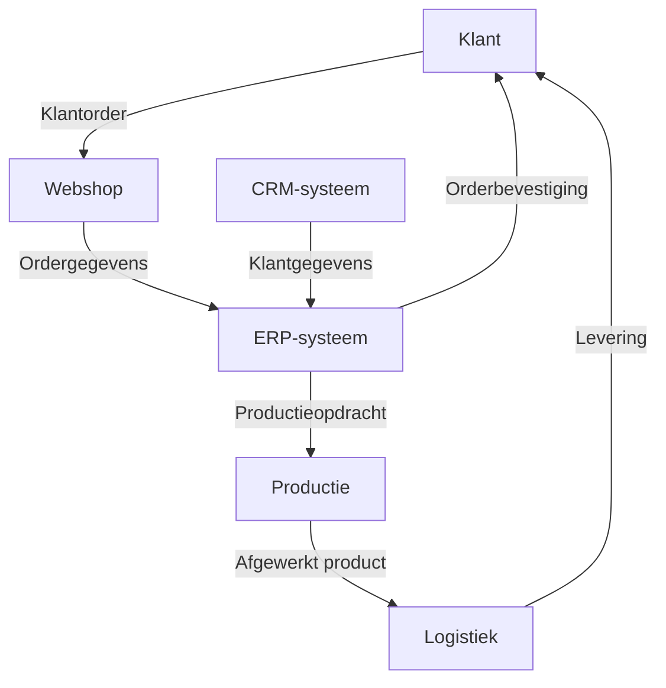

#### Inleiding

Dit Procescontext Template beschrijft de omgevingsfactoren die van invloed zijn op het uitvoeren van {{procesnaam}}. Het doel is om:  
-  Duidelijke afbakening te bieden van wat wel en niet tot het proces behoort (scope).  
-  Triggers te identificeren die het proces starten of beïnvloeden.  
-  Input en output in kaart te brengen voor een soepele doorstroom.  
-  Regels en beperkingen te documenteren die het proces beïnvloeden.  
-  Technische integraties te beschrijven voor systeemondersteuning.

#### Eigenschappen

| Veld           | Waarde                | Toelichting                                                                                |
| -------------- | --------------------- | ------------------------------------------------------------------------------------------ |
| PMD-nummer | 03.02.00              | Uniek identificatienummer voor deze procescontext in het Proces Management Document (PMD). |
| Versie     | 1                     | Huidige versie van dit document. Wordt geüpdaterd bij elke wijziging.                      |
| Status     | concept               | Mogelijke statussen: *concept*, *in review*, *goedgekeurd*, *gepubliceerd*, *verouderd*.   |
| Auteur     | [Naam]                | De persoon of afdeling die dit document heeft opgesteld (meestal de procesanalist).        |
| Eigenaar   | [Naam proceseigenaar] | Verantwoordelijk voor de inhoud en actualiteit van de procescontext.                       |
| Datum      | 17/04/2026            | Datum van de laatste update.                                                               |

#### 1. Algemeen Overzicht

Geef hier een kort overzicht van het proces waarvoor de context wordt beschreven.

| Veld                | Waarde                                                                   |
| ----------------------- | ---------------------------------------------------------------------------- |
| Procesnaam          | [Naam van het proces, bijv. "Orderverwerking"]                               |
| Procescategorie     | [Primair / Ondersteunend / Sturend]                                          |
| PMD-nummer          | [PMD-nummer van het proces]                                                  |
| Doel van het proces | [Korte beschrijving, bijv. "Tijdige en accurate verwerking van klantorders"] |

#### 2. Scope

Beschrijf hier wat wel en niet tot het proces behoort. Dit voorkomt misverstanden en dubbel werk.

##### Wat valt binnen het proces?

| Onderdeel                     | Beschrijving                                                                 | Verantwoordelijke |
| --------------------------------- | -------------------------------------------------------------------------------- | --------------------- |
| [Bijv. "Ontvangst klantorder"]    | [Korte beschrijving, bijv. "Registratie van klantorders in het ERP-systeem"]     | [Naam/afdeling]       |
| [Bijv. "Validatie klantgegevens"] | [Korte beschrijving, bijv. "Controle of klantgegevens compleet en correct zijn"] | [Naam/afdeling]       |
| [Bijv. "Bevestiging naar klant"]  | [Korte beschrijving, bijv. "Versturen van orderbevestiging per e-mail"]          | [Naam/afdeling]       |

##### Wat valt buiten het proces?

| Uitsluiting                 | Toelichting                                                          | Verantwoordelijk proces               |
| ------------------------------- | ------------------------------------------------------------------------ | ----------------------------------------- |
| [Bijv. "Inkoop van materialen"] | [Korte toelichting, bijv. "Inkoop valt onder het Inkoopproces"]          | [Bijv. "Inkoopproces (PMD-02.01.00)"]     |
| [Bijv. "Facturatie"]            | [Korte toelichting, bijv. "Facturatie valt onder het Financiële proces"] | [Bijv. "Facturatieproces (PMD-01.03.00)"] |

#### 3. Triggers

Beschrijf hier wat het proces start of beïnvloedt. Triggers kunnen extern (bijv. klantactie) of intern (bijv. systeemgebeurtenis) zijn.

| Trigger                    | Type | Beschrijving                               | Bron    | Frequentie |
| ------------------------------ | -------- | ---------------------------------------------- | ----------- | -------------- |
| [Bijv. "Ontvangst klantorder"] | Extern   | Een klant plaatst een order via de webshop.    | Webshop     | Dagelijks      |
| [Bijv. "Systeemalert"]         | Intern   | ERP-systeem geeft een alert bij lage voorraad. | ERP-systeem | Ad hoc         |
| [Bijv. "Handmatige actie"]     | Intern   | Medewerker start het proces handmatig.         | Medewerker  | Dagelijks      |

Toelichting types triggers:

- Extern: Gebeurtenissen buiten de organisatie (bijv. klantacties, leveranciers).
- Intern: Gebeurtenissen binnen de organisatie (bijv. systeemalerts, handmatige acties).

#### 4. Input

Beschrijf hier wat het proces nodig heeft om te kunnen starten of draaien. Input kan data, documenten, materialen, of goedkeuringen zijn.

| Input                        | Type    | Beschrijving                                        | Bron          | Kwaliteitseisen      | Verantwoordelijke |
| -------------------------------- | ----------- | ------------------------------------------------------- | ----------------- | ------------------------ | --------------------- |
| [Bijv. "Klantorder"]             | Data        | Digitaal orderformulier met klant- en productgegevens.  | Webshop/CRM       | Compleet en geverifieerd | Sales Team            |
| [Bijv. "Goedkeuring manager"]    | Goedkeuring | Handtekening of digitale goedkeuring voor grote orders. | Manager           | Tijdig en accuraat       | Sales Manager         |
| [Bijv. "Productiespecificaties"] | Document    | Technische specificaties voor productie.                | Productieafdeling | Actueel en goedgekeurd   | Productie Manager     |

#### 5. Output

Beschrijf hier wat het proces oplevert. Output kan producten, documenten, data, of diensten zijn.

| Output                     | Type | Beschrijving                           | Bestemming    | Kwaliteitseisen          | Verantwoordelijke |
| ------------------------------ | -------- | ------------------------------------------ | ----------------- | ---------------------------- | --------------------- |
| [Bijv. "Orderbevestiging"]     | Document | Bevestiging van de order aan de klant.     | Klant             | Accuraat en tijdig           | Order Team            |
| [Bijv. "Productieopdracht"]    | Data     | Digitaal opdrachtformulier voor productie. | Productieafdeling | Compleet en foutloos         | Order Team            |
| [Bijv. "Geproduceerd product"] | Product  | Afgewerkt product volgens specificaties.   | Logistiek         | Voldoet aan kwaliteitsnormen | Productie Team        |

#### 6. Regels & Constraints

Beschrijf hier welke regels en beperkingen gelden voor het proces. Dit kunnen wettelijke eisen, organisatieregels, of technische beperkingen zijn.

| Regel/Constraint            | Type    | Beschrijving                                       | Impact bij niet-naleving | Verantwoordelijke |
| ------------------------------- | ----------- | ------------------------------------------------------ | ---------------------------- | --------------------- |
| [Bijv. "GDPR-compliance"]       | Wettelijk   | Persoonsgegevens moeten veilig worden opgeslagen.      | Boete of juridische gevolgen | Compliance Officer    |
| [Bijv. "Maximale doorlooptijd"] | Organisatie | Order moet binnen 24 uur worden verwerkt.              | Vertraging in levering       | Order Team            |
| [Bijv. "Systeemlimiet"]         | Technisch   | ERP-systeem kan maximaal 100 orders per uur verwerken. | Vertraging of fouten         | IT-afdeling           |

Toelichting types regels:

- Wettelijk: Regels die voortvloeien uit wet- en regelgeving (bijv. GDPR, ISO-normen).
- Organisatie: Interne regels en beleid van de organisatie.
- Technisch: Beperkingen van systemen of infrastructuur.

#### 7. Systemen & Integraties

Beschrijf hier welke systemen worden gebruikt in het proces en hoe deze met elkaar gekoppeld zijn.

##### Systemen

| Systeem           | Doel                                   | Gebruikers             | Toegang      | Verantwoordelijke |
| --------------------- | ------------------------------------------ | -------------------------- | ---------------- | --------------------- |
| [Bijv. "ERP-systeem"] | Beheer van orders, productie, en voorraad. | Order Team, Productie Team | Webinterface     | IT-afdeling           |
| [Bijv. "CRM-systeem"] | Beheer van klantgegevens en interacties.   | Sales Team                 | Webinterface     | IT-afdeling           |
| [Bijv. "Webshop"]     | Ontvangst van klantorders.                 | Klanten, Sales Team        | Publieke website | Marketing             |

##### Koppelingen

| Koppeling                   | Type    | Beschrijving                                       | Systemen | Frequentie | Verantwoordelijke |
| ------------------------------- | ----------- | ------------------------------------------------------ | ------------ | -------------- | --------------------- |
| [Bijv. "ERP-CRM koppeling"]     | Automatisch | Synchronisatie van klantgegevens tussen ERP en CRM.    | ERP, CRM     | Real-time      | IT-afdeling           |
| [Bijv. "Webshop-ERP koppeling"] | Automatisch | Overdracht van orders van webshop naar ERP.            | Webshop, ERP | Real-time      | IT-afdeling           |
| [Bijv. "Handmatige export"]     | Handmatig   | Maandelijkse export van ordergegevens voor rapportage. | ERP, Excel   | Maandelijks    | Order Team            |

Toelichting types koppelingen:

- Automatisch: Koppelingen die automatisch data overdragen (bijv. API’s, ETL-processen).
- Handmatig: Koppelingen die handmatige actie vereisen (bijv. exports, imports).

#### 8. Visuele Weergave (Optioneel)

Gebruik een visueel diagram (bijv. in Mermaid) om de procescontext weer te geven, inclusief scope, triggers, input/output, en systemen.

Voorbeeld:

#### 9. Stakeholders en Verantwoordelijkheden

Geef hier een overzicht van wie betrokken is bij de procescontext.

| Rol                | Verantwoordelijkheid                                                 | Betrokkenheid |
| ---------------------- | ------------------------------------------------------------------------ | ----------------- |
| Proceseigenaar     | Verantwoordelijk voor de inhoud en actualiteit van de procescontext. | Continu           |
| Procesanalist      | Documenteert en analyseert de procescontext.                         | Ad hoc            |
| IT-afdeling        | Ondersteunt bij systeemintegraties en technische beperkingen.        | Ad hoc            |
| Compliance Officer | Zorgt voor naleving van regels en wetgeving.                         | Periodiek         |
| Uitvoerend team    | Voert het proces uit volgens de gedocumenteerde context.             | Dagelijks         |

#### 10. Tips voor het Documenteren van Procescontext

- Wees specifiek: Beschrijf concreet wat binnen en buiten de scope valt.  
- Identificeer alle triggers: Zorg dat alle startmomenten van het proces duidelijk zijn.  
- Documenteer input/output: Maak duidelijk wat het proces nodig heeft en wat het oplevert.  
- Houd rekening met regels: Zorg dat alle beperkingen (wettelijk, organisatie, technisch) zijn gedocumenteerd.  
- Beschrijf systemen en koppelingen: Geef aan hoe systemen met elkaar interageren.  
- Betrek stakeholders: Laat de procescontext reviewen door proceseigenaren en IT.  
- Houd het actueel: Update de context bij wijzigingen in processen, systemen, of regels.

#### 11. Gerelateerde Documenten

Lijst hier alle gerelateerde documenten, zoals:

- [Link naar procesbeschrijving]
- [Link naar BPMN-diagram]
- [Link naar proceslandkaart]
- [Link naar systeemdocumentatie]

#### 12. Versiehistorie

| Versie | Datum  | Wijziging   | Auteur |
| ---------- | ---------- | --------------- | ---------- |
| 1.0        | 17/04/2026 | Initiële versie | [Naam]     |

#### 13. Instructies voor Gebruik

1. Start met het proces:
  - Kies het proces waarvoor je de context wilt beschrijven.
1. Definieer de scope:
  - Beschrijf wat wel en niet tot het proces behoort.
1. Identificeer triggers:
  - Bepaal wat het proces start of beïnvloedt.
1. Documenteer input en output:
  - Geef aan wat het proces nodig heeft en wat het oplevert.
1. Beschrijf regels en constraints:
  - Documenteer alle beperkingen die gelden voor het proces.
1. Beschrijf systemen en integraties:
  - Geef aan welke systemen worden gebruikt en hoe deze gekoppeld zijn.
1. Valideer met stakeholders:
  - Laat de procescontext reviewen door proceseigenaren, IT, en compliance.

#### 14. Voorbeeld: Ingevulde Procescontext (Orderverwerking)

##### Algemeen Overzicht

| Veld                | Waarde                                      |
| ----------------------- | ----------------------------------------------- |
| Procesnaam          | Orderverwerking                                 |
| Procescategorie     | Primair                                         |
| PMD-nummer          | PMD-01.01.00                                    |
| Doel van het proces | Tijdige en accurate verwerking van klantorders. |

##### Scope

Wat valt binnen het proces?

| Onderdeel           | Beschrijving                                    | Verantwoordelijke |
| ----------------------- | --------------------------------------------------- | --------------------- |
| Ontvangst klantorder    | Registratie van klantorders in het ERP-systeem.     | Order Team            |
| Validatie klantgegevens | Controle of klantgegevens compleet en correct zijn. | Order Team            |
| Bevestiging naar klant  | Versturen van orderbevestiging per e-mail.          | Order Team            |

Wat valt buiten het proces?

| Uitsluiting       | Toelichting                              | Verantwoordelijk proces     |
| --------------------- | -------------------------------------------- | ------------------------------- |
| Inkoop van materialen | Inkoop valt onder het Inkoopproces.          | Inkoopproces (PMD-02.01.00)     |
| Facturatie            | Facturatie valt onder het Financiële proces. | Facturatieproces (PMD-01.03.00) |

##### Triggers

| Trigger                | Type | Beschrijving                               | Bron    | Frequentie |
| -------------------------- | -------- | ---------------------------------------------- | ----------- | -------------- |
| Ontvangst klantorder       | Extern   | Een klant plaatst een order via de webshop.    | Webshop     | Dagelijks      |
| Systeemalert lage voorraad | Intern   | ERP-systeem geeft een alert bij lage voorraad. | ERP-systeem | Ad hoc         |

##### Input

| Input           | Type    | Beschrijving                                        | Bron    | Kwaliteitseisen      | Verantwoordelijke |
| ------------------- | ----------- | ------------------------------------------------------- | ----------- | ------------------------ | --------------------- |
| Klantorder          | Data        | Digitaal orderformulier met klant- en productgegevens.  | Webshop/CRM | Compleet en geverifieerd | Sales Team            |
| Goedkeuring manager | Goedkeuring | Handtekening of digitale goedkeuring voor grote orders. | Manager     | Tijdig en accuraat       | Sales Manager         |

##### Output

| Output        | Type | Beschrijving                           | Bestemming    | Kwaliteitseisen  | Verantwoordelijke |
| ----------------- | -------- | ------------------------------------------ | ----------------- | -------------------- | --------------------- |
| Orderbevestiging  | Document | Bevestiging van de order aan de klant.     | Klant             | Accuraat en tijdig   | Order Team            |
| Productieopdracht | Data     | Digitaal opdrachtformulier voor productie. | Productieafdeling | Compleet en foutloos | Order Team            |

##### Regels & Constraints

| Regel/Constraint  | Type    | Beschrijving                                  | Impact bij niet-naleving | Verantwoordelijke |
| --------------------- | ----------- | ------------------------------------------------- | ---------------------------- | --------------------- |
| GDPR-compliance       | Wettelijk   | Persoonsgegevens moeten veilig worden opgeslagen. | Boete of juridische gevolgen | Compliance Officer    |
| Maximale doorlooptijd | Organisatie | Order moet binnen 24 uur worden verwerkt.         | Vertraging in levering       | Order Team            |

##### Systemen & Integraties

Systemen:

| Systeem | Doel                                   | Gebruikers             | Toegang  | Verantwoordelijke |
| ----------- | ------------------------------------------ | -------------------------- | ------------ | --------------------- |
| ERP-systeem | Beheer van orders, productie, en voorraad. | Order Team, Productie Team | Webinterface | IT-afdeling           |
| CRM-systeem | Beheer van klantgegevens en interacties.   | Sales Team                 | Webinterface | IT-afdeling           |

Koppelingen:

| Koppeling         | Type    | Beschrijving                                    | Systemen | Frequentie | Verantwoordelijke |
| --------------------- | ----------- | --------------------------------------------------- | ------------ | -------------- | --------------------- |
| ERP-CRM koppeling     | Automatisch | Synchronisatie van klantgegevens tussen ERP en CRM. | ERP, CRM     | Real-time      | IT-afdeling           |
| Webshop-ERP koppeling | Automatisch | Overdracht van orders van webshop naar ERP.         | Webshop, ERP | Real-time      | IT-afdeling           |