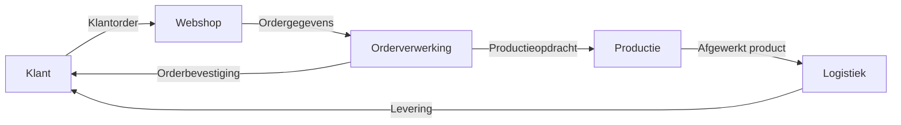

#### Inleiding

Dit Procesinput-output-template beschrijft de stroom van input naar output binnen {{procesnaam}}, inclusief triggers, transformatiestappen, en kwaliteitsvoorwaarden. Het doel is om:  
- Duidelijkheid te scheppen over wat het proces start en wat het oplevert.  
- Inzicht te bieden in de transformatie die plaatsvindt tussen input en output.  
- Kwaliteitsvoorwaarden te definieren voor input en output.  
- Stakeholders een helder overzicht te geven van de processtroom.

#### Eigenschappen

| Veld           | Waarde                | Toelichting                                                                                     |
| -------------- | --------------------- | ----------------------------------------------------------------------------------------------- |
| PMD-nummer | 03.02.01              | Uniek identificatienummer voor deze procesinput-output in het Proces Management Document (PMD). |
| Versie     | 1                     | Huidige versie van dit document. Wordt geüpdaterd bij elke wijziging.                           |
| Status     | concept               | Mogelijke statussen: *concept*, *in review*, *goedgekeurd*, *gepubliceerd*, *verouderd*.        |
| Auteur     | [Naam]                | De persoon of afdeling die dit document heeft opgesteld (meestal de procesanalist).             |
| Eigenaar   | [Naam proceseigenaar] | Verantwoordelijk voor de inhoud en actualiteit van de procesinput-output.                       |
| Datum      | 17/04/2026            | Datum van de laatste update.                                                                    |

#### 1. Algemeen Overzicht

Geef hier een kort overzicht van het proces waarvoor de input-output wordt beschreven.

| Veld                | Waarde                                                                   |
| ----------------------- | ---------------------------------------------------------------------------- |
| Procesnaam          | [Naam van het proces, bijv. "Orderverwerking"]                               |
| Procescategorie     | [Primair / Ondersteunend / Sturend]                                          |
| PMD-nummer          | [PMD-nummer van het proces]                                                  |
| Doel van het proces | [Korte beschrijving, bijv. "Tijdige en accurate verwerking van klantorders"] |

#### 2. Procestrigger

Beschrijf hier wat het proces start. Een trigger kan een event, aanvraag, of signaal zijn.

| Trigger                          | Type                 | Beschrijving                                 | Bron    | Frequentie | Verantwoordelijke |
| ------------------------------------ | ------------------------ | ------------------------------------------------ | ----------- | -------------- | --------------------- |
| [Bijv. "Ontvangst klantorder"]       | Event                    | Een klant plaatst een order via de webshop.      | Webshop     | Dagelijks      | Sales Team            |
| [Bijv. "Aanvraag productieopdracht"] | Aanvraag                 | Een medewerker vraagt een productieopdracht aan. | Order Team  | Dagelijks      | Order Team            |
| [Bijv. "Signaal lage voorraad"]      | Signaal uit ander proces | ERP-systeem geeft een alert bij lage voorraad.   | ERP-systeem | Ad hoc         | IT-afdeling           |

Toelichting types triggers:

- Event: Een gebeurtenis die het proces start (bijv. ontvangst van een order, een klantverzoek).
- Aanvraag: Een verzoek van een persoon of afdeling om het proces te starten.
- Signaal uit ander proces: Een automatisch signaal uit een ander proces (bijv. systeemalert, koppeling met een ander proces).

#### 3. Input

Beschrijf hier wat het proces nodig heeft om te kunnen starten of draaien. Input kan data, documenten, systemen, of externe input zijn.

| Input                              | Type      | Beschrijving                                        | Bron          | Kwaliteitsvoorwaarden            | Verantwoordelijke |
| -------------------------------------- | ------------- | ------------------------------------------------------- | ----------------- | ------------------------------------ | --------------------- |
| [Bijv. "Klantorder"]                   | Data          | Digitaal orderformulier met klant- en productgegevens.  | Webshop/CRM       | Compleet, geverifieerd, en tijdig    | Sales Team            |
| [Bijv. "Productiespecificaties"]       | Document      | Technische specificaties voor productie.                | Productieafdeling | Actueel, goedgekeurd, en beschikbaar | Productie Manager     |
| [Bijv. "Goedkeuring manager"]          | Goedkeuring   | Handtekening of digitale goedkeuring voor grote orders. | Manager           | Tijdig en accuraat                   | Sales Manager         |
| [Bijv. "Externe leveranciersgegevens"] | Externe input | Gegevens van leveranciers voor inkoop.                  | Leverancier       | Betrouwbaar en up-to-date            | Inkoop Team           |

Toelichting types input:

- Data: Digitale informatie (bijv. klantgegevens, ordergegevens).
- Documenten: Fysieke of digitale documenten (bijv. contracten, specificaties).
- Systemen: Toegang tot systemen (bijv. ERP, CRM).
- Externe input: Input van buiten de organisatie (bijv. leveranciers, klanten).

#### 4. Output

Beschrijf hier wat het proces oplevert. Output kan een product, dienst, besluit, of registratie zijn.

| Output                          | Type | Beschrijving                           | Bestemming    | Kwaliteitsvoorwaarden          | Verantwoordelijke |
| ----------------------------------- | -------- | ------------------------------------------ | ----------------- | ---------------------------------- | --------------------- |
| [Bijv. "Orderbevestiging"]          | Document | Bevestiging van de order aan de klant.     | Klant             | Accuraat, tijdig, en professioneel | Order Team            |
| [Bijv. "Productieopdracht"]         | Data     | Digitaal opdrachtformulier voor productie. | Productieafdeling | Compleet, foutloos, en tijdig      | Order Team            |
| [Bijv. "Afgewerkt product"]         | Product  | Fysiek product volgens specificaties.      | Logistiek         | Voldoet aan kwaliteitsnormen       | Productie Team        |
| [Bijv. "Besluit goedkeuring order"] | Besluit  | Goedkeuring of afwijzing van een order.    | Klant/Sales       | Duidelijk en gemotiveerd           | Sales Manager         |

Toelichting types output:

- Product: Fysiek of digitaal product (bijv. software, hardware).
- Dienst: Een dienst die wordt geleverd (bijv. klantenservice, onderhoud).
- Besluit: Een beslissing die wordt genomen (bijv. goedkeuring, afwijzing).
- Registratie: Een registratie in een systeem (bijv. orderregistratie, factuur).

#### 5. Transformatie

Beschrijf hier wat er gebeurt tussen input en output. Geef de belangrijkste bewerkingen, kernactiviteiten, en logische stappen weer.

| Stap                              | Beschrijving                                    | Type Activiteit | Verantwoordelijke | Systeem/Tool | Duur   |
| ------------------------------------- | --------------------------------------------------- | ------------------- | --------------------- | ---------------- | ---------- |
| [Bijv. "Ontvangst klantorder"]        | Registratie van de klantorder in het ERP-systeem.   | Registratie         | Order Team            | ERP-systeem      | 5 minuten  |
| [Bijv. "Validatie klantgegevens"]     | Controle of klantgegevens compleet en correct zijn. | Validatie           | Order Team            | CRM-systeem      | 10 minuten |
| [Bijv. "Genereren productieopdracht"] | Omzetten van klantorder naar productieopdracht.     | Transformatie       | Order Team            | ERP-systeem      | 15 minuten |
| [Bijv. "Versturen orderbevestiging"]  | Verzenden van bevestigingsmail naar klant.          | Communicatie        | Order Team            | E-mail           | 2 minuten  |

Toelichting types activiteiten:

- Registratie: Het vastleggen van gegevens in een systeem.
- Validatie: Het controleren van gegevens op juistheid en volledigheid.
- Transformatie: Het omzetten van input naar een andere vorm (bijv. order naar productieopdracht).
- Communicatie: Het doorgeven van informatie aan een andere partij (bijv. klant, afdeling).

#### 6. Kwaliteitsvoorwaarden

Definieer hier wanneer input bruikbaar is en wanneer output correct is. Gebruik kwalitatieve en kwantitatieve criteria.

##### Kwaliteitsvoorwaarden voor Input

| Voorwaarde   | Beschrijving                              | Meetmethode                 | Verantwoordelijke |
| ---------------- | --------------------------------------------- | ------------------------------- | --------------------- |
| Volledigheid | Alle benodigde gegevens zijn aanwezig.        | Controle op ontbrekende velden  | Order Team            |
| Juistheid    | Gegevens zijn correct en accuraat.            | Validatie tegen brongegevens    | Order Team            |
| Tijdigheid   | Input is tijdig beschikbaar.                  | Controle op ontvangsttijd       | Order Team            |
| Consistentie | Gegevens zijn consistent met andere systemen. | Vergelijking met andere bronnen | IT-afdeling           |

##### Kwaliteitsvoorwaarden voor Output

| Voorwaarde      | Beschrijving                                      | Meetmethode                    | Verantwoordelijke |
| ------------------- | ----------------------------------------------------- | ---------------------------------- | --------------------- |
| Volledigheid    | Alle benodigde output is geleverd.                    | Controle op ontbrekende onderdelen | Order Team            |
| Juistheid       | Output is correct en accuraat.                        | Validatie tegen input              | Kwaliteitsmanager     |
| Tijdigheid      | Output is tijdig geleverd.                            | Controle op leverdatum             | Order Team            |
| Naleving normen | Output voldoet aan organisatie- en wettelijke normen. | Audit                              | Compliance Officer    |

#### 7. Visuele Weergave (Optioneel)

Gebruik een visueel diagram (bijv. in Mermaid) om de input-output-stroom van het proces weer te geven.

Voorbeeld:

#### 8. Stakeholders en Verantwoordelijkheden

Geef hier een overzicht van wie betrokken is bij de input-output-stroom van het proces.

| Rol               | Verantwoordelijkheid                                                       | Betrokkenheid |
| --------------------- | ------------------------------------------------------------------------------ | ----------------- |
| Proceseigenaar    | Verantwoordelijk voor de inhoud en actualiteit van de input-output-stroom. | Continu           |
| Procesanalist     | Documenteert en analyseert de input-output-stroom.                         | Ad hoc            |
| Uitvoerend team   | Voert het proces uit volgens de gedocumenteerde stappen.                   | Dagelijks         |
| IT-afdeling       | Ondersteunt bij systeemintegraties en technische beperkingen.              | Ad hoc            |
| Kwaliteitsmanager | Monitort de kwaliteitsvoorwaarden voor input en output.                    | Periodiek         |

#### 9. Tips voor het Documenteren van Procesinput-Output

- Wees specifiek: Beschrijf concreet wat de input en output zijn.  
- Identificeer alle triggers: Zorg dat alle startmomenten van het proces duidelijk zijn.  
- Documenteer de transformatie: Maak duidelijk wat er gebeurt tussen input en output.  
- Definieer kwaliteitsvoorwaarden: Zorg dat input en output voldoen aan duidelijke criteria.  
- Gebruik visuele hulpmiddelen: Diagrammen (bijv. Mermaid) maken de stroom inzichtelijk.  
- Betrek stakeholders: Laat de input-output-stroom reviewen door proceseigenaren en IT.  
- Houd het actueel: Update de documentatie bij wijzigingen in processen, systemen, of regels.

#### 10. Gerelateerde Documenten

Lijst hier alle gerelateerde documenten, zoals:

- [Link naar procesbeschrijving]
- [Link naar BPMN-diagram]
- [Link naar proceslandkaart]
- [Link naar systeemdocumentatie]

#### 11. Versiehistorie

| Versie | Datum  | Wijziging   | Auteur |
| ---------- | ---------- | --------------- | ---------- |
| 1.0        | 17/04/2026 | Initiële versie | [Naam]     |

#### 12. Instructies voor Gebruik

1. Start met het proces:
  - Kies het proces waarvoor je de input-output wilt beschrijven.
1. Identificeer triggers:
  - Bepaal wat het proces start.
1. Documenteer input:
  - Beschrijf wat het proces nodig heeft om te kunnen draaien.
1. Documenteer output:
  - Beschrijf wat het proces oplevert.
1. Beschrijf de transformatie:
  - Geef aan wat er gebeurt tussen input en output.
1. Definieer kwaliteitsvoorwaarden:
  - Stel criteria op voor input en output.
1. Valideer met stakeholders:
  - Laat de input-output-stroom reviewen door proceseigenaren en betrokken teams.

#### 13. Voorbeeld: Ingevulde Procesinput-Output (Orderverwerking)

##### Algemeen Overzicht

| Veld                | Waarde                                      |
| ----------------------- | ----------------------------------------------- |
| Procesnaam          | Orderverwerking                                 |
| Procescategorie     | Primair                                         |
| PMD-nummer          | PMD-01.01.00                                    |
| Doel van het proces | Tijdige en accurate verwerking van klantorders. |

##### Procestrigger

| Trigger           | Type                 | Beschrijving                               | Bron    | Frequentie | Verantwoordelijke |
| --------------------- | ------------------------ | ---------------------------------------------- | ----------- | -------------- | --------------------- |
| Ontvangst klantorder  | Event                    | Een klant plaatst een order via de webshop.    | Webshop     | Dagelijks      | Sales Team            |
| Signaal lage voorraad | Signaal uit ander proces | ERP-systeem geeft een alert bij lage voorraad. | ERP-systeem | Ad hoc         | IT-afdeling           |

##### Input

| Input              | Type | Beschrijving                                       | Bron          | Kwaliteitsvoorwaarden            | Verantwoordelijke |
| ---------------------- | -------- | ------------------------------------------------------ | ----------------- | ------------------------------------ | --------------------- |
| Klantorder             | Data     | Digitaal orderformulier met klant- en productgegevens. | Webshop/CRM       | Compleet, geverifieerd, en tijdig    | Sales Team            |
| Productiespecificaties | Document | Technische specificaties voor productie.               | Productieafdeling | Actueel, goedgekeurd, en beschikbaar | Productie Manager     |

##### Output

| Output        | Type | Beschrijving                           | Bestemming    | Kwaliteitsvoorwaarden          | Verantwoordelijke |
| ----------------- | -------- | ------------------------------------------ | ----------------- | ---------------------------------- | --------------------- |
| Orderbevestiging  | Document | Bevestiging van de order aan de klant.     | Klant             | Accuraat, tijdig, en professioneel | Order Team            |
| Productieopdracht | Data     | Digitaal opdrachtformulier voor productie. | Productieafdeling | Compleet, foutloos, en tijdig      | Order Team            |

##### Transformatie

| Stap                    | Beschrijving                                    | Type Activiteit | Verantwoordelijke | Systeem/Tool | Duur   |
| --------------------------- | --------------------------------------------------- | ------------------- | --------------------- | ---------------- | ---------- |
| Ontvangst klantorder        | Registratie van de klantorder in het ERP-systeem.   | Registratie         | Order Team            | ERP-systeem      | 5 minuten  |
| Validatie klantgegevens     | Controle of klantgegevens compleet en correct zijn. | Validatie           | Order Team            | CRM-systeem      | 10 minuten |
| Genereren productieopdracht | Omzetten van klantorder naar productieopdracht.     | Transformatie       | Order Team            | ERP-systeem      | 15 minuten |
| Versturen orderbevestiging  | Verzenden van bevestigingsmail naar klant.          | Communicatie        | Order Team            | E-mail           | 2 minuten  |

##### Kwaliteitsvoorwaarden

Voor Input:

| Voorwaarde | Beschrijving                       | Meetmethode                | Verantwoordelijke |
| -------------- | -------------------------------------- | ------------------------------ | --------------------- |
| Volledigheid   | Alle benodigde gegevens zijn aanwezig. | Controle op ontbrekende velden | Order Team            |
| Juistheid      | Gegevens zijn correct en accuraat.     | Validatie tegen brongegevens   | Order Team            |

Voor Output:

| Voorwaarde | Beschrijving                   | Meetmethode                    | Verantwoordelijke |
| -------------- | ---------------------------------- | ---------------------------------- | --------------------- |
| Volledigheid   | Alle benodigde output is geleverd. | Controle op ontbrekende onderdelen | Order Team            |
| Juistheid      | Output is correct en accuraat.     | Validatie tegen input              | Kwaliteitsmanager     |