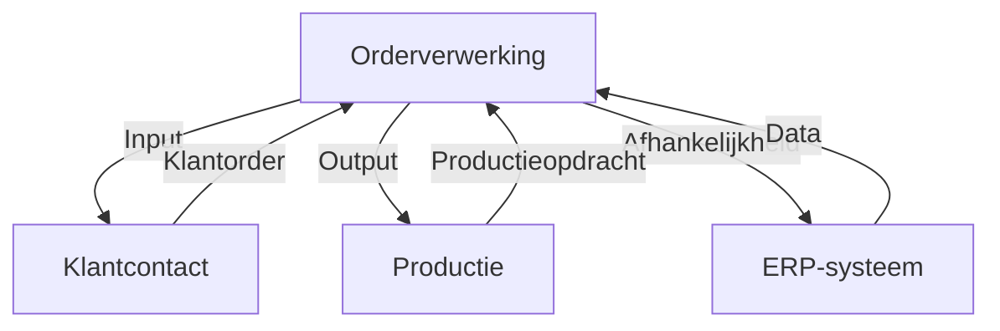

#### Inleiding

Dit Procesmetadata-template legt de basiseigenschappen, relaties en versiegeschiedenis van een proces vast. Het doel is om:  
- Eenduidige identificatie van processen mogelijk te maken.  
- Overzicht te bieden van eigenschappen, relaties en afhankelijkheden.  
- Versiebeheer te faciliteren voor traceerbaarheid en actualiteit.  
- Integratie met andere systemen (bijv. Confluence, SharePoint, BPMN-tools) te vergemakkelijken.

#### Eigenschappen

| Veld           | Waarde                | Toelichting                                                                                 |
| -------------- | --------------------- | ------------------------------------------------------------------------------------------- |
| PMD-nummer | 03.05.00              | Uniek identificatienummer voor deze procesmetadata in het Proces Management Document (PMD). |
| Versie     | 1                     | Huidige versie van dit document. Wordt geüpdaterd bij elke wijziging.                       |
| Status     | concept               | Mogelijke statussen: *concept*, *in review*, *goedgekeurd*, *gepubliceerd*, *verouderd*.    |
| Auteur     | [Naam]                | De persoon of afdeling die dit document heeft opgesteld (meestal de procesanalist).         |
| Eigenaar   | [Naam proceseigenaar] | Verantwoordelijk voor de inhoud en actualiteit van de procesmetadata.                       |
| Datum      | 17/04/2026            | Datum van de laatste update.                                                                |

#### 1. Basisgegevens

Geef hier de fundamentele identificatiegegevens van het proces.

| Veld            | Waarde                                        | Toelichting                                                   |
| ------------------- | ------------------------------------------------- | ----------------------------------------------------------------- |
| Proces-ID       | [Uniek identificatienummer, bijv. "PR-001"]       | Unieke identifier voor het proces, bijv. gebaseerd op PMD-nummer. |
| Procesnaam      | [Naam van het proces, bijv. "Orderverwerking"]    | Duidelijke en eenduidige naam van het proces.                     |
| Procescategorie | [Primair / Ondersteunend / Sturend]               | Categorisatie van het proces.                                     |
| Proceseigenaar  | [Naam/afdeling]                                   | Verantwoordelijke voor het proces.                                |
| Status          | [Actief / Inactief / Verouderd / In Ontwikkeling] | Huidige status van het proces.                                    |
| Versie          | [Versienummer, bijv. "1.0"]                       | Huidige versie van het proces.                                    |
| Organisatie     | [Naam organisatie]                                | Organisatie waarbinnen het proces valt.                           |
| Product/Dienst  | [Naam product/dienst]                             | Product of dienst waar het proces aan bijdraagt.                  |
| PMD-nummer      | [PMD-nummer]                                      | Referentie naar het Proces Management Document.                   |

#### 2. Classificatie

Geef hier additionele classificatiegegevens om het proces in context te plaatsen.

| Veld          | Waarde                                               | Toelichting                                 |
| ----------------- | -------------------------------------------------------- | ----------------------------------------------- |
| Domein        | [Bijv. "Sales", "Productie", "Financiën"]                | Functioneel domein waar het proces toe behoort. |
| Subdomein     | [Bijv. "Orderbeheer", "Klantenservice"]                  | Subdomein binnen het domein.                    |
| Procesniveau  | [Level 0 / Level 1 / Level 2 / Level 3 / Level 4]        | Niveau in de proceshiërarchie.                  |
| Kritikaliteit | [Hoog / Middel / Laag]                                   | Belang van het proces voor de organisatie.      |
| Frequentie    | [Continu / Dagelijks / Wekelijks / Maandelijks / Ad hoc] | Hoe vaak het proces wordt uitgevoerd.           |

#### 3. Relaties

Beschrijf hier de relaties van het proces met andere processen, systemen, en stakeholders.

##### Gerelateerde Processen

| Relatietype | Procesnaam | PMD-nummer | Beschrijving                                     | Afhankelijkheid                                       |
| --------------- | -------------- | -------------- | ---------------------------------------------------- | --------------------------------------------------------- |
| Input           | [Naam]         | [PMD-nummer]   | [Beschrijving, bijv. "Levert klantorders"]           | [Bijv. "Proces kan niet starten zonder input"]            |
| Output          | [Naam]         | [PMD-nummer]   | [Beschrijving, bijv. "Ontvangt productieopdrachten"] | [Bijv. "Proces is afhankelijk van output"]                |
| Afhankelijkheid | [Naam]         | [PMD-nummer]   | [Beschrijving, bijv. "Gebruikt dezelfde data"]       | [Bijv. "Vertraging in dit proces beïnvloedt hoofdproces"] |

##### Systeemintegraties

| Systeem           | Type Koppeling        | Beschrijving                               | Verantwoordelijke |
| --------------------- | ------------------------- | ---------------------------------------------- | --------------------- |
| [Bijv. "ERP-systeem"] | [Automatisch / Handmatig] | [Beschrijving, bijv. "Registratie van orders"] | [Naam/afdeling]       |
| [Bijv. "CRM-systeem"] | [Automatisch / Handmatig] | [Beschrijving, bijv. "Klantgegevens"]          | [Naam/afdeling]       |

##### Stakeholders

| Rol        | Naam/Afdeling | Betrokkenheid | Verantwoordelijkheid       |
| -------------- | ----------------- | ----------------- | ------------------------------ |
| Proceseigenaar | [Naam]            | Continu           | Eigenaar van het proces.       |
| Procesanalist  | [Naam]            | Ad hoc            | Documentatie en optimalisatie. |
| IT-afdeling    | [Naam]            | Ad hoc            | Technische ondersteuning.      |

#### 4. Versiebeheer

Documenteer hier de versiegeschiedenis van het proces, inclusief wijzigingen, redenen, en betrokkenen.

| Versie | Datum | Wijziging                                          | Reden                           | Auteur | Goedgekeurd door | Status   |
| ---------- | --------- | ------------------------------------------------------ | ----------------------------------- | ---------- | -------------------- | ------------ |
| v0.1       | [Datum]   | [Beschrijving, bijv. "Initiële versie"]                | [Reden, bijv. "Eerste opzet"]       | [Naam]     | [Naam]               | Concept      |
| v1.0       | [Datum]   | [Beschrijving, bijv. "Toegevoegde systeemkoppelingen"] | [Reden, bijv. "Integratie met ERP"] | [Naam]     | [Naam]               | Goedgekeurd  |
| v1.1       | [Datum]   | [Beschrijving]                                         | [Reden]                             | [Naam]     | [Naam]               | Gepubliceerd |

#### 5. Metadata voor Documentbeheer

Geef hier additionele metadata voor documentbeheer en zoekbaarheid.

| Veld                    | Waarde                                                | Toelichting                                 |
| --------------------------- | --------------------------------------------------------- | ----------------------------------------------- |
| Trefwoorden             | [Lijst van trefwoorden, bijv. "order, verwerking, klant"] | Voor zoekbaarheid in systemen.                  |
| Geldigheid              | [Datum]                                                   | Datum tot wanneer het proces geldig is.         |
| Vervangt                | [PMD-nummer/versie]                                       | Welk proces of versie dit document vervangt.    |
| Vervangen door          | [PMD-nummer/versie]                                       | Welk proces of versie dit document vervangt.    |
| Gerelateerde documenten | [Lijst van links]                                         | Documenten die gerelateerd zijn aan dit proces. |

#### 6. Kwaliteit en Compliance

Beschrijf hier kwaliteits- en compliance-eisen die van toepassing zijn op het proces.

| Eis                 | Type   | Beschrijving                    | Verantwoordelijke | Controlefrequentie |
| ----------------------- | ---------- | ----------------------------------- | --------------------- | ---------------------- |
| [Bijv. "ISO 9001"]      | Compliance | Voldoen aan kwaliteitsnormen.       | Kwaliteitsmanager     | Jaarlijks              |
| [Bijv. "GDPR"]          | Wettelijk  | Bescherming van persoonsgegevens.   | Compliance Officer    | Continu                |
| [Bijv. "Interne audit"] | Kwaliteit  | Periodieke controle van het proces. | Interne Auditor       | Halfjaarlijks          |

#### 7. Visuele Weergave (Optioneel)

Gebruik een visueel diagram (bijv. in Mermaid) om de relaties en afhankelijkheden van het proces weer te geven.

Voorbeeld:

#### 8. Tips voor het Documenteren van Procesmetadata

-  Wees consistent: Gebruik eenduidige terminologie en structuur voor alle processen.  
-  Houd het actueel: Update metadata bij elke wijziging in het proces.  
-  Gebruik unieke identifiers: Zorg voor eenduidige Proces-ID’s en PMD-nummers.  
-  Documenteer relaties: Maak duidelijk hoe het proces samenhangt met andere processen en systemen.  
-  Versiebeheer is cruciaal: Houd een duidelijke versiegeschiedenis bij voor traceerbaarheid.  
-  Betrek stakeholders: Laat metadata reviewen door proceseigenaren en IT.  
-  Gebruik metadata voor zoekbaarheid: Voeg trefwoorden en domeinen toe voor betere vindbaarheid.

#### 9. Gerelateerde Documenten

Lijst hier alle gerelateerde documenten, zoals:

- [Link naar procesbeschrijving]
- [Link naar BPMN-diagram]
- [Link naar proceslandkaart]
- [Link naar systeemdocumentatie]

#### 10. Versiehistorie

| Versie | Datum  | Wijziging   | Auteur |
| ---------- | ---------- | --------------- | ---------- |
| 1.0        | 17/04/2026 | Initiële versie | [Naam]     |

#### 11. Instructies voor Gebruik

1. Start met basisgegevens:
  - Vul de fundamentele identificatiegegevens van het proces in.
1. Classificeer het proces:
  - Geef aan tot welk domein, subdomein, en niveau het proces behoort.
1. Documenteer relaties:
  - Beschrijf input, output, afhankelijkheden, en systeemintegraties.
1. Houd versiebeheer bij:
  - Documenteer alle wijzigingen in de versiegeschiedenis.
1. Voeg metadata toe:
  - Vul trefwoorden, geldigheid, en gerelateerde documenten in voor zoekbaarheid.
1. Beschrijf kwaliteit en compliance:
  - Geef aan welke kwaliteits- en compliance-eisen gelden.
1. Valideer met stakeholders:
  - Laat de metadata reviewen door proceseigenaren en betrokken teams.

#### 12. Voorbeeld: Ingevulde Procesmetadata (Orderverwerking)

##### Basisgegevens

| Veld            | Waarde      | Toelichting                         |
| ------------------- | --------------- | --------------------------------------- |
| Proces-ID       | PR-001          | Unieke identifier voor Orderverwerking. |
| Procesnaam      | Orderverwerking | Naam van het proces.                    |
| Procescategorie | Primair         | Categorisatie als kernproces.           |
| Proceseigenaar  | Jan de Vries    | Verantwoordelijke voor het proces.      |
| Status          | Actief          | Huidige status.                         |
| Versie          | 1.2             | Huidige versie.                         |
| Organisatie     | Martin van Pelt | Organisatie waarbinnen het proces valt. |
| Product/Dienst  | Klantorders     | Product waar het proces aan bijdraagt.  |
| PMD-nummer      | PMD-01.01.00    | Referentie naar PMD.                    |

##### Classificatie

| Veld          | Waarde  | Toelichting                       |
| ----------------- | ----------- | ------------------------------------- |
| Domein        | Sales       | Functioneel domein.                   |
| Subdomein     | Orderbeheer | Subdomein binnen Sales.               |
| Procesniveau  | Level 1     | Niveau in de proceshiërarchie.        |
| Kritikaliteit | Hoog        | Belang voor de organisatie.           |
| Frequentie    | Dagelijks   | Hoe vaak het proces wordt uitgevoerd. |

##### Relaties

Gerelateerde Processen:

| Relatietype | Procesnaam | PMD-nummer | Beschrijving              | Afhankelijkheid                   |
| --------------- | -------------- | -------------- | ----------------------------- | ------------------------------------- |
| Input           | Klantcontact   | PMD-01.00.00   | Leveren van klantorders.      | Proces kan niet starten zonder input. |
| Output          | Productie      | PMD-01.02.00   | Ontvangt productieopdrachten. | Proces is afhankelijk van output.     |

Systeemintegraties:

| Systeem | Type Koppeling | Beschrijving        | Verantwoordelijke |
| ----------- | ------------------ | ----------------------- | --------------------- |
| ERP-systeem | Automatisch        | Registratie van orders. | IT-afdeling           |
| CRM-systeem | Automatisch        | Klantgegevens.          | IT-afdeling           |

Stakeholders:

| Rol        | Naam/Afdeling | Betrokkenheid | Verantwoordelijkheid       |
| -------------- | ----------------- | ----------------- | ------------------------------ |
| Proceseigenaar | Jan de Vries      | Continu           | Eigenaar van het proces.       |
| Procesanalist  | Lisa van der Meer | Ad hoc            | Documentatie en optimalisatie. |

##### Versiebeheer

| Versie | Datum  | Wijziging                  | Reden                  | Auteur        | Goedgekeurd door | Status   |
| ---------- | ---------- | ------------------------------ | -------------------------- | ----------------- | -------------------- | ------------ |
| v0.1       | 01/03/2026 | Initiële versie                | Eerste opzet               | Lisa van der Meer | Jan de Vries         | Concept      |
| v1.0       | 15/03/2026 | Toegevoegde systeemkoppelingen | Integratie met ERP         | Lisa van der Meer | Jan de Vries         | Goedgekeurd  |
| v1.1       | 01/04/2026 | Geüpdaterde processtappen      | Optimalisatie doorlooptijd | Lisa van der Meer | Jan de Vries         | Gepubliceerd |
| v1.2       | 17/04/2026 | Toegevoegde compliance-eisen   | GDPR-naleving              | Lisa van der Meer | Compliance Officer   | Gepubliceerd |

##### Metadata voor Documentbeheer

| Veld                    | Waarde                                            | Toelichting                         |
| --------------------------- | ----------------------------------------------------- | --------------------------------------- |
| Trefwoorden             | order, verwerking, klant, sales                       | Voor zoekbaarheid.                      |
| Geldigheid              | 17/04/2027                                            | Datum tot wanneer het proces geldig is. |
| Vervangt                | PMD-01.01.00 v1.1                                     | Welke versie dit document vervangt.     |
| Gerelateerde documenten | [Link naar BPMN-diagram], [Link naar werkinstructies] | Gerelateerde documenten.                |

##### Kwaliteit en Compliance

| Eis  | Type   | Beschrijving                  | Verantwoordelijke | Controlefrequentie |
| -------- | ---------- | --------------------------------- | --------------------- | ---------------------- |
| ISO 9001 | Compliance | Voldoen aan kwaliteitsnormen.     | Kwaliteitsmanager     | Jaarlijks              |
| GDPR     | Wettelijk  | Bescherming van persoonsgegevens. | Compliance Officer    | Continu                |