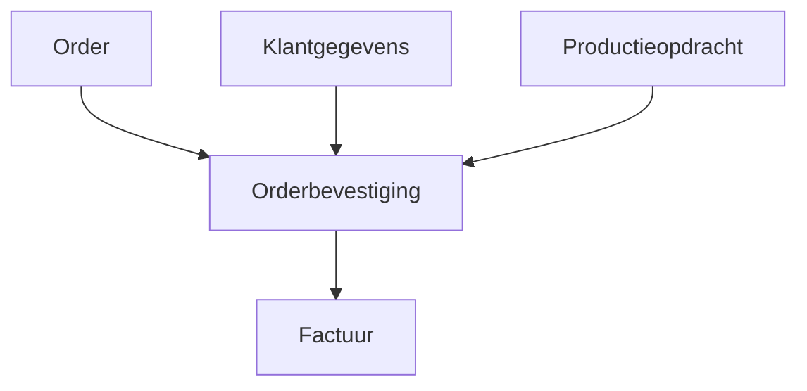

#### Inleiding

Dit Procesbegrippen-template legde terminologie en definities vast die binnen {{organisatienaam}} worden gebruikt. Het doel is om:  
-  Eenduidigheid te creëren in de begrippen en terminologie die binnen processen worden gebruikt.  
-  Misverstanden te voorkomen door duidelijke definities en context te bieden.  
-  Consistentie te waarborgen in documentatie, communicatie, en training.  
-  Stakeholders (medewerkers, management, externe partijen) een betrouwbare bron te bieden voor procesgerelateerde termen.

#### Eigenschappen

| Veld           | Waarde                | Toelichting                                                                                  |
| -------------- | --------------------- | -------------------------------------------------------------------------------------------- |
| PMD-nummer | 03.02.01              | Uniek identificatienummer voor deze procesbegrippen in het Proces Management Document (PMD). |
| Versie     | 1                     | Huidige versie van dit document. Wordt geüpdaterd bij elke wijziging.                        |
| Status     | concept               | Mogelijke statussen: *concept*, *in review*, *goedgekeurd*, *gepubliceerd*, *verouderd*.     |
| Auteur     | [Naam]                | De persoon of afdeling die dit document heeft opgesteld (meestal de procesanalist).          |
| Eigenaar   | [Naam proceseigenaar] | Verantwoordelijk voor de inhoud en actualiteit van de procesbegrippen.                       |
| Datum      | 17/04/2026            | Datum van de laatste update.                                                                 |

#### 1. Algemeen Overzicht

Geef hier een kort overzicht van het doel en de scope van dit begrippenoverzicht.

| Veld                   | Waarde                                               |
| -------------------------- | -------------------------------------------------------- |
| Domein                 | [Bijv. "Orderverwerking", "Klantenservice", "Productie"] |
| Doelgroep              | [Bijv. "Medewerkers, Management, Externe partijen"]      |
| Gerelateerd aan proces | [Naam proces, bijv. "Orderverwerking"]                   |

#### 2. Begrip

Geef hier de naam van het begrip dat wordt gedefinieerd.

| Veld   | Waarde                                      |
| ---------- | ----------------------------------------------- |
| Begrip | [Naam van het begrip, bijv. "Orderbevestiging"] |

#### 3. Definitie

Geef hier een eenduidige en duidelijke beschrijving van het begrip. Gebruik korte, heldere zinnen en vermijd jargon.

| Veld      | Waarde                                                                                                                                                |
| ------------- | --------------------------------------------------------------------------------------------------------------------------------------------------------- |
| Definitie | [Eenduidige beschrijving, bijv. "Een orderbevestiging is een officiële bevestiging aan de klant dat de order is ontvangen en in behandeling is genomen."] |

Tips voor een goede definitie:

- Gebruik duidelijke, eenvoudige taal.
- Vermijd circulaire definities (bijv. "Een order is een bestelling" → niet informatief).
- Geef context als dat nodig is voor begrip.

#### 4. Context

Beschrijf hier waar en hoe het begrip wordt gebruikt binnen de organisatie. Geef aan:

- In welke processen het begrip wordt gebruikt.
- In welke documenten het begrip voorkomt.
- Welke afdelingen of rollen met het begrip werken.

| Veld                        | Waarde                                                                                    |
| ------------------------------- | --------------------------------------------------------------------------------------------- |
| Gebruik in processen        | [Lijst van processen, bijv. "Orderverwerking, Facturatie"]                                    |
| Gebruik in documenten       | [Lijst van documenten, bijv. "Procesbeschrijving Orderverwerking, Werkinstructie Facturatie"] |
| Relevante afdelingen/rollen | [Lijst van afdelingen/rollen, bijv. "Sales, Order Team, Financiële Afdeling"]                 |

#### 5. Synoniemen

Geef hier andere termen of benamingen die binnen de organisatie voor hetzelfde begrip worden gebruikt. Dit helpt om verwarring te voorkomen.

| Synoniem               | Toelichting                                             | Gebruik in               |
| -------------------------- | ----------------------------------------------------------- | ---------------------------- |
| [Bijv. "Orderconfirmatie"] | [Toelichting, bijv. "Gebruikt in het CRM-systeem"]          | [Bijv. "CRM-systeem, Sales"] |
| [Bijv. "Bevestigingsmail"] | [Toelichting, bijv. "Informele term binnen het Order Team"] | [Bijv. "Order Team"]         |

#### 6. Gerelateerde Begrippen

Geef hier verwante begrippen binnen het Proces Management Document (PDM). Dit helpt om samenhang te tonen tussen verschillende termen.

| Gerelateerd begrip  | Relatie              | Toelichting                                                                              | PMD-nummer |
| ----------------------- | ------------------------ | -------------------------------------------------------------------------------------------- | -------------- |
| [Bijv. "Order"]         | Overkoepelend begrip | [Toelichting, bijv. "Een order is de basis voor een orderbevestiging."]                      | [PMD-nummer]   |
| [Bijv. "Factuur"]       | Volgend proces       | [Toelichting, bijv. "Na orderbevestiging volgt de factuur."]                                 | [PMD-nummer]   |
| [Bijv. "Klantgegevens"] | Input voor proces    | [Toelichting, bijv. "Klantgegevens zijn nodig voor het genereren van een orderbevestiging."] | [PMD-nummer]   |

Toelichting types relaties:

- Overkoepelend begrip: Een begrip waar dit begrip onder valt.
- Volgend proces: Een begrip dat volgt op dit begrip in een proces.
- Input voor proces: Een begrip dat als input dient voor dit begrip.
- Output van proces: Een begrip dat als output uit dit begrip voortkomt.

#### 7. Voorbeelden

Geef hier concrete voorbeelden van hoe het begrip in de praktijk wordt toegepast. Dit helpt om het begrip tastbaar te maken.

| Voorbeeld                                                     | Toelichting                                                                                              |
| ----------------------------------------------------------------- | ------------------------------------------------------------------------------------------------------------ |
| [Bijv. "Een orderbevestiging voor klant X met ordernummer 12345"] | [Toelichting, bijv. "Deze bevestiging wordt gegenereerd na ontvangst van de order en verstuurd per e-mail."] |

#### 8. Bronnen en Referenties

Geef hier aan waar het begrip vandaan komt of waar meer informatie te vinden is.

| Bron                   | Type  | Link/Referentie            |
| -------------------------- | --------- | ------------------------------ |
| [Bijv. "PDM-handboek"]     | Document  | [Link naar document]           |
| [Bijv. "ISO 9001"]         | Standaard | [Link naar standaard]          |
| [Bijv. "Interne training"] | Training  | [Link naar trainingsmateriaal] |

#### 9. Visuele Weergave (Optioneel)

Gebruik een visueel diagram (bijv. in Mermaid) om de relaties tussen begrippen weer te geven.

Voorbeeld:

#### 10. Stakeholders en Verantwoordelijkheden

Geef hier een overzicht van wie verantwoordelijk is voor het beheer en gebruik van de begrippen.

| Rol                     | Verantwoordelijkheid                                             | Betrokkenheid |
| --------------------------- | -------------------------------------------------------------------- | ----------------- |
| Proceseigenaar          | Verantwoordelijk voor de inhoud en actualiteit van de begrippen. | Continu           |
| Procesanalist           | Documenteert en onderhoudt de begrippen.                         | Ad hoc            |
| Training & Communicatie | Zorgt voor verspreiding en training van begrippen.               | Periodiek         |
| Medewerkers             | Gebruiken de begrippen volgens de gedefinieerde definities.      | Dagelijks         |

#### 11. Tips voor het Documenteren van Procesbegrippen

-  Wees eenduidig: Gebruik één definitie per begrip om verwarring te voorkomen.  
-  Houd het simpel: Gebruik duidelijke, eenvoudige taal in definities.  
-  Geef context: Leg uit waar en hoe het begrip wordt gebruikt.  
-  Documenteer synoniemen: Geef aan welke andere termen voor hetzelfde begrip worden gebruikt.  
-  Koppel gerelateerde begrippen: Maak duidelijk hoe begrippen met elkaar samenhangen.  
-  Gebruik voorbeelden: Concrete voorbeelden helpen om begrippen tastbaar te maken.  
-  Betrek stakeholders: Laat begrippen reviewen door proceseigenaren en gebruikers.  
-  Houd het actueel: Update begrippen bij wijzigingen in processen of organisatie.

#### 12. Gerelateerde Documenten

Lijst hier alle gerelateerde documenten, zoals:

- [Link naar procesbeschrijvingen]
- [Link naar PDM-handboek]
- [Link naar trainingmateriaal]

#### 13. Versiehistorie

| Versie | Datum  | Wijziging   | Auteur |
| ---------- | ---------- | --------------- | ---------- |
| 1.0        | 17/04/2026 | Initiële versie | [Naam]     |

#### 14. Instructies voor Gebruik

1. Start met het begrip:
  - Kies het begrip dat je wilt documenteren.
1. Geef een duidelijke definitie:
  - Schrijf een eenduidige en heldere definitie.
1. Beschrijf de context:
  - Geef aan waar en hoe het begrip wordt gebruikt.
1. Documenteer synoniemen:
  - Noteer andere termen die voor hetzelfde begrip worden gebruikt.
1. Koppel gerelateerde begrippen:
  - Maak duidelijk hoe het begrip samenhangt met andere begrippen.
1. Voeg voorbeelden toe:
  - Geef concrete voorbeelden van het gebruik van het begrip.
1. Valideer met stakeholders:
  - Laat het begrip reviewen door proceseigenaren en gebruikers.

#### 15. Voorbeeld: Ingevuld Procesbegrip (Orderbevestiging)

##### Algemeen Overzicht

| Veld                   | Waarde                       |
| -------------------------- | -------------------------------- |
| Domein                 | Orderverwerking                  |
| Doelgroep              | Medewerkers, Management, Klanten |
| Gerelateerd aan proces | Orderverwerking                  |

##### Begrip

| Veld   | Waarde       |
| ---------- | ---------------- |
| Begrip | Orderbevestiging |

##### Definitie

| Veld      | Waarde                                                                                                                                                                                                                                                               |
| ------------- | ------------------------------------------------------------------------------------------------------------------------------------------------------------------------------------------------------------------------------------------------------------------------ |
| Definitie | Een orderbevestiging is een officiële, schriftelijke of digitale bevestiging aan de klant dat de order is ontvangen en in behandeling is genomen. Deze bevestiging bevat doorgaans het ordernummer, de bestelde producten/diensten, de prijs, en de verwachte levertijd. |

##### Context

| Veld                        | Waarde                                                           |
| ------------------------------- | -------------------------------------------------------------------- |
| Gebruik in processen        | Orderverwerking, Klantenservice                                      |
| Gebruik in documenten       | Procesbeschrijving Orderverwerking, Werkinstructie Klantcommunicatie |
| Relevante afdelingen/rollen | Sales, Order Team, Klantenservice                                    |

##### Synoniemen

| Synoniem     | Toelichting                      | Gebruik in     |
| ---------------- | ------------------------------------ | ------------------ |
| Orderconfirmatie | Gebruikt in het CRM-systeem          | CRM-systeem, Sales |
| Bevestigingsmail | Informele term binnen het Order Team | Order Team         |

##### Gerelateerde Begrippen

| Gerelateerd begrip | Relatie          | Toelichting                                                       | PMD-nummer |
| ---------------------- | -------------------- | --------------------------------------------------------------------- | -------------- |
| Order                  | Overkoepelend begrip | Een order is de basis voor een orderbevestiging.                      | PMD-01.01.00   |
| Factuur                | Volgend proces       | Na orderbevestiging volgt de factuur.                                 | PMD-01.03.00   |
| Klantgegevens          | Input voor proces    | Klantgegevens zijn nodig voor het genereren van een orderbevestiging. | PMD-03.01.00   |

##### Voorbeelden

| Voorbeeld                                                                                            | Toelichting                                                                               |
| -------------------------------------------------------------------------------------------------------- | --------------------------------------------------------------------------------------------- |
| Een orderbevestiging voor klant X met ordernummer 12345, verstuurd per e-mail na ontvangst van de order. | Deze bevestiging wordt gegenereerd in het ERP-systeem en automatisch verstuurd naar de klant. |

##### Bronnen en Referenties

| Bron     | Type  | Link/Referentie      |
| ------------ | --------- | ------------------------ |
| PDM-handboek | Document  | [Link naar PDM-handboek] |
| ISO 9001     | Standaard | [Link naar ISO 9001]     |