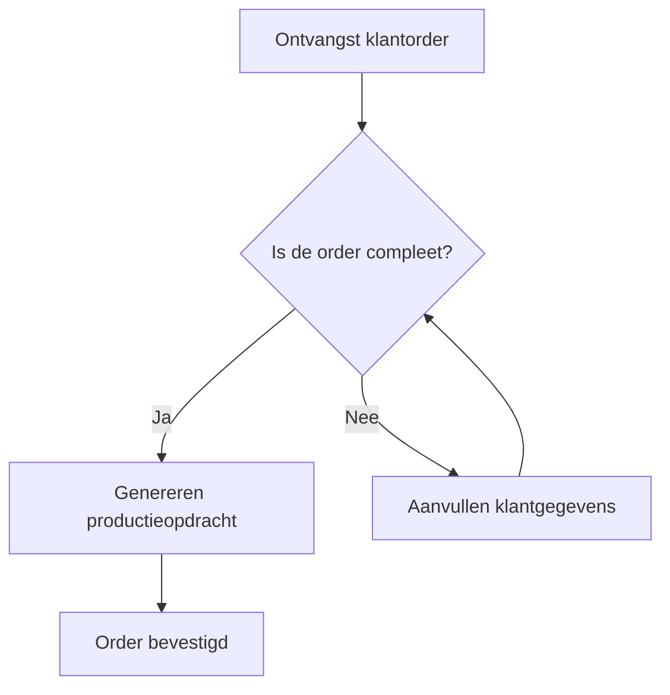
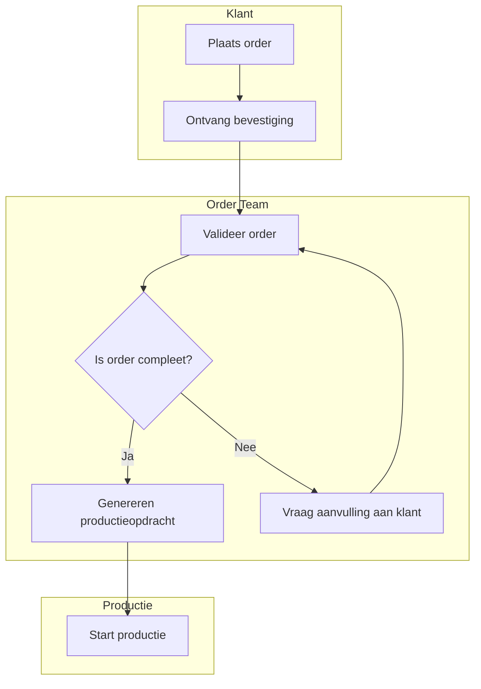

#### Inleiding

Dit Procesmodellering-template biedt een gestructureerde aanpak voor het visueel en tekstueel modelleren van {{procesnaam}}. Het doel is om:  
- Inzicht te bieden in de stappen, beslissingen, en uitzonderingen binnen het proces.  
- Duidelijkheid te creëren over hoe het proces verloopt en waar knelpunten kunnen ontstaan.  
- Stakeholders (management, uitvoerende teams, IT) een helder overzicht te geven van de proceslogica.  
- Basis te leggen voor automatisering, optimalisatie, en training.

#### Eigenschappen


| Veld           | Waarde                | Toelichting                                                                                    |
| -------------- | --------------------- | ---------------------------------------------------------------------------------------------- |
| PMD-nummer | 03.06.00              | Uniek identificatienummer voor deze procesmodellering in het Proces Management Document (PMD). |
| Versie     | 1                     | Huidige versie van dit document. Wordt geüpdaterd bij elke wijziging.                          |
| Status     | concept               | Mogelijke statussen: *concept*, *in review*, *goedgekeurd*, *gepubliceerd*, *verouderd*.       |
| Auteur     | [Naam]                | De persoon of afdeling die dit document heeft opgesteld (meestal de procesanalist).            |
| Eigenaar   | [Naam proceseigenaar] | Verantwoordelijk voor de inhoud en actualiteit van de procesmodellering.                       |
| Datum      | 17/04/2026            | Datum van de laatste update.                                                                   |


#### 1. Algemeen Overzicht

Geef hier een kort overzicht van het proces dat gemodelleerd wordt.


| Veld                | Waarde                                                                         |
| ----------------------- | ---------------------------------------------------------------------------------- |
| Procesnaam          | [Naam van het proces, bijv. "Orderverwerking"]                                     |
| Procescategorie     | [Primair / Ondersteunend / Sturend]                                                |
| PMD-nummer          | [PMD-nummer van het proces]                                                        |
| Doel van het proces | [Korte beschrijving, bijv. "Tijdige en accurate verwerking van klantorders"]       |
| Scope               | [Beschrijving van de reikwijdte, bijv. "Van ontvangst klantorder tot bevestiging"] |


#### 2. Notatiekeuze

Geef hier aan welke notatie wordt gebruikt voor het modelleren van het proces. Kies uit BPMN, Flowchart, Swimlane, of een andere methode.


| Veld             | Waarde                                                                                                            | Toelichting                                |
| -------------------- | --------------------------------------------------------------------------------------------------------------------- | ---------------------------------------------- |
| Notatie          | [BPMN / Flowchart / Swimlane / Overig]                                                                                | De gekozen modelleringstaal.                   |
| Reden voor keuze | [Bijv. "BPMN wordt gebruikt omdat het de standaard is binnen de organisatie en geschikt is voor complexe processen."] | Waarom deze notatie is gekozen.                |
| Tools            | [Bijv. "Camunda, Signavio, Lucidchart, Visio"]                                                                        | Tools die worden gebruikt voor het modelleren. |


Toelichting notaties:

- BPMN (Business Process Model and Notation): Geschikt voor complexe processen met veel beslissingen en stroomlijnen. Gebruikt standaard symbolen voor taken, gateways, en events.
- Flowchart: Geschikt voor eenvoudige processen met een lineaire stroom. Makkelijk te begrijpen voor niet-technische stakeholders.
- Swimlane: Geschikt voor processen met meerdere verantwoordelijke partijen (bijv. afdelingen, rollen). Toont wie wat doet.
- Overig: Andere notaties, zoals UML, EPC, of Value Stream Mapping.

#### 3. Hoofdflow

Beschrijf hier de hoofdstappen van het proces in logische volgorde. Gebruik nummering voor de stappen.


| Stap | Beschrijving                      | Verantwoordelijke | Systeem/Tool      | Duur             | Notatie-symbool          |
| -------- | ------------------------------------- | --------------------- | --------------------- | -------------------- | ---------------------------- |
| 1        | [Bijv. "Ontvangst klantorder"]        | [Naam/afdeling]       | [Bijv. "Webshop"]     | [Bijv. "5 minuten"]  | [Bijv. "Start Event (BPMN)"] |
| 2        | [Bijv. "Validatie klantgegevens"]     | [Naam/afdeling]       | [Bijv. "CRM-systeem"] | [Bijv. "10 minuten"] | [Bijv. "Task (BPMN)"]        |
| 3        | [Bijv. "Genereren productieopdracht"] | [Naam/afdeling]       | [Bijv. "ERP-systeem"] | [Bijv. "15 minuten"] | [Bijv. "Task (BPMN)"]        |


Toelichting:

- Notatie-symbool: Geef aan welk symbool uit de gekozen notatie (bijv. BPMN) bij deze stap hoort.

#### 4. Beslissingen

Beschrijf hier de beslissingspunten (gateways) in het proces. Geef aan welke keuzes worden gemaakt en wat de gevolgen zijn van elke keuze.


| Beslissing                      | Type                             | Beschrijving                                            | Opties | Gevolg per optie                                                  | Notatie-symbool                |
| ----------------------------------- | ------------------------------------ | ----------------------------------------------------------- | ---------- | --------------------------------------------------------------------- | ---------------------------------- |
| [Bijv. "Is de order compleet?"]     | [Bijv. "Exclusieve splitsing (XOR)"] | [Bijv. "Controle of alle vereiste velden zijn ingevuld."]   | [Ja / Nee] | [Ja: "Doorgaan naar stap 4", Nee: "Terug naar klant voor aanvulling"] | [Bijv. "Exclusive Gateway (BPMN)"] |
| [Bijv. "Is de voorraad voldoende?"] | [Bijv. "Exclusieve splitsing (XOR)"] | [Bijv. "Controle of er genoeg producten op voorraad zijn."] | [Ja / Nee] | [Ja: "Doorgaan naar productie", Nee: "Inkoop inschakelen"]            | [Bijv. "Exclusive Gateway (BPMN)"] |


Toelichting types beslissingen:

- Exclusieve splitsing (XOR): Slechts één pad kan worden gevolgd (bijv. "Ja" of "Nee").
- Inclusieve splitsing (OR): Meerdere paden kunnen worden gevolgd (bijv. "A en B", "A en C").
- Parallelle splitsing (AND): Alle paden moeten worden gevolgd (bijv. "A en B en C").

#### 5. Uitzonderingen

Beschrijf hier wat er gebeurt als het proces niet volgens de hoofdflow verloopt. Geef aan welke uitzonderingen kunnen optreden en hoe deze worden afhandeld.


| Uitzondering                    | Oorzaak                                                 | Impact                              | Afhandeling                                                      | Verantwoordelijke | Notatie-symbool                 |
| ----------------------------------- | ----------------------------------------------------------- | --------------------------------------- | -------------------------------------------------------------------- | --------------------- | ----------------------------------- |
| [Bijv. "Onvolledige klantgegevens"] | [Bijv. "Klant heeft niet alle verplichte velden ingevuld."] | [Bijv. "Vertraging in orderverwerking"] | [Bijv. "Terugsturen naar klant voor aanvulling"]                     | [Naam/afdeling]       | [Bijv. "Error Event (BPMN)"]        |
| [Bijv. "Systeemstoring"]            | [Bijv. "ERP-systeem is niet beschikbaar."]                  | [Bijv. "Proces stopt"]                  | [Bijv. "Handmatige registratie in Excel, later overzetten naar ERP"] | [Naam/afdeling]       | [Bijv. "Interrupting Event (BPMN)"] |


Toelichting:

- Notatie-symbool: Geef aan welk symbool uit de gekozen notatie (bijv. BPMN) bij deze uitzondering hoort.

#### 6. Visuele Weergave

Voeg hier een visuele weergave van het proces toe, gebruikmakend van de gekozen notatie (bijv. BPMN, Flowchart, Swimlane). Gebruik Mermaid voor een eenvoudige weergave in markdown.

Voorbeeld in BPMN:

```mermaid
%% Procesmodellering voorbeeld - vervang door eigen diagram
bpmnDiagram
    startEvent "Ontvangst klantorder" as start
    userTask "Validatie klantgegevens" as validatie
    exclusiveGateway "Is de order compleet?" as gateway1
    userTask "Aanvullen klantgegevens" as aanvullen
    userTask "Genereren productieopdracht" as productie
    endEvent "Order bevestigd" as end

    start --> validatie
    validatie --> gateway1
    gateway1 -->|Ja| productie
    gateway1 -->|Nee| aanvullen
    aanvullen --> validatie
    productie --> end
```

Voorbeeld in Flowchart:



Voorbeeld in Swimlane:



#### 7. Stakeholders en Verantwoordelijkheden

Geef hier een overzicht van wie betrokken is bij het proces en hun rol in de modellering.


| Rol             | Verantwoordelijkheid                                                     | Betrokkenheid |
| ------------------- | ---------------------------------------------------------------------------- | ----------------- |
| Proceseigenaar  | Verantwoordelijk voor de inhoud en actualiteit van de procesmodellering. | Continu           |
| Procesanalist   | Modelleert en documenteert het proces.                                   | Ad hoc            |
| Uitvoerend team | Voert het proces uit volgens het model.                                  | Dagelijks         |
| IT-afdeling     | Ondersteunt bij systeemintegraties en automatisering.                    | Ad hoc            |
| Management      | Valideert het model op strategische alignement.                          | Periodiek         |


#### 8. Tips voor Effectieve Procesmodellering

- Kies de juiste notatie: Gebruik BPMN voor complexe processen, Flowchart voor eenvoudige processen, en Swimlane voor processen met meerdere verantwoordelijken.  
- Houd het overzichtelijk: Beperk het aantal stappen en beslissingen per diagram om complexiteit te vermijden.  
- Gebruik standaard symbolen: Zorg voor consistentie in de gebruikte notatie (bijv. BPMN-symbolen).  
- Documenteer uitzonderingen: Maak duidelijk wat er gebeurt als het proces niet volgens de hoofdflow verloopt.  
- Betrek stakeholders: Laat het model reviewen door proceseigenaren, uitvoerende teams, en IT.  
- Gebruik visuele hulpmiddelen: Diagrammen (bijv. Mermaid, BPMN-tools) maken de modellering inzichtelijk.  
- Houd het actueel: Update de modellering bij wijzigingen in processen of systemen.

#### 9. Gerelateerde Documenten

Lijst hier alle gerelateerde documenten, zoals:

- [Link naar procesbeschrijving]
- [Link naar proceslandkaart]
- [Link naar BPMN-diagrammen (indien niet in dit document)]
- [Link naar werkinstructies]

#### 10. Versiehistorie


| Versie | Datum  | Wijziging   | Auteur |
| ---------- | ---------- | --------------- | ---------- |
| 1.0        | 17/04/2026 | Initiële versie | [Naam]     |


#### 11. Instructies voor Gebruik

1. Kies de notatie:
  - Bepaal welke notatie (BPMN, Flowchart, Swimlane) het beste past bij het proces.
1. Beschrijf de hoofdflow:
  - Documenteer de hoofdstappen van het proces in logische volgorde.
1. Voeg beslissingen toe:
  - Beschrijf beslissingspunten en de gevolgen van elke keuze.
1. Documenteer uitzonderingen:
  - Geef aan wat er gebeurt als het proces niet volgens de hoofdflow verloopt.
1. Maak een visuele weergave:
  - Gebruik Mermaid of een BPMN-tool om het proces visueel weer te geven.
1. Valideer met stakeholders:
  - Laat het model reviewen door proceseigenaren, uitvoerende teams, en IT.

#### 12. Voorbeeld: Ingevulde Procesmodellering (Orderverwerking)

##### Algemeen Overzicht


| Veld                | Waarde                                          |
| ----------------------- | --------------------------------------------------- |
| Procesnaam          | Orderverwerking                                     |
| Procescategorie     | Primair                                             |
| PMD-nummer          | PMD-01.01.00                                        |
| Doel van het proces | Tijdige en accurate verwerking van klantorders.     |
| Scope               | Van ontvangst klantorder tot bevestiging aan klant. |


##### Notatiekeuze


| Veld             | Waarde                                                                                 | Toelichting                                          |
| -------------------- | ------------------------------------------------------------------------------------------ | -------------------------------------------------------- |
| Notatie          | BPMN                                                                                       | Standaard voor complexe processen binnen de organisatie. |
| Reden voor keuze | BPMN biedt de nodige flexibiliteit voor het modelleren van beslissingen en uitzonderingen. | &nbsp;                                                   |
| Tools            | Camunda, Lucidchart                                                                        | &nbsp;                                                   |


##### Hoofdflow


| Stap | Beschrijving            | Verantwoordelijke | Systeem/Tool | Duur   | Notatie-symbool |
| -------- | --------------------------- | --------------------- | ---------------- | ---------- | ------------------- |
| 1        | Ontvangst klantorder        | Order Team            | Webshop          | 5 minuten  | Start Event         |
| 2        | Validatie klantgegevens     | Order Team            | CRM-systeem      | 10 minuten | Task                |
| 3        | Genereren productieopdracht | Order Team            | ERP-systeem      | 15 minuten | Task                |


##### Beslissingen


| Beslissing            | Type                   | Beschrijving                                  | Opties | Gevolg per optie                                            | Notatie-symbool |
| ------------------------- | -------------------------- | ------------------------------------------------- | ---------- | --------------------------------------------------------------- | ------------------- |
| Is de order compleet?     | Exclusieve splitsing (XOR) | Controle of alle vereiste velden zijn ingevuld.   | Ja / Nee   | Ja: Doorgaan naar stap 4, Nee: Terug naar klant voor aanvulling | Exclusive Gateway   |
| Is de voorraad voldoende? | Exclusieve splitsing (XOR) | Controle of er genoeg producten op voorraad zijn. | Ja / Nee   | Ja: Doorgaan naar productie, Nee: Inkoop inschakelen            | Exclusive Gateway   |


##### Uitzonderingen


| Uitzondering          | Oorzaak                                       | Impact                    | Afhandeling                                            | Verantwoordelijke | Notatie-symbool |
| ------------------------- | ------------------------------------------------- | ----------------------------- | ---------------------------------------------------------- | --------------------- | ------------------- |
| Onvolledige klantgegevens | Klant heeft niet alle verplichte velden ingevuld. | Vertraging in orderverwerking | Terugsturen naar klant voor aanvulling                     | Order Team            | Error Event         |
| Systeemstoring            | ERP-systeem is niet beschikbaar.                  | Proces stopt                  | Handmatige registratie in Excel, later overzetten naar ERP | IT-afdeling           | Interrupting Event  |


##### Visuele Weergave

```mermaid
%% Procesmodellering voorbeeld - Orderverwerking
bpmnDiagram
    startEvent "Ontvangst klantorder" as start
    userTask "Validatie klantgegevens" as validatie
    exclusiveGateway "Is de order compleet?" as gateway1
    userTask "Aanvullen klantgegevens" as aanvullen
    userTask "Genereren productieopdracht" as productie
    exclusiveGateway "Is de voorraad voldoende?" as gateway2
    userTask "Inkoop inschakelen" as inkoop
    endEvent "Order bevestigd" as end

    start --> validatie
    validatie --> gateway1
    gateway1 -->|Ja| gateway2
    gateway1 -->|Nee| aanvullen
    aanvullen --> validatie
    gateway2 -->|Ja| productie
    gateway2 -->|Nee| inkoop
    inkoop --> productie
    productie --> end
```