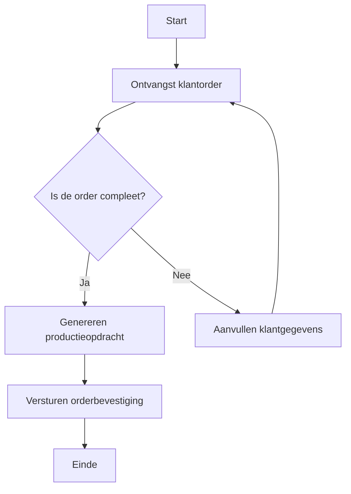
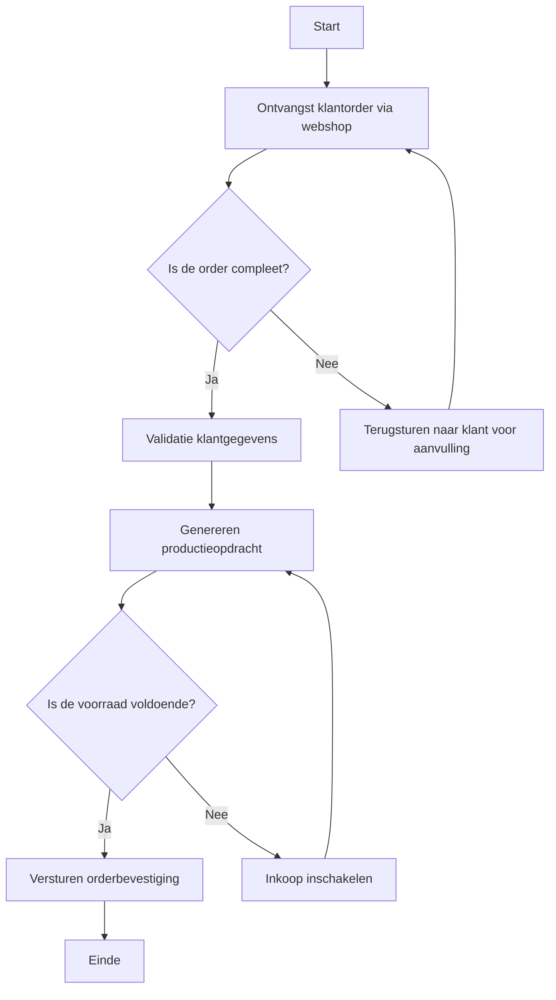
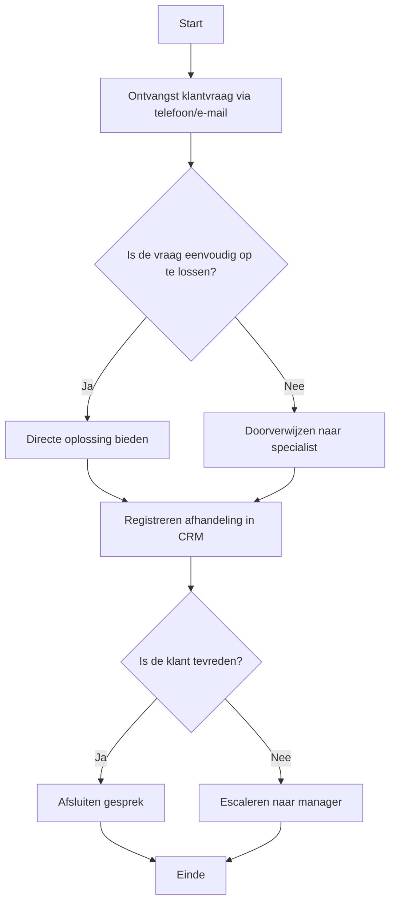

#### Inleiding

Dit Flowchart-template biedt een gestructureerde aanpak voor het visueel modelleren van processen met behulp van eenvoudige flowcharts. Het doel is om:  
- Duidelijkheid te scheppen over de stappen en beslissingen in een proces.  
- Complexe processen op een eenvoudige en visuele manier weer te geven.  
- Communicatie tussen stakeholders (management, uitvoerende teams, klanten) te verbeteren.  
- Basis te leggen voor training, documentatie, en procesoptimalisatie.

#### Eigenschappen


| Veld           | Waarde                | Toelichting                                                                              |
| -------------- | --------------------- | ---------------------------------------------------------------------------------------- |
| PMD-nummer | 03.06.02              | Uniek identificatienummer voor deze flowchart in het Proces Management Document (PMD).   |
| Versie     | 1                     | Huidige versie van dit document. Wordt geüpdaterd bij elke wijziging.                    |
| Status     | concept               | Mogelijke statussen: *concept*, *in review*, *goedgekeurd*, *gepubliceerd*, *verouderd*. |
| Auteur     | [Naam]                | De persoon of afdeling die deze flowchart heeft opgesteld (meestal de procesanalist).    |
| Eigenaar   | [Naam proceseigenaar] | Verantwoordelijk voor de inhoud en actualiteit van de flowchart.                         |
| Datum      | 17/04/2026            | Datum van de laatste update.                                                             |


#### 1. Algemeen Overzicht

Geef hier een kort overzicht van het proces dat met de flowchart wordt gemodelleerd.


| Veld                | Waarde                                                                         |
| ----------------------- | ---------------------------------------------------------------------------------- |
| Procesnaam          | [Naam van het proces, bijv. "Orderverwerking"]                                     |
| Procescategorie     | [Primair / Ondersteunend / Sturend]                                                |
| PMD-nummer          | [PMD-nummer van het proces]                                                        |
| Doel van het proces | [Korte beschrijving, bijv. "Tijdige en accurate verwerking van klantorders"]       |
| Scope               | [Beschrijving van de reikwijdte, bijv. "Van ontvangst klantorder tot bevestiging"] |


#### 2. Wanneer een Flowchart Gebruiken?

Flowcharts zijn bijzonder geschikt voor:  
✔ Eenvoudige processen met een lineaire stroom en beperkte beslissingen.  
✔ Snelle visualisatie van processen voor niet-technische stakeholders.  
✔ Training en uitleg van processen aan nieuwe medewerkers.  
✔ Documentatie van korte, overzichtelijke processen.

Niet geschikt voor:  
✖ Complexe processen met veel parallelle paden of uitzonderingen (gebruik dan BPMN).  
✖ Processen met veel interacties tussen verschillende afdelingen (gebruik dan Swimlane-diagrammen).

#### 3. Standaard Symbolen

Gebruik de volgende standaard symbolen voor je flowchart. Zorg voor consistentie in het gebruik van symbolen binnen je organisatie.


| Symbool    | Naam           | Betekenis                    | Voorbeeld                                | BPMN-equivalent |
| -------------- | ------------------ | -------------------------------- | -------------------------------------------- | ------------------- |
| Ovaal          | Ovaal          | Start of einde van het proces.   | "Start", "Einde"                             | Start/End Event     |
| Rechthoek      | Rechthoek      | Een activiteit of taak.          | "Order ontvangen", "Validatie klantgegevens" | Task                |
| Ruit           | Ruit           | Een beslissing of keuzepunt.     | "Is de order compleet?"                      | Exclusive Gateway   |
| Pijl           | Pijl           | De richting van de processtroom. | →                                            | Sequence Flow       |
| Parallellogram | Parallellogram | Input of output.                 | "Klantorder", "Orderbevestiging"             | Data Object         |
| Cilinder       | Cilinder       | Database of opslag.              | "ERP-systeem", "Klantendatabase"             | Data Store          |


#### 4. Flowchart Template

Gebruik de onderstaande structuur voor het opstellen van je flowchart. Je kunt dit tekstueel beschrijven of visueel weergeven met een tool zoals Lucidchart, Visio, of Mermaid.

##### Tekstuele Weergave

```
Start (Ovaal)
↓
[Activiteit 1: Ontvangst klantorder] (Rechthoek)
↓
{Beslissing: Is de order compleet?} (Ruit)
├── Ja → [Activiteit 2: Genereren productieopdracht] (Rechthoek)
└── Nee → [Activiteit 3: Aanvullen klantgegevens] (Rechthoek)
↓
[Activiteit 4: Versturen orderbevestiging] (Rechthoek)
↓
Einde (Ovaal)
```

##### Visuele Weergave (Mermaid)



#### 5. Stappen voor het Opstellen van een Flowchart

Volg deze stappen om een effectieve flowchart te maken:

1. Definieer het proces:
  - Bepaal welk proces je wilt modelleren en wat de scope is.
1. Identificeer de start en einde:
  - Bepaal waar het proces begint (Start Event) en waar het eindigt (End Event).
1. Bepaal de hoofdactiviteiten:
  - Lijst alle belangrijkste stappen in het proces op in logische volgorde.
1. Voeg beslissingen toe:
  - Identificeer keuzepunten in het proces en de opties die daaruit voortvloeien.
1. Teken de stroom:
  - Verbind de activiteiten en beslissingen met pijlen om de processtroom weer te geven.
1. Voeg input/output toe:
  - Geef aan wat de input is voor het proces en wat de output is.
1. Review en valideer:
  - Laat de flowchart reviewen door proceseigenaren en stakeholders.

#### 6. Voorbeeld: Flowchart voor Orderverwerking

##### Algemeen Overzicht


| Veld                | Waarde                                          |
| ----------------------- | --------------------------------------------------- |
| Procesnaam          | Orderverwerking                                     |
| Procescategorie     | Primair                                             |
| PMD-nummer          | PMD-01.01.00                                        |
| Doel van het proces | Tijdige en accurate verwerking van klantorders.     |
| Scope               | Van ontvangst klantorder tot bevestiging aan klant. |


##### Tekstuele Weergave

```
Start (Ovaal)
↓
[Activiteit 1: Ontvangst klantorder via webshop] (Rechthoek)
↓
{Beslissing: Is de order compleet?} (Ruit)
├── Ja → [Activiteit 2: Validatie klantgegevens] (Rechthoek)
└── Nee → [Activiteit 3: Terugsturen naar klant voor aanvulling] (Rechthoek)
↓
[Activiteit 4: Genereren productieopdracht] (Rechthoek)
↓
{Beslissing: Is de voorraad voldoende?} (Ruit)
├── Ja → [Activiteit 5: Versturen orderbevestiging] (Rechthoek)
└── Nee → [Activiteit 6: Inkoop inschakelen] (Rechthoek)
↓
Einde (Ovaal)
```

##### Visuele Weergave (Mermaid)



#### 7. Tips voor Effectieve Flowcharts

- Houd het eenvoudig: Beperk het aantal stappen en beslissingen per flowchart (max. 10-15 stappen).  
- Gebruik standaard symbolen: Zorg voor consistentie in het gebruik van symbolen.  
- Gebruik duidelijke labels: Elk symbool moet een duidelijke, beknopte label hebben.  
- Voeg kleur toe (optioneel): Gebruik kleuren om verschillende typen stappen te onderscheiden (bijv. groen voor start, rood voor einde).  
- Houd de stroom logisch: Zorg dat de pijlen een duidelijke, logische volgorde weergeven.  
- Voeg een legende toe: Als je niet-standaard symbolen gebruikt, voeg dan een legende toe.  
- Gebruik tools: Maak gebruik van flowchart-tools (bijv. Lucidchart, Visio, Draw.io, Mermaid) voor professionele diagrammen.  
- Valideer met stakeholders: Laat de flowchart reviewen door proceseigenaren en uitvoerende teams.

#### 8. Veelgemaakte Fouten en Hoe ze te Vermijden


| Fout                 | Oorzaak                                       | Oplossing                                                                                                             |
| ------------------------ | ------------------------------------------------- | ------------------------------------------------------------------------------------------------------------------------- |
| Te complex               | Te veel stappen en beslissingen in één flowchart. | Splits complexe processen op in meerdere flowcharts.                                                                  |
| Onduidelijke labels      | Labels zijn te vaag of te lang.                   | Gebruik korte, duidelijke labels (bijv. "Valideer order" in plaats van "Controleer of de order correct is ingevuld"). |
| Ontbrekende beslissingen | Beslissingspunten zijn niet gemodelleerd.         | Voeg alle keuzemomenten toe als ruit-symbolen.                                                                        |
| Circulaire referenties   | Oneindige lussen in de flowchart.                 | Zorg voor een duidelijk einde en vermijd oneindige lussen.                                                            |
| Inconsistente symbolen   | Verschillende symbolen voor hetzelfde type stap.  | Gebruik standaard symbolen voor alle flowcharts.                                                                      |


#### 9. Tools voor het Maken van Flowcharts

Hier zijn enkele tools die je kunt gebruiken voor het maken van flowcharts:


| Tool                      | Type       | Voordelen                                                   | Nadelen                                     | Link                                           |
| ----------------------------- | -------------- | --------------------------------------------------------------- | ----------------------------------------------- | -------------------------------------------------- |
| Lucidchart                | Online         | Gebruiksvriendelijk, samenwerking, integratie met andere tools. | Betaalde versie nodig voor gevorderde functies. | [lucidchart.com](https://www.lucidchart.com)       |
| Microsoft Visio           | Desktop        | Professionele diagrammen, veel templates.                       | Duur, alleen voor Windows.                      | [Microsoft Visio](https://www.microsoft.com/visio) |
| Draw.io (nu Diagrams.net) | Online/Desktop | Gratis, eenvoudig, geen installatie nodig.                      | Minder geavanceerde functies.                   | [diagrams.net](https://app.diagrams.net/)          |
| Mermaid                   | Code-based     | Integreert met Markdown, geschikt voor ontwikkelaars.           | Beperkte visuele aanpassingsmogelijkheden.      | [Mermaid Live Editor](https://mermaid.live/)       |
| Gliffy                    | Online         | Makkelijk te gebruiken, integratie met Confluence/Jira.         | Beperkte gratis versie.                         | [gliffy.com](https://www.gliffy.com)               |


#### 10. Stakeholders en Verantwoordelijkheden

Geef hier een overzicht van wie betrokken is bij het opstellen en gebruik van de flowchart.


| Rol                     | Verantwoordelijkheid                                             | Betrokkenheid |
| --------------------------- | -------------------------------------------------------------------- | ----------------- |
| Proceseigenaar          | Verantwoordelijk voor de inhoud en actualiteit van de flowchart. | Continu           |
| Procesanalist           | Stelt de flowchart op en zorgt voor consistentie.                | Ad hoc            |
| Uitvoerend team         | Gebruikt de flowchart voor uitvoering van het proces.            | Dagelijks         |
| Management              | Valideert de flowchart op strategische alignement.               | Periodiek         |
| Training & Communicatie | Zorgt voor verspreiding en training op basis van de flowchart.   | Periodiek         |


#### 11. Gerelateerde Documenten

Lijst hier alle gerelateerde documenten, zoals:

- [Link naar procesbeschrijving]
- [Link naar BPMN-diagram (indien van toepassing)]
- [Link naar werkinstructies]
- [Link naar proceslandkaart]

#### 12. Versiehistorie


| Versie | Datum  | Wijziging   | Auteur |
| ---------- | ---------- | --------------- | ---------- |
| 1.0        | 17/04/2026 | Initiële versie | [Naam]     |


#### 13. Instructies voor Gebruik

1. Kies het proces:
  - Bepaal welk proces je wilt modelleren met een flowchart.
1. Definieer de scope:
  - Bepaal wat wel en niet in de flowchart moet worden opgenomen.
1. Gebruik standaard symbolen:
  - Kies de juiste symbolen voor start, activiteiten, beslissingen, en einde.
1. Teken de hoofdstroom:
  - Begin met de hoofdstappen van het proces.
1. Voeg beslissingen toe:
  - Identificeer keuzepunten en voeg deze toe als ruit-symbolen.
1. Voeg input/output toe:
  - Geef aan wat de input is en wat de output is.
1. Maak een visuele weergave:
  - Gebruik een tool (bijv. Lucidchart, Mermaid) om de flowchart visueel weer te geven.
1. Valideer met stakeholders:
  - Laat de flowchart reviewen door proceseigenaren en uitvoerende teams.

#### 14. Voorbeeld: Flowchart voor Klantenservice Proces

##### Algemeen Overzicht


| Veld                | Waarde                                                |
| ----------------------- | --------------------------------------------------------- |
| Procesnaam          | Klantenservice                                            |
| Procescategorie     | Ondersteunend                                             |
| PMD-nummer          | PMD-02.01.00                                              |
| Doel van het proces | Efficiënt afhandelen van klantvragen en -problemen.       |
| Scope               | Van ontvangst klantvraag tot oplossing of doorverwijzing. |


##### Tekstuele Weergave

```
Start (Ovaal)
↓
[Activiteit 1: Ontvangst klantvraag via telefoon/e-mail] (Rechthoek)
↓
{Beslissing: Is de vraag eenvoudig op te lossen?} (Ruit)
├── Ja → [Activiteit 2: Directe oplossing bieden] (Rechthoek)
└── Nee → [Activiteit 3: Doorverwijzen naar specialist] (Rechthoek)
↓
[Activiteit 4: Registreren afhandeling in CRM] (Rechthoek)
↓
{Beslissing: Is de klant tevreden?} (Ruit)
├── Ja → [Activiteit 5: Afsluiten gesprek] (Rechthoek)
└── Nee → [Activiteit 6: Escaleren naar manager] (Rechthoek)
↓
Einde (Ovaal)
```

##### Visuele Weergave (Mermaid)

