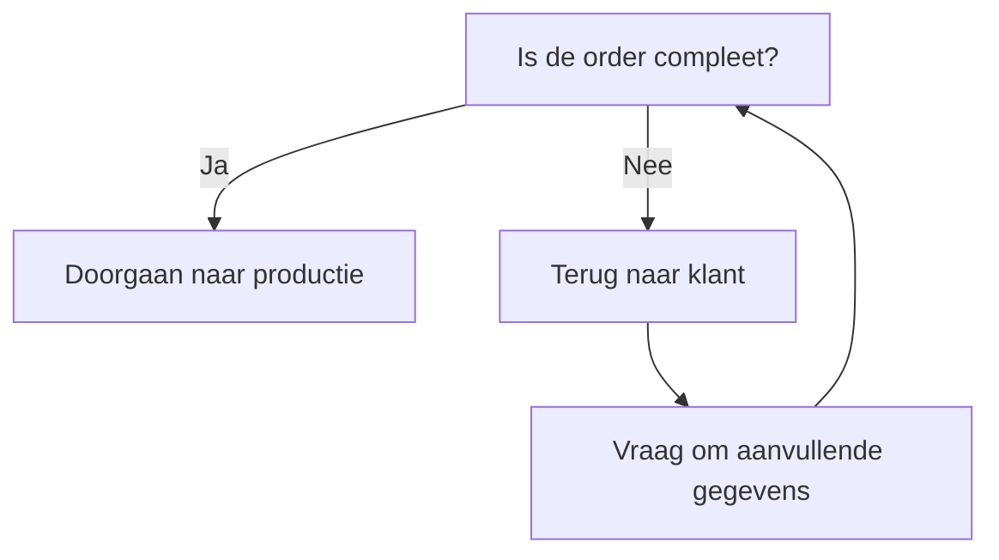
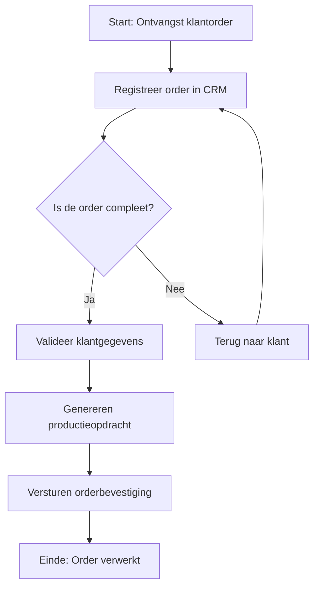

Dit Procesuitwerking-template biedt een gedetailleerde, uitvoerbare beschrijving van {{procesnaam}}. Het doel is om:  
- Duidelijkheid te scheppen over hoe het proces uitgevoerd moet worden.  
- Consistentie te waarborgen in de uitvoering door alle betrokkenen.  
- Training en onboarding van medewerkers te ondersteunen.  
- Basis te leggen voor automatisering, optimalisatie, en audits.  
- Integratie met andere documentatie (BPMN, Swimlane, Proceslandkaart) te vergemakkelijken.

#### Eigenschappen

| Veld              | Waarde                                   | Toelichting                                                                                   |
| ----------------- | ---------------------------------------- | --------------------------------------------------------------------------------------------- |
| PMD-nummer    | 03.07.00                                 | Uniek identificatienummer voor deze procesuitwerking in het Proces Management Document (PMD). |
| Versie        | 1                                        | Huidige versie van dit document. Wordt geüpdaterd bij elke wijziging.                         |
| Status        | concept                                  | Mogelijke statussen: *concept*, *in review*, *goedgekeurd*, *gepubliceerd*, *verouderd*.      |
| Auteur        | [Naam]                                   | De persoon of afdeling die dit document heeft opgesteld (meestal de procesanalist).           |
| Eigenaar      | [Naam proceseigenaar]                    | Verantwoordelijk voor de inhoud en actualiteit van de procesuitwerking.                       |
| Datum         | 17/04/2026                               | Datum van de laatste update.                                                                  |
| Gekoppeld aan | [Bijv. "PMD-01.01.00 (Orderverwerking)"] | Referentie naar gerelateerde processen of diagrammen.                                         |

#### 1. Algemeen Overzicht

Geef hier een kort overzicht van het proces, inclusief doel, scope, en context.

| Veld                    | Waarde                                                                              | Toelichting                                 |
| --------------------------- | --------------------------------------------------------------------------------------- | ----------------------------------------------- |
| Procesnaam              | [Naam van het proces, bijv. "Orderverwerking"]                                          | Naam van het proces.                            |
| Procescategorie         | [Primair / Ondersteunend / Sturend]                                                     | Categorisatie van het proces.                   |
| PMD-nummer              | [PMD-nummer]                                                                            | Referentie naar het Proces Management Document. |
| Doel van het proces     | [Korte beschrijving, bijv. "Tijdige en accurate verwerking van klantorders"]            | Wat het proces moet bereiken.                   |
| Scope                   | [Beschrijving van de reikwijdte]                                                        | Wat valt wel en niet binnen het proces.         |
| Gerelateerde documenten | [Lijst van links, bijv. "BPMN-diagram (PMD-03.06.01), Swimlane-diagram (PMD-03.06.03)"] | Documenten die gerelateerd zijn aan dit proces. |

#### 2. Procesbeschrijving

Geef hier een duidelijke, beknopte beschrijving van het proces. Beschrijf:

- Wat het proces doet.
- Waarom het proces bestaat.
- Hoe het proces bijdraagt aan de organisatiedoelen.

Voorbeeld (Orderverwerking):

> *"Het proces 'Orderverwerking' zorgt voor de tijdige en accurate afhandeling van klantorders, van ontvangst tot bevestiging. Dit proces is essentieel voor het nakomen van leverafspraken en het waarborgen van klanttevredenheid. Het proces draagt bij aan de organisatiedoelen door efficiëntie in de orderafhandeling te verbeteren en fouten te minimaliseren."*

#### 3. Procescontext (Koppeling met Andere Templates)

Geef hier een koppeling met andere templates uit je 7x Framework of 7x Process Language voor een holistische weergave van het proces.

| Template           | Referentie | Toepassing                                             |
| ---------------------- | -------------- | ---------------------------------------------------------- |
| Proceslandkaart    | [PMD-nummer]   | Positie van het proces in de algehele processtructuur. |
| Proceshiërarchie   | [PMD-nummer]   | Niveau van het proces (Level 0-4).                     |
| Procesdoel         | [PMD-nummer]   | Doel en succescriteria van het proces.                 |
| BPMN/Swimlane      | [PMD-nummer]   | Visuele weergave van het proces.                       |
| Procesinput-output | [PMD-nummer]   | Input, output, en transformatie van het proces.        |

#### 4. Rollen en Verantwoordelijkheden

Beschrijf hier wie betrokken is bij het proces en wat hun verantwoordelijkheden zijn. Gebruik een tabel voor overzichtelijkheid.

| Rol                     | Afdeling | Verantwoordelijkheid                                           | Betrokkenheid | Competenties                 | Tools/Systemen |
| --------------------------- | ------------ | ------------------------------------------------------------------ | ----------------- | -------------------------------- | ------------------ |
| [Bijv. "Order Medewerker"]  | Sales        | Registreert en valideert klantorders.                              | Dagelijks         | Kennis van CRM, klantenservice   | CRM-systeem, ERP   |
| [Bijv. "Proceseigenaar"]    | Sales        | Verantwoordelijk voor de inhoud en actualiteit van het proces. | Continu           | Procesmanagement, BPMN           | PMD, BPMN-tools    |
| [Bijv. "Kwaliteitsmanager"] | Kwaliteit    | Monitort de kwaliteit en compliance van het proces.            | Periodiek         | Kwaliteitsmanagement, audits     | Kwaliteitssysteem  |
| [Bijv. "IT Medewerker"]     | IT           | Ondersteunt bij systeemintegraties.                            | Ad hoc            | Technische kennis, systeembeheer | ERP, CRM           |

Toelichting:

- Competenties: Welke vaardigheden zijn nodig voor de rol?
- Tools/Systemen: Welke systemen worden gebruikt door de rol?

#### 5. Werkinstructies

Beschrijf hier stapsgewijs hoe het proces moet worden uitgevoerd. Gebruik duidelijke, actiegerichte taal en voeg tips, waarschuwingen, of voorbeelden toe waar nodig.

##### Stap 1: [Naam stap, bijv. "Ontvangst klantorder"]

- Actie: [Beschrijving, bijv. "Registreer de klantorder in het CRM-systeem."]
- Verantwoordelijke: [Rol, bijv. "Order Medewerker"]
- Systeem/Tool: [Bijv. "CRM-systeem"]
- Input: [Bijv. "Klantorder (digitaal formulier)"]
- Output: [Bijv. "Geregistreerde order in CRM"]
- Tijdsduur: [Bijv. "5 minuten"]
- Kwaliteitsvoorwaarden: [Bijv. "Alle verplichte velden zijn ingevuld."]
- Tips/Waarschuwingen: [Bijv. "Controleer of de klantgegevens matchen met de database."]
- Voorbeeld: [Bijv. "Order #12345 van Klant X wordt geregistreerd met product A en B."]

##### Stap 2: [Naam stap, bijv. "Validatie klantgegevens"]

- Actie: [Beschrijving, bijv. "Controleer of de klantgegevens compleet en correct zijn."]
- Verantwoordelijke: [Rol]
- Systeem/Tool: [Bijv. "CRM-systeem"]
- Input: [Bijv. "Geregistreerde order"]
- Output: [Bijv. "Gevalideerde klantgegevens"]
- Tijdsduur: [Bijv. "10 minuten"]
- Kwaliteitsvoorwaarden: [Bijv. "Klant-ID is geldig, adresgegevens zijn correct."]
- Tips/Waarschuwingen: [Bijv. "Bij onjuiste gegevens: neem contact op met de klant."]
- Beslissing: [Bijv. "Is de order compleet? → Ja: Doorgaan naar stap 3 / Nee: Terug naar klant."]

##### Stap 3: [Naam stap]

- Actie: [Beschrijving]
- Verantwoordelijke: [Rol]
- Systeem/Tool: [Systeem]
- Input: [Input]
- Output: [Output]
- Tijdsduur: [Duur]
- Kwaliteitsvoorwaarden: [Voorwaarden]
- Tips/Waarschuwingen: [Tips]

#### 6. Beslissingsbomen (Optioneel)

Voeg hier beslissingsbomen toe voor complexe keuzepunten in het proces. Dit helpt medewerkers om snel de juiste actie te ondernemen.

Voorbeeld (Orderverwerking):

#### 7. Output

Beschrijf hier wat het proces oplevert. Geef aan:

- Wat de output is (product, dienst, document, besluit).
- Wie de output ontvangt.
- Kwaliteitsvoorwaarden voor de output.

| Output                     | Type | Beschrijving                           | Bestemming    | Kwaliteitsvoorwaarden       | Verantwoordelijke |
| ------------------------------ | -------- | ------------------------------------------ | ----------------- | ------------------------------- | --------------------- |
| [Bijv. "Orderbevestiging"]     | Document | Bevestiging van de order aan de klant.     | Klant             | Accuraat, tijdig, professioneel | Order Medewerker      |
| [Bijv. "Productieopdracht"]    | Data     | Digitaal opdrachtformulier voor productie. | Productieafdeling | Compleet, foutloos, tijdig      | Order Medewerker      |
| [Bijv. "Geregistreerde order"] | Data     | Ordergegevens in ERP-systeem.              | ERP-systeem       | Volledig, consistent            | ERP-systeem           |

#### 8. Kwaliteits- en Compliance-eisen

Beschrijf hier welke kwaliteits- en compliance-eisen gelden voor het proces.

| Eis                        | Type   | Beschrijving                                   | Verantwoordelijke | Controlefrequentie | Meetmethode        |
| ------------------------------ | ---------- | -------------------------------------------------- | --------------------- | ---------------------- | ---------------------- |
| [Bijv. "ISO 9001"]             | Compliance | Voldoen aan kwaliteitsnormen voor orderverwerking. | Kwaliteitsmanager     | Jaarlijks              | Interne audit          |
| [Bijv. "GDPR"]                 | Wettelijk  | Bescherming van persoonsgegevens.                  | Compliance Officer    | Continu                | Automatische controles |
| [Bijv. "Doorlooptijd <24 uur"] | KPI        | Order moet binnen 24 uur worden verwerkt.          | Proceseigenaar        | Maandelijks            | ERP-rapportage         |

#### 9. Risico’s en Mitigerende Maatregelen

Identificeer hier potentiële risico’s in het proces en hoe deze kunnen worden gemitigeerd.

| Risico                              | Oorzaak                       | Impact             | Kans | Mitigerende maatregel           | Verantwoordelijke |
| --------------------------------------- | --------------------------------- | ---------------------- | -------- | ----------------------------------- | --------------------- |
| [Bijv. "Vertraging in orderverwerking"] | Handmatige stappen duren te lang. | Levering komt te laat. | Middel   | Automatiseren van validatiestappen. | IT-afdeling           |
| [Bijv. "Fouten in klantgegevens"]       | Onjuiste invoer door medewerker.  | Onjuiste levering.     | Hoog     | Dubbelcheck door tweede medewerker. | Order Team            |
| [Bijv. "Systeemstoring"]                | ERP-systeem is niet beschikbaar.  | Proces stopt.          | Laag     | Back-up procedure in Excel.         | IT-afdeling           |

#### 10. KPI’s en Metrics

Definieer hier KPI’s (Key Performance Indicators) om het succes van het proces te meten.

| KPI                                | Doelwaarde | Meetfrequentie | Verantwoordelijke | Bron          | Streefcijfer  |
| -------------------------------------- | -------------- | ------------------ | --------------------- | ----------------- | ----------------- |
| [Bijv. "Doorlooptijd orderverwerking"] | < 24 uur       | Dagelijks          | Proceseigenaar        | ERP-systeem       | 95% van de orders |
| [Bijv. "Aantal fouten per order"]      | < 1%           | Wekelijks          | Kwaliteitsmanager     | Kwaliteitsrapport | 0,5%              |
| [Bijv. "Klanttevredenheid (NPS)"]      | > 8            | Maandelijks        | Sales Manager         | Klantenquête      | 8,5               |

#### 11. Tools en Systemen

Geef hier een overzicht van welke tools en systemen worden gebruikt in het proces.

| Tool/Systeem      | Doel                            | Gebruikers        | Toegang  | Verantwoordelijke | Integraties         |
| --------------------- | ----------------------------------- | --------------------- | ------------ | --------------------- | ----------------------- |
| [Bijv. "CRM-systeem"] | Beheer van klantgegevens en orders. | Sales, Order Team     | Webinterface | IT-afdeling           | ERP, E-mail             |
| [Bijv. "ERP-systeem"] | Registratie van orders en voorraad. | Order Team, Productie | Webinterface | IT-afdeling           | CRM, Financieel systeem |
| [Bijv. "E-mail"]      | Communicatie met klanten.           | Sales, Order Team     | Outlook      | IT-afdeling           | CRM                     |

#### 12. Visuele Weergave (Optioneel)

Voeg hier een visuele weergave van het proces toe, bijv. een BPMN-diagram, Swimlane-diagram, of Flowchart. Gebruik Mermaid voor een eenvoudige weergave in Markdown.

Voorbeeld (Mermaid Flowchart):

#### 13. Tips voor Effectieve Procesuitwerking

- Wees specifiek: Gebruik duidelijke, actiegerichte taal in werkinstructies.  
- Gebruik visuele hulpmiddelen: Voeg diagrammen, afbeeldingen, of iconen toe voor betere begrijpelijkheid.  
- Houd het actueel: Update de procesuitwerking bij wijzigingen in het proces.  
- Betrek stakeholders: Laat de uitwerking reviewen door proceseigenaren en uitvoerende teams.  
- Documenteer uitzonderingen: Geef aan wat er gebeurt als het proces niet volgens de hoofdstroom verloopt.  
- Gebruik je DTP-kwalificaties: Maak de documentatie visueel aantrekkelijk met je grafische vaardigheden.  
- Koppel aan andere templates: Zorg voor consistentie met Proceslandkaart, BPMN, en Swimlane-diagrammen.

#### 14. Stakeholders en Verantwoordelijkheden

Geef hier een overzicht van wie betrokken is bij de procesuitwerking.

| Rol                     | Verantwoordelijkheid                                                    | Betrokkenheid |
| --------------------------- | --------------------------------------------------------------------------- | ----------------- |
| Proceseigenaar          | Verantwoordelijk voor de inhoud en actualiteit van de procesuitwerking. | Continu           |
| Procesanalist           | Stelt de uitwerking op en zorgt voor consistentie.                      | Ad hoc            |
| Uitvoerend team         | Voert het proces uit volgens de werkinstructies.                        | Dagelijks         |
| Kwaliteitsmanager       | Monitort de kwaliteit en compliance.                                    | Periodiek         |
| IT-afdeling             | Ondersteunt bij systeemintegraties.                                     | Ad hoc            |
| Training & Communicatie | Zorgt voor verspreiding en training van de procesuitwerking.            | Periodiek         |

#### 15. Gerelateerde Documenten

Lijst hier alle gerelateerde documenten, zoals:

- [Link naar Proceslandkaart]
- [Link naar Proceshiërarchie]
- [Link naar BPMN-diagram]
- [Link naar Swimlane-diagram]
- [Link naar Procesdoel]
- [Link naar Procesinput-output]

#### 16. Versiehistorie

| Versie | Datum  | Wijziging   | Auteur | Goedgekeurd door |
| ---------- | ---------- | --------------- | ---------- | -------------------- |
| 1.0        | 17/04/2026 | Initiële versie | [Naam]     | [Naam]               |

#### 17. Instructies voor Gebruik

1. Start met het proces: Kies het proces waarvoor je de uitwerking wilt documenteren.
2. Geef een algemene beschrijving: Beschrijf wat het proces doet, waarom het bestaat, en hoe het bijdraagt aan de organisatie.
3. Definieer rollen en verantwoordelijkheden: Geef aan wie betrokken is en wat hun taken zijn.
4. Beschrijf de werkinstructies: Documenteer stapsgewijs hoe het proces moet worden uitgevoerd.
  - Voeg tips, waarschuwingen, en voorbeelden toe waar nodig.
1. Documenteer output, KPI’s, en risico’s: Geef aan wat het proces oplevert, hoe succes wordt gemeten, en welke risico’s er zijn.
2. Voeg visuele weergaven toe: Gebruik diagrammen (BPMN, Flowchart, Swimlane) voor extra duidelijkheid.
3. Valideer met stakeholders: Laat de uitwerking reviewen door proceseigenaren, uitvoerende teams, en management.
4. Houd het actueel: Update de documentatie bij wijzigingen in het proces.

#### 18. Voorbeeld: Ingevulde Procesuitwerking (Orderverwerking)

##### Algemeen Overzicht

| Veld                    | Waarde                                                   | Toelichting                     |
| --------------------------- | ------------------------------------------------------------ | ----------------------------------- |
| Procesnaam              | Orderverwerking                                              | Naam van het proces.                |
| Procescategorie         | Primair                                                      | Kernproces voor de organisatie.     |
| PMD-nummer              | PMD-01.01.00                                                 | Referentie naar het PMD.            |
| Doel van het proces     | Tijdige en accurate verwerking van klantorders.              | Waardecreatie voor klanten.         |
| Scope                   | Van ontvangst klantorder tot bevestiging aan klant.          | Inclusief validatie en registratie. |
| Gerelateerde documenten | BPMN-diagram (PMD-03.06.01), Swimlane-diagram (PMD-03.06.03) | Visuele weergaven van het proces.   |

---

##### Procesbeschrijving

> *"Het proces 'Orderverwerking' zorgt voor de tijdige en accurate afhandeling van klantorders, van ontvangst tot bevestiging. Dit proces is essentieel voor het nakomen van leverafspraken en het waarborgen van klanttevredenheid. Het proces draagt bij aan de organisatiedoelen door efficiëntie in de orderafhandeling te verbeteren en fouten te minimaliseren."*

---

##### Rollen en Verantwoordelijkheden

| Rol           | Afdeling | Verantwoordelijkheid                                       | Betrokkenheid | Competenties               | Tools/Systemen |
| ----------------- | ------------ | -------------------------------------------------------------- | ----------------- | ------------------------------ | ------------------ |
| Order Medewerker  | Sales        | Registreert en valideert klantorders.                          | Dagelijks         | Kennis van CRM, klantenservice | CRM-systeem, ERP   |
| Proceseigenaar    | Sales        | Verantwoordelijk voor de inhoud en actualiteit van het proces. | Continu           | Procesmanagement, BPMN         | PMD, Camunda       |
| Kwaliteitsmanager | Kwaliteit    | Monitort de kwaliteit en compliance van het proces.            | Periodiek         | Kwaliteitsmanagement, audits   | Kwaliteitssysteem  |

---

##### Werkinstructies

###### Stap 1: Ontvangst klantorder

- Actie: Registreer de klantorder in het CRM-systeem.
- Verantwoordelijke: Order Medewerker
- Systeem/Tool: CRM-systeem
- Input: Klantorder (digitaal formulier)
- Output: Geregistreerde order in CRM
- Tijdsduur: 5 minuten
- Kwaliteitsvoorwaarden: Alle verplichte velden zijn ingevuld.
- Tips/Waarschuwingen: Controleer of de klantgegevens matchen met de database.
- Voorbeeld: Order #12345 van Klant X wordt geregistreerd met product A en B.

###### Stap 2: Validatie klantgegevens

- Actie: Controleer of de klantgegevens compleet en correct zijn.
- Verantwoordelijke: Order Medewerker
- Systeem/Tool: CRM-systeem
- Input: Geregistreerde order
- Output: Gevalideerde klantgegevens
- Tijdsduur: 10 minuten
- Kwaliteitsvoorwaarden: Klant-ID is geldig, adresgegevens zijn correct.
- Tips/Waarschuwingen: Bij onjuiste gegevens: neem contact op met de klant.
- Beslissing: Is de order compleet? → Ja: Doorgaan naar stap 3 / Nee: Terug naar klant.

###### Stap 3: Genereren productieopdracht

- Actie: Zet de klantorder om in een productieopdracht in het ERP-systeem.
- Verantwoordelijke: Order Medewerker
- Systeem/Tool: ERP-systeem
- Input: Gevalideerde order
- Output: Productieopdracht
- Tijdsduur: 15 minuten
- Kwaliteitsvoorwaarden: Productieopdracht is compleet en foutloos.
- Tips/Waarschuwingen: Controleer of de voorraad voldoende is.

---

##### Output

| Output           | Type | Beschrijving                           | Bestemming    | Kwaliteitsvoorwaarden       | Verantwoordelijke |
| -------------------- | -------- | ------------------------------------------ | ----------------- | ------------------------------- | --------------------- |
| Orderbevestiging     | Document | Bevestiging van de order aan de klant.     | Klant             | Accuraat, tijdig, professioneel | Order Medewerker      |
| Productieopdracht    | Data     | Digitaal opdrachtformulier voor productie. | Productieafdeling | Compleet, foutloos, tijdig      | Order Medewerker      |
| Geregistreerde order | Data     | Ordergegevens in ERP-systeem.              | ERP-systeem       | Volledig, consistent            | ERP-systeem           |

---

##### Kwaliteits- en Compliance-eisen

| Eis              | Type   | Beschrijving                                   | Verantwoordelijke | Controlefrequentie | Meetmethode        |
| -------------------- | ---------- | -------------------------------------------------- | --------------------- | ---------------------- | ---------------------- |
| ISO 9001             | Compliance | Voldoen aan kwaliteitsnormen voor orderverwerking. | Kwaliteitsmanager     | Jaarlijks              | Interne audit          |
| GDPR                 | Wettelijk  | Bescherming van persoonsgegevens.                  | Compliance Officer    | Continu                | Automatische controles |
| Doorlooptijd <24 uur | KPI        | Order moet binnen 24 uur worden verwerkt.          | Proceseigenaar        | Maandelijks            | ERP-rapportage         |

---

##### Risico’s en Mitigerende Maatregelen

| Risico                    | Oorzaak                       | Impact             | Kans | Mitigerende maatregel           | Verantwoordelijke |
| ----------------------------- | --------------------------------- | ---------------------- | -------- | ----------------------------------- | --------------------- |
| Vertraging in orderverwerking | Handmatige stappen duren te lang. | Levering komt te laat. | Middel   | Automatiseren van validatiestappen. | IT-afdeling           |
| Fouten in klantgegevens       | Onjuiste invoer door medewerker.  | Onjuiste levering.     | Hoog     | Dubbelcheck door tweede medewerker. | Order Team            |

---

##### KPI’s en Metrics

| KPI                      | Doelwaarde | Meetfrequentie | Verantwoordelijke | Bron          | Streefcijfer  |
| ---------------------------- | -------------- | ------------------ | --------------------- | ----------------- | ----------------- |
| Doorlooptijd orderverwerking | < 24 uur       | Dagelijks          | Proceseigenaar        | ERP-systeem       | 95% van de orders |
| Aantal fouten per order      | < 1%           | Wekelijks          | Kwaliteitsmanager     | Kwaliteitsrapport | 0,5%              |

---

##### Tools en Systemen

| Tool/Systeem | Doel                            | Gebruikers        | Toegang  | Verantwoordelijke | Integraties         |
| ---------------- | ----------------------------------- | --------------------- | ------------ | --------------------- | ----------------------- |
| CRM-systeem      | Beheer van klantgegevens en orders. | Sales, Order Team     | Webinterface | IT-afdeling           | ERP, E-mail             |
| ERP-systeem      | Registratie van orders en voorraad. | Order Team, Productie | Webinterface | IT-afdeling           | CRM, Financieel systeem |

---

##### Visuele Weergave (Mermaid)

