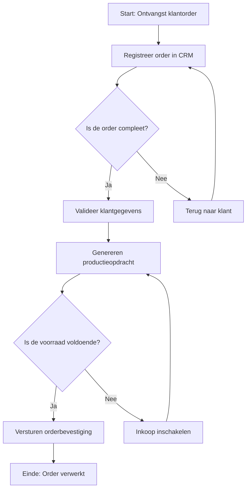

#### Inleiding

Dit Procesbeschrijving-template biedt een gestructureerde, complete beschrijving van {{procesnaam}}. Het doel is om:  
- Duidelijkheid te scheppen over wat het proces doet, waarom het bestaat, en hoe het uitgevoerd moet worden.  
- Consistentie te waarborgen in de uitvoering en documentatie van processen.  
- Basis te leggen voor training, optimalisatie, automatisering, en audits.  
- Integratie met andere documentatie (BPMN, Swimlane, Proceslandkaart) te vergemakkelijken.  
- Stakeholders (management, uitvoerende teams, IT, klanten) een betrouwbare bron te bieden.

#### Eigenschappen

| Veld              | Waarde                                                                 | Toelichting                                                                                     |
| ----------------- | ---------------------------------------------------------------------- | ----------------------------------------------------------------------------------------------- |
| PMD-nummer    | 03.07.01                                                               | Uniek identificatienummer voor deze procesbeschrijving in het Proces Management Document (PMD). |
| Versie        | 1                                                                      | Huidige versie van dit document. Wordt geüpdaterd bij elke wijziging.                           |
| Status        | concept                                                                | Mogelijke statussen: *concept*, *in review*, *goedgekeurd*, *gepubliceerd*, *verouderd*.        |
| Auteur        | [Naam]                                                                 | De persoon of afdeling die dit document heeft opgesteld (meestal de procesanalist).             |
| Eigenaar      | [Naam proceseigenaar]                                                  | Verantwoordelijk voor de inhoud en actualiteit van de procesbeschrijving.                       |
| Datum         | 17/04/2026                                                             | Datum van de laatste update.                                                                    |
| Gekoppeld aan | [Bijv. "BPMN-diagram (PMD-03.06.01), Swimlane-diagram (PMD-03.06.03)"] | Referentie naar gerelateerde documenten.                                                        |

## 1. Basisgegevens

Geef hier de fundamentele identificatiegegevens van het proces.

| Veld            | Waarde                                     | Toelichting                |
| ------------------- | ---------------------------------------------- | ------------------------------ |
| Procesnaam      | [Naam van het proces, bijv. "Orderverwerking"] | Duidelijke en eenduidige naam. |
| Proces-ID       | [Unieke identifier, bijv. "PR-001"]            | Unieke code voor referentie.   |
| Procescategorie | [Primair / Ondersteunend / Sturend]            | Categorisatie van het proces.  |
| Domein          | [Bijv. "Sales", "Productie", "Klantenservice"] | Functioneel domein.            |
| Subdomein       | [Bijv. "Orderbeheer", "Klantcontact"]          | Subdomein binnen het domein.   |

## 2. Procesdoel

Beschrijf hier waarom het proces bestaat en wat het moet bereiken. Gebruik de SMART-methode (Specifiek, Meetbaar, Acceptabel, Realistisch, Tijdgebonden) voor het formuleren van doelen.

| Aspect                     | Beschrijving                                                                        |
| ------------------------------ | --------------------------------------------------------------------------------------- |
| Hoofddoel                  | [Bijv. "Zorgen voor tijdige en accurate verwerking van klantorders."]                   |
| Waarde voor de organisatie | [Bijv. "Verhogen van klanttevredenheid en efficiëntie in orderafhandeling."]            |
| Waarde voor de klant       | [Bijv. "Snelle en betrouwbare orderbevestiging en levering."]                           |
| Waarde voor medewerkers    | [Bijv. "Duidelijke werkinstructies en verantwoordelijkheden."]                          |
| Strategische koppeling     | [Bijv. "Ondersteunt het organisatiedoel 'Klanttevredenheid verhogen tot 90% in 2026'."] |

Tip voor Martin:  
Gebruik je Lean Six Sigma Green Belt-kennis om doelen meetbaar en optimaliseerbaar te maken.

## 3. Scope

Beschrijf hier wat wel en niet tot het proces behoort. Dit voorkomt misverstanden en dubbel werk.

#### Wat valt binnen het proces?

| Onderdeel                         | Beschrijving     | Verantwoordelijke |
| ------------------------------------- | -------------------- | --------------------- |
| [Bijv. "Ontvangst klantorder"]        | [Korte beschrijving] | [Rol/afdeling]        |
| [Bijv. "Validatie klantgegevens"]     | [Korte beschrijving] | [Rol/afdeling]        |
| [Bijv. "Genereren productieopdracht"] | [Korte beschrijving] | [Rol/afdeling]        |

#### Wat valt buiten het proces?

| Uitsluiting                 | Toelichting     | Verantwoordelijk proces               |
| ------------------------------- | ------------------- | ----------------------------------------- |
| [Bijv. "Inkoop van materialen"] | [Korte toelichting] | [Bijv. "Inkoopproces (PMD-02.01.00)"]     |
| [Bijv. "Facturatie"]            | [Korte toelichting] | [Bijv. "Facturatieproces (PMD-01.03.00)"] |

## 4. Trigger

Beschrijf hier wat het proces start. Een trigger kan een event, aanvraag, of signaal zijn.

| Trigger                          | Type | Beschrijving                               | Bron    | Frequentie | Verantwoordelijke |
| ------------------------------------ | -------- | ---------------------------------------------- | ----------- | -------------- | --------------------- |
| [Bijv. "Ontvangst klantorder"]       | Event    | Een klant plaatst een order via de webshop.    | Webshop     | Dagelijks      | Sales Team            |
| [Bijv. "Systeemalert lage voorraad"] | Signaal  | ERP-systeem geeft een alert bij lage voorraad. | ERP-systeem | Ad hoc         | IT-afdeling           |
| [Bijv. "Handmatige aanvraag"]        | Aanvraag | Een medewerker start het proces handmatig.     | Medewerker  | Dagelijks      | Order Team            |

## 5. Input

Beschrijf hier wat het proces nodig heeft om te kunnen starten of draaien.

| Input                        | Type    | Beschrijving                                        | Bron          | Kwaliteitsvoorwaarden      | Verantwoordelijke |
| -------------------------------- | ----------- | ------------------------------------------------------- | ----------------- | ------------------------------ | --------------------- |
| [Bijv. "Klantorder"]             | Data        | Digitaal orderformulier met klant- en productgegevens.  | Webshop/CRM       | Compleet, geverifieerd, tijdig | Sales Team            |
| [Bijv. "Productiespecificaties"] | Document    | Technische specificaties voor productie.                | Productieafdeling | Actueel, goedgekeurd           | Productie Manager     |
| [Bijv. "Goedkeuring manager"]    | Goedkeuring | Handtekening of digitale goedkeuring voor grote orders. | Manager           | Tijdig, accuraat               | Sales Manager         |

## 6. Output

Beschrijf hier wat het proces oplevert.

| Output                     | Type | Beschrijving                           | Bestemming    | Kwaliteitsvoorwaarden       | Verantwoordelijke |
| ------------------------------ | -------- | ------------------------------------------ | ----------------- | ------------------------------- | --------------------- |
| [Bijv. "Orderbevestiging"]     | Document | Bevestiging van de order aan de klant.     | Klant             | Accuraat, tijdig, professioneel | Order Team            |
| [Bijv. "Productieopdracht"]    | Data     | Digitaal opdrachtformulier voor productie. | Productieafdeling | Compleet, foutloos, tijdig      | Order Team            |
| [Bijv. "Geregistreerde order"] | Data     | Ordergegevens in ERP-systeem.              | ERP-systeem       | Volledig, consistent            | ERP-systeem           |

## 7. Processtappen

Beschrijf hier stapsgewijs hoe het proces verloopt. Gebruik duidelijke, actiegerichte taal en voeg beslissingen, uitzonderingen, en tips toe waar nodig.

| Stap | Activiteit              | Rol          | Systeem/Tool | Duur | Input            | Output            | Beslissing            | Tips/Waarschuwingen                              |
| -------- | --------------------------- | ---------------- | ---------------- | -------- | -------------------- | --------------------- | ------------------------- | ---------------------------------------------------- |
| 1        | Ontvangst klantorder        | Order Medewerker | Webshop          | 5 min    | Klantorder           | Geregistreerde order  | -                         | Controleer of alle verplichte velden zijn ingevuld.  |
| 2        | Validatie klantgegevens     | Order Medewerker | CRM-systeem      | 10 min   | Geregistreerde order | Gevalideerde gegevens | Is de order compleet?     | Bij onjuiste gegevens: neem contact op met de klant. |
| 3        | Genereren productieopdracht | Order Medewerker | ERP-systeem      | 15 min   | Gevalideerde order   | Productieopdracht     | Is de voorraad voldoende? | Controleer voorraadniveaus in het ERP-systeem.       |

Tip voor Martin:  
Gebruik je PRINCE2 Foundation-kennis om duidelijke, gestructureerde stappen te definieren.

## 8. Betrokken Systemen

Beschrijf hier welke systemen worden gebruikt in het proces.

| Systeem           | Doel                                   | Gebruikers        | Toegang  | Verantwoordelijke | Integraties         | Kritikaliteit |
| --------------------- | ------------------------------------------ | --------------------- | ------------ | --------------------- | ----------------------- | ----------------- |
| [Bijv. "ERP-systeem"] | Beheer van orders, productie, en voorraad. | Order Team, Productie | Webinterface | IT-afdeling           | CRM, Financieel systeem | Hoog              |
| [Bijv. "CRM-systeem"] | Beheer van klantgegevens en interacties.   | Sales, Order Team     | Webinterface | IT-afdeling           | ERP, E-mail             | Hoog              |
| [Bijv. "E-mail"]      | Communicatie met klanten.                  | Sales, Order Team     | Outlook      | IT-afdeling           | CRM                     | Middel            |

## 9. KPI’s (Key Performance Indicators)

Definieer hier meetbare doelen om het succes van het proces te evalueren.

| KPI                      | Definitie                                   | Doelwaarde | Meetfrequentie | Verantwoordelijke | Bron          | Streefcijfer  | Huidige waarde |
| ---------------------------- | ----------------------------------------------- | -------------- | ------------------ | --------------------- | ----------------- | ----------------- | ------------------ |
| Doorlooptijd orderverwerking | Tijd tussen ontvangst en bevestiging van order. | < 24 uur       | Dagelijks          | Proceseigenaar        | ERP-systeem       | 95% van de orders | 90%                |
| Aantal fouten per order      | Percentage orders met fouten.                   | < 1%           | Wekelijks          | Kwaliteitsmanager     | Kwaliteitsrapport | 0,5%              | 0,8%               |
| Klanttevredenheid (NPS)      | Net Promoter Score voor orderafhandeling.       | > 8            | Maandelijks        | Sales Manager         | Klantenquête      | 8,5               | 8,2                |

## 10. Risico’s en Mitigerende Maatregelen

Identificeer hier potentiële risico’s in het proces en hoe deze kunnen worden gemitigeerd.

| Risico                    | Oorzaak                       | Impact             | Kans | Mitigerende maatregel           | Verantwoordelijke | Status      |
| ----------------------------- | --------------------------------- | ---------------------- | -------- | ----------------------------------- | --------------------- | --------------- |
| Vertraging in orderverwerking | Handmatige stappen duren te lang. | Levering komt te laat. | Middel   | Automatiseren van validatiestappen. | IT-afdeling           | In uitvoering   |
| Fouten in klantgegevens       | Onjuiste invoer door medewerker.  | Onjuiste levering.     | Hoog     | Dubbelcheck door tweede medewerker. | Order Team            | Geïmplementeerd |
| Systeemstoring                | ERP-systeem is niet beschikbaar.  | Proces stopt.          | Laag     | Back-up procedure in Excel.         | IT-afdeling           | Geïmplementeerd |

## 11. Relaties met Andere Processen

Beschrijf hier hoe dit proces samenhangt met andere processen.

#### Upstream Processen (Input)

| Procesnaam         | Type Input | Beschrijving                              | PMD-nummer | Verantwoordelijke |
| ---------------------- | -------------- | --------------------------------------------- | -------------- | --------------------- |
| [Bijv. "Klantcontact"] | Klantorder     | Ontvangen klantorder via telefoon of webshop. | PMD-01.00.00   | Sales Team            |

#### Downstream Processen (Output)

| Procesnaam      | Type Output   | Beschrijving                    | PMD-nummer | Verantwoordelijke |
| ------------------- | ----------------- | ----------------------------------- | -------------- | --------------------- |
| [Bijv. "Productie"] | Productieopdracht | Bevestigde opdracht voor productie. | PMD-01.02.00   | Productie Manager     |

#### Afhankelijkheden

| Afhankelijkheid                   | Type | Beschrijving                                    | Impact bij uitval | Mitigerende maatregel   |
| ------------------------------------- | -------- | --------------------------------------------------- | --------------------- | --------------------------- |
| [Bijv. "Beschikbaarheid ERP-systeem"] | Systeem  | Orderverwerking is afhankelijk van het ERP-systeem. | Proces stopt          | Back-up procedure in Excel. |

## 12. Visuele Weergave (Optioneel)

Voeg hier een visuele weergave van het proces toe, bijv. een BPMN-diagram, Swimlane-diagram, of Flowchart. Gebruik Mermaid voor een eenvoudige weergave in Markdown.

Voorbeeld (Mermaid Flowchart):

## 13. Tips voor Effectieve Procesbeschrijving

🔹 Wees specifiek: Gebruik duidelijke, actiegerichte taal in de beschrijving.  
🔹 Gebruik visuele hulpmiddelen: Voeg diagrammen, afbeeldingen, of iconen toe voor betere begrijpelijkheid.  
🔹 Houd het actueel: Update de beschrijving bij wijzigingen in het proces.  
🔹 Betrek stakeholders: Laat de beschrijving reviewen door proceseigenaren, uitvoerende teams, en management.  
🔹 Documenteer uitzonderingen: Geef aan wat er gebeurt als het proces niet volgens de hoofdstroom verloopt.  
🔹 Gebruik je DTP-kwalificaties: Maak de documentatie visueel aantrekkelijk met je grafische vaardigheden.  
🔹 Koppel aan andere templates: Zorg voor consistentie met Proceslandkaart, BPMN, en Swimlane-diagrammen.  
🔹 Gebruik SMART-doelen: Maak doelen Specifiek, Meetbaar, Acceptabel, Realistisch, Tijdgebonden.

## 14. Stakeholders en Verantwoordelijkheden

Geef hier een overzicht van wie betrokken is bij het proces.

| Rol           | Afdeling | Verantwoordelijkheid                                           | Betrokkenheid | Competenties           | Tools/Systemen |
| ----------------- | ------------ | ------------------------------------------------------------------ | ----------------- | -------------------------- | ------------------ |
| Proceseigenaar    | [Afdeling]   | Verantwoordelijk voor de inhoud en actualiteit van het proces. | Continu           | Procesmanagement, BPMN     | PMD, BPMN-tools    |
| Procesanalist     | [Afdeling]   | Documenteert en optimaliseert het proces.                      | Ad hoc            | Procesmodellering, analyse | BPMN-tools, Excel  |
| Uitvoerend team   | [Afdeling]   | Voert het proces uit volgens de beschrijving.                  | Dagelijks         | Kennis van systemen        | CRM, ERP           |
| Kwaliteitsmanager | Kwaliteit    | Monitort de kwaliteit en compliance.                           | Periodiek         | Kwaliteitsmanagement       | Kwaliteitssysteem  |
| IT-afdeling       | IT           | Ondersteunt bij systeemintegraties.                            | Ad hoc            | Technische kennis          | ERP, CRM           |

## 15. Gerelateerde Documenten

Lijst hier alle gerelateerde documenten, zoals:

- [Link naar Proceslandkaart (PMD-03.04.01)]
- [Link naar Proceshiërarchie (PMD-03.04.02)]
- [Link naar BPMN-diagram (PMD-03.06.01)]
- [Link naar Swimlane-diagram (PMD-03.06.03)]
- [Link naar Procesdoel (PMD-03.03.00)]
- [Link naar Procesinput-output (PMD-03.02.01)]
- [Link naar Werkinstructies]

## 16. Versiehistorie

| Versie | Datum  | Wijziging   | Auteur | Goedgekeurd door |
| ---------- | ---------- | --------------- | ---------- | -------------------- |
| 1.0        | 17/04/2026 | Initiële versie | [Naam]     | [Naam]               |

## 17. Instructies voor Gebruik

1. Start met de basisgegevens:
  - Vul de fundamentele identificatiegegevens van het proces in.
1. Definieer het procesdoel:
  - Beschrijf waarom het proces bestaat en wat het moet bereiken.
1. Bepaal de scope:
  - Geef aan wat wel en niet tot het proces behoort.
1. Identificeer triggers en input/output:
  - Beschrijf wat het proces start en wat het oplevert.
1. Beschrijf de processtappen:
  - Documenteer stapsgewijs hoe het proces verloopt.
  - Voeg beslissingen, uitzonderingen, en tips toe waar nodig.
1. Documenteer systemen, KPI’s, en risico’s:
  - Geef aan welke systemen worden gebruikt, hoe succes wordt gemeten, en welke risico’s er zijn.
1. Voeg visuele weergaven toe:
  - Gebruik diagrammen (BPMN, Flowchart, Swimlane) voor extra duidelijkheid.
1. Valideer met stakeholders:
  - Laat de beschrijving reviewen door proceseigenaren, uitvoerende teams, en management.
1. Houd het actueel:
  - Update de documentatie bij wijzigingen in het proces.

## 18. Voorbeeld: Ingevulde Procesbeschrijving (Orderverwerking)

#### Basisgegevens

| Veld            | Waarde      | Toelichting      |
| ------------------- | --------------- | -------------------- |
| Procesnaam      | Orderverwerking | Naam van het proces. |
| Proces-ID       | PR-001          | Unieke identifier.   |
| Procescategorie | Primair         | Kernproces.          |
| Domein          | Sales           | Functioneel domein.  |
| Subdomein       | Orderbeheer     | Subdomein.           |

#### Procesdoel

| Aspect                     | Beschrijving                                                              |
| ------------------------------ | ----------------------------------------------------------------------------- |
| Hoofddoel                  | Zorgen voor tijdige en accurate verwerking van klantorders.                   |
| Waarde voor de organisatie | Verhogen van klanttevredenheid en efficiëntie in orderafhandeling.            |
| Waarde voor de klant       | Snelle en betrouwbare orderbevestiging en levering.                           |
| Waarde voor medewerkers    | Duidelijke werkinstructies en verantwoordelijkheden.                          |
| Strategische koppeling     | Ondersteunt het organisatiedoel 'Klanttevredenheid verhogen tot 90% in 2026'. |

#### Scope

Wat valt binnen het proces?

| Onderdeel               | Beschrijving                                     | Verantwoordelijke |
| --------------------------- | ---------------------------------------------------- | --------------------- |
| Ontvangst klantorder        | Registratie van klantorders via webshop of telefoon. | Order Team            |
| Validatie klantgegevens     | Controle of klantgegevens compleet en correct zijn.  | Order Team            |
| Genereren productieopdracht | Omzetten van klantorder naar productieopdracht.      | Order Team            |

Wat valt buiten het proces?

| Uitsluiting       | Toelichting                              | Verantwoordelijk proces     |
| --------------------- | -------------------------------------------- | ------------------------------- |
| Inkoop van materialen | Inkoop valt onder het Inkoopproces.          | Inkoopproces (PMD-02.01.00)     |
| Facturatie            | Facturatie valt onder het Financiële proces. | Facturatieproces (PMD-01.03.00) |

#### Trigger

| Trigger                | Type | Beschrijving                               | Bron    | Frequentie | Verantwoordelijke |
| -------------------------- | -------- | ---------------------------------------------- | ----------- | -------------- | --------------------- |
| Ontvangst klantorder       | Event    | Een klant plaatst een order via de webshop.    | Webshop     | Dagelijks      | Sales Team            |
| Systeemalert lage voorraad | Signaal  | ERP-systeem geeft een alert bij lage voorraad. | ERP-systeem | Ad hoc         | IT-afdeling           |

#### Input

| Input              | Type | Beschrijving                                       | Bron          | Kwaliteitsvoorwaarden      | Verantwoordelijke |
| ---------------------- | -------- | ------------------------------------------------------ | ----------------- | ------------------------------ | --------------------- |
| Klantorder             | Data     | Digitaal orderformulier met klant- en productgegevens. | Webshop/CRM       | Compleet, geverifieerd, tijdig | Sales Team            |
| Productiespecificaties | Document | Technische specificaties voor productie.               | Productieafdeling | Actueel, goedgekeurd           | Productie Manager     |

#### Output

| Output        | Type | Beschrijving                           | Bestemming    | Kwaliteitsvoorwaarden       | Verantwoordelijke |
| ----------------- | -------- | ------------------------------------------ | ----------------- | ------------------------------- | --------------------- |
| Orderbevestiging  | Document | Bevestiging van de order aan de klant.     | Klant             | Accuraat, tijdig, professioneel | Order Team            |
| Productieopdracht | Data     | Digitaal opdrachtformulier voor productie. | Productieafdeling | Compleet, foutloos, tijdig      | Order Team            |

#### Processtappen

| Stap | Activiteit              | Rol          | Systeem/Tool | Duur | Input            | Output            | Beslissing            | Tips/Waarschuwingen                              |
| -------- | --------------------------- | ---------------- | ---------------- | -------- | -------------------- | --------------------- | ------------------------- | ---------------------------------------------------- |
| 1        | Ontvangst klantorder        | Order Medewerker | Webshop          | 5 min    | Klantorder           | Geregistreerde order  | -                         | Controleer of alle verplichte velden zijn ingevuld.  |
| 2        | Validatie klantgegevens     | Order Medewerker | CRM-systeem      | 10 min   | Geregistreerde order | Gevalideerde gegevens | Is de order compleet?     | Bij onjuiste gegevens: neem contact op met de klant. |
| 3        | Genereren productieopdracht | Order Medewerker | ERP-systeem      | 15 min   | Gevalideerde order   | Productieopdracht     | Is de voorraad voldoende? | Controleer voorraadniveaus in het ERP-systeem.       |

#### Betrokken Systemen

| Systeem | Doel                                   | Gebruikers        | Toegang  | Verantwoordelijke | Integraties         | Kritikaliteit |
| ----------- | ------------------------------------------ | --------------------- | ------------ | --------------------- | ----------------------- | ----------------- |
| ERP-systeem | Beheer van orders, productie, en voorraad. | Order Team, Productie | Webinterface | IT-afdeling           | CRM, Financieel systeem | Hoog              |
| CRM-systeem | Beheer van klantgegevens en interacties.   | Sales, Order Team     | Webinterface | IT-afdeling           | ERP, E-mail             | Hoog              |

#### KPI’s

| KPI                      | Definitie                                   | Doelwaarde | Meetfrequentie | Verantwoordelijke | Bron          | Streefcijfer  | Huidige waarde |
| ---------------------------- | ----------------------------------------------- | -------------- | ------------------ | --------------------- | ----------------- | ----------------- | ------------------ |
| Doorlooptijd orderverwerking | Tijd tussen ontvangst en bevestiging van order. | < 24 uur       | Dagelijks          | Proceseigenaar        | ERP-systeem       | 95% van de orders | 90%                |
| Aantal fouten per order      | Percentage orders met fouten.                   | < 1%           | Wekelijks          | Kwaliteitsmanager     | Kwaliteitsrapport | 0,5%              | 0,8%               |

#### Risico’s en Mitigerende Maatregelen

| Risico                    | Oorzaak                       | Impact             | Kans | Mitigerende maatregel           | Verantwoordelijke | Status      |
| ----------------------------- | --------------------------------- | ---------------------- | -------- | ----------------------------------- | --------------------- | --------------- |
| Vertraging in orderverwerking | Handmatige stappen duren te lang. | Levering komt te laat. | Middel   | Automatiseren van validatiestappen. | IT-afdeling           | In uitvoering   |
| Fouten in klantgegevens       | Onjuiste invoer door medewerker.  | Onjuiste levering.     | Hoog     | Dubbelcheck door tweede medewerker. | Order Team            | Geïmplementeerd |

#### Relaties met Andere Processen

Upstream Processen (Input):

| Procesnaam | Type Input | Beschrijving                              | PMD-nummer | Verantwoordelijke |
| -------------- | -------------- | --------------------------------------------- | -------------- | --------------------- |
| Klantcontact   | Klantorder     | Ontvangen klantorder via telefoon of webshop. | PMD-01.00.00   | Sales Team            |

Downstream Processen (Output):

| Procesnaam | Type Output   | Beschrijving                    | PMD-nummer | Verantwoordelijke |
| -------------- | ----------------- | ----------------------------------- | -------------- | --------------------- |
| Productie      | Productieopdracht | Bevestigde opdracht voor productie. | PMD-01.02.00   | Productie Manager     |

#### Visuele Weergave (Mermaid)

#### Stakeholders en Verantwoordelijkheden

| Rol          | Afdeling | Verantwoordelijkheid                                       | Betrokkenheid | Competenties           | Tools/Systemen |
| ---------------- | ------------ | -------------------------------------------------------------- | ----------------- | -------------------------- | ------------------ |
| Proceseigenaar   | Sales        | Verantwoordelijk voor de inhoud en actualiteit van het proces. | Continu           | Procesmanagement, BPMN     | PMD, Camunda       |
| Procesanalist    | Sales        | Documenteert en optimaliseert het proces.                      | Ad hoc            | Procesmodellering, analyse | BPMN-tools, Excel  |
| Order Medewerker | Sales        | Voert het proces uit volgens de beschrijving.                  | Dagelijks         | Kennis van CRM, ERP        | CRM, ERP           |