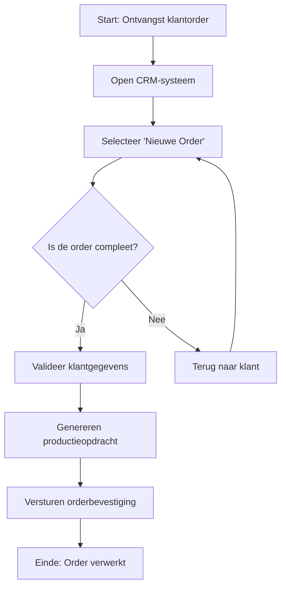
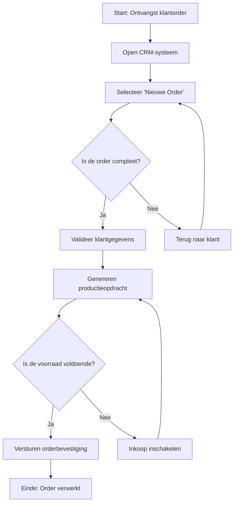

#### Inleiding

Dit Werkinstructie-template biedt een gedetailleerde, uitvoerbare handleiding voor {{procesnaam}}. Het doel is om:  
- Duidelijke, stapsgewijze instructies te bieden voor uitvoerende teams.  
- Consistentie te waarborgen in de uitvoering van het proces.  
- Fouten te minimaliseren door controlepunten en kwaliteitsvoorwaarden te definieren.  
- Training en onboarding van nieuwe medewerkers te ondersteunen.  
- Basis te leggen voor automatisering en optimalisatie van het proces.

#### Eigenschappen

| Veld              | Waarde                                                                   | Toelichting                                                                                 |
| ----------------- | ------------------------------------------------------------------------ | ------------------------------------------------------------------------------------------- |
| PMD-nummer    | 03.07.02                                                                 | Uniek identificatienummer voor deze werkinstructie in het Proces Management Document (PMD). |
| Versie        | 1                                                                        | Huidige versie van dit document. Wordt geüpdaterd bij elke wijziging.                       |
| Status        | concept                                                                  | Mogelijke statussen: *concept*, *in review*, *goedgekeurd*, *gepubliceerd*, *verouderd*.    |
| Auteur        | [Naam]                                                                   | De persoon of afdeling die deze werkinstructie heeft opgesteld (meestal de procesanalist).  |
| Eigenaar      | [Naam proceseigenaar]                                                    | Verantwoordelijk voor de inhoud en actualiteit van de werkinstructie.                       |
| Datum         | 17/04/2026                                                               | Datum van de laatste update.                                                                |
| Gekoppeld aan | [Bijv. "Procesbeschrijving (PMD-03.07.01), BPMN-diagram (PMD-03.06.01)"] | Referentie naar gerelateerde documenten.                                                    |

## 1. Basisgegevens

Geef hier de fundamentele identificatiegegevens van de werkinstructie.

| Veld              | Waarde                                     | Toelichting                                      |
| --------------------- | ---------------------------------------------- | ---------------------------------------------------- |
| Werkinstructie-ID | [Unieke identifier, bijv. "WI-001"]            | Unieke code voor referentie.                         |
| Procesnaam        | [Naam van het proces, bijv. "Orderverwerking"] | Naam van het proces waar deze instructie voor geldt. |
| Proces-ID         | [Bijv. "PR-001"]                               | Referentie naar het proces in het PMD.               |
| Versie            | [Versienummer]                                 | Huidige versie van de werkinstructie.                |

## 2. Doel

Beschrijf hier waarom deze werkinstructie bestaat en wat het moet bereiken.

| Aspect                     | Beschrijving                                                                            |
| ------------------------------ | ------------------------------------------------------------------------------------------- |
| Hoofddoel                  | [Bijv. "Zorgen voor een gestandaardiseerde en foutloze uitvoering van de orderverwerking."] |
| Waarde voor de organisatie | [Bijv. "Verminderen van fouten en vertragingen in de orderafhandeling."]                    |
| Waarde voor de medewerker  | [Bijv. "Duidelijke handleiding voor nieuwe medewerkers."]                                   |
| Koppeling met procesdoel   | [Bijv. "Ondersteunt het procesdoel 'Tijdige en accurate verwerking van klantorders'."]      |

Tip voor Martin:  
Gebruik je Lean Six Sigma Green Belt-kennis om het doel meetbaar en optimaliseerbaar te maken.

## 3. Toepassingsgebied

Beschrijf hier voor wie en wanneer deze werkinstructie geldt.

| Veld                   | Waarde                                                   |
| -------------------------- | ------------------------------------------------------------ |
| Doelgroep              | [Bijv. "Order Team, Sales Medewerkers"]                      |
| Toepassingsmoment      | [Bijv. "Bij het verwerken van klantorders"]                  |
| Uitzonderingen         | [Bijv. "Niet van toepassing op bulkorders (>100 stuks)"]     |
| Gerelateerde processen | [Lijst van processen, bijv. "Inkoopproces, Productieproces"] |

## 4. Voorbereiding

Beschrijf hier wat nodig is voordat de werkinstructie kan worden uitgevoerd.

| Veld                   | Waarde                                                          |
| -------------------------- | ------------------------------------------------------------------- |
| Benodigde kennis       | [Bijv. "Kennis van CRM-systeem, basis kennis van productportfolio"] |
| Benodigde toegang      | [Bijv. "Toegang tot CRM-systeem, ERP-systeem"]                      |
| Benodigde materialen   | [Bijv. "Laptop, telefoon, orderformulieren"]                        |
| Voorbereidende stappen | [Bijv. "Inloggen in CRM-systeem, openen van orderdashboard"]        |

## 5. Stappen

Beschrijf hier stapsgewijs hoe de taak moet worden uitgevoerd. Gebruik duidelijke, actiegerichte taal en voeg schermvoorbeelden, tips, waarschuwingen, of voorbeelden toe waar nodig.

#### Stap 1: [Naam stap, bijv. "Ontvangst klantorder"]

- Actie: [Beschrijving, bijv. "Open het CRM-systeem en selecteer 'Nieuwe Order'."]
- Verantwoordelijke: [Rol, bijv. "Order Medewerker"]
- Systeem/Tool: [Bijv. "CRM-systeem"]
- Input: [Bijv. "Klantorder (digitaal formulier of telefoongesprek)"]
- Output: [Bijv. "Geregistreerde order in CRM"]
- Tijdsduur: [Bijv. "5 minuten"]
- Kwaliteitsvoorwaarden: [Bijv. "Alle verplichte velden zijn ingevuld."]
- Schermvoorbeeld: [Bijv. "Zie Afbeelding 1: CRM Orderformulier"]
- Tips/Waarschuwingen:
  - [Bijv. "Controleer of de klant-ID geldig is in het systeem."]
  - [Bijv. "Bij onbekende klanten: eerst klantgegevens aanmaken."]
- Voorbeeld: [Bijv. "Order #12345 van Klant X wordt geregistreerd met product A en B."]

#### Stap 2: [Naam stap, bijv. "Validatie klantgegevens"]

- Actie: [Beschrijving, bijv. "Controleer of de klantgegevens (naam, adres, contactgegevens) compleet en correct zijn."]
- Verantwoordelijke: [Rol]
- Systeem/Tool: [Bijv. "CRM-systeem"]
- Input: [Bijv. "Geregistreerde order"]
- Output: [Bijv. "Gevalideerde klantgegevens"]
- Tijdsduur: [Bijv. "10 minuten"]
- Kwaliteitsvoorwaarden: [Bijv. "Klant-ID is geldig, adresgegevens zijn correct en compleet."]
- Beslissing: [Bijv. "Is de order compleet? → Ja: Doorgaan naar stap 3 / Nee: Terug naar klant voor aanvulling."]
- Tips/Waarschuwingen:
  - [Bijv. "Bij onjuiste gegevens: neem contact op met de klant via telefoon of e-mail."]
  - [Bijv. "Gebruik de 'Valideer'-knop in het CRM-systeem voor automatische controle."]

#### Stap 3: [Naam stap]

- Actie: [Beschrijving]
- Verantwoordelijke: [Rol]
- Systeem/Tool: [Systeem]
- Input: [Input]
- Output: [Output]
- Tijdsduur: [Duur]
- Kwaliteitsvoorwaarden: [Voorwaarden]
- Beslissing: [Beslissing]
- Tips/Waarschuwingen: [Tips]

Tip voor Martin:  
Gebruik je Grafisch Vormgever/DTP-kwalificaties om de werkinstructie visueel aantrekkelijk te maken met:

- Afbeeldingen van schermen of formulieren.
- Iconen voor acties (bijv. 📥 voor input, 📤 voor output).
- Kleuren om verschillende typen stappen te onderscheiden (bijv. groen voor start, rood voor waarschuwingen).

## 6. Benodigde Systemen

Beschrijf hier welke systemen nodig zijn voor het uitvoeren van de werkinstructie.

| Systeem           | Doel                            | Toegang  | Verantwoordelijke | Inloggegevens         | Handleiding         |
| --------------------- | ----------------------------------- | ------------ | --------------------- | ------------------------- | ----------------------- |
| [Bijv. "CRM-systeem"] | Beheer van klantgegevens en orders. | Webinterface | IT-afdeling           | Gebruikersnaam/wachtwoord | [Link naar handleiding] |
| [Bijv. "ERP-systeem"] | Registratie van orders en voorraad. | Webinterface | IT-afdeling           | Gebruikersnaam/wachtwoord | [Link naar handleiding] |
| [Bijv. "E-mail"]      | Communicatie met klanten.           | Outlook      | IT-afdeling           | Bedrijfsaccount           | [Link naar IT-beleid]   |

## 7. Controlepunten

Beschrijf hier waar en hoe controles moeten worden uitgevoerd om de kwaliteit van de uitvoering te waarborgen.

| Controlepunt                     | Stap | Type Controle | Frequentie | Verantwoordelijke | Controlemethode | Acceptatiecriteria                |
| ------------------------------------ | -------- | ----------------- | -------------- | --------------------- | ------------------- | ------------------------------------- |
| [Bijv. "Volledigheid klantgegevens"] | Stap 2   | Handmatig         | Per order      | Order Medewerker      | Visuele controle    | Alle verplichte velden zijn ingevuld. |
| [Bijv. "Juistheid ordergegevens"]    | Stap 3   | Automatisch       | Per order      | CRM-systeem           | Systeemvalidatie    | Geen foutmeldingen in het systeem.    |
| [Bijv. "Tijdige verwerking"]         | Stap 4   | Handmatig         | Dagelijks      | Teamleider            | Tijdsregistratie    | Order verwerkt binnen 24 uur.         |

Tip voor Martin:  
Gebruik je Lean Six Sigma-kennis om efficiënte controlepunten te definieren die fouten voorkomen in plaats van ze achteraf te moeten oplossen.

## 8. Kwaliteitsvoorwaarden

Beschrijf hier welke voorwaarden moeten worden voldaan om de kwaliteit van de uitvoering te waarborgen.

| Voorwaarde         | Beschrijving                               | Meetmethode  | Verantwoordelijke |
| ---------------------- | ---------------------------------------------- | ---------------- | --------------------- |
| [Bijv. "Volledigheid"] | Alle benodigde gegevens zijn aanwezig.         | Visuele controle | Order Medewerker      |
| [Bijv. "Juistheid"]    | Gegevens zijn correct en accuraat.             | Systeemvalidatie | CRM-systeem           |
| [Bijv. "Tijdigheid"]   | Taak wordt binnen de gestelde tijd uitgevoerd. | Tijdsregistratie | Teamleider            |

## 9. Veelgemaakte Fouten en Oplossingen

Beschrijf hier veelgemaakte fouten en hoe deze kunnen worden voorkomen.

| Fout                              | Oorzaak                             | Impact                     | Oplossing                    | Preventieve maatregel                     |
| ------------------------------------- | --------------------------------------- | ------------------------------ | -------------------------------- | --------------------------------------------- |
| [Bijv. "Onvolledige klantgegevens"]   | Medewerker vergeet velden in te vullen. | Vertraging in orderverwerking. | Handmatig aanvullen.             | Gebruik verplichte velden in het CRM-systeem. |
| [Bijv. "Foutieve productcodes"]       | Onjuiste selectie uit dropdown-menu.    | Onjuiste orderverwerking.      | Handmatig corrigeren.            | Voeg validatie toe in het systeem.            |
| [Bijv. "Vertraging door systeemfout"] | Systeem is niet beschikbaar.            | Proces stopt.                  | Handmatige registratie in Excel. | Zorg voor back-up procedures.                 |

## 10. Escalatieprocedure

Beschrijf hier wat te doen als er problemen optreden die niet binnen de werkinstructie kunnen worden opgelost.

| Probleem                  | Escalatieniveau | Actie                          | Verantwoordelijke | Contactgegevens                                   |
| ----------------------------- | ------------------- | ---------------------------------- | --------------------- | ----------------------------------------------------- |
| [Bijv. "Onbekende klant"]     | Niveau 1            | Neem contact op met Sales Manager. | Order Medewerker      | [sales@bedrijf.nl](mailto:sales@bedrijf.nl)           |
| [Bijv. "Systeemstoring"]      | Niveau 2            | Meldt storing bij IT-afdeling.     | Order Medewerker      | [it-support@bedrijf.nl](mailto:it-support@bedrijf.nl) |
| [Bijv. "Complexe klantvraag"] | Niveau 3            | Escaleren naar Proceseigenaar.     | Teamleider            | [proces@bedrijf.nl](mailto:proces@bedrijf.nl)         |

## 11. Bijlagen

Voeg hier bijlagen toe die relevant zijn voor de werkinstructie, zoals:

- Schermvoorbeelden (screenshots van systemen).
- Formulieren (templates voor orders, validaties, etc.).
- Checklists (voor kwaliteitscontrole).
- Handleidingen (voor systemen of tools).

| Bijlage                   | Type   | Beschrijving                            | Locatie |
| ----------------------------- | ---------- | ------------------------------------------- | ----------- |
| [Bijv. "CRM Orderformulier"]  | Afbeelding | Schermvoorbeeld van het orderformulier.     | Bijlage 1   |
| [Bijv. "Validatie Checklist"] | Document   | Checklist voor validatie van klantgegevens. | Bijlage 2   |
| [Bijv. "ERP Handleiding"]     | Document   | Handleiding voor het ERP-systeem.           | [Link]      |

## 12. Visuele Weergave (Optioneel)

Voeg hier een visuele weergave toe van de werkinstructie, bijv. een Flowchart of Swimlane-diagram. Gebruik Mermaid voor een eenvoudige weergave in Markdown.

Voorbeeld (Mermaid Flowchart):

## 13. Tips voor Effectieve Werkinstructies

🔹 Wees specifiek: Gebruik duidelijke, actiegerichte taal (bijv. "Klik op 'Opslaan'" in plaats van "Sla de gegevens op").  
🔹 Gebruik visuele hulpmiddelen: Voeg schermvoorbeelden, iconen, of diagrammen toe voor betere begrijpelijkheid.  
🔹 Houd het actueel: Update de werkinstructie bij wijzigingen in processen of systemen.  
🔹 Betrek uitvoerende teams: Laat de instructie reviewen door medewerkers die het proces daadwerkelijk uitvoeren.  
🔹 Documenteer uitzonderingen: Geef aan wat te doen als het proces niet volgens de hoofdstroom verloopt.  
🔹 Gebruik je DTP-kwalificaties: Maak de instructie visueel aantrekkelijk met afbeeldingen, kleuren, en iconen.  
🔹 Voeg controlepunten toe: Zorg voor kwaliteitscontroles op kritieke momenten in het proces.  
🔹 Escalatieprocedures: Maak duidelijk wat te doen bij problemen.

## 14. Stakeholders en Verantwoordelijkheden

Geef hier een overzicht van wie betrokken is bij de werkinstructie.

| Rol                     | Verantwoordelijkheid                                                  | Betrokkenheid |
| --------------------------- | ------------------------------------------------------------------------- | ----------------- |
| Proceseigenaar          | Verantwoordelijk voor de inhoud en actualiteit van de werkinstructie. | Continu           |
| Procesanalist           | Stelt de werkinstructie op en zorgt voor consistentie.                | Ad hoc            |
| Uitvoerend team         | Voert de instructie uit volgens de beschreven stappen.                | Dagelijks         |
| Teamleider              | Zorgt voor naleving van de werkinstructie.                            | Continu           |
| Kwaliteitsmanager       | Monitort de kwaliteit van de uitvoering.                              | Periodiek         |
| Training & Communicatie | Zorgt voor verspreiding en training van de werkinstructie.            | Periodiek         |

## 15. Gerelateerde Documenten

Lijst hier alle gerelateerde documenten, zoals:

- [Link naar Procesbeschrijving (PMD-03.07.01)]
- [Link naar BPMN-diagram (PMD-03.06.01)]
- [Link naar Swimlane-diagram (PMD-03.06.03)]
- [Link naar Procesdoel (PMD-03.03.00)]
- [Link naar Procesinput-output (PMD-03.02.01)]

## 16. Versiehistorie

| Versie | Datum  | Wijziging   | Auteur | Goedgekeurd door |
| ---------- | ---------- | --------------- | ---------- | -------------------- |
| 1.0        | 17/04/2026 | Initiële versie | [Naam]     | [Naam]               |

## 17. Instructies voor Gebruik

1. Start met de basisgegevens:
  - Vul de fundamentele identificatiegegevens van de werkinstructie in.
1. Definieer het doel en toepassingsgebied:
  - Beschrijf waarom de instructie bestaat en voor wie deze geldt.
1. Beschrijf de voorbereiding:
  - Geef aan wat nodig is voordat de instructie kan worden uitgevoerd.
1. Documenteer de stappen:
  - Beschrijf stapsgewijs hoe de taak moet worden uitgevoerd.
  - Voeg schermvoorbeelden, tips, waarschuwingen, en voorbeelden toe waar nodig.
1. Beschrijf benodigde systemen:
  - Geef aan welke systemen nodig zijn en hoe toegang kan worden verkregen.
1. Voeg controlepunten toe:
  - Documenteer waar en hoe controles moeten worden uitgevoerd.
1. Documenteer veelgemaakte fouten en escalatieprocedures:
  - Geef aan welke fouten vaak voorkomen en hoe deze kunnen worden opgelost.
1. Voeg visuele weergaven toe:
  - Gebruik diagrammen (Flowchart, Swimlane) voor extra duidelijkheid.
1. Valideer met stakeholders:
  - Laat de werkinstructie reviewen door proceseigenaren, uitvoerende teams, en management.
1. Houd het actueel:
  - Update de documentatie bij wijzigingen in het proces of systemen.

## 18. Voorbeeld: Ingevulde Werkinstructie (Orderverwerking)

#### Basisgegevens

| Veld              | Waarde      | Toelichting             |
| --------------------- | --------------- | --------------------------- |
| Werkinstructie-ID | WI-001          | Unieke identifier.          |
| Procesnaam        | Orderverwerking | Naam van het proces.        |
| Proces-ID         | PR-001          | Referentie naar het proces. |
| Versie            | 1.0             | Huidige versie.             |

#### Doel

| Aspect                     | Beschrijving                                                                  |
| ------------------------------ | --------------------------------------------------------------------------------- |
| Hoofddoel                  | Zorgen voor een gestandaardiseerde en foutloze uitvoering van de orderverwerking. |
| Waarde voor de organisatie | Verminderen van fouten en vertragingen in de orderafhandeling.                    |
| Waarde voor de medewerker  | Duidelijke handleiding voor nieuwe medewerkers.                                   |
| Koppeling met procesdoel   | Ondersteunt het procesdoel "Tijdige en accurate verwerking van klantorders".      |

#### Toepassingsgebied

| Veld                   | Waarde                                      |
| -------------------------- | ----------------------------------------------- |
| Doelgroep              | Order Team, Sales Medewerkers                   |
| Toepassingsmoment      | Bij het verwerken van klantorders.              |
| Uitzonderingen         | Niet van toepassing op bulkorders (>100 stuks). |
| Gerelateerde processen | Inkoopproces, Productieproces                   |

#### Voorbereiding

| Veld                   | Waarde                                                 |
| -------------------------- | ---------------------------------------------------------- |
| Benodigde kennis       | Kennis van CRM-systeem, basis kennis van productportfolio. |
| Benodigde toegang      | Toegang tot CRM-systeem, ERP-systeem.                      |
| Benodigde materialen   | Laptop, telefoon, orderformulieren.                        |
| Voorbereidende stappen | Inloggen in CRM-systeem, openen van orderdashboard.        |

#### Stappen

##### Stap 1: Ontvangst klantorder

- Actie: Open het CRM-systeem en selecteer 'Nieuwe Order'.
- Verantwoordelijke: Order Medewerker
- Systeem/Tool: CRM-systeem
- Input: Klantorder (digitaal formulier of telefoongesprek)
- Output: Geregistreerde order in CRM
- Tijdsduur: 5 minuten
- Kwaliteitsvoorwaarden: Alle verplichte velden zijn ingevuld.
- Schermvoorbeeld: Zie Afbeelding 1: CRM Orderformulier
- Tips/Waarschuwingen:
  - Controleer of de klant-ID geldig is in het systeem.
  - Bij onbekende klanten: eerst klantgegevens aanmaken.
- Voorbeeld: Order #12345 van Klant X wordt geregistreerd met product A en B.

##### Stap 2: Validatie klantgegevens

- Actie: Controleer of de klantgegevens (naam, adres, contactgegevens) compleet en correct zijn.
- Verantwoordelijke: Order Medewerker
- Systeem/Tool: CRM-systeem
- Input: Geregistreerde order
- Output: Gevalideerde klantgegevens
- Tijdsduur: 10 minuten
- Kwaliteitsvoorwaarden: Klant-ID is geldig, adresgegevens zijn correct en compleet.
- Beslissing: Is de order compleet? → Ja: Doorgaan naar stap 3 / Nee: Terug naar klant voor aanvulling.
- Tips/Waarschuwingen:
  - Bij onjuiste gegevens: neem contact op met de klant via telefoon of e-mail.
  - Gebruik de 'Valideer'-knop in het CRM-systeem voor automatische controle.

##### Stap 3: Genereren productieopdracht

- Actie: Zet de klantorder om in een productieopdracht in het ERP-systeem.
- Verantwoordelijke: Order Medewerker
- Systeem/Tool: ERP-systeem
- Input: Gevalideerde order
- Output: Productieopdracht
- Tijdsduur: 15 minuten
- Kwaliteitsvoorwaarden: Productieopdracht is compleet en foutloos.
- Beslissing: Is de voorraad voldoende? → Ja: Doorgaan naar stap 4 / Nee: Inkoop inschakelen.
- Tips/Waarschuwingen:
  - Controleer voorraadniveaus in het ERP-systeem.
  - Bij lage voorraad: neem contact op met Inkoop.

#### Benodigde Systemen

| Systeem | Doel                            | Toegang  | Verantwoordelijke | Inloggegevens         | Handleiding         |
| ----------- | ----------------------------------- | ------------ | --------------------- | ------------------------- | ----------------------- |
| CRM-systeem | Beheer van klantgegevens en orders. | Webinterface | IT-afdeling           | Gebruikersnaam/wachtwoord | [Link naar handleiding] |
| ERP-systeem | Registratie van orders en voorraad. | Webinterface | IT-afdeling           | Gebruikersnaam/wachtwoord | [Link naar handleiding] |

#### Controlepunten

| Controlepunt           | Stap | Type Controle | Frequentie | Verantwoordelijke | Controlemethode | Acceptatiecriteria                |
| -------------------------- | -------- | ----------------- | -------------- | --------------------- | ------------------- | ------------------------------------- |
| Volledigheid klantgegevens | Stap 2   | Handmatig         | Per order      | Order Medewerker      | Visuele controle    | Alle verplichte velden zijn ingevuld. |
| Juistheid ordergegevens    | Stap 3   | Automatisch       | Per order      | CRM-systeem           | Systeemvalidatie    | Geen foutmeldingen in het systeem.    |

#### Veelgemaakte Fouten en Oplossingen

| Fout                  | Oorzaak                             | Impact                     | Oplossing         | Preventieve maatregel                     |
| ------------------------- | --------------------------------------- | ------------------------------ | --------------------- | --------------------------------------------- |
| Onvolledige klantgegevens | Medewerker vergeet velden in te vullen. | Vertraging in orderverwerking. | Handmatig aanvullen.  | Gebruik verplichte velden in het CRM-systeem. |
| Foutieve productcodes     | Onjuiste selectie uit dropdown-menu.    | Onjuiste orderverwerking.      | Handmatig corrigeren. | Voeg validatie toe in het systeem.            |

#### Escalatieprocedure

| Probleem    | Escalatieniveau | Actie                          | Verantwoordelijke | Contactgegevens                                   |
| --------------- | ------------------- | ---------------------------------- | --------------------- | ----------------------------------------------------- |
| Onbekende klant | Niveau 1            | Neem contact op met Sales Manager. | Order Medewerker      | [sales@bedrijf.nl](mailto:sales@bedrijf.nl)           |
| Systeemstoring  | Niveau 2            | Meldt storing bij IT-afdeling.     | Order Medewerker      | [it-support@bedrijf.nl](mailto:it-support@bedrijf.nl) |

#### Bijlagen

| Bijlage         | Type   | Beschrijving                            | Locatie |
| ------------------- | ---------- | ------------------------------------------- | ----------- |
| CRM Orderformulier  | Afbeelding | Schermvoorbeeld van het orderformulier.     | Bijlage 1   |
| Validatie Checklist | Document   | Checklist voor validatie van klantgegevens. | Bijlage 2   |

#### Visuele Weergave (Mermaid)

#### Stakeholders en Verantwoordelijkheden

| Rol          | Verantwoordelijkheid                                              | Betrokkenheid |
| ---------------- | --------------------------------------------------------------------- | ----------------- |
| Proceseigenaar   | Verantwoordelijk voor de inhoud en actualiteit van de werkinstructie. | Continu           |
| Procesanalist    | Stelt de werkinstructie op en zorgt voor consistentie.                | Ad hoc            |
| Order Medewerker | Voert de instructie uit volgens de beschreven stappen.                | Dagelijks         |
| Teamleider       | Zorgt voor naleving van de werkinstructie.                            | Continu           |