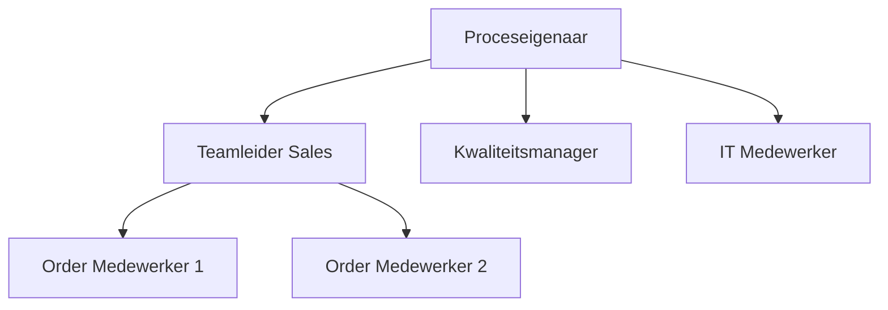

#### Inleiding

Dit Procesrollen-template helpt je om rollen binnen processen duidelijk en gestructureerd te definieren. Het doel is om:  
- Verantwoordelijkheden per rol eenduidig in kaart te brengen.  
- Overlappende taken te identificeren en te elimineren.  
- Samenwerking tussen rollen en afdelingen te optimaliseren.  
- Basis te leggen voor training, werving, en prestatiebeoordeling.  
- Integratie met andere documentatie (RACI, Werkinstructies, BPMN) te vergemakkelijken.

#### Eigenschappen

| Veld              | Waarde                                                              | Toelichting                                                                               |
| ----------------- | ------------------------------------------------------------------- | ----------------------------------------------------------------------------------------- |
| PMD-nummer    | 03.07.04                                                            | Uniek identificatienummer voor deze procesrollen in het Proces Management Document (PMD). |
| Versie        | 1                                                                   | Huidige versie van dit document. Wordt geüpdaterd bij elke wijziging.                     |
| Status        | concept                                                             | Mogelijke statussen: *concept*, *in review*, *goedgekeurd*, *gepubliceerd*, *verouderd*.  |
| Auteur        | [Naam]                                                              | De persoon of afdeling die dit document heeft opgesteld (meestal de procesanalist).       |
| Eigenaar      | [Naam proceseigenaar]                                               | Verantwoordelijk voor de inhoud en actualiteit van de procesrollen.                       |
| Datum         | 17/04/2026                                                          | Datum van de laatste update.                                                              |
| Gekoppeld aan | [Bijv. "RACI Matrix (PMD-03.07.03), Werkinstructie (PMD-03.07.02)"] | Referentie naar gerelateerde documenten.                                                  |

## 1. Wat zijn Procesrollen?

Procesrollen beschrijven wie wat doet binnen een proces. Een goed gedefinieerde rol bevat:

- Naam van de rol (bijv. "Order Medewerker").
- Verantwoordelijkheden (wat de rol doet).
- Betrokken processen (in welke processen de rol actief is).
- Competenties (welke vaardigheden nodig zijn).
- Tools/Systemen (welke systemen de rol gebruikt).
- KPI’s (hoe de prestaties van de rol worden gemeten).

Voordelen van duidelijke procesrollen:  
- Efficiëntie: Medewerkers weten wat van hen wordt verwacht.  
- Transparantie: Verantwoordelijkheden zijn voor iedereen duidelijk.  
- Flexibiliteit: Rollen kunnen eenvoudig worden aangepast bij veranderingen.  
- Samenwerking: Overlappende taken worden geïdentificeerd en opgelost.

## 2. Wanneer Procesrollen Gebruiken?

Procesrollen zijn bijzonder geschikt voor:  
- Complexe processen met meerdere betrokken partijen.  
- Nieuwe processen waar rollen nog niet duidelijk zijn.  
- Organisatieveranderingen (bijv. fusies, herstructureringen).  
- Training en onboarding van nieuwe medewerkers.  
- Procesoptimalisatie om bottlenecks te identificeren.

## 3. Procesrollen Template

Gebruik de onderstaande structuur om rollen binnen {{procesnaam}} te definieren.

#### Overzichtstabel

| Rol                     | Beschrijving                                     | Verantwoordelijkheden                                    | Betrokken Processen         | Competenties               | Tools/Systemen | KPI’s                       | RACI-code |
| --------------------------- | ---------------------------------------------------- | ------------------------------------------------------------ | ------------------------------- | ------------------------------ | ------------------ | ------------------------------- | ------------- |
| [Bijv. "Order Medewerker"]  | Verantwoordelijk voor de verwerking van klantorders. | Registratie, validatie, en bevestiging van orders.           | Orderverwerking, Klantenservice | Kennis van CRM, klantenservice | CRM-systeem, ERP   | Aantal verwerkte orders per dag | R             |
| [Bijv. "Proceseigenaar"]    | Verantwoordelijk voor het beheer van het proces.     | Eigenaar van procesdocumentatie, optimalisatie, en training. | Orderverwerking                 | Procesmanagement, BPMN         | PMD, BPMN-tools    | Procesdoorlooptijd              | A             |
| [Bijv. "Kwaliteitsmanager"] | Verantwoordelijk voor de kwaliteit van het proces.   | Monitoring, audits, en verbetervoorstellen.                  | Orderverwerking, Inkoop         | Kwaliteitsmanagement           | Kwaliteitssysteem  | Aantal fouten per order         | C             |

## 4. Gedetailleerde Rolomschrijving

Gebruik deze gestructureerde opzet voor elke rol. Dit zorgt voor consistentie en vollledigheid.

#### [Rolnaam, bijv. "Order Medewerker"]

##### Algemeen

| Veld            | Waarde                                       |
| ------------------- | ------------------------------------------------ |
| Rol-ID          | [Unieke identifier, bijv. "ROL-001"]             |
| Afdeling        | [Bijv. "Sales"]                                  |
| Rapporteert aan | [Bijv. "Teamleider Sales"]                       |
| Type rol        | [Bijv. "Uitvoerend", "Sturend", "Ondersteunend"] |

##### Verantwoordelijkheden

| Verantwoordelijkheid    | Beschrijving                                             | Frequentie | Gerelateerde activiteiten                 |
| --------------------------- | ------------------------------------------------------------ | -------------- | --------------------------------------------- |
| Registratie klantorders     | Ontvangst en registratie van klantorders in het CRM-systeem. | Dagelijks      | Ontvangst klantorder, Validatie klantgegevens |
| Validatie klantgegevens     | Controle of klantgegevens compleet en correct zijn.          | Dagelijks      | Validatie klantgegevens                       |
| Genereren productieopdracht | Omzetten van klantorder naar productieopdracht.              | Dagelijks      | Genereren productieopdracht                   |

##### Betrokken Processen

| Procesnaam  | PMD-nummer | Rol in proces | Betrokkenheid |
| --------------- | -------------- | ----------------- | ----------------- |
| Orderverwerking | PMD-01.01.00   | Uitvoerend        | Dagelijks         |
| Klantenservice  | PMD-02.01.00   | Ondersteunend     | Ad hoc            |

##### Competenties

| Competentie            | Niveau | Beschrijving                                | Training        |
| -------------------------- | ---------- | ----------------------------------------------- | ------------------- |
| Kennis CRM-systeem         | Gevorderd  | Ervaring met het CRM-systeem voor orderbeheer.  | Interne training    |
| Klantenservice             | Gevorderd  | Vaardigheid in het omgaan met klantvragen.      | On-the-job training |
| Probleemoplossend vermogen | Basis      | Vermogen om problemen zelfstandig op te lossen. | Workshop            |

##### Tools en Systemen

| Tool/Systeem | Doel                            | Toegang  | Handleiding         |
| ---------------- | ----------------------------------- | ------------ | ----------------------- |
| CRM-systeem      | Beheer van klantgegevens en orders. | Webinterface | [Link naar handleiding] |
| ERP-systeem      | Registratie van orders en voorraad. | Webinterface | [Link naar handleiding] |

##### KPI’s

| KPI                         | Definitie                                   | Doelwaarde | Meetfrequentie | Bron    |
| ------------------------------- | ----------------------------------------------- | -------------- | ------------------ | ----------- |
| Aantal verwerkte orders per dag | Aantal orders dat dagelijks wordt verwerkt.     | 50             | Dagelijks          | CRM-systeem |
| Doorlooptijd per order          | Tijd tussen ontvangst en bevestiging van order. | < 24 uur       | Dagelijks          | ERP-systeem |

##### RACI-code

| Proces              | RACI-code | Toelichting  |
| ----------------------- | ------------- | ---------------- |
| Orderverwerking         | R             | Uitvoerende rol. |
| Validatie klantgegevens | R             | Uitvoerende rol. |

## 5. Stappen voor het Definiëren van Procesrollen

Volg deze stappen om effectieve procesrollen te definieren:

1. Identificeer de processen:
  - Gebruik de Proceslandkaart en Proceshiërarchie als uitgangspunt.
1. Bepaal de activiteiten:
  - Lijst alle activiteiten op die binnen de processen worden uitgevoerd (gebruik de Procesbeschrijving).
1. Groeper activiteiten per rol:
  - Bepaal welke activiteiten bij elkaar horen en wie deze uitvoert.
1. Definieer verantwoordelijkheden:
  - Beschrijf wat elke rol doet in duidelijke, meetbare termen.
1. Voeg competenties toe:
  - Bepaal welke vaardigheden nodig zijn voor elke rol.
1. Koppel rollen aan systemen:
  - Geef aan welke tools/systemen elke rol gebruikt.
1. Definieer KPI’s:
  - Bepaal hoe de prestaties van elke rol worden gemeten.
1. Valideer met stakeholders:
  - Laat de rollen reviewen door proceseigenaren, uitvoerende teams, en HR.
1. Integreer met andere documentatie:
  - Koppel de rollen aan de RACI-matrix, Werkinstructies, en BPMN-diagrammen.

## 6. Tips voor Effectieve Procesrollen

- Wees specifiek: Beschrijf concreet wat de rol doet (gebruik werkwoorden zoals "registreren", "valideren", "genereren").  
- Vermijd overlappende rollen: Zorg dat verantwoordelijkheden niet dubbel zijn toegewijzen.  
- Gebruik standaard terminologie: Zorg voor consistentie in de benaming van rollen.  
- Voeg competenties toe: Maak duidelijk welke vaardigheden nodig zijn voor elke rol.  
- Koppel aan KPI’s: Definieer meetbare doelen voor elke rol.  
- Gebruik visuele hulpmiddelen: Voeg organigrammen of rolkaarten toe voor extra duidelijkheid.  
- Houd het actueel: Update de rollen bij wijzigingen in processen of organisatie.  
- Betrek HR: Zorg voor alignement met functieomschrijvingen en wervingsbeleid.

## 7. Veelgemaakte Fouten en Hoe ze te Vermijden

| Fout                           | Oorzaak                              | Impact                            | Oplossing                                         |
| ---------------------------------- | ---------------------------------------- | ------------------------------------- | ----------------------------------------------------- |
| Overlappende verantwoordelijkheden | Rollen zijn niet duidelijk afgebakend.   | Conflicten en dubbel werk.            | Zorg voor duidelijke scheiding van taken.         |
| Ontbrekende rollen                 | Belangrijke taken zijn niet toegewijzen. | Taken blijven ongedaan.               | Controleer of alle activiteiten zijn toegewijzen. |
| Te algemene beschrijvingen         | Verantwoordelijkheden zijn vaag.         | Misverstanden over taken.             | Gebruik specifieke, actiegerichte taal.           |
| Ontbrekende competenties           | Vaardigheden zijn niet gedocumenteerd.   | Medewerkers zijn niet gekwalificeerd. | Voeg competentie-eisen toe.                       |
| Geen KPI’s                         | Prestaties worden niet gemeten.          | Geen inzicht in effectiviteit.        | Definieer meetbare KPI’s per rol.                 |

## 8. Integratie met Andere Templates

De Procesrollen kunnen worden geïntegreerd met andere templates uit je 7x Framework:

| Template           | Relatie           | Toepassing                                                                       |
| ---------------------- | --------------------- | ------------------------------------------------------------------------------------ |
| RACI Matrix        | Verantwoordelijkheden | Gebruik de rollen uit dit template voor de kolommen in de RACI-matrix.       |
| Werkinstructie     | Uitvoering            | Gebruik de rollen om verantwoordelijkheden in werkinstructies toe te wijzen. |
| Procesbeschrijving | Activiteiten          | Koppel rollen aan activiteiten in de procesbeschrijving.                     |
| BPMN/Swimlane      | Visueel               | Voeg rollen toe als Swimlanes in BPMN- of Swimlane-diagrammen.               |
| Procesdoel         | Alignement            | Zorg dat rollen bijdragen aan de procesdoelen.                               |

## 9. Visuele Weergave (Optioneel)

Voeg hier een visuele weergave toe van de procesrollen, bijv. een organigram of rolkaart. Gebruik Mermaid voor een eenvoudige weergave in Markdown.

Voorbeeld (Mermaid Organigram):

## 10. Stakeholders en Verantwoordelijkheden

Geef hier een overzicht van wie betrokken is bij het definieren en gebruik van procesrollen.

| Rol             | Verantwoordelijkheid                                                | Betrokkenheid |
| ------------------- | ----------------------------------------------------------------------- | ----------------- |
| Proceseigenaar  | Verantwoordelijk voor de inhoud en actualiteit van de procesrollen. | Continu           |
| Procesanalist   | Definieert en documenteert de procesrollen.                         | Ad hoc            |
| HR              | Zorgt voor alignement met functieomschrijvingen.                    | Ad hoc            |
| Uitvoerend team | Voert taken uit volgens de gedefinieerde rollen.                    | Dagelijks         |
| Management      | Valideert de procesrollen op strategische alignement.               | Periodiek         |

## 11. Gerelateerde Documenten

Lijst hier alle gerelateerde documenten, zoals:

- [Link naar RACI Matrix (PMD-03.07.03)]
- [Link naar Werkinstructie (PMD-03.07.02)]
- [Link naar Procesbeschrijving (PMD-03.07.01)]
- [Link naar BPMN-diagram (PMD-03.06.01)]
- [Link naar Proceslandkaart (PMD-03.04.01)]

## 12. Versiehistorie

| Versie | Datum  | Wijziging   | Auteur | Goedgekeurd door |
| ---------- | ---------- | --------------- | ---------- | -------------------- |
| 1.0        | 17/04/2026 | Initiële versie | [Naam]     | [Naam]               |

## 13. Instructies voor Gebruik

1. Identificeer de processen:
  - Gebruik de Proceslandkaart en Proceshiërarchie als uitgangspunt.
1. Bepaal de activiteiten:
  - Lijst alle activiteiten op die binnen de processen worden uitgevoerd.
1. Groeper activiteiten per rol:
  - Bepaal welke activiteiten bij elkaar horen en wie deze uitvoert.
1. Definieer verantwoordelijkheden:
  - Beschrijf wat elke rol doet in duidelijke, meetbare termen.
1. Voeg competenties toe:
  - Bepaal welke vaardigheden nodig zijn voor elke rol.
1. Koppel rollen aan systemen:
  - Geef aan welke tools/systemen elke rol gebruikt.
1. Definieer KPI’s:
  - Bepaal hoe de prestaties van elke rol worden gemeten.
1. Valideer met stakeholders:
  - Laat de rollen reviewen door proceseigenaren, uitvoerende teams, en HR.
1. Integreer met andere documentatie:
  - Koppel de rollen aan de RACI-matrix, Werkinstructies, en BPMN-diagrammen.

## 14. Voorbeeld: Procesrollen voor Orderverwerking

#### Overzichtstabel

| Rol           | Beschrijving                                                 | Verantwoordelijkheden                                 | Betrokken Processen         | Competenties           | Tools/Systemen | KPI’s                       | RACI-code |
| ----------------- | ---------------------------------------------------------------- | --------------------------------------------------------- | ------------------------------- | -------------------------- | ------------------ | ------------------------------- | ------------- |
| Proceseigenaar    | Verantwoordelijk voor het beheer van het Orderverwerkingsproces. | Eigenaar van procesdocumentatie, optimalisatie, training. | Orderverwerking                 | Procesmanagement, BPMN     | PMD, Camunda       | Procesdoorlooptijd              | A             |
| Teamleider Sales  | Verantwoordelijk voor het team dat orders verwerkt.              | Coördinatie, planning, en kwaliteitscontrole.             | Orderverwerking, Klantenservice | Leiderschap, planning      | CRM, ERP           | Teamprestaties                  | A             |
| Order Medewerker  | Verantwoordelijk voor de verwerking van klantorders.             | Registratie, validatie, en bevestiging van orders.        | Orderverwerking                 | Kennis CRM, klantenservice | CRM, ERP           | Aantal verwerkte orders per dag | R             |
| Kwaliteitsmanager | Verantwoordelijk voor de kwaliteit van het proces.               | Monitoring, audits, verbetervoorstellen.                  | Orderverwerking, Inkoop         | Kwaliteitsmanagement       | Kwaliteitssysteem  | Aantal fouten per order         | C             |
| IT Medewerker     | Verantwoordelijk voor technische ondersteuning.                  | Onderhoud en ondersteuning van systemen.                  | Orderverwerking                 | Technische kennis          | ERP, CRM           | Systeemuptime                   | I             |

#### Gedetailleerde Rolomschrijving: Order Medewerker

##### Algemeen

| Veld            | Waarde       |
| ------------------- | ---------------- |
| Rol-ID          | ROL-001          |
| Afdeling        | Sales            |
| Rapporteert aan | Teamleider Sales |
| Type rol        | Uitvoerend       |

##### Verantwoordelijkheden

| Verantwoordelijkheid    | Beschrijving                                             | Frequentie | Gerelateerde activiteiten |
| --------------------------- | ------------------------------------------------------------ | -------------- | ----------------------------- |
| Registratie klantorders     | Ontvangst en registratie van klantorders in het CRM-systeem. | Dagelijks      | Ontvangst klantorder          |
| Validatie klantgegevens     | Controle of klantgegevens compleet en correct zijn.          | Dagelijks      | Validatie klantgegevens       |
| Genereren productieopdracht | Omzetten van klantorder naar productieopdracht.              | Dagelijks      | Genereren productieopdracht   |
| Communicatie met klanten    | Beantwoorden van vragen en versturen van bevestigingen.      | Dagelijks      | Versturen orderbevestiging    |

##### Betrokken Processen

| Procesnaam  | PMD-nummer | Rol in proces | Betrokkenheid |
| --------------- | -------------- | ----------------- | ----------------- |
| Orderverwerking | PMD-01.01.00   | Uitvoerend        | Dagelijks         |
| Klantenservice  | PMD-02.01.00   | Ondersteunend     | Ad hoc            |

##### Competenties

| Competentie            | Niveau | Beschrijving                                | Training        |
| -------------------------- | ---------- | ----------------------------------------------- | ------------------- |
| Kennis CRM-systeem         | Gevorderd  | Ervaring met het CRM-systeem voor orderbeheer.  | Interne training    |
| Klantenservice             | Gevorderd  | Vaardigheid in het omgaan met klantvragen.      | On-the-job training |
| Probleemoplossend vermogen | Basis      | Vermogen om problemen zelfstandig op te lossen. | Workshop            |
| Accuraatheid               | Gevorderd  | Vermogen om foutloos te werken.                 | Training            |

##### Tools en Systemen

| Tool/Systeem | Doel                            | Toegang  | Handleiding         |
| ---------------- | ----------------------------------- | ------------ | ----------------------- |
| CRM-systeem      | Beheer van klantgegevens en orders. | Webinterface | [Link naar handleiding] |
| ERP-systeem      | Registratie van orders en voorraad. | Webinterface | [Link naar handleiding] |
| E-mail           | Communicatie met klanten.           | Outlook      | [Link naar IT-beleid]   |

##### KPI’s

| KPI                         | Definitie                                   | Doelwaarde | Meetfrequentie | Bron     |
| ------------------------------- | ----------------------------------------------- | -------------- | ------------------ | ------------ |
| Aantal verwerkte orders per dag | Aantal orders dat dagelijks wordt verwerkt.     | 50             | Dagelijks          | CRM-systeem  |
| Doorlooptijd per order          | Tijd tussen ontvangst en bevestiging van order. | < 24 uur       | Dagelijks          | ERP-systeem  |
| Klanttevredenheid               | Tevredenheidsscore van klanten.                 | > 8            | Maandelijks        | Klantenquête |

##### RACI-code

| Proces                  | RACI-code | Toelichting  |
| --------------------------- | ------------- | ---------------- |
| Orderverwerking             | R             | Uitvoerende rol. |
| Validatie klantgegevens     | R             | Uitvoerende rol. |
| Genereren productieopdracht | R             | Uitvoerende rol. |
