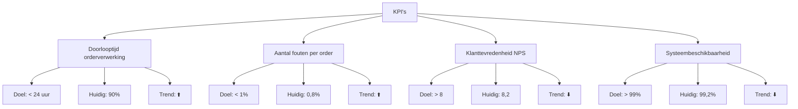

###### Inleiding

Dit Processturing-template biedt een gestructureerde aanpak voor het sturen, meten, en verbeteren van {{procesnaam}}. Het doel is om:  
- Prestaties van het proces meetbaar te maken met KPI’s.  
- Monitoring in te richten voor real-time inzicht in de procesprestaties.  
- Rapportage te standaardiseren voor transparantie naar stakeholders.  
- Kwaliteitsborging te waarborgen door controles en audits.  
- Continue verbetering te faciliteren met feedback en actieplannen.

###### Eigenschappen

| Veld              | Waarde                                                                 | Toelichting                                                                                |
| ----------------- | ---------------------------------------------------------------------- | ------------------------------------------------------------------------------------------ |
| PMD-nummer    | 03.08.00                                                               | Uniek identificatienummer voor deze processturing in het Proces Management Document (PMD). |
| Versie        | 1                                                                      | Huidige versie van dit document. Wordt geüpdaterd bij elke wijziging.                      |
| Status        | concept                                                                | Mogelijke statussen: *concept*, *in review*, *goedgekeurd*, *gepubliceerd*, *verouderd*.   |
| Auteur        | [Naam]                                                                 | De persoon of afdeling die dit document heeft opgesteld (meestal de procesanalist).        |
| Eigenaar      | [Naam proceseigenaar]                                                  | Verantwoordelijk voor de inhoud en actualiteit van de processturing.                       |
| Datum         | 17/04/2026                                                             | Datum van de laatste update.                                                               |
| Gekoppeld aan | [Bijv. "Procesbeschrijving (PMD-03.07.01), Procesdoel (PMD-03.03.00)"] | Referentie naar gerelateerde documenten.                                                   |

#### 1. Algemeen Overzicht

Geef hier een kort overzicht van het proces waarvoor de sturing wordt gedefinieerd.

| Veld                | Waarde                                                                   | Toelichting                         |
| ----------------------- | ---------------------------------------------------------------------------- | --------------------------------------- |
| Procesnaam          | [Naam van het proces, bijv. "Orderverwerking"]                               | Naam van het proces.                    |
| Proces-ID           | [Bijv. "PR-001"]                                                             | Unieke identifier.                      |
| Procescategorie     | [Primair / Ondersteunend / Sturend]                                          | Categorisatie van het proces.           |
| Doel van het proces | [Korte beschrijving, bijv. "Tijdige en accurate verwerking van klantorders"] | Wat het proces moet bereiken.           |
| Scope               | [Beschrijving van de reikwijdte]                                             | Wat valt wel en niet binnen het proces. |

#### 2. KPI’s (Key Performance Indicators)

Definieer hier meetbare doelen om de prestaties van het proces te evalueren. Gebruik SMART-criteria (Specifiek, Meetbaar, Acceptabel, Realistisch, Tijdgebonden).

###### Overzichtstabel KPI’s

| KPI                      | Definitie                                   | Doelwaarde | Meetfrequentie | Verantwoordelijke | Bron          | Streefcijfer  | Huidige waarde | Trend | Actie bij afwijking         |
| ---------------------------- | ----------------------------------------------- | -------------- | ------------------ | --------------------- | ----------------- | ----------------- | ------------------ | --------- | ------------------------------- |
| Doorlooptijd orderverwerking | Tijd tussen ontvangst en bevestiging van order. | < 24 uur       | Dagelijks          | Proceseigenaar        | ERP-systeem       | 95% van de orders | 90%                | ⬆️/⬇️/→   | Onderzoek oorzaak vertraging.   |
| Aantal fouten per order      | Percentage orders met fouten.                   | < 1%           | Wekelijks          | Kwaliteitsmanager     | Kwaliteitsrapport | 0,5%              | 0,8%               | ⬆️        | Extra training voor Order Team. |
| Klanttevredenheid (NPS)      | Net Promoter Score voor orderafhandeling.       | > 8            | Maandelijks        | Sales Manager         | Klantenquête      | 8,5               | 8,2                | ⬇️        | Klantfeedback analyseren.       |
| Systeembeschikbaarheid       | Percentage tijd dat ERP-systeem beschikbaar is. | > 99%          | Continu            | IT-afdeling           | Monitoringstool   | 99,5%             | 99,2%              | ⬇️        | IT-onderhoud plannen.           |

Tip voor Martin:  
Gebruik je Lean Six Sigma Green Belt-kennis om KPI’s te koppelen aan procesdoelen en verbeteracties te definieren.

#### 3. Monitoring

Beschrijf hier hoe het proces wordt gemonitord om real-time inzicht in de prestaties te krijgen.

###### Dashboards

| Dashboard             | Doel                                 | Gebruikers             | Frequentie | Tools         | Verantwoordelijke |
| ------------------------- | ---------------------------------------- | -------------------------- | -------------- | ----------------- | --------------------- |
| Orderverwerkingsdashboard | Overzicht van KPI’s en procesprestaties. | Proceseigenaar, Order Team | Dagelijks      | Power BI, Tableau | Proceseigenaar        |
| Kwaliteitsdashboard       | Overzicht van fouten en verbeterpunten.  | Kwaliteitsmanager          | Wekelijks      | Qlik Sense        | Kwaliteitsmanager     |
| Systeemstatusdashboard    | Overzicht van systeembeschikbaarheid.    | IT-afdeling                | Continu        | Nagios, Splunk    | IT-afdeling           |

###### Alerts

| Alert                  | Trigger                  | Drempelwaarde | Actie                | Verantwoordelijke | Escalatie      |
| -------------------------- | ---------------------------- | ----------------- | ------------------------ | --------------------- | ------------------ |
| Vertraagde orderverwerking | Doorlooptijd > 24 uur        | 24 uur            | Onderzoek oorzaak        | Proceseigenaar        | Teamleider Sales   |
| Hoog foutpercentage        | Aantal fouten > 1%           | 1%                | Extra training           | Kwaliteitsmanager     | Proceseigenaar     |
| Lage klanttevredenheid     | NPS < 8                      | 8                 | Klantfeedback analyseren | Sales Manager         | Directie           |
| Systeemstoring             | Systeembeschikbaarheid < 99% | 99%               | IT-onderhoud             | IT-afdeling           | Extern supportteam |

#### 4. Rapportage

Beschrijf hier hoe en wanneer rapportages worden opgesteld en gedeeld.

###### Rapportage Overzicht

| Rapportage                   | Frequentie | Inhoud                                         | Doelgroep                     | Verantwoordelijke | Format        | Distributie    |
| -------------------------------- | -------------- | -------------------------------------------------- | --------------------------------- | --------------------- | ----------------- | ------------------ |
| Dagelijkse procesrapportage      | Dagelijks      | KPI’s, afwijkingen, actiepunten                    | Proceseigenaar, Order Team        | Proceseigenaar        | E-mail, Dashboard | E-mail, SharePoint |
| Wekelijkse kwaliteitsrapportage  | Wekelijks      | Foutenanalyse, verbeterpunten                      | Kwaliteitsmanager, Proceseigenaar | Kwaliteitsmanager     | PDF               | E-mail, Confluence |
| Maandelijkse prestatierapportage | Maandelijks    | KPI-trends, verbeteracties, ROI                    | Management, Directie              | Proceseigenaar        | Presentatie       | Managementmeeting  |
| Ad-hoc incidentrapportage        | Ad hoc         | Oorzaakanalyse, oplossing, preventieve maatregelen | Betrokken partijen                | Proceseigenaar        | Word/PDF          | E-mail             |

Tip voor Martin:  
Gebruik je PRINCE2 Foundation-kennis om rapportages te structureren volgens best practices voor project- en procesmanagement.

#### 5. Kwaliteitsborging

Beschrijf hier hoe de kwaliteit van het proces wordt gegarandeerd.

###### Controles

| Controle          | Type    | Frequentie | Verantwoordelijke | Methode      | Acceptatiecriteria                |
| --------------------- | ----------- | -------------- | --------------------- | ---------------- | ------------------------------------- |
| Volledigheidscontrole | Handmatig   | Per order      | Order Medewerker      | Visuele controle | Alle verplichte velden zijn ingevuld. |
| Juistheidscontrole    | Automatisch | Per order      | CRM-systeem           | Systeemvalidatie | Geen foutmeldingen in het systeem.    |
| Tijdigheidscontrole   | Handmatig   | Dagelijks      | Teamleider            | Tijdsregistratie | Order verwerkt binnen 24 uur.         |
| Systeemcontrole       | Automatisch | Continu        | IT-afdeling           | Monitoringstool  | Systeembeschikbaarheid > 99%.         |

###### Audits

| Audit              | Type         | Frequentie | Verantwoordelijke | Scope            | Doel                             | Rapportage        |
| ---------------------- | ---------------- | -------------- | --------------------- | -------------------- | ------------------------------------ | --------------------- |
| Interne procesaudit    | Interne audit    | Halfjaarlijks  | Kwaliteitsmanager     | Hele proces          | Naleving van processtappen en KPI’s  | Auditrapport          |
| Externe ISO 9001 audit | Externe audit    | Jaarlijks      | Kwaliteitsmanager     | Kwaliteitsmanagement | Naleving van ISO 9001-normen         | Certificeringsrapport |
| Systeemaudit           | Technische audit | Kwartaallijks  | IT-afdeling           | ERP-systeem          | Systeemveiligheid en beschikbaarheid | Technisch rapport     |

#### 6. Continue Verbetering

Beschrijf hier hoe het proces continu wordt verbeterd op basis van feedback, analyses, en actieplannen.

###### Feedback Mechanismen

| Mechanisme     | Type                 | Frequentie | Verantwoordelijke | Doel                     | Actie               |
| ------------------ | ------------------------ | -------------- | --------------------- | ---------------------------- | ----------------------- |
| Medewerkerfeedback | Kwalitatief              | Maandelijks    | Teamleider            | Verbeterpunten identificeren | Werkoverleg             |
| Klantfeedback      | Kwalitatief/Kwantitatief | Continu        | Sales Manager         | Klanttevredenheid meten      | Klantenquête, follow-up |
| Systeemfeedback    | Kwantitatief             | Continu        | IT-afdeling           | Systeemprestaties meten      | Monitoring, onderhoud   |
| Procesaudit        | Kwalitatief              | Halfjaarlijks  | Kwaliteitsmanager     | Naleving en verbeterpunten   | Auditrapport, actieplan |

###### Verbeteracties

| Verbeterpunt           | Oorzaak                         | Impact               | Actie                      | Verantwoordelijke | Deadline | Status    |
| -------------------------- | ----------------------------------- | ------------------------ | ------------------------------ | --------------------- | ------------ | ------------- |
| Vertraagde orderverwerking | Handmatige validatie duurt te lang. | Levering komt te laat.   | Automatiseren validatiestap    | IT-afdeling           | 30/06/2026   | In uitvoering |
| Hoog foutpercentage        | Onvoldoende training                | Onjuiste orderverwerking | Extra training Order Team      | Kwaliteitsmanager     | 15/05/2026   | Gepland       |
| Lage klanttevredenheid     | Onduidelijke communicatie           | Klantontevredenheid      | Verbeter communicatietemplates | Sales Manager         | 30/04/2026   | In uitvoering |

#### 7. Stappen voor het Opstellen van Processturing

Volg deze stappen om effectieve processturing in te richten:

1. Definieer KPI’s:
  - Bepaal welke prestaties gemeten moeten worden (gebruik de Procesdoelen als uitgangspunt).
  - Zorg voor SMART-criteria (Specifiek, Meetbaar, Acceptabel, Realistisch, Tijdgebonden).
1. Richt monitoring in:
  - Kies tools voor het meten van KPI’s (bijv. Power BI, Tableau, Nagios).
  - Definieer dashboards en alerts voor real-time inzicht.
1. Stel rapportage op:
  - Bepaal welke rapportages nodig zijn en hoe vaak deze moeten worden opgesteld.
  - Definieer doelgroepen en distributiekanalen.
1. Implementeer kwaliteitsborging:
  - Voeg controles toe voor kritische processtappen.
  - Plan audits voor periodieke evaluatie.
1. Richt continue verbetering in:
  - Definieer feedbackmechanismen (medewerkers, klanten, systemen).
  - Stel verbeteracties op op basis van analyses.
1. Valideer met stakeholders:
  - Laat de processturing reviewen door proceseigenaren, management, en IT.
1. Houd het actueel:
  - Update de processturing bij wijzigingen in processen, KPI’s, of organisatie.

#### 8. Tips voor Effectieve Processturing

- Gebruik SMART KPI’s: Zorg dat KPI’s Specifiek, Meetbaar, Acceptabel, Realistisch, en Tijdgebonden zijn.  
- Automatiseer monitoring: Gebruik tools (Power BI, Tableau) voor real-time inzicht.  
- Stel duidelijke alerts in: Definieer drempelwaarden en acties voor afwijkingen.  
- Standardiseer rapportage: Gebruik templates voor consistentie in rapportages.  
- Voer regelmatige audits uit: Zorg voor periodieke controles van procesnaleving.  
- Betrek stakeholders: Laat alle betrokkenen meedenken over KPI’s en verbeteracties.  
- Gebruik je Lean Six Sigma-kennis: Pas DMAIC (Define, Measure, Analyze, Improve, Control) toe voor continue verbetering.  
- Houd het actueel: Update de processturing bij wijzigingen in processen of organisatie.

#### 9. Visuele Weergave (Optioneel)

Voeg hier een visuele weergave toe van de processturing, bijv. een dashboard lay-out of KPI-overzicht. Gebruik Mermaid voor een eenvoudige weergave in Markdown.

Voorbeeld (Mermaid KPI-overzicht):

#### 10. Stakeholders en Verantwoordelijkheden

Geef hier een overzicht van wie betrokken is bij de processturing.

| Rol               | Verantwoordelijkheid                                                 | Betrokkenheid |
| --------------------- | ------------------------------------------------------------------------ | ----------------- |
| Proceseigenaar    | Verantwoordelijk voor de inhoud en actualiteit van de processturing. | Continu           |
| Procesanalist     | Stelt de processturing op en zorgt voor consistentie.                | Ad hoc            |
| Kwaliteitsmanager | Monitort de kwaliteit en voert audits uit.                           | Periodiek         |
| IT-afdeling       | Ondersteunt bij monitoring en systeembeschikbaarheid.                | Continu           |
| Management        | Valideert de processturing op strategische alignement.               | Periodiek         |
| Uitvoerend team   | Voert het proces uit volgens de gedefinieerde sturing.               | Dagelijks         |

#### 11. Gerelateerde Documenten

Lijst hier alle gerelateerde documenten, zoals:

- [Link naar Procesbeschrijving (PMD-03.07.01)]
- [Link naar Procesdoel (PMD-03.03.00)]
- [Link naar Werkinstructie (PMD-03.07.02)]
- [Link naar RACI Matrix (PMD-03.07.03)]
- [Link naar Procesrollen (PMD-03.07.04)]

#### 12. Versiehistorie

| Versie | Datum  | Wijziging   | Auteur | Goedgekeurd door |
| ---------- | ---------- | --------------- | ---------- | -------------------- |
| 1.0        | 17/04/2026 | Initiële versie | [Naam]     | [Naam]               |

#### 13. Instructies voor Gebruik

1. Definieer KPI’s:
  - Bepaal welke prestaties gemeten moeten worden.
  - Gebruik SMART-criteria voor het formuleren van KPI’s.
1. Richt monitoring in:
  - Kies tools voor het meten van KPI’s.
  - Definieer dashboards en alerts.
1. Stel rapportage op:
  - Bepaal welke rapportages nodig zijn en hoe vaak deze moeten worden opgesteld.
1. Implementeer kwaliteitsborging:
  - Voeg controles toe voor kritische processtappen.
  - Plan audits voor periodieke evaluatie.
1. Richt continue verbetering in:
  - Definieer feedbackmechanismen.
  - Stel verbeteracties op op basis van analyses.
1. Valideer met stakeholders:
  - Laat de processturing reviewen door alle betrokken partijen.
1. Houd het actueel:
  - Update de processturing bij wijzigingen in processen of organisatie.

#### 14. Voorbeeld: Ingevulde Processturing (Orderverwerking)

###### Algemeen Overzicht

| Veld                | Waarde                                          | Toelichting                     |
| ----------------------- | --------------------------------------------------- | ----------------------------------- |
| Procesnaam          | Orderverwerking                                     | Naam van het proces.                |
| Proces-ID           | PR-001                                              | Unieke identifier.                  |
| Procescategorie     | Primair                                             | Kernproces.                         |
| Doel van het proces | Tijdige en accurate verwerking van klantorders.     | Waardecreatie voor klanten.         |
| Scope               | Van ontvangst klantorder tot bevestiging aan klant. | Inclusief validatie en registratie. |

###### KPI’s

| KPI                      | Definitie                                   | Doelwaarde | Meetfrequentie | Verantwoordelijke | Bron          | Streefcijfer  | Huidige waarde | Trend | Actie bij afwijking         |
| ---------------------------- | ----------------------------------------------- | -------------- | ------------------ | --------------------- | ----------------- | ----------------- | ------------------ | --------- | ------------------------------- |
| Doorlooptijd orderverwerking | Tijd tussen ontvangst en bevestiging van order. | < 24 uur       | Dagelijks          | Proceseigenaar        | ERP-systeem       | 95% van de orders | 90%                | ⬆️        | Onderzoek oorzaak vertraging.   |
| Aantal fouten per order      | Percentage orders met fouten.                   | < 1%           | Wekelijks          | Kwaliteitsmanager     | Kwaliteitsrapport | 0,5%              | 0,8%               | ⬆️        | Extra training voor Order Team. |
| Klanttevredenheid (NPS)      | Net Promoter Score voor orderafhandeling.       | > 8            | Maandelijks        | Sales Manager         | Klantenquête      | 8,5               | 8,2                | ⬇️        | Klantfeedback analyseren.       |

###### Monitoring

Dashboards:

| Dashboard             | Doel                                 | Gebruikers             | Frequentie | Tools | Verantwoordelijke |
| ------------------------- | ---------------------------------------- | -------------------------- | -------------- | --------- | --------------------- |
| Orderverwerkingsdashboard | Overzicht van KPI’s en procesprestaties. | Proceseigenaar, Order Team | Dagelijks      | Power BI  | Proceseigenaar        |

Alerts:

| Alert                  | Trigger           | Drempelwaarde | Actie         | Verantwoordelijke | Escalatie    |
| -------------------------- | --------------------- | ----------------- | ----------------- | --------------------- | ---------------- |
| Vertraagde orderverwerking | Doorlooptijd > 24 uur | 24 uur            | Onderzoek oorzaak | Proceseigenaar        | Teamleider Sales |
| Hoog foutpercentage        | Aantal fouten > 1%    | 1%                | Extra training    | Kwaliteitsmanager     | Proceseigenaar   |

###### Rapportage

| Rapportage                  | Frequentie | Inhoud                      | Doelgroep                     | Verantwoordelijke | Format | Distributie |
| ------------------------------- | -------------- | ------------------------------- | --------------------------------- | --------------------- | ---------- | --------------- |
| Dagelijkse procesrapportage     | Dagelijks      | KPI’s, afwijkingen, actiepunten | Proceseigenaar, Order Team        | Proceseigenaar        | E-mail     | E-mail          |
| Wekelijkse kwaliteitsrapportage | Wekelijks      | Foutenanalyse, verbeterpunten   | Kwaliteitsmanager, Proceseigenaar | Kwaliteitsmanager     | PDF        | SharePoint      |

###### Kwaliteitsborging

Controles:

| Controle          | Type    | Frequentie | Verantwoordelijke | Methode      | Acceptatiecriteria                |
| --------------------- | ----------- | -------------- | --------------------- | ---------------- | ------------------------------------- |
| Volledigheidscontrole | Handmatig   | Per order      | Order Medewerker      | Visuele controle | Alle verplichte velden zijn ingevuld. |
| Juistheidscontrole    | Automatisch | Per order      | CRM-systeem           | Systeemvalidatie | Geen foutmeldingen in het systeem.    |

Audits:

| Audit           | Type      | Frequentie | Verantwoordelijke | Scope   | Doel                   | Rapportage |
| ------------------- | ------------- | -------------- | --------------------- | ----------- | -------------------------- | -------------- |
| Interne procesaudit | Interne audit | Halfjaarlijks  | Kwaliteitsmanager     | Hele proces | Naleving van processtappen | Auditrapport   |

###### Continue Verbetering

Feedback Mechanismen:

| Mechanisme     | Type    | Frequentie | Verantwoordelijke | Doel                     | Actie    |
| ------------------ | ----------- | -------------- | --------------------- | ---------------------------- | ------------ |
| Medewerkerfeedback | Kwalitatief | Maandelijks    | Teamleider            | Verbeterpunten identificeren | Werkoverleg  |
| Klantfeedback      | Kwalitatief | Continu        | Sales Manager         | Klanttevredenheid meten      | Klantenquête |

Verbeteracties:

| Verbeterpunt           | Oorzaak                         | Impact             | Actie                   | Verantwoordelijke | Deadline | Status    |
| -------------------------- | ----------------------------------- | ---------------------- | --------------------------- | --------------------- | ------------ | ------------- |
| Vertraagde orderverwerking | Handmatige validatie duurt te lang. | Levering komt te laat. | Automatiseren validatiestap | IT-afdeling           | 30/06/2026   | In uitvoering |