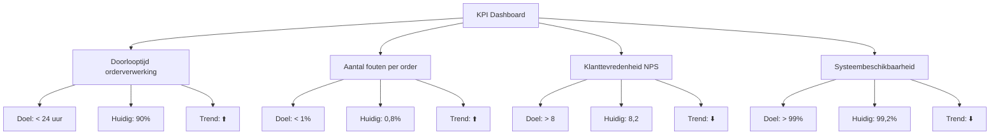

##### Inleiding

Dit KPI-template helpt je om meetbare prestatie-indicatoren voor {{procesnaam}} te definieren, meten, en evalueren. Het doel is om:  
- Prestaties van het proces objectief meetbaar te maken.  
- Doelen te koppelen aan concrete, meetbare resultaten.  
- Transparantie te creëren voor stakeholders (management, teams, klanten).  
- Continue verbetering te faciliteren door afwijkingen te analyseren en acties te ondernemen.  
- Alignement te waarborgen met strategische organisatiedoelen.

##### Eigenschappen

| Veld              | Waarde                                                                    | Toelichting                                                                              |
| ----------------- | ------------------------------------------------------------------------- | ---------------------------------------------------------------------------------------- |
| PMD-nummer    | 03.08.01                                                                  | Uniek identificatienummer voor deze KPI's in het Proces Management Document (PMD).       |
| Versie        | 1                                                                         | Huidige versie van dit document. Wordt geüpdaterd bij elke wijziging.                    |
| Status        | concept                                                                   | Mogelijke statussen: *concept*, *in review*, *goedgekeurd*, *gepubliceerd*, *verouderd*. |
| Auteur        | [Naam]                                                                    | De persoon of afdeling die dit document heeft opgesteld (meestal de procesanalist).      |
| Eigenaar      | [Naam proceseigenaar]                                                     | Verantwoordelijk voor de inhoud en actualiteit van de KPI's.                             |
| Datum         | 17/04/2026                                                                | Datum van de laatste update.                                                             |
| Gekoppeld aan | [Bijv. "Procesbeschrijving (PMD-03.07.01), Processturing (PMD-03.08.00)"] | Referentie naar gerelateerde documenten.                                                 |

#### 1. Algemeen Overzicht

Geef hier een kort overzicht van het proces waarvoor de KPI's worden gedefinieerd.

| Veld                   | Waarde                                                                              | Toelichting                  |
| -------------------------- | --------------------------------------------------------------------------------------- | -------------------------------- |
| Procesnaam             | [Naam van het proces, bijv. "Orderverwerking"]                                          | Naam van het proces.             |
| Proces-ID              | [Bijv. "PR-001"]                                                                        | Unieke identifier.               |
| Procescategorie        | [Primair / Ondersteunend / Sturend]                                                     | Categorisatie van het proces.    |
| Doel van het proces    | [Korte beschrijving, bijv. "Tijdige en accurate verwerking van klantorders"]            | Wat het proces moet bereiken.    |
| Strategische koppeling | [Bijv. "Ondersteunt het organisatiedoel 'Klanttevredenheid verhogen tot 90% in 2026'."] | Koppeling met organisatiedoelen. |

#### 2. Wat zijn KPI's?

KPI's (Key Performance Indicators) zijn meetbare waarden die aangeven hoe effectief een proces zijn doelen bereikt. Een goede KPI is:

- SMART:
  - Specifiek: Duidelijk en eenduidig gedefinieerd.
  - Meetbaar: Kwantificeerbaar (bijv. percentage, tijd, aantal).
  - Acceptabel: Relevant voor de organisatie en stakeholders.
  - Realistisch: Haalbaar binnen de beschikbare middelen.
  - Tijdgebonden: Gebonden aan een tijdsbestek (bijv. dagelijks, maandelijks).

Types KPI's:

- Efficiëntie-KPI's: Meten hoe goed middelen worden gebruikt (bijv. doorlooptijd, kosten per order).
- Effectiviteit-KPI's: Meten hoe goed doelen worden bereikt (bijv. klanttevredenheid, foutpercentage).
- Kwaliteit-KPI's: Meten de kwaliteit van output (bijv. aantal fouten, naleving normen).
- Compliance-KPI's: Meten naleving van regels en standaarden (bijv. ISO 9001, GDPR).

#### 3. KPI Template

Gebruik de onderstaande structuur om KPI's voor {{procesnaam}} te definieren.

##### Overzichtstabel KPI's

| KPI                      | Definitie                                       | Doel                   | Meetmethode                     | Meetfrequentie | Norm (Doelwaarde) | Streefcijfer  | Huidige waarde | Trend | Verantwoordelijke | Bron          | Actie bij afwijking        | Koppeling met strategie                   |
| ---------------------------- | --------------------------------------------------- | -------------------------- | ----------------------------------- | ------------------ | --------------------- | ----------------- | ------------------ | --------- | --------------------- | ----------------- | ------------------------------ | --------------------------------------------- |
| Doorlooptijd orderverwerking | Tijd tussen ontvangst en bevestiging van een order. | Snelle orderafhandeling    | Automatische meting via ERP-systeem | Dagelijks          | < 24 uur              | 95% van de orders | 90%                | ⬆️        | Proceseigenaar        | ERP-systeem       | Onderzoek oorzaak vertraging   | Ondersteunt doel "Klanttevredenheid verhogen" |
| Aantal fouten per order      | Percentage orders met fouten.                       | Minimaliseren van fouten   | Handmatige controle + systeemlogs   | Wekelijks          | < 1%                  | 0,5%              | 0,8%               | ⬆️        | Kwaliteitsmanager     | Kwaliteitsrapport | Extra training voor Order Team | Ondersteunt doel "Kwaliteit verbeteren"       |
| Klanttevredenheid (NPS)      | Net Promoter Score voor orderafhandeling.           | Hoge klanttevredenheid     | Klantenquête                        | Maandelijks        | > 8                   | 8,5               | 8,2                | ⬇️        | Sales Manager         | Klantenquête      | Klantfeedback analyseren       | Ondersteunt doel "Klanttevredenheid verhogen" |
| Systeembeschikbaarheid       | Percentage tijd dat ERP-systeem beschikbaar is.     | Betrouwbare systeemtoegang | Automatische monitoring             | Continu            | > 99%                 | 99,5%             | 99,2%              | ⬇️        | IT-afdeling           | Nagios            | IT-onderhoud plannen           | Ondersteunt doel "Betrouwbaarheid verhogen"   |

#### 4. Stappen voor het Definiëren van KPI's

Volg deze stappen om effectieve KPI's te definieren:

1. Bepaal het doel van het proces:
  - Gebruik de Procesbeschrijving en Procesdoel als uitgangspunt.
1. Identificeer kritische succescriteria:
  - Bepaal wat succesvol is voor het proces (gebruik de Procesdoel-template).
1. Definieer KPI's:
  - Kies meetbare indicatoren die de succescriteria weerspiegelen.
  - Zorg voor SMART-criteria.
1. Bepaal meetmethoden:
  - Definieer hoe de KPI's worden gemeten (handmatig, automatisch, enquêtes, etc.).
1. Stel normen en streefcijfers:
  - Bepaal doelwaarden (norm) en ambitieuze streefcijfers.
1. Wijs verantwoordelijken toe:
  - Bepaal wie verantwoordelijk is voor het meten en verbeteren van elke KPI.
1. Koppel aan strategie:
  - Zorg voor alignement met organisatiedoelen.
1. Definieer acties bij afwijkingen:
  - Bepaal wat er moet gebeuren als een KPI niet aan de norm voldoet.
1. Valideer met stakeholders:
  - Laat de KPI's reviewen door proceseigenaren, management, en uitvoerende teams.
1. Houd het actueel:
  - Update de KPI's bij wijzigingen in processen of organisatiedoelen.

#### 5. Tips voor Effectieve KPI's

-  Wees specifiek: Gebruik duidelijke, eenduidige definities voor KPI's.  
-  Meetbaarheid is key: Zorg dat KPI's kwantificeerbaar zijn (bijv. percentage, tijd, aantal).  
-  Koppel aan doelen: Zorg dat KPI's direct gerelateerd zijn aan procesdoelen en organisatiedoelen.  
-  Gebruik automatisering: Meet KPI's automatisch waar mogelijk (bijv. via ERP, CRM, monitoringstools).  
-  Stel realistische normen: Zorg dat doelwaarden haalbaar zijn.  
-  Monitor trends: Analyseer trends in KPI's om verbeterpunten te identificeren.  
-  Betrek stakeholders: Laat alle betrokkenen meedenken over KPI's.  
-  Gebruik je Lean Six Sigma-kennis: Pas de DMAIC-methode (Define, Measure, Analyze, Improve, Control) toe voor continue verbetering.

#### 6. Veelgemaakte Fouten en Hoe ze te Vermijden

| Fout                    | Oorzaak                                   | Impact                                | Oplossing                                               |
| --------------------------- | --------------------------------------------- | ----------------------------------------- | ----------------------------------------------------------- |
| Te veel KPI's               | Te veel indicatoren worden gemeten.           | Overzicht gaat verloren, focus ontbreekt. | Beperk tot 5-10 kritische KPI's per proces.             |
| Niet-meetbare KPI's         | KPI's zijn vaag of kwalitatief.               | Moeilijk te evalueren.                    | Gebruik SMART-criteria.                                 |
| Geen koppeling met doelen   | KPI's zijn niet gekoppeld aan procesdoelen.   | Geen relevantie voor stakeholders.        | Koppel KPI's aan Procesdoel en strategische doelen. |
| Onrealistische normen       | Doelwaarden zijn niet haalbaar.               | Frustratie en demotivatie.                | Stel realistische, haalbare normen.                     |
| Geen acties bij afwijkingen | Geen plan voor als KPI's niet worden gehaald. | Geen verbetering.                         | Definieer actieplannen voor afwijkingen.                |
| Geen verantwoordelijke      | Niemand is verantwoordelijk voor KPI's.       | Geen ownership.                           | Wijs duidelijke verantwoordelijken toe.                 |

#### 7. Integratie met Andere Templates

De KPI's kunnen worden geïntegreerd met andere templates uit je 7x Framework:

| Template           | Relatie          | Toepassing                                                                          |
| ---------------------- | -------------------- | --------------------------------------------------------------------------------------- |
| Procesbeschrijving | Basis                | Gebruik de activiteiten en doelen uit de Procesbeschrijving om KPI's te definieren. |
| Procesdoel         | Alignement           | Zorg dat KPI's koppelen aan de procesdoelen.                                        |
| Processturing      | Monitoring           | Gebruik KPI's in dashboards en rapportages.                                         |
| RACI Matrix        | Verantwoordelijkheid | Wijs verantwoordelijken toe voor het meten en verbeteren van KPI's.                 |
| Werkinstructie     | Uitvoering           | Gebruik KPI's om prestaties van medewerkers te meten.                               |

#### 8. Visuele Weergave (Optioneel)

Voeg hier een visuele weergave toe van de KPI's, bijv. een dashboard lay-out of trendanalyse. Gebruik Mermaid voor een eenvoudige weergave in Markdown.

Voorbeeld (Mermaid KPI Dashboard):

#### 9. Tools voor het Meten van KPI's

Hier zijn tools die je kunt gebruiken voor het meten en monitoren van KPI's:

| Tool               | Type    | Voordelen                                               | Nadelen                                 | Link                                               | Geschikt voor                 |
| ---------------------- | ----------- | ----------------------------------------------------------- | ------------------------------------------- | ------------------------------------------------------ | --------------------------------- |
| Power BI           | Dashboard   | Visuele weergave, integratie met Excel/ERP, real-time data. | Complexe opzet.                             | [powerbi.microsoft.com](https://powerbi.microsoft.com) | KPI-dashboards, trendanalyses.    |
| Tableau            | Dashboard   | Gebruiksvriendelijk, krachtige visualisaties.               | Duur.                                       | [tableau.com](https://www.tableau.com)                 | KPI-dashboards, rapportages.      |
| Google Data Studio | Dashboard   | Gratis, integratie met Google tools.                        | Beperkte functionaliteit.                   | [datastudio.google.com](https://datastudio.google.com) | Eenvoudige KPI-dashboards.        |
| Excel              | Spreadsheet | Flexibel, eenvoudig in gebruik.                             | Handmatige invoer, beperkte automatisering. | -                                                      | Eenvoudige KPI-tracking.          |
| Nagios             | Monitoring  | Real-time monitoring, alerts.                               | Technisch, complex.                         | [nagios.org](https://www.nagios.org)                   | Systeembeschikbaarheid, IT-KPI's. |
| Splunk             | Monitoring  | Krachtige loganalyse, real-time inzichten.                  | Duur, complex.                              | [splunk.com](https://www.splunk.com)                   | Systeemprestaties, foutenanalyse. |

#### 10. Stakeholders en Verantwoordelijkheden

Geef hier een overzicht van wie betrokken is bij het definieren, meten, en verbeteren van KPI's.

| Rol               | Verantwoordelijkheid                                         | Betrokkenheid |
| --------------------- | ---------------------------------------------------------------- | ----------------- |
| Proceseigenaar    | Verantwoordelijk voor de inhoud en actualiteit van de KPI's. | Continu           |
| Procesanalist     | Definieert en meet de KPI's.                                 | Ad hoc            |
| Kwaliteitsmanager | Monitort de KPI's en voert analyses uit.                     | Periodiek         |
| IT-afdeling       | Ondersteunt bij automatisering van metingen.                 | Ad hoc            |
| Management        | Valideert de KPI's op strategische alignement.               | Periodiek         |
| Uitvoerend team   | Voert het proces uit en levert data voor KPI's.              | Dagelijks         |

#### 11. Gerelateerde Documenten

Lijst hier alle gerelateerde documenten, zoals:

- [Link naar Procesbeschrijving (PMD-03.07.01)]
- [Link naar Procesdoel (PMD-03.03.00)]
- [Link naar Processturing (PMD-03.08.00)]
- [Link naar RACI Matrix (PMD-03.07.03)]
- [Link naar Werkinstructie (PMD-03.07.02)]

#### 12. Versiehistorie

| Versie | Datum  | Wijziging   | Auteur | Goedgekeurd door |
| ---------- | ---------- | --------------- | ---------- | -------------------- |
| 1.0        | 17/04/2026 | Initiële versie | [Naam]     | [Naam]               |

#### 13. Instructies voor Gebruik

1. Bepaal het doel van het proces:
  - Gebruik de Procesbeschrijving en Procesdoel als uitgangspunt.
1. Identificeer kritische succescriteria:
  - Bepaal wat succesvol is voor het proces.
1. Definieer KPI's:
  - Kies meetbare indicatoren die de succescriteria weerspiegelen.
  - Zorg voor SMART-criteria.
1. Bepaal meetmethoden:
  - Definieer hoe de KPI's worden gemeten.
1. Stel normen en streefcijfers:
  - Bepaal doelwaarden en ambitieuze streefcijfers.
1. Wijs verantwoordelijken toe:
  - Bepaal wie verantwoordelijk is voor het meten en verbeteren van elke KPI.
1. Koppel aan strategie:
  - Zorg voor alignement met organisatiedoelen.
1. Definieer acties bij afwijkingen:
  - Bepaal wat er moet gebeuren als een KPI niet aan de norm voldoet.
1. Valideer met stakeholders:
  - Laat de KPI's reviewen door alle betrokken partijen.
1. Houd het actueel:
  - Update de KPI's bij wijzigingen in processen of organisatiedoelen.

#### 14. Voorbeeld: Ingevulde KPI's voor Orderverwerking

##### Algemeen Overzicht

| Veld                   | Waarde                                                                    | Toelichting                  |
| -------------------------- | ----------------------------------------------------------------------------- | -------------------------------- |
| Procesnaam             | Orderverwerking                                                               | Naam van het proces.             |
| Proces-ID              | PR-001                                                                        | Unieke identifier.               |
| Procescategorie        | Primair                                                                       | Kernproces.                      |
| Doel van het proces    | Tijdige en accurate verwerking van klantorders.                               | Waardecreatie voor klanten.      |
| Strategische koppeling | Ondersteunt het organisatiedoel "Klanttevredenheid verhogen tot 90% in 2026". | Koppeling met organisatiedoelen. |

##### KPI Overzichtstabel

| KPI                      | Definitie                                       | Doel                   | Meetmethode                     | Meetfrequentie | Norm (Doelwaarde) | Streefcijfer  | Huidige waarde | Trend | Verantwoordelijke | Bron          | Actie bij afwijking        | Koppeling met strategie                   |
| ---------------------------- | --------------------------------------------------- | -------------------------- | ----------------------------------- | ------------------ | --------------------- | ----------------- | ------------------ | --------- | --------------------- | ----------------- | ------------------------------ | --------------------------------------------- |
| Doorlooptijd orderverwerking | Tijd tussen ontvangst en bevestiging van een order. | Snelle orderafhandeling    | Automatische meting via ERP-systeem | Dagelijks          | < 24 uur              | 95% van de orders | 90%                | ⬆️        | Proceseigenaar        | ERP-systeem       | Onderzoek oorzaak vertraging   | Ondersteunt doel "Klanttevredenheid verhogen" |
| Aantal fouten per order      | Percentage orders met fouten.                       | Minimaliseren van fouten   | Handmatige controle + systeemlogs   | Wekelijks          | < 1%                  | 0,5%              | 0,8%               | ⬆️        | Kwaliteitsmanager     | Kwaliteitsrapport | Extra training voor Order Team | Ondersteunt doel "Kwaliteit verbeteren"       |
| Klanttevredenheid (NPS)      | Net Promoter Score voor orderafhandeling.           | Hoge klanttevredenheid     | Klantenquête                        | Maandelijks        | > 8                   | 8,5               | 8,2                | ⬇️        | Sales Manager         | Klantenquête      | Klantfeedback analyseren       | Ondersteunt doel "Klanttevredenheid verhogen" |
| Systeembeschikbaarheid       | Percentage tijd dat ERP-systeem beschikbaar is.     | Betrouwbare systeemtoegang | Automatische monitoring             | Continu            | > 99%                 | 99,5%             | 99,2%              | ⬇️        | IT-afdeling           | Nagios            | IT-onderhoud plannen           | Ondersteunt doel "Betrouwbaarheid verhogen"   |
| Kosten per order             | Gemiddelde kosten voor het verwerken van een order. | Efficiënte orderverwerking | Financiële rapportage               | Maandelijks        | < €5                  | €4,50             | €5,20              | ⬆️        | Financiële Afdeling   | ERP-systeem       | Onderzoek kostenposten         | Ondersteunt doel "Kosten verlagen"            |

#### 15. Voorbeeld: KPI's voor een Telecomproces (SIM-activatie)

Gebaseerd op je ervaring in de telecomsector, hier een praktisch voorbeeld voor een SIM-activatieproces.

##### Algemeen Overzicht

| Veld                   | Waarde                                                                       | Toelichting                  |
| -------------------------- | -------------------------------------------------------------------------------- | -------------------------------- |
| Procesnaam             | SIM-activatie                                                                    | Naam van het proces.             |
| Proces-ID              | PR-002                                                                           | Unieke identifier.               |
| Procescategorie        | Ondersteunend                                                                    | Ondersteunt klantprocessen.      |
| Doel van het proces    | Snelle en betrouwbare activatie van SIM-kaarten voor klanten.                    | Waardecreatie voor klanten.      |
| Strategische koppeling | Ondersteunt het organisatiedoel "Klanttevredenheid in telecomdiensten verhogen". | Koppeling met organisatiedoelen. |

##### KPI Overzichtstabel

| KPI                  | Definitie                                            | Doel                   | Meetmethode                              | Meetfrequentie | Norm (Doelwaarde) | Streefcijfer     | Huidige waarde | Trend | Verantwoordelijke | Bron             | Actie bij afwijking            | Koppeling met strategie                   |
| ------------------------ | -------------------------------------------------------- | -------------------------- | -------------------------------------------- | ------------------ | --------------------- | -------------------- | ------------------ | --------- | --------------------- | -------------------- | ---------------------------------- | --------------------------------------------- |
| Activatietijd            | Tijd tussen aanvraag en activatie van SIM-kaart.         | Snelle activatie           | Automatische meting via provisioning-systeem | Dagelijks          | < 1 uur               | 95% van de aanvragen | 85%                | ⬆️        | Proceseigenaar        | Provisioning-systeem | Onderzoek oorzaak vertraging       | Ondersteunt doel "Klanttevredenheid verhogen" |
| Activatiefouten          | Percentage SIM-kaarten met activatiefouten.              | Betrouwbare activatie      | Systeemlogs + handmatige controle            | Wekelijks          | < 0,5%                | 0,2%                 | 0,7%               | ⬆️        | Technisch Team        | Provisioning-systeem | Extra training voor Technisch Team | Ondersteunt doel "Kwaliteit verbeteren"       |
| Klanttevredenheid (CSAT) | Customer Satisfaction Score voor SIM-activatie.          | Hoge klanttevredenheid     | Klantenquête                                 | Maandelijks        | > 90%                 | 95%                  | 88%                | ⬇️        | Klantenservice        | Klantenquête         | Klantfeedback analyseren           | Ondersteunt doel "Klanttevredenheid verhogen" |
| Systeembeschikbaarheid   | Percentage tijd dat provisioning-systeem beschikbaar is. | Betrouwbare systeemtoegang | Automatische monitoring                      | Continu            | > 99,5%               | 99,9%                | 99,3%              | ⬇️        | IT-afdeling           | Nagios               | IT-onderhoud plannen               | Ondersteunt doel "Betrouwbaarheid verhogen"   |