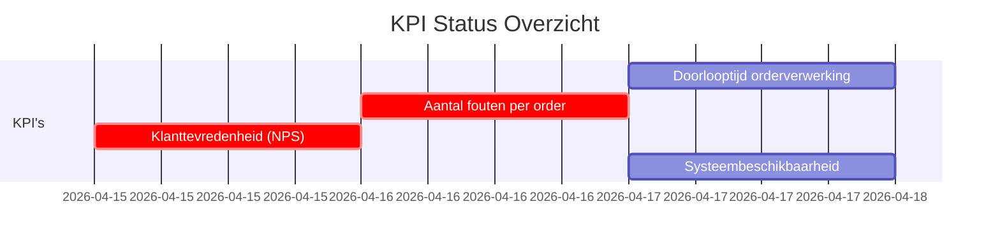
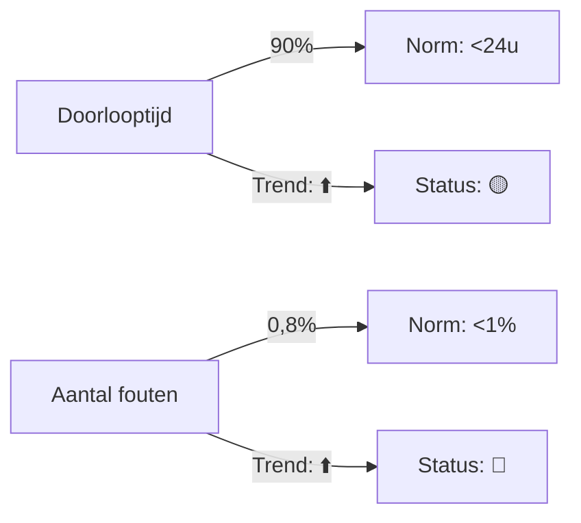
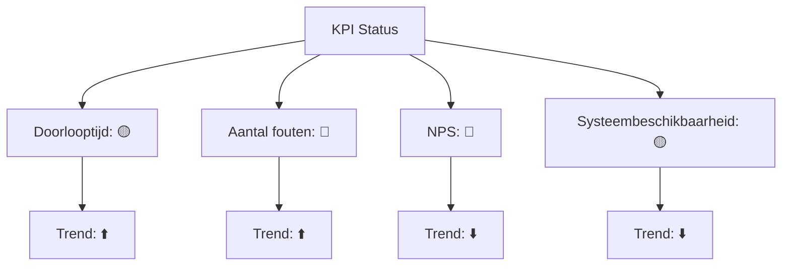
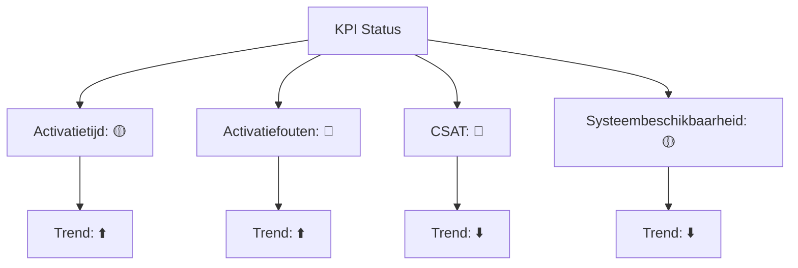

Dit Procesdashboard-template biedt een centrale, visuele weergave van de prestaties, trends, en verbeterpunten van {{procesnaam}}. Het doel is om:  
-  Real-time inzicht te bieden in de prestaties van het proces.  
-  Trends en patronen te identificeren voor proactieve sturing.  
-  Afwijkingen snel te signaleren en acties te ondernemen.  
-  Transparantie te creëren voor stakeholders (management, teams, klanten).  
-  Basis te leggen voor continue verbetering en datagestuurde besluitvorming.

#### Eigenschappen

| Veld              | Waarde                                                       | Toelichting                                                                                 |
| ----------------- | ------------------------------------------------------------ | ------------------------------------------------------------------------------------------- |
| PMD-nummer    | 03.08.02                                                     | Uniek identificatienummer voor dit procesdashboard in het Proces Management Document (PMD). |
| Versie        | 1                                                            | Huidige versie van dit document. Wordt geüpdaterd bij elke wijziging.                       |
| Status        | concept                                                      | Mogelijke statussen: *concept*, *in review*, *goedgekeurd*, *gepubliceerd*, *verouderd*.    |
| Auteur        | [Naam]                                                       | De persoon of afdeling die dit dashboard heeft opgesteld (meestal de procesanalist).        |
| Eigenaar      | [Naam proceseigenaar]                                        | Verantwoordelijk voor de inhoud en actualiteit van het dashboard.                           |
| Datum         | 17/04/2026                                                   | Datum van de laatste update.                                                                |
| Gekoppeld aan | [Bijv. "KPI's (PMD-03.08.01), Processturing (PMD-03.08.00)"] | Referentie naar gerelateerde documenten.                                                    |

## 1. Algemeen Overzicht

Geef hier een kort overzicht van het proces waarvoor het dashboard wordt opgesteld.

| Veld                   | Waarde                                                                             | Toelichting                    |
| -------------------------- | -------------------------------------------------------------------------------------- | ---------------------------------- |
| Procesnaam             | [Naam van het proces, bijv. "Orderverwerking"]                                         | Naam van het proces.               |
| Proces-ID              | [Bijv. "PR-001"]                                                                       | Unieke identifier.                 |
| Procescategorie        | [Primair / Ondersteunend / Sturend]                                                    | Categorisatie van het proces.      |
| Doel van het dashboard | [Bijv. "Real-time monitoring van orderverwerkingsprestaties voor proactieve sturing."] | Wat het dashboard moet bereiken.   |
| Doelgroep              | [Bijv. "Proceseigenaar, Order Team, Management"]                                       | Voor wie het dashboard bedoeld is. |

## 2. Dashboard Structuur

Een effectief procesdashboard bevat de volgende onderdelen:

1. KPI-overzicht: Huidige waarden, normen, en trends van KPI's.
2. Visuele weergave: Grafieken, diagrammen, en meters voor snelle interpretatie.
3. Analyse: Diepgaande analyse van trends, afwijkingen, en oorzaken.
4. Verbeteracties: Actiepunten voor het verbeteren van procesprestaties.
5. Alerts: Waarschuwingen voor kritische afwijkingen.

## 3. KPI Overzicht

Geef hier een overzicht van de KPI's die op het dashboard worden weergegeven. Gebruik kleuren om afwijkingen visueel te markeren (bijv. groen = norm bereikt, oranje = waarschuwing, rood = afwijking).

| KPI                      | Huidige waarde | Norm | Trend | Status | Verantwoordelijke | Bron          | Laatste meting |
| ---------------------------- | ------------------ | -------- | --------- | ---------- | --------------------- | ----------------- | ------------------ |
| Doorlooptijd orderverwerking | 90%                | < 24 uur | ⬆️        | 🟡         | Proceseigenaar        | ERP-systeem       | 17/04/2026         |
| Aantal fouten per order      | 0,8%               | < 1%     | ⬆️        | 🔴         | Kwaliteitsmanager     | Kwaliteitsrapport | 16/04/2026         |
| Klanttevredenheid (NPS)      | 8,2                | > 8      | ⬇️        | 🔴         | Sales Manager         | Klantenquête      | 15/04/2026         |
| Systeembeschikbaarheid       | 99,2%              | > 99%    | ⬇️        | 🟡         | IT-afdeling           | Nagios            | 17/04/2026         |

Legenda Status:

- 🟢 Groen: Norm bereikt of overschreden.
- 🟡 Oranje: Waarschuwing (dicht bij norm, maar niet bereikt).
- 🔴 Rood: Afwijking (norm niet bereikt).

## 4. Visuele Weergave (Optioneel)

Voeg hier visuele elementen toe om het dashboard inzichtelijker te maken. Gebruik Mermaid voor eenvoudige diagrammen in Markdown, of verwijz naar Power BI/Tableau-dashboards.

#### Voorbeeld 1: KPI Meter (Mermaid)

#### Voorbeeld 2: Trendgrafiek (Mermaid)

Tip voor Martin:  
Gebruik je Grafisch Vormgever/DTP-kwalificaties om het dashboard visueel aantrekkelijk te maken met:

- Kleuren voor statusindicatie.
- Grafieken (staafdiagrammen, lijndiagrammen, meters).
- Iconen voor snelle herkenning (bijv. 📈 voor stijgende trend, 📉 voor dalende trend).

## 5. Analyse

Voer hier een diepgaande analyse uit van de KPI-trends, afwijkingen, en oorzaken. Gebruik de 5 Why's-methode (uit Lean Six Sigma) om root causes te identificeren.

#### Trendanalyse

| KPI                      | Trend | Oorzaak              | Impact               | Root Cause            | Onderbouwing                                 |
| ---------------------------- | --------- | ------------------------ | ------------------------ | ------------------------- | ------------------------------------------------ |
| Doorlooptijd orderverwerking | ⬆️        | Handmatige validatiestap | Vertraging in levering   | Gebrek aan automatisering | Handmatige validatie duurt gemiddeld 2 uur.      |
| Aantal fouten per order      | ⬆️        | Onvoldoende training     | Onjuiste orderverwerking | Gebrek aan kennis         | Nieuwe medewerkers zijn niet voldoende getraind. |
| Klanttevredenheid (NPS)      | ⬇️        | Vertraagde levering      | Lagere klanttevredenheid | Hoge doorlooptijd         | Klanten klagen over late leveringen.             |
| Systeembeschikbaarheid       | ⬇️        | Systeemupdates           | Onderbreking van proces  | Planned downtime          | Maandelijkse updates veroorzaken 2 uur downtime. |

#### Correlatieanalyse

| KPI 1                    | KPI 2                    | Correlatie | Uitleg                                               |
| ---------------------------- | ---------------------------- | -------------- | -------------------------------------------------------- |
| Doorlooptijd orderverwerking | Klanttevredenheid (NPS)      | Negatief       | Langere doorlooptijd leidt tot lagere klanttevredenheid. |
| Aantal fouten per order      | Doorlooptijd orderverwerking | Positief       | Fouten leiden tot herwerk en vertraging.                 |

## 6. Verbeteracties

Definieer hier concrete acties om de procesprestaties te verbeteren. Gebruik de PDCA-cyclus (Plan-Do-Check-Act) voor structuur.

| Verbeterpunt             | KPI                      | Oorzaak               | Actie                                    | Verantwoordelijke | Deadline | Status    | Impact                    | Kosten | Prioriteit |
| ---------------------------- | ---------------------------- | ------------------------- | -------------------------------------------- | --------------------- | ------------ | ------------- | ----------------------------- | ---------- | -------------- |
| Automatiseren validatiestap  | Doorlooptijd orderverwerking | Handmatige validatie      | Implementeer automatische validatie in CRM.  | IT-afdeling           | 30/06/2026   | In uitvoering | ⬇️ Doorlooptijd met 50%       | €5.000     | Hoog           |
| Extra training Order Team    | Aantal fouten per order      | Onvoldoende training      | Organiseer training voor nieuwe medewerkers. | Kwaliteitsmanager     | 15/05/2026   | Gepland       | ⬇️ Fouten met 30%             | €2.000     | Hoog           |
| Optimaliseren systeemupdates | Systeembeschikbaarheid       | Planned downtime          | Verplaats updates naar buiten kantooruren.   | IT-afdeling           | 30/04/2026   | In uitvoering | ⬆️ Beschikbaarheid naar 99,5% | €0         | Middel         |
| Klantcommunicatie verbeteren | Klanttevredenheid (NPS)      | Onduidelijke communicatie | Implementeer automatische statusupdates.     | Sales Manager         | 30/05/2026   | Gepland       | ⬆️ NPS met 0,5 punt           | €1.000     | Hoog           |

Prioriteit:

- Hoog: Kritisch voor procesprestaties.
- Middel: Belangrijk, maar niet kritiek.
- Laag: Wenselijk, maar niet urgent.

## 7. Alerts en Waarschuwingen

Definieer hier automatische alerts voor kritische afwijkingen. Gebruik drempelwaarden en escalatiepaden.

| Alert                  | KPI                      | Drempelwaarde | Trigger                      | Actie                | Verantwoordelijke | Escalatie      | Kanaal        |
| -------------------------- | ---------------------------- | ----------------- | -------------------------------- | ------------------------ | --------------------- | ------------------ | ----------------- |
| Vertraagde orderverwerking | Doorlooptijd orderverwerking | > 24 uur          | Doorlooptijd overschrijdt norm   | Onderzoek oorzaak        | Proceseigenaar        | Teamleider Sales   | E-mail, SMS       |
| Hoog foutpercentage        | Aantal fouten per order      | > 1%              | Foutpercentage overschrijdt norm | Extra training           | Kwaliteitsmanager     | Proceseigenaar     | E-mail            |
| Lage klanttevredenheid     | Klanttevredenheid (NPS)      | < 8               | NPS daalt onder norm             | Klantfeedback analyseren | Sales Manager         | Directie           | E-mail, Dashboard |
| Systeemstoring             | Systeembeschikbaarheid       | < 99%             | Systeembeschikbaarheid daalt     | IT-onderhoud             | IT-afdeling           | Extern supportteam | SMS, E-mail       |

## 8. Stappen voor het Opstellen van een Procesdashboard

Volg deze stappen om een effectief procesdashboard te maken:

1. Definieer het doel:
  - Bepaal wat het dashboard moet bereiken (monitoring, analyse, sturing).
1. Selecteer KPI's:
  - Kies 5-10 kritische KPI's uit de KPI-template (PMD-03.08.01).
1. Bepaal de visuele weergave:
  - Kies grafieken, meters, of tabellen voor de weergave van KPI's.
  - Gebruik kleuren voor statusindicatie (groen/oranje/rood).
1. Voeg analyse toe:
  - Voer trendanalyse en correlatieanalyse uit.
  - Gebruik de 5 Why's-methode voor root cause analyse.
1. Definieer verbeteracties:
  - Stel PDCA-acties op voor het verbeteren van procesprestaties.
1. Richt alerts in:
  - Definieer drempelwaarden en escalatiepaden voor kritische afwijkingen.
1. Kies tools:
  - Selecteer tools voor het dashboard (Power BI, Tableau, Excel, etc.).
1. Valideer met stakeholders:
  - Laat het dashboard reviewen door proceseigenaren, management, en IT.
1. Houd het actueel:
  - Update het dashboard dagelijks/wekelijks met nieuwe data.

## 9. Tips voor een Effectief Procesdashboard

-  Houd het overzichtelijk: Beperk het dashboard tot 5-10 kritische KPI's.  
-  Gebruik visuele elementen: Voeg grafieken, meters, en iconen toe voor snelle interpretatie.  
-  Gebruik kleuren: Markeren van afwijkingen (groen/oranje/rood) voor snelle herkenning.  
-  Voeg context toe: Geef uitleg bij trends en afwijkingen.  
-  Automatiseer waar mogelijk: Gebruik tools (Power BI, Tableau) voor real-time data.  
-  Betrek stakeholders: Zorg dat het dashboard relevant is voor alle betrokkenen.  
-  Gebruik je Lean Six Sigma-kennis: Pas DMAIC en 5 Why's toe voor diepgaande analyse.  
-  Houd het actueel: Update het dashboard regelmatig met nieuwe data.

## 10. Tools voor het Maken van een Procesdashboard

Hier zijn tools die je kunt gebruiken voor het maken van een procesdashboard:

| Tool               | Type    | Voordelen                                               | Nadelen                                 | Link                                               | Geschikt voor              |
| ---------------------- | ----------- | ----------------------------------------------------------- | ------------------------------------------- | ------------------------------------------------------ | ------------------------------ |
| Power BI           | Dashboard   | Visuele weergave, real-time data, integratie met Excel/ERP. | Complexe opzet.                             | [powerbi.microsoft.com](https://powerbi.microsoft.com) | KPI-dashboards, trendanalyses. |
| Tableau            | Dashboard   | Gebruiksvriendelijk, krachtige visualisaties.               | Duur.                                       | [tableau.com](https://www.tableau.com)                 | KPI-dashboards, rapportages.   |
| Google Data Studio | Dashboard   | Gratis, integratie met Google tools.                        | Beperkte functionaliteit.                   | [datastudio.google.com](https://datastudio.google.com) | Eenvoudige KPI-dashboards.     |
| Excel              | Spreadsheet | Flexibel, eenvoudig in gebruik.                             | Handmatige invoer, beperkte automatisering. | -                                                      | Eenvoudige KPI-tracking.       |
| Grafana            | Monitoring  | Open-source, real-time monitoring, alerts.                  | Technisch, complex.                         | [grafana.com](https://grafana.com)                     | Systeemprestaties, IT-KPI's.   |
| Qlik Sense         | Dashboard   | Associatieve data-analyse, interactieve visualisaties.      | Duur.                                       | [qlik.com](https://www.qlik.com)                       | Complexe data-analyse.         |

## 11. Stakeholders en Verantwoordelijkheden

Geef hier een overzicht van wie betrokken is bij het dashboard.

| Rol               | Verantwoordelijkheid                                              | Betrokkenheid | Toegang            |
| --------------------- | --------------------------------------------------------------------- | ----------------- | ---------------------- |
| Proceseigenaar    | Verantwoordelijk voor de inhoud en actualiteit van het dashboard. | Continu           | Volledig               |
| Procesanalist     | Stelt het dashboard op en voert analyses uit.                     | Ad hoc            | Volledig               |
| Kwaliteitsmanager | Monitort KPI's en voert verbeteracties uit.                       | Periodiek         | KPI-overzicht, Analyse |
| IT-afdeling       | Ondersteunt bij automatisering en tooling.                        | Ad hoc            | Technische gegevens    |
| Management        | Gebruikt het dashboard voor strategische besluitvorming.          | Periodiek         | Samenvatting, Trends   |
| Uitvoerend team   | Levert data voor het dashboard.                                   | Dagelijks         | Eigen KPI's            |

## 12. Gerelateerde Documenten

Lijst hier alle gerelateerde documenten, zoals:

- [Link naar KPI's (PMD-03.08.01)]
- [Link naar Processturing (PMD-03.08.00)]
- [Link naar Procesbeschrijving (PMD-03.07.01)]
- [Link naar RACI Matrix (PMD-03.07.03)]

## 13. Versiehistorie

| Versie | Datum  | Wijziging   | Auteur | Goedgekeurd door |
| ---------- | ---------- | --------------- | ---------- | -------------------- |
| 1.0        | 17/04/2026 | Initiële versie | [Naam]     | [Naam]               |

## 14. Instructies voor Gebruik

1. Definieer het doel:
  - Bepaal wat het dashboard moet bereiken.
1. Selecteer KPI's:
  - Kies 5-10 kritische KPI's uit de KPI-template.
1. Bepaal de visuele weergave:
  - Kies grafieken, meters, of tabellen voor de weergave.
1. Voeg analyse toe:
  - Voer trendanalyse en correlatieanalyse uit.
1. Definieer verbeteracties:
  - Stel PDCA-acties op voor het verbeteren van procesprestaties.
1. Richt alerts in:
  - Definieer drempelwaarden en escalatiepaden.
1. Kies tools:
  - Selecteer tools voor het dashboard (Power BI, Tableau, etc.).
1. Valideer met stakeholders:
  - Laat het dashboard reviewen door alle betrokken partijen.
1. Houd het actueel:
  - Update het dashboard regelmatig met nieuwe data.

## 15. Voorbeeld: Ingevuld Procesdashboard (Orderverwerking)

#### Algemeen Overzicht

| Veld                   | Waarde                                                                   | Toelichting                    |
| -------------------------- | ---------------------------------------------------------------------------- | ---------------------------------- |
| Procesnaam             | Orderverwerking                                                              | Naam van het proces.               |
| Proces-ID              | PR-001                                                                       | Unieke identifier.                 |
| Procescategorie        | Primair                                                                      | Kernproces.                        |
| Doel van het dashboard | Real-time monitoring van orderverwerkingsprestaties voor proactieve sturing. | Wat het dashboard moet bereiken.   |
| Doelgroep              | Proceseigenaar, Order Team, Management                                       | Voor wie het dashboard bedoeld is. |

#### KPI Overzicht

| KPI                      | Huidige waarde | Norm | Trend | Status | Verantwoordelijke | Bron          | Laatste meting |
| ---------------------------- | ------------------ | -------- | --------- | ---------- | --------------------- | ----------------- | ------------------ |
| Doorlooptijd orderverwerking | 90%                | < 24 uur | ⬆️        | 🟡         | Proceseigenaar        | ERP-systeem       | 17/04/2026         |
| Aantal fouten per order      | 0,8%               | < 1%     | ⬆️        | 🔴         | Kwaliteitsmanager     | Kwaliteitsrapport | 16/04/2026         |
| Klanttevredenheid (NPS)      | 8,2                | > 8      | ⬇️        | 🔴         | Sales Manager         | Klantenquête      | 15/04/2026         |
| Systeembeschikbaarheid       | 99,2%              | > 99%    | ⬇️        | 🟡         | IT-afdeling           | Nagios            | 17/04/2026         |

#### Visuele Weergave (Mermaid)

#### Analyse

Trendanalyse:

| KPI                      | Trend | Oorzaak              | Impact               | Root Cause            | Onderbouwing                                 |
| ---------------------------- | --------- | ------------------------ | ------------------------ | ------------------------- | ------------------------------------------------ |
| Doorlooptijd orderverwerking | ⬆️        | Handmatige validatiestap | Vertraging in levering   | Gebrek aan automatisering | Handmatige validatie duurt gemiddeld 2 uur.      |
| Aantal fouten per order      | ⬆️        | Onvoldoende training     | Onjuiste orderverwerking | Gebrek aan kennis         | Nieuwe medewerkers zijn niet voldoende getraind. |

Correlatieanalyse:

| KPI 1                    | KPI 2               | Correlatie | Uitleg                                               |
| ---------------------------- | ----------------------- | -------------- | -------------------------------------------------------- |
| Doorlooptijd orderverwerking | Klanttevredenheid (NPS) | Negatief       | Langere doorlooptijd leidt tot lagere klanttevredenheid. |

#### Verbeteracties

| Verbeterpunt            | KPI                      | Oorzaak          | Actie                                    | Verantwoordelijke | Deadline | Status    | Impact              | Kosten | Prioriteit |
| --------------------------- | ---------------------------- | -------------------- | -------------------------------------------- | --------------------- | ------------ | ------------- | ----------------------- | ---------- | -------------- |
| Automatiseren validatiestap | Doorlooptijd orderverwerking | Handmatige validatie | Implementeer automatische validatie in CRM.  | IT-afdeling           | 30/06/2026   | In uitvoering | ⬇️ Doorlooptijd met 50% | €5.000     | Hoog           |
| Extra training Order Team   | Aantal fouten per order      | Onvoldoende training | Organiseer training voor nieuwe medewerkers. | Kwaliteitsmanager     | 15/05/2026   | Gepland       | ⬇️ Fouten met 30%       | €2.000     | Hoog           |

#### Alerts en Waarschuwingen

| Alert                  | KPI                      | Drempelwaarde | Trigger                      | Actie         | Verantwoordelijke | Escalatie    | Kanaal |
| -------------------------- | ---------------------------- | ----------------- | -------------------------------- | ----------------- | --------------------- | ---------------- | ---------- |
| Vertraagde orderverwerking | Doorlooptijd orderverwerking | > 24 uur          | Doorlooptijd overschrijdt norm   | Onderzoek oorzaak | Proceseigenaar        | Teamleider Sales | E-mail     |
| Hoog foutpercentage        | Aantal fouten per order      | > 1%              | Foutpercentage overschrijdt norm | Extra training    | Kwaliteitsmanager     | Proceseigenaar   | E-mail     |

## 16. Voorbeeld: Procesdashboard voor SIM-activatie (Telecom)

Gebaseerd op je ervaring in de telecomsector, hier een praktisch voorbeeld voor een SIM-activatieproces.

#### Algemeen Overzicht

| Veld                   | Waarde                                                                | Toelichting                    |
| -------------------------- | ------------------------------------------------------------------------- | ---------------------------------- |
| Procesnaam             | SIM-activatie                                                             | Naam van het proces.               |
| Proces-ID              | PR-002                                                                    | Unieke identifier.                 |
| Procescategorie        | Ondersteunend                                                             | Ondersteunt klantprocessen.        |
| Doel van het dashboard | Real-time monitoring van SIM-activatieprestaties voor proactieve sturing. | Wat het dashboard moet bereiken.   |
| Doelgroep              | Proceseigenaar, Technisch Team, Klantenservice                            | Voor wie het dashboard bedoeld is. |

#### KPI Overzicht

| KPI                  | Huidige waarde | Norm | Trend | Status | Verantwoordelijke | Bron             | Laatste meting |
| ------------------------ | ------------------ | -------- | --------- | ---------- | --------------------- | -------------------- | ------------------ |
| Activatietijd            | 85%                | < 1 uur  | ⬆️        | 🟡         | Proceseigenaar        | Provisioning-systeem | 17/04/2026         |
| Activatiefouten          | 0,7%               | < 0,5%   | ⬆️        | 🔴         | Technisch Team        | Provisioning-systeem | 16/04/2026         |
| Klanttevredenheid (CSAT) | 88%                | > 90%    | ⬇️        | 🔴         | Klantenservice        | Klantenquête         | 15/04/2026         |
| Systeembeschikbaarheid   | 99,3%              | > 99,5%  | ⬇️        | 🟡         | IT-afdeling           | Nagios               | 17/04/2026         |

#### Visuele Weergave (Mermaid)

#### Analyse

Trendanalyse:

| KPI         | Trend | Oorzaak                           | Impact           | Root Cause            | Onderbouwing                               |
| --------------- | --------- | ------------------------------------- | -------------------- | ------------------------- | ---------------------------------------------- |
| Activatietijd   | ⬆️        | Handmatige stappen in activatieproces | Vertraagde activatie | Gebrek aan automatisering | Handmatige stappen duren gemiddeld 30 minuten. |
| Activatiefouten | ⬆️        | Onjuiste invoer door medewerkers      | Onjuiste activatie   | Gebrek aan validatie      | Geen automatische controle op invoergegevens.  |

Correlatieanalyse:

| KPI 1     | KPI 2                | Correlatie | Uitleg                                                |
| ------------- | ------------------------ | -------------- | --------------------------------------------------------- |
| Activatietijd | Klanttevredenheid (CSAT) | Negatief       | Langere activatietijd leidt tot lagere klanttevredenheid. |

#### Verbeteracties

| Verbeterpunt              | KPI         | Oorzaak        | Actie                                                    | Verantwoordelijke | Deadline | Status    | Impact               | Kosten | Prioriteit |
| ----------------------------- | --------------- | ------------------ | ------------------------------------------------------------ | --------------------- | ------------ | ------------- | ------------------------ | ---------- | -------------- |
| Automatiseren activatieproces | Activatietijd   | Handmatige stappen | Implementeer automatische activatie in provisioning-systeem. | IT-afdeling           | 30/06/2026   | In uitvoering | ⬇️ Activatietijd met 40% | €7.500     | Hoog           |
| Voeg validatie toe            | Activatiefouten | Onjuiste invoer    | Implementeer automatische validatie van invoergegevens.      | Technisch Team        | 15/05/2026   | Gepland       | ⬇️ Fouten met 50%        | €3.000     | Hoog           |

#### Alerts en Waarschuwingen

| Alert            | KPI         | Drempelwaarde | Trigger                      | Actie         | Verantwoordelijke | Escalatie  | Kanaal |
| -------------------- | --------------- | ----------------- | -------------------------------- | ----------------- | --------------------- | -------------- | ---------- |
| Vertraagde activatie | Activatietijd   | > 1 uur           | Activatietijd overschrijdt norm  | Onderzoek oorzaak | Proceseigenaar        | Technisch Team | E-mail     |
| Hoog foutpercentage  | Activatiefouten | > 0,5%            | Foutpercentage overschrijdt norm | Extra training    | Technisch Team        | Proceseigenaar | E-mail     |