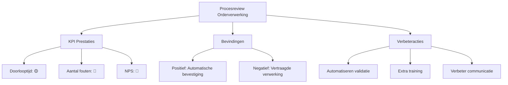

#### Inleiding

Dit Procesreview-template biedt een gestructureerde aanpak voor het evalueren en verbeteren van {{procesnaam}}. Het doel is om:  
- Prestaties van het proces objectief te beoordelen op basis van KPI's en bevindingen.  
- Knippunten en kansen voor verbetering te identificeren.  
- Actieplannen op te stellen voor continue verbetering.  
- Verantwoordelijkheid en follow-up te waarborgen voor het implementeren van verbeteringen.  
- Transparantie te creëren voor stakeholders (management, teams, klanten).

#### Eigenschappen

| Veld              | Waarde                                                                                            | Toelichting                                                                               |
| ----------------- | ------------------------------------------------------------------------------------------------- | ----------------------------------------------------------------------------------------- |
| PMD-nummer    | 03.08.03                                                                                          | Uniek identificatienummer voor deze procesreview in het Proces Management Document (PMD). |
| Versie        | 1                                                                                                 | Huidige versie van dit document. Wordt geüpdaterd bij elke wijziging.                     |
| Status        | concept                                                                                           | Mogelijke statussen: *concept*, *in review*, *goedgekeurd*, *gepubliceerd*, *verouderd*.  |
| Auteur        | [Naam]                                                                                            | De persoon of afdeling die deze review heeft opgesteld (meestal de procesanalist).        |
| Eigenaar      | [Naam proceseigenaar]                                                                             | Verantwoordelijk voor de inhoud en actualiteit van de procesreview.                       |
| Datum         | 17/04/2026                                                                                        | Datum van de laatste update.                                                              |
| Gekoppeld aan | [Bijv. "Procesbeschrijving (PMD-03.07.01), KPI's (PMD-03.08.01), Procesdashboard (PMD-03.08.02)"] | Referentie naar gerelateerde documenten.                                                  |

## 1. Algemeen Overzicht

Geef hier een kort overzicht van de procesreview.

| Veld               | Waarde                                                                    | Toelichting                          |
| ---------------------- | ----------------------------------------------------------------------------- | ---------------------------------------- |
| Procesnaam         | [Naam van het proces, bijv. "Orderverwerking"]                                | Naam van het proces dat wordt gereviewd. |
| Proces-ID          | [Bijv. "PR-001"]                                                              | Unieke identifier.                       |
| Datum review       | [Bijv. "17/04/2026"]                                                          | Datum waarop de review is uitgevoerd.    |
| Type review        | [Bijv. "Maandelijkse review", "Jaarlijkse audit", "Ad-hoc review"]            | Type review.                             |
| Doel van de review | [Bijv. "Evaluatie van procesprestaties en identificatie van verbeterpunten."] | Wat de review moet bereiken.             |
| Scope              | [Bijv. "Hele proces van ontvangst tot bevestiging van orders."]               | Wat valt binnen de scope van de review.  |

## 2. Voorbereiding

Beschrijf hier wat nodig is om de review voor te bereiden.

| Veld                 | Waarde                                                                                    |
| ------------------------ | --------------------------------------------------------------------------------------------- |
| Benodigde documenten | [Lijst van documenten, bijv. "Procesbeschrijving, KPI-rapport, Procesdashboard, RACI-matrix"] |
| Benodigde data       | [Lijst van data, bijv. "KPI-waarden, proceslogs, klantfeedback"]                              |
| Betrokken partijen   | [Lijst van rollen, bijv. "Proceseigenaar, Procesanalist, Kwaliteitsmanager, IT-afdeling"]     |
| Agenda               | [Lijst van onderwerpen, bijv. "KPI-prestaties, bevindingen, verbeteracties"]                  |

## 3. KPI Prestaties

Evalueer hier de prestaties van het proces op basis van KPI's. Gebruik de KPI-template (PMD-03.08.01) als uitgangspunt.

| KPI                      | Huidige waarde | Norm | Trend | Status | Afwijking | Oorzaak              | Impact               |
| ---------------------------- | ------------------ | -------- | --------- | ---------- | ------------- | ------------------------ | ------------------------ |
| Doorlooptijd orderverwerking | 90%                | < 24 uur | ⬆️        | 🟡         | +10%          | Handmatige validatiestap | Vertraging in levering   |
| Aantal fouten per order      | 0,8%               | < 1%     | ⬆️        | 🔴         | +0,3%         | Onvoldoende training     | Onjuiste orderverwerking |
| Klanttevredenheid (NPS)      | 8,2                | > 8      | ⬇️        | 🔴         | -0,3          | Vertraagde levering      | Lagere klanttevredenheid |
| Systeembeschikbaarheid       | 99,2%              | > 99%    | ⬇️        | 🟡         | -0,3%         | Systeemupdates           | Onderbreking van proces  |

Legenda Status:

- 🟢 Groen: Norm bereikt of overschreden.
- 🟡 Oranje: Waarschuwing (dicht bij norm, maar niet bereikt).
- 🔴 Rood: Afwijking (norm niet bereikt).

## 4. Bevindingen

Documenteer hier de belangrijkste bevindingen uit de review. Gebruik de 5 Why's-methode (uit Lean Six Sigma) om root causes te identificeren.

#### Positieve Bevindingen

| Bevinding                           | Beschrijving                                 | Oorzaak                     | Impact                       |
| --------------------------------------- | ------------------------------------------------ | ------------------------------- | -------------------------------- |
| [Bijv. "Automatische orderbevestiging"] | Orderbevestigingen worden automatisch verstuurd. | Geïmplementeerd in CRM-systeem  | Vermindering van handmatig werk. |
| [Bijv. "Hoge systeembeschikbaarheid"]   | ERP-systeem is 99,2% beschikbaar.                | Goed onderhoud door IT-afdeling | Betrouwbare procesuitvoering.    |

#### Negatieve Bevindingen (Verbeterpunten)

| Bevinding              | Beschrijving                               | Oorzaak (5 Why's)                                                                                                                                          | Impact               | Prioriteit |
| -------------------------- | ---------------------------------------------- | -------------------------------------------------------------------------------------------------------------------------------------------------------------- | ------------------------ | -------------- |
| Vertraagde orderverwerking | Doorlooptijd is toegenomen met 10%.            | 1. Handmatige validatie duurt te lang. 2. Geen automatisering. 3. Beperkte IT-capaciteit. 4. Geen budget voor automatisering. 5. Geen business case opgesteld. | Vertraging in levering   | Hoog           |
| Hoog foutpercentage        | Aantal fouten per order is gestegen naar 0,8%. | 1. Onvoldoende training. 2. Nieuwe medewerkers. 3. Geen gestandaardiseerde werkwijze. 4. Geen checklists. 5. Geen kwaliteitscontroles.                         | Onjuiste orderverwerking | Hoog           |
| Lage klanttevredenheid     | NPS is gedaald naar 8,2.                       | 1. Vertraagde levering. 2. Onjuiste orders. 3. Gebrek aan communicatie. 4. Geen proactieve updates. 5. Geen klantfeedbackmechanisme.                           | Lagere klanttevredenheid | Hoog           |

Prioriteit:

- Hoog: Kritisch voor procesprestaties, directe actie vereist.
- Middel: Belangrijk, maar niet kritiek.
- Laag: Wenselijk, maar niet urgent.

## 5. Verbeteracties

Stel hier concrete verbeteracties op op basis van de bevindingen. Gebruik de PDCA-cyclus (Plan-Do-Check-Act) voor structuur.

| Verbeterpunt             | KPI                      | Bevinding               | Actie                                    | Verantwoordelijke | Deadline | Status    | Impact                    | Kosten | Prioriteit | Succescriteria           |
| ---------------------------- | ---------------------------- | --------------------------- | -------------------------------------------- | --------------------- | ------------ | ------------- | ----------------------------- | ---------- | -------------- | ---------------------------- |
| Automatiseren validatiestap  | Doorlooptijd orderverwerking | Vertraagde orderverwerking  | Implementeer automatische validatie in CRM.  | IT-afdeling           | 30/06/2026   | In uitvoering | ⬇️ Doorlooptijd met 50%       | €5.000     | Hoog           | Doorlooptijd < 24 uur        |
| Extra training Order Team    | Aantal fouten per order      | Hoog foutpercentage         | Organiseer training voor nieuwe medewerkers. | Kwaliteitsmanager     | 15/05/2026   | Gepland       | ⬇️ Fouten met 30%             | €2.000     | Hoog           | Foutpercentage < 1%          |
| Verbeter klantcommunicatie   | Klanttevredenheid (NPS)      | Lage klanttevredenheid      | Implementeer automatische statusupdates.     | Sales Manager         | 30/05/2026   | Gepland       | ⬆️ NPS met 0,5 punt           | €1.000     | Hoog           | NPS > 8                      |
| Optimaliseren systeemupdates | Systeembeschikbaarheid       | Lage systeembeschikbaarheid | Verplaats updates naar buiten kantooruren.   | IT-afdeling           | 30/04/2026   | In uitvoering | ⬆️ Beschikbaarheid naar 99,5% | €0         | Middel         | Systeembeschikbaarheid > 99% |

## 6. Actieplan

Gebruik dit actieplan om de verbeteracties te structureren en te volgen.

| Actie                    | Verantwoordelijke | Startdatum | Deadline | Status    | Afhankelijkheden     | Risico's                     | Mitigerende maatregelen |
| ---------------------------- | --------------------- | -------------- | ------------ | ------------- | ------------------------ | -------------------------------- | --------------------------- |
| Automatiseren validatiestap  | IT-afdeling           | 01/05/2026     | 30/06/2026   | In uitvoering | Budgetgoedkeuring        | Vertraging door andere projecten | Prioriteit verhogen         |
| Extra training Order Team    | Kwaliteitsmanager     | 01/05/2026     | 15/05/2026   | Gepland       | Beschikbaarheid trainers | Lage opkomst                     | Verplichte training         |
| Verbeter klantcommunicatie   | Sales Manager         | 01/05/2026     | 30/05/2026   | Gepland       | IT-ondersteuning         | Technische beperkingen           | Pilot testen                |
| Optimaliseren systeemupdates | IT-afdeling           | 17/04/2026     | 30/04/2026   | In uitvoering | -                        | Systeemstoring                   | Back-up procedure           |

## 7. Follow-up

Beschrijf hier hoe de follow-up van de verbeteracties wordt gegarandeerd.

| Veld                        | Waarde                                                                                          |
| ------------------------------- | --------------------------------------------------------------------------------------------------- |
| Follow-up frequentie        | [Bijv. "Wekelijks"]                                                                                 |
| Verantwoordelijke follow-up | [Bijv. "Proceseigenaar"]                                                                            |
| Rapportage                  | [Bijv. "Wekelijkse statusupdate via e-mail"]                                                        |
| Escalatiepad                | [Bijv. "Proceseigenaar → Teamleider → Directie"]                                                    |
| Afsluiting                  | [Bijv. "Review wordt afgerond wanneer alle acties zijn geïmplementeerd en KPI's de norm bereiken."] |

## 8. Stappen voor het Uitvoeren van een Procesreview

Volg deze stappen om een effectieve procesreview uit te voeren:

1. Voorbereiding:
  - Verzamel benodigde documenten en data.
  - Nodig betrokken partijen uit.
  - Stel een agenda op.
1. KPI-prestaties evalueren:
  - Analyseer de huidige waarden, normen, en trends van KPI's.
  - Identificeer afwijkingen en oorzaken.
1. Bevindingen documenteren:
  - Noteer positieve en negatieve bevindingen.
  - Gebruik de 5 Why's-methode voor root cause analyse.
1. Verbeteracties definieren:
  - Stel PDCA-acties op voor het verbeteren van procesprestaties.
  - Wijs verantwoordelijken en deadlines toe.
1. Actieplan opstellen:
  - Structureer de verbeteracties in een actieplan.
  - Definieer afhankelijkheden, risico's, en mitigerende maatregelen.
1. Follow-up regelen:
  - Bepaal hoe en wanneer de follow-up plaatsvindt.
  - Zorg voor escalatiepaden bij vertragingen.
1. Rapportage:
  - Documenteer de resultaten van de review.
  - Deel de bevindingen en acties met stakeholders.
1. Valideer met stakeholders:
  - Laat de review goedkeuren door management en betrokken teams.

## 9. Tips voor een Effectieve Procesreview

- Wees objectief: Baseer bevindingen op feiten en data, niet op aannames.  
- Gebruik de 5 Why's-methode: Identificeer root causes van problemen.  
- Focus op verbetering: Stel actiegerichte verbeterpunten op.  
- Betrek stakeholders: Zorg dat alle betrokkenen meedenken over verbeteracties.  
- Gebruik visuele hulpmiddelen: Voeg grafieken, diagrammen, of dashboards toe voor extra duidelijkheid.  
- Houd het actueel: Update de review regelmatig (bijv. maandelijks, kwartaallijks).  
- Gebruik je Lean Six Sigma-kennis: Pas DMAIC (Define, Measure, Analyze, Improve, Control) toe voor gestructureerde verbetering.  
- Koppel aan strategie: Zorg dat verbeteracties alignen met organisatiedoelen.

## 10. Visuele Weergave (Optioneel)

Voeg hier een visuele weergave toe van de procesreview, bijv. een overzicht van bevindingen en acties. Gebruik Mermaid voor een eenvoudige weergave in Markdown.

Voorbeeld (Mermaid Procesreview Overzicht):

## 11. Stakeholders en Verantwoordelijkheden

Geef hier een overzicht van wie betrokken is bij de procesreview.

| Rol               | Verantwoordelijkheid                                            | Betrokkenheid |
| --------------------- | ------------------------------------------------------------------- | ----------------- |
| Proceseigenaar    | Verantwoordelijk voor de uitvoering en follow-up van de review. | Continu           |
| Procesanalist     | Voert de review uit en documenteert bevindingen.                | Ad hoc            |
| Kwaliteitsmanager | Evalueert KPI-prestaties en stelt verbeteracties voor.          | Periodiek         |
| IT-afdeling       | Levert technische data en ondersteunt bij verbeteracties.       | Ad hoc            |
| Management        | Valideert de review en goedgekeurt verbeteracties.              | Periodiek         |
| Uitvoerend team   | Levert input voor de review en voert verbeteracties uit.        | Ad hoc            |

## 12. Gerelateerde Documenten

Lijst hier alle gerelateerde documenten, zoals:

- [Link naar Procesbeschrijving (PMD-03.07.01)]
- [Link naar KPI's (PMD-03.08.01)]
- [Link naar Procesdashboard (PMD-03.08.02)]
- [Link naar RACI Matrix (PMD-03.07.03)]
- [Link naar Werkinstructie (PMD-03.07.02)]

## 13. Versiehistorie

| Versie | Datum  | Wijziging   | Auteur | Goedgekeurd door |
| ---------- | ---------- | --------------- | ---------- | -------------------- |
| 1.0        | 17/04/2026 | Initiële versie | [Naam]     | [Naam]               |

## 14. Instructies voor Gebruik

1. Voorbereiding:
  - Verzamel benodigde documenten en data.
  - Nodig betrokken partijen uit.
1. KPI-prestaties evalueren:
  - Analyseer de KPI's en identificeer afwijkingen.
1. Bevindingen documenteren:
  - Noteer positieve en negatieve bevindingen.
  - Gebruik de 5 Why's-methode voor root cause analyse.
1. Verbeteracties definieren:
  - Stel PDCA-acties op voor verbetering.
1. Actieplan opstellen:
  - Structureer de verbeteracties in een actieplan.
1. Follow-up regelen:
  - Bepaal hoe en wanneer de follow-up plaatsvindt.
1. Rapportage:
  - Documenteer de resultaten en deel deze met stakeholders.
1. Valideer met stakeholders:
  - Laat de review goedkeuren door management en betrokken teams.

## 15. Voorbeeld: Ingevulde Procesreview (Orderverwerking)

#### Algemeen Overzicht

| Veld               | Waarde                                                          | Toelichting              |
| ---------------------- | ------------------------------------------------------------------- | ---------------------------- |
| Procesnaam         | Orderverwerking                                                     | Naam van het proces.         |
| Proces-ID          | PR-001                                                              | Unieke identifier.           |
| Datum review       | 17/04/2026                                                          | Datum van de review.         |
| Type review        | Maandelijkse review                                                 | Type review.                 |
| Doel van de review | Evaluatie van procesprestaties en identificatie van verbeterpunten. | Wat de review moet bereiken. |
| Scope              | Hele proces van ontvangst tot bevestiging van orders.               | Wat valt binnen de scope.    |

#### Voorbereiding

| Veld                 | Waarde                                                    |
| ------------------------ | ------------------------------------------------------------- |
| Benodigde documenten | Procesbeschrijving, KPI-rapport, Procesdashboard, RACI-matrix |
| Benodigde data       | KPI-waarden, proceslogs, klantfeedback                        |
| Betrokken partijen   | Proceseigenaar, Procesanalist, Kwaliteitsmanager, IT-afdeling |
| Agenda               | KPI-prestaties, bevindingen, verbeteracties, actieplan        |

#### KPI Prestaties

| KPI                      | Huidige waarde | Norm | Trend | Status | Afwijking | Oorzaak              | Impact               |
| ---------------------------- | ------------------ | -------- | --------- | ---------- | ------------- | ------------------------ | ------------------------ |
| Doorlooptijd orderverwerking | 90%                | < 24 uur | ⬆️        | 🟡         | +10%          | Handmatige validatiestap | Vertraging in levering   |
| Aantal fouten per order      | 0,8%               | < 1%     | ⬆️        | 🔴         | +0,3%         | Onvoldoende training     | Onjuiste orderverwerking |
| Klanttevredenheid (NPS)      | 8,2                | > 8      | ⬇️        | 🔴         | -0,3          | Vertraagde levering      | Lagere klanttevredenheid |

#### Bevindingen

Positieve Bevindingen:

| Bevinding                 | Beschrijving                                 | Oorzaak                    | Impact                       |
| ----------------------------- | ------------------------------------------------ | ------------------------------ | -------------------------------- |
| Automatische orderbevestiging | Orderbevestigingen worden automatisch verstuurd. | Geïmplementeerd in CRM-systeem | Vermindering van handmatig werk. |

Negatieve Bevindingen:

| Bevinding              | Beschrijving                    | Oorzaak (5 Why's)                                                                                                                                          | Impact             | Prioriteit |
| -------------------------- | ----------------------------------- | -------------------------------------------------------------------------------------------------------------------------------------------------------------- | ---------------------- | -------------- |
| Vertraagde orderverwerking | Doorlooptijd is toegenomen met 10%. | 1. Handmatige validatie duurt te lang. 2. Geen automatisering. 3. Beperkte IT-capaciteit. 4. Geen budget voor automatisering. 5. Geen business case opgesteld. | Vertraging in levering | Hoog           |

#### Verbeteracties

| Verbeterpunt            | KPI                      | Bevinding              | Actie                                    | Verantwoordelijke | Deadline | Status    | Impact              | Kosten | Prioriteit | Succescriteria    |
| --------------------------- | ---------------------------- | -------------------------- | -------------------------------------------- | --------------------- | ------------ | ------------- | ----------------------- | ---------- | -------------- | --------------------- |
| Automatiseren validatiestap | Doorlooptijd orderverwerking | Vertraagde orderverwerking | Implementeer automatische validatie in CRM.  | IT-afdeling           | 30/06/2026   | In uitvoering | ⬇️ Doorlooptijd met 50% | €5.000     | Hoog           | Doorlooptijd < 24 uur |
| Extra training Order Team   | Aantal fouten per order      | Hoog foutpercentage        | Organiseer training voor nieuwe medewerkers. | Kwaliteitsmanager     | 15/05/2026   | Gepland       | ⬇️ Fouten met 30%       | €2.000     | Hoog           | Foutpercentage < 1%   |

#### Actieplan

| Actie                   | Verantwoordelijke | Startdatum | Deadline | Status    | Afhankelijkheden     | Risico's                     | Mitigerende maatregelen |
| --------------------------- | --------------------- | -------------- | ------------ | ------------- | ------------------------ | -------------------------------- | --------------------------- |
| Automatiseren validatiestap | IT-afdeling           | 01/05/2026     | 30/06/2026   | In uitvoering | Budgetgoedkeuring        | Vertraging door andere projecten | Prioriteit verhogen         |
| Extra training Order Team   | Kwaliteitsmanager     | 01/05/2026     | 15/05/2026   | Gepland       | Beschikbaarheid trainers | Lage opkomst                     | Verplichte training         |

#### Follow-up

| Veld                        | Waarde                             |
| ------------------------------- | -------------------------------------- |
| Follow-up frequentie        | Wekelijks                              |
| Verantwoordelijke follow-up | Proceseigenaar                         |
| Rapportage                  | Wekelijkse statusupdate via e-mail     |
| Escalatiepad                | Proceseigenaar → Teamleider → Directie |

## 16. Voorbeeld: Procesreview voor SIM-activatie (Telecom)

Gebaseerd op je ervaring in de telecomsector, hier een praktisch voorbeeld voor een SIM-activatieproces.

#### Algemeen Overzicht

| Veld               | Waarde                                                                 | Toelichting              |
| ---------------------- | -------------------------------------------------------------------------- | ---------------------------- |
| Procesnaam         | SIM-activatie                                                              | Naam van het proces.         |
| Proces-ID          | PR-002                                                                     | Unieke identifier.           |
| Datum review       | 17/04/2026                                                                 | Datum van de review.         |
| Type review        | Kwartaals review                                                           | Type review.                 |
| Doel van de review | Evaluatie van SIM-activatieprestaties en identificatie van verbeterpunten. | Wat de review moet bereiken. |
| Scope              | Hele proces van aanvraag tot activatie van SIM-kaarten.                    | Wat valt binnen de scope.    |

#### Voorbereiding

| Veld                 | Waarde                                                                |
| ------------------------ | ------------------------------------------------------------------------- |
| Benodigde documenten | Procesbeschrijving, KPI-rapport, Procesdashboard, Technische documentatie |
| Benodigde data       | KPI-waarden, activatielogs, klantfeedback                                 |
| Betrokken partijen   | Proceseigenaar, Technisch Team, Klantenservice, IT-afdeling               |
| Agenda               | KPI-prestaties, bevindingen, verbeteracties, actieplan                    |

#### KPI Prestaties

| KPI                  | Huidige waarde | Norm | Trend | Status | Afwijking | Oorzaak                           | Impact               |
| ------------------------ | ------------------ | -------- | --------- | ---------- | ------------- | ------------------------------------- | ------------------------ |
| Activatietijd            | 85%                | < 1 uur  | ⬆️        | 🟡         | +15%          | Handmatige stappen in activatieproces | Vertraagde activatie     |
| Activatiefouten          | 0,7%               | < 0,5%   | ⬆️        | 🔴         | +0,2%         | Onjuiste invoer door medewerkers      | Onjuiste activatie       |
| Klanttevredenheid (CSAT) | 88%                | > 90%    | ⬇️        | 🔴         | -2%           | Vertraagde activatie                  | Lagere klanttevredenheid |

#### Bevindingen

Positieve Bevindingen:

| Bevinding             | Beschrijving                                             | Oorzaak                             | Impact                |
| ------------------------- | ------------------------------------------------------------ | --------------------------------------- | ------------------------- |
| Automatische notificaties | Klanten ontvangen automatische updates over activatiestatus. | Geïmplementeerd in provisioning-systeem | Betere klantcommunicatie. |

Negatieve Bevindingen:

| Bevinding        | Beschrijving                     | Oorzaak (5 Why's)                                                                                                                                             | Impact           | Prioriteit |
| -------------------- | ------------------------------------ | ----------------------------------------------------------------------------------------------------------------------------------------------------------------- | -------------------- | -------------- |
| Vertraagde activatie | Activatietijd is toegenomen met 15%. | 1. Handmatige stappen in activatieproces. 2. Geen automatisering. 3. Beperkte IT-capaciteit. 4. Geen budget voor automatisering. 5. Geen business case opgesteld. | Vertraagde activatie | Hoog           |

#### Verbeteracties

| Verbeterpunt              | KPI         | Bevinding        | Actie                                                    | Verantwoordelijke | Deadline | Status    | Impact               | Kosten | Prioriteit | Succescriteria    |
| ----------------------------- | --------------- | -------------------- | ------------------------------------------------------------ | --------------------- | ------------ | ------------- | ------------------------ | ---------- | -------------- | --------------------- |
| Automatiseren activatieproces | Activatietijd   | Vertraagde activatie | Implementeer automatische activatie in provisioning-systeem. | IT-afdeling           | 30/06/2026   | In uitvoering | ⬇️ Activatietijd met 40% | €7.500     | Hoog           | Activatietijd < 1 uur |
| Voeg validatie toe            | Activatiefouten | Hoog foutpercentage  | Implementeer automatische validatie van invoergegevens.      | Technisch Team        | 15/05/2026   | Gepland       | ⬇️ Fouten met 50%        | €3.000     | Hoog           | Foutpercentage < 0,5% |

#### Actieplan

| Actie                     | Verantwoordelijke | Startdatum | Deadline | Status    | Afhankelijkheden          | Risico's                     | Mitigerende maatregelen |
| ----------------------------- | --------------------- | -------------- | ------------ | ------------- | ----------------------------- | -------------------------------- | --------------------------- |
| Automatiseren activatieproces | IT-afdeling           | 01/05/2026     | 30/06/2026   | In uitvoering | Budgetgoedkeuring             | Vertraging door andere projecten | Prioriteit verhogen         |
| Voeg validatie toe            | Technisch Team        | 01/05/2026     | 15/05/2026   | Gepland       | Beschikbaarheid ontwikkelaars | Technische beperkingen           | Pilot testen                |

#### Follow-up

| Veld                        | Waarde                                       |
| ------------------------------- | ------------------------------------------------ |
| Follow-up frequentie        | Wekelijks                                        |
| Verantwoordelijke follow-up | Proceseigenaar                                   |
| Rapportage                  | Wekelijkse statusupdate via e-mail               |
| Escalatiepad                | Proceseigenaar → Technisch Teamleider → Directie |