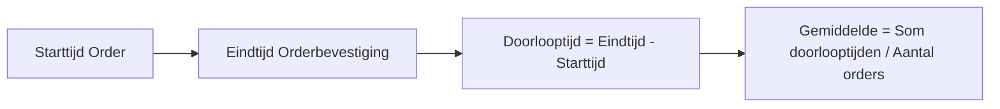

Dit KPI Definitie-template helpt je om Key Performance Indicators (KPI's) eenduidig en meetbaar te definieren. Het doel is om:  
- Duidelijkheid te scheppen over wat een KPI meet en hoe deze wordt berekend.  
- Consistentie te waarborgen in de meting en interpretatie van KPI's.  
- Transparantie te creëren voor stakeholders (management, teams, klanten).  
- Basis te leggen voor processturing, monitoring, en continue verbetering.  
- Integratie met andere documentatie (Procesbeschrijving, Procesdashboard, Processturing) te vergemakkelijken.
---

#### Eigenschappen

| Veld              | Waarde                                                                      | Toelichting                                                                                |
| ----------------- | --------------------------------------------------------------------------- | ------------------------------------------------------------------------------------------ |
| PMD-nummer    | 03.08.04                                                                    | Uniek identificatienummer voor deze KPI-definitie in het Proces Management Document (PMD). |
| Versie        | 1                                                                           | Huidige versie van dit document. Wordt geüpdaterd bij elke wijziging.                      |
| Status        | concept                                                                     | Mogelijke statussen: *concept*, *in review*, *goedgekeurd*, *gepubliceerd*, *verouderd*.   |
| Auteur        | [Naam]                                                                      | De persoon of afdeling die deze KPI-definitie heeft opgesteld (meestal de procesanalist).  |
| Eigenaar      | [Naam proceseigenaar]                                                       | Verantwoordelijk voor de inhoud en actualiteit van de KPI-definitie.                       |
| Datum         | 17/04/2026                                                                  | Datum van de laatste update.                                                               |
| Gekoppeld aan | [Bijv. "Procesbeschrijving (PMD-03.07.01), Procesdashboard (PMD-03.08.02)"] | Referentie naar gerelateerde documenten.                                                   |

#### 1. Basisgegevens

Geef hier de fundamentele identificatiegegevens van de KPI.

| Veld       | Waarde                                              | Toelichting                        |
| -------------- | ------------------------------------------------------- | -------------------------------------- |
| KPI-ID     | [Unieke identifier, bijv. "KPI-001"]                    | Unieke code voor referentie.           |
| KPI naam   | [Naam van de KPI, bijv. "Doorlooptijd Orderverwerking"] | Duidelijke en eenduidige naam.         |
| Procesnaam | [Naam van het proces, bijv. "Orderverwerking"]          | Proces waar de KPI toe behoort.        |
| Proces-ID  | [Bijv. "PR-001"]                                        | Referentie naar het proces in het PMD. |
| Categorie  | [Efficiëntie / Effectiviteit / Kwaliteit / Compliance]  | Type KPI.                              |

#### 2. KPI Naam

Geef de KPI een eenduidige, duidelijke naam die direct herkenbaar is voor alle stakeholders.

Voorbeelden:

- Efficiëntie: "Doorlooptijd Orderverwerking", "Kosten per Order".
- Effectiviteit: "Klanttevredenheid (NPS)", "Aantal geslaagde activaties".
- Kwaliteit: "Aantal fouten per Order", "Naleving ISO 9001".
- Compliance: "Systeembeschikbaarheid", "GDPR-naleving".

Tip voor Martin:  
Gebruik je ervaring in de telecomsector om sector-specifieke KPI-namen te bedenken (bijv. "SIM-activatietijd", "Netwerkbeschikbaarheid").

#### 3. Definitie

Beschrijf hier wat de KPI precies meet, inclusief exacte betekenis en scope.

| Veld              | Waarde                                                                                   |
| --------------------- | -------------------------------------------------------------------------------------------- |
| Exacte betekenis  | [Bijv. "De gemiddelde tijd tussen ontvangst en bevestiging van een klantorder."]             |
| Scope             | [Bijv. "Alle orders die via de webshop of telefoon worden ontvangen, exclusief bulkorders."] |
| Doel van de KPI   | [Bijv. "Meten van de efficiëntie van het orderverwerkingsproces."]                           |
| Toepassingsgebied | [Bijv. "Order Team, Sales Afdeling"]                                                         |

Voorbeeld (Doorlooptijd Orderverwerking):

> *"De KPI 'Doorlooptijd Orderverwerking' meet de gemiddelde tijd in uren tussen het moment waarop een klantorder wordt ontvangen (via webshop of telefoon) en het moment waarop de orderbevestiging naar de klant wordt verstuurd. Deze KPI is van toepassing op alle standaard orders (exclusief bulkorders >100 stuks) en heeft als doel om de efficiëntie van het orderverwerkingsproces te meten en te verbeteren."*

#### 4. Formule

Beschrijf hier hoe de KPI wordt berekend. Gebruik wiskundige formules, stappen, of logica om de berekening duidelijk te maken.

| Veld                | Waarde                                                       |
| ----------------------- | ---------------------------------------------------------------- |
| Formule             | [Bijv. "(Som van doorlooptijden alle orders) / (Aantal orders)"] |
| Eenheid             | [Bijv. "uren", "%", "aantal"]                                    |
| Berekeningsmethode  | [Bijv. "Automatisch via ERP-systeem, handmatige controle"]       |
| Voorbeeldberekening | [Bijv. "(24u + 20u + 18u) / 3 = 20,67u"]                         |

Voorbeelden:

- Doorlooptijd Orderverwerking:
  - Formule: `(Som van doorlooptijden alle orders) / (Aantal orders)`
  - Eenheid: uren
  - Berekeningsmethode: Automatisch via ERP-systeem.
- Aantal fouten per order:
  - Formule: `(Aantal orders met fouten) / (Totaal aantal orders) * 100%`
  - Eenheid: %
  - Berekeningsmethode: Handmatige controle + systeemlogs.
- Klanttevredenheid (NPS):
  - Formule: `% Promoters - % Detractors`
  - Eenheid: Score (-100 tot +100)
  - Berekeningsmethode: Klantenquête.

#### 5. Brondata

Beschrijf hier waar de data vandaan komt die nodig is om de KPI te berekenen.

| Veld             | Waarde                                                  |
| -------------------- | ----------------------------------------------------------- |
| Bronsysteem      | [Bijv. "ERP-systeem", "CRM-systeem", "Klantenenquête"]      |
| Rapportage       | [Bijv. "Maandelijkse KPI-rapportage", "Realtime dashboard"] |
| Handmatige input | [Bijv. "Handmatige registratie door Order Team"]            |
| Data-eigenaar    | [Bijv. "IT-afdeling", "Order Team"]                         |
| Datakwaliteit    | [Bijv. "Gevalideerd, up-to-date, consistent"]               |

Voorbeeld (Doorlooptijd Orderverwerking):

| Veld             | Waarde                         |
| -------------------- | ---------------------------------- |
| Bronsysteem      | ERP-systeem (SAP)                  |
| Rapportage       | Dagelijkse KPI-rapportage          |
| Handmatige input | Geen (fully automated)             |
| Data-eigenaar    | IT-afdeling                        |
| Datakwaliteit    | Gevalideerd, real-time, consistent |

#### 6. Norm / Target

Definieer hier wat de gewenste waarden zijn voor de KPI. Gebruik minimum, streefwaarde, en maximum waar van toepassing.

| Veld                    | Waarde                                                         | Toelichting                             |
| --------------------------- | ------------------------------------------------------------------ | ------------------------------------------- |
| Minimum                 | [Bijv. "Niet van toepassing"]                                      | Ondergrens (indien relevant).               |
| Norm (Doelwaarde)       | [Bijv. "< 24 uur"]                                                 | Gewenste waarde.                            |
| Streefwaarde            | [Bijv. "< 12 uur"]                                                 | Ambitieuze waarde.                          |
| Maximum                 | [Bijv. "Niet van toepassing"]                                      | Bovengrens (indien relevant).               |
| Koppeling met strategie | [Bijv. "Ondersteunt organisatiedoel 'Klanttevredenheid verhogen'"] | Hoe de KPI bijdraagt aan organisatiedoelen. |

Voorbeeld (Doorlooptijd Orderverwerking):

| Veld                    | Waarde                                                                | Toelichting                    |
| --------------------------- | ------------------------------------------------------------------------- | ---------------------------------- |
| Minimum                 | Niet van toepassing                                                       | -                                  |
| Norm (Doelwaarde)       | < 24 uur                                                                  | Gemiddelde doorlooptijd.           |
| Streefwaarde            | < 12 uur                                                                  | Ambitieuze doelwaarde.             |
| Maximum                 | 48 uur                                                                    | Maximale acceptabele doorlooptijd. |
| Koppeling met strategie | Ondersteunt organisatiedoel "Klanttevredenheid verhogen tot 90% in 2026". | &nbsp;                             |

#### 7. Meetfrequentie

Geef hier aan hoe vaak de KPI wordt gemeten.

| Veld              | Waarde                                                                  | Toelichting                |
| --------------------- | --------------------------------------------------------------------------- | ------------------------------ |
| Frequentie        | [Dagelijks / Wekelijks / Maandelijks / Kwartaallijks / Jaarlijks / Continu] | Hoe vaak de KPI wordt gemeten. |
| Meetmoment        | [Bijv. "Einde van de dag", "Einde van de week"]                             | Wanneer de meting plaatsvindt. |
| Verantwoordelijke | [Bijv. "Proceseigenaar", "IT-afdeling"]                                     | Wie de meting uitvoert.        |

Voorbeeld (Doorlooptijd Orderverwerking):

| Veld              | Waarde                   | Toelichting |
| --------------------- | ---------------------------- | --------------- |
| Frequentie        | Dagelijks                    | -               |
| Meetmoment        | Einde van de dag (17:00 uur) | -               |
| Verantwoordelijke | Proceseigenaar               | -               |

#### 8. Eigenaar

Geef hier aan wie verantwoordelijk is voor de KPI.

| Veld                  | Waarde                                                              | Toelichting                      |
| ------------------------- | ----------------------------------------------------------------------- | ------------------------------------ |
| Eigenaar              | [Naam/rol, bijv. "Proceseigenaar Orderverwerking"]                      | Wie verantwoordelijk is voor de KPI. |
| Verantwoordelijkheden | [Bijv. "Meting, analyse, rapportage, verbeteracties"]                   | Wat de eigenaar doet.                |
| Contactgegevens       | [Bijv. "[proceseigenaar@bedrijf.nl](mailto:proceseigenaar@bedrijf.nl)"] | Hoe de eigenaar bereikbaar is.       |

Voorbeeld (Doorlooptijd Orderverwerking):

| Veld                  | Waarde                                                    | Toelichting |
| ------------------------- | ------------------------------------------------------------- | --------------- |
| Eigenaar              | Proceseigenaar Orderverwerking                                | -               |
| Verantwoordelijkheden | Meting, analyse, rapportage, verbeteracties                   | -               |
| Contactgegevens       | [proceseigenaar@bedrijf.nl](mailto:proceseigenaar@bedrijf.nl) | -               |

#### 9. Kwaliteitsvoorwaarden

Beschrijf hier welke voorwaarden moeten worden voldaan om de KPI betrouwbaar en valide te maken.

| Veld          | Waarde                                                          |
| ----------------- | ------------------------------------------------------------------- |
| Datakwaliteit | [Bijv. "Data moet compleet, accuraat, en tijdig zijn."]             |
| Meetmethode   | [Bijv. "Automatische meting via ERP-systeem, handmatige validatie"] |
| Validatie     | [Bijv. "Maandelijkse controle door Kwaliteitsmanager"]              |

Voorbeeld (Doorlooptijd Orderverwerking):

| Veld          | Waarde                                       |
| ----------------- | ------------------------------------------------ |
| Datakwaliteit | Data moet compleet, accuraat, en real-time zijn. |
| Meetmethode   | Automatische meting via ERP-systeem.             |
| Validatie     | Maandelijkse controle door Kwaliteitsmanager.    |

#### 10. Visuele Weergave (Optioneel)

Voeg hier een visuele weergave toe van de KPI-definitie, bijv. een formule, diagram, of voorbeeldberekening. Gebruik Mermaid voor een eenvoudige weergave in Markdown.

Voorbeeld (Mermaid Formule):

#### 11. Stappen voor het Definiëren van een KPI

Volg deze stappen om een effectieve KPI te definieren:

1. Bepaal het doel:
  - Wat wil je meten en waarom? (Gebruik de Procesdoel-template als uitgangspunt.)
1. Geef de KPI een naam:
  - Kies een duidelijke, eenduidige naam.
1. Definieer de KPI:
  - Beschrijf wat de KPI meet en wat de scope is.
1. Bepaal de formule:
  - Definieer hoe de KPI wordt berekend.
1. Identificeer brondata:
  - Bepaal waar de data vandaan komt.
1. Stel normen en targets:
  - Definieer doelwaarden, streefwaarden, en grenzen.
1. Bepaal meetfrequentie:
  - Geef aan hoe vaak de KPI wordt gemeten.
1. Wijs een eigenaar toe:
  - Bepaal wie verantwoordelijk is voor de KPI.
1. Definieer kwaliteitsvoorwaarden:
  - Zorg voor betrouwbare en valide metingen.
1. Valideer met stakeholders:
  - Laat de KPI-definitie reviewen door proceseigenaren, management, en IT.

#### 12. Tips voor Effectieve KPI Definities

- Wees specifiek: Gebruik duidelijke, eenduidige definities voor KPI's.  
- Meetbaarheid is key: Zorg dat KPI's kwantificeerbaar zijn.  
- Koppel aan doelen: Zorg dat KPI's direct gerelateerd zijn aan procesdoelen en organisatiedoelen.  
- Gebruik automatisering: Meet KPI's automatisch waar mogelijk (bijv. via ERP, CRM).  
- Stel realistische normen: Zorg dat doelwaarden haalbaar zijn.  
- Documenteer brondata: Maak duidelijk waar data vandaan komt en wie verantwoordelijk is.  
- Betrek stakeholders: Laat alle betrokkenen meedenken over KPI-definities.  
- Gebruik je Lean Six Sigma-kennis: Pas DMAIC toe voor datagestuurde KPI's.

#### 13. Veelgemaakte Fouten en Hoe ze te Vermijden

| Fout                  | Oorzaak                                             | Impact                            | Oplossing                                               |
| ------------------------- | ------------------------------------------------------- | ------------------------------------- | ----------------------------------------------------------- |
| Vage definitie            | KPI is niet duidelijk gedefinieerd.                     | Misverstanden over wat wordt gemeten. | Gebruik exacte definities en voorbeelden.               |
| Niet-meetbaar             | KPI is kwalitatief in plaats van kwantitatief.          | Moeilijk te evalueren.                | Zorg voor kwantificeerbare KPI's.                       |
| Geen koppeling met doelen | KPI is niet gekoppeld aan proces- of organisatiedoelen. | Geen relevantie voor stakeholders.    | Koppel KPI's aan Procesdoel en strategische doelen. |
| Onrealistische normen     | Doelwaarden zijn niet haalbaar.                         | Frustratie en demotivatie.            | Stel realistische, haalbare normen.                     |
| Ontbrekende brondata      | Data is niet beschikbaar of betrouwbaar.                | Onnauwige metingen.                   | Zorg voor betrouwbare brondata.                         |
| Geen eigenaar             | Niemand is verantwoordelijk voor de KPI.                | Geen ownership.                       | Wijs een duidelijke eigenaar toe.                       |

#### 14. Integratie met Andere Templates

De KPI Definitie kan worden geïntegreerd met andere templates uit je 7x Framework:

| Template           | Relatie | Toepassing                                                           |
| ---------------------- | ----------- | ------------------------------------------------------------------------ |
| Procesbeschrijving | Basis       | Gebruik de Procesbeschrijving om KPI's te koppelen aan procesdoelen. |
| Procesdoel         | Alignement  | Zorg dat KPI's koppelen aan de procesdoelen.                         |
| Procesdashboard    | Monitoring  | Gebruik KPI-definities voor het Procesdashboard.                     |
| Processturing      | Sturing     | Gebruik KPI's voor monitoring en verbetering.                        |
| Procesreview       | Evaluatie   | Gebruik KPI's in Procesreviews om prestaties te evalueren.           |

#### 15. Stakeholders en Verantwoordelijkheden

Geef hier een overzicht van wie betrokken is bij het definieren en gebruiken van de KPI.

| Rol               | Verantwoordelijkheid                                                 | Betrokkenheid |
| --------------------- | ------------------------------------------------------------------------ | ----------------- |
| Proceseigenaar    | Verantwoordelijk voor de inhoud en actualiteit van de KPI-definitie. | Continu           |
| Procesanalist     | Definieert en documenteert de KPI.                                   | Ad hoc            |
| IT-afdeling       | Levert technische data en ondersteunt bij automatisering.            | Ad hoc            |
| Kwaliteitsmanager | Valideert de KPI-definitie en zorgt voor datakwaliteit.              | Periodiek         |
| Management        | Valideert de KPI op strategische alignement.                         | Periodiek         |

#### 16. Gerelateerde Documenten

Lijst hier alle gerelateerde documenten, zoals:

- [Link naar Procesbeschrijving (PMD-03.07.01)]
- [Link naar Procesdoel (PMD-03.03.00)]
- [Link naar Procesdashboard (PMD-03.08.02)]
- [Link naar Processturing (PMD-03.08.00)]
- [Link naar KPI's (PMD-03.08.01)]

#### 17. Versiehistorie

| Versie | Datum  | Wijziging   | Auteur | Goedgekeurd door |
| ---------- | ---------- | --------------- | ---------- | -------------------- |
| 1.0        | 17/04/2026 | Initiële versie | [Naam]     | [Naam]               |

#### 18. Instructies voor Gebruik

1. Bepaal het doel:
  - Wat wil je meten en waarom?
1. Geef de KPI een naam:
  - Kies een duidelijke, eenduidige naam.
1. Definieer de KPI:
  - Beschrijf wat de KPI meet en wat de scope is.
1. Bepaal de formule:
  - Definieer hoe de KPI wordt berekend.
1. Identificeer brondata:
  - Bepaal waar de data vandaan komt.
1. Stel normen en targets:
  - Definieer doelwaarden en streefwaarden.
1. Bepaal meetfrequentie:
  - Geef aan hoe vaak de KPI wordt gemeten.
1. Wijs een eigenaar toe:
  - Bepaal wie verantwoordelijk is voor de KPI.
1. Definieer kwaliteitsvoorwaarden:
  - Zorg voor betrouwbare en valide metingen.
1. Valideer met stakeholders:
  - Laat de KPI-definitie reviewen door alle betrokken partijen.

#### 19. Voorbeeld: Ingevulde KPI Definitie (Doorlooptijd Orderverwerking)

###### Basisgegevens

| Veld       | Waarde                   | Toelichting                 |
| -------------- | ---------------------------- | ------------------------------- |
| KPI-ID     | KPI-001                      | Unieke identifier.              |
| KPI naam   | Doorlooptijd Orderverwerking | Naam van de KPI.                |
| Procesnaam | Orderverwerking              | Proces waar de KPI toe behoort. |
| Proces-ID  | PR-001                       | Referentie naar het proces.     |
| Categorie  | Efficiëntie                  | Type KPI.                       |

###### KPI Naam

Doorlooptijd Orderverwerking

###### Definitie

| Veld              | Waarde                                                                                                                                                                           |
| --------------------- | ------------------------------------------------------------------------------------------------------------------------------------------------------------------------------------ |
| Exacte betekenis  | De gemiddelde tijd in uren tussen het moment waarop een klantorder wordt ontvangen (via webshop of telefoon) en het moment waarop de orderbevestiging naar de klant wordt verstuurd. |
| Scope             | Alle orders die via de webshop of telefoon worden ontvangen, exclusief bulkorders (>100 stuks).                                                                                      |
| Doel van de KPI   | Meten van de efficiëntie van het orderverwerkingsproces.                                                                                                                             |
| Toepassingsgebied | Order Team, Sales Afdeling                                                                                                                                                           |

###### Formule

| Veld                | Waarde                                             |
| ----------------------- | ------------------------------------------------------ |
| Formule             | (Som van doorlooptijden alle orders) / (Aantal orders) |
| Eenheid             | uren                                                   |
| Berekeningsmethode  | Automatisch via ERP-systeem (SAP).                     |
| Voorbeeldberekening | (24u + 20u + 18u) / 3 = 20,67u                         |

###### Brondata

| Veld             | Waarde                         |
| -------------------- | ---------------------------------- |
| Bronsysteem      | ERP-systeem (SAP)                  |
| Rapportage       | Dagelijkse KPI-rapportage          |
| Handmatige input | Geen (fully automated)             |
| Data-eigenaar    | IT-afdeling                        |
| Datakwaliteit    | Gevalideerd, real-time, consistent |

###### Norm / Target

| Veld                    | Waarde                                                                | Toelichting                    |
| --------------------------- | ------------------------------------------------------------------------- | ---------------------------------- |
| Minimum                 | Niet van toepassing                                                       | -                                  |
| Norm (Doelwaarde)       | < 24 uur                                                                  | Gemiddelde doorlooptijd.           |
| Streefwaarde            | < 12 uur                                                                  | Ambitieuze doelwaarde.             |
| Maximum                 | 48 uur                                                                    | Maximale acceptabele doorlooptijd. |
| Koppeling met strategie | Ondersteunt organisatiedoel "Klanttevredenheid verhogen tot 90% in 2026". | &nbsp;                             |

###### Meetfrequentie

| Veld              | Waarde                   | Toelichting |
| --------------------- | ---------------------------- | --------------- |
| Frequentie        | Dagelijks                    | -               |
| Meetmoment        | Einde van de dag (17:00 uur) | -               |
| Verantwoordelijke | Proceseigenaar               | -               |

###### Eigenaar

| Veld                  | Waarde                                                    | Toelichting |
| ------------------------- | ------------------------------------------------------------- | --------------- |
| Eigenaar              | Proceseigenaar Orderverwerking                                | -               |
| Verantwoordelijkheden | Meting, analyse, rapportage, verbeteracties                   | -               |
| Contactgegevens       | [proceseigenaar@bedrijf.nl](mailto:proceseigenaar@bedrijf.nl) | -               |

###### Kwaliteitsvoorwaarden

| Veld          | Waarde                                       |
| ----------------- | ------------------------------------------------ |
| Datakwaliteit | Data moet compleet, accuraat, en real-time zijn. |
| Meetmethode   | Automatische meting via ERP-systeem.             |
| Validatie     | Maandelijkse controle door Kwaliteitsmanager.    |

#### 20. Voorbeeld: KPI Definitie voor Telecom (SIM-activatietijd)

###### Basisgegevens

| Veld       | Waarde        | Toelichting                 |
| -------------- | ----------------- | ------------------------------- |
| KPI-ID     | KPI-002           | Unieke identifier.              |
| KPI naam   | SIM-activatietijd | Naam van de KPI.                |
| Procesnaam | SIM-activatie     | Proces waar de KPI toe behoort. |
| Proces-ID  | PR-002            | Referentie naar het proces.     |
| Categorie  | Efficiëntie       | Type KPI.                       |

###### KPI Naam

SIM-activatietijd

###### Definitie

| Veld              | Waarde                                                                                                                                                                         |
| --------------------- | ---------------------------------------------------------------------------------------------------------------------------------------------------------------------------------- |
| Exacte betekenis  | De gemiddelde tijd in minuten tussen het moment waarop een SIM-activatieaanvraag wordt ontvangen en het moment waarop de SIM-kaart actief is en de klant een bevestiging ontvangt. |
| Scope             | Alle SIM-activatieaanvragen voor particuliere klanten, exclusief zakelijke bulkactivaties.                                                                                         |
| Doel van de KPI   | Meten van de efficiëntie van het SIM-activatieproces.                                                                                                                              |
| Toepassingsgebied | Technisch Team, Klantenservice                                                                                                                                                     |

###### Formule

| Veld                | Waarde                                                        |
| ----------------------- | ----------------------------------------------------------------- |
| Formule             | (Som van activatietijden alle SIM-kaarten) / (Aantal SIM-kaarten) |
| Eenheid             | minuten                                                           |
| Berekeningsmethode  | Automatisch via provisioning-systeem.                             |
| Voorbeeldberekening | (30m + 45m + 25m) / 3 = 33,33m                                    |

###### Brondata

| Veld             | Waarde                         |
| -------------------- | ---------------------------------- |
| Bronsysteem      | Provisioning-systeem               |
| Rapportage       | Realtime dashboard                 |
| Handmatige input | Geen (fully automated)             |
| Data-eigenaar    | IT-afdeling                        |
| Datakwaliteit    | Gevalideerd, real-time, consistent |

###### Norm / Target

| Veld                    | Waarde                                                                   | Toelichting                     |
| --------------------------- | ---------------------------------------------------------------------------- | ----------------------------------- |
| Minimum                 | Niet van toepassing                                                          | -                                   |
| Norm (Doelwaarde)       | < 60 minuten                                                                 | Gemiddelde activatietijd.           |
| Streefwaarde            | < 30 minuten                                                                 | Ambitieuze doelwaarde.              |
| Maximum                 | 120 minuten                                                                  | Maximale acceptabele activatietijd. |
| Koppeling met strategie | Ondersteunt organisatiedoel "Klanttevredenheid in telecomdiensten verhogen". | &nbsp;                              |

###### Meetfrequentie

| Veld              | Waarde  | Toelichting |
| --------------------- | ----------- | --------------- |
| Frequentie        | Continu     | -               |
| Meetmoment        | Realtime    | -               |
| Verantwoordelijke | IT-afdeling | -               |

###### Eigenaar

| Veld                  | Waarde                                                  | Toelichting |
| ------------------------- | ----------------------------------------------------------- | --------------- |
| Eigenaar              | Proceseigenaar SIM-activatie                                | -               |
| Verantwoordelijkheden | Meting, analyse, rapportage, verbeteracties                 | -               |
| Contactgegevens       | [sim-activatie@bedrijf.nl](mailto:sim-activatie@bedrijf.nl) | -               |

###### Kwaliteitsvoorwaarden

| Veld          | Waarde                                       |
| ----------------- | ------------------------------------------------ |
| Datakwaliteit | Data moet compleet, accuraat, en real-time zijn. |
| Meetmethode   | Automatische meting via provisioning-systeem.    |
| Validatie     | Wekelijkse controle door Technisch Team.         |