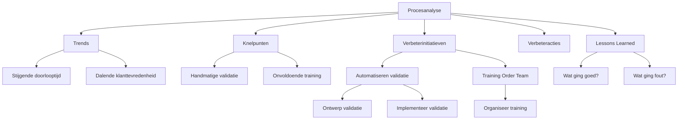

#### Inleiding

Dit Procesverbetering-template biedt een gestructureerde aanpak voor het analyseren, verbeteren, en optimaliseren van {{procesnaam}}. Het doel is om:  
- Knelpunten en inefficiënties in processen te identificeren en op te lossen.  
- Datagestuurde verbeterinitiatieven te ontwikkelen op basis van trends en analyses.  
- Concrete verbeteracties te definieren met duidelijke verantwoordelijkheden en deadlines.  
- Lessons learned vast te leggen voor toekomstige verbeteringen.  
- Continue verbetering te waarborgen door feedback en evaluatie.

#### Eigenschappen

| Veld              | Waarde                                                                                    | Toelichting                                                                                    |
| ----------------- | ----------------------------------------------------------------------------------------- | ---------------------------------------------------------------------------------------------- |
| PMD-nummer    | 03.09.00                                                                                  | Uniek identificatienummer voor deze procesverbetering in het Proces Management Document (PMD). |
| Versie        | 1                                                                                         | Huidige versie van dit document. Wordt geüpdaterd bij elke wijziging.                          |
| Status        | concept                                                                                   | Mogelijke statussen: *concept*, *in review*, *goedgekeurd*, *gepubliceerd*, *verouderd*.       |
| Auteur        | [Naam]                                                                                    | De persoon of afdeling die dit document heeft opgesteld (meestal de procesanalist).            |
| Eigenaar      | [Naam proceseigenaar]                                                                     | Verantwoordelijk voor de inhoud en actualiteit van de procesverbetering.                       |
| Datum         | 17/04/2026                                                                                | Datum van de laatste update.                                                                   |
| Gekoppeld aan | [Bijv. "Procesreview (PMD-03.08.03), KPI's (PMD-03.08.01), Processturing (PMD-03.08.00)"] | Referentie naar gerelateerde documenten.                                                       |

## 1. Algemeen Overzicht

Geef hier een kort overzicht van de procesverbetering.

| Veld                    | Waarde                                                                                | Toelichting                              |
| --------------------------- | ----------------------------------------------------------------------------------------- | -------------------------------------------- |
| Procesnaam              | [Naam van het proces, bijv. "Orderverwerking"]                                            | Naam van het proces dat wordt verbeterd.     |
| Proces-ID               | [Bijv. "PR-001"]                                                                          | Unieke identifier.                           |
| Doel van de verbetering | [Bijv. "Verminderen van doorlooptijd en fouten in de orderverwerking."]                   | Wat de verbetering moet bereiken.            |
| Scope                   | [Bijv. "Hele proces van ontvangst tot bevestiging van orders."]                           | Wat valt binnen de scope van de verbetering. |
| Betrokken partijen      | [Lijst van rollen, bijv. "Proceseigenaar, Procesanalist, IT-afdeling, Kwaliteitsmanager"] | Wie is betrokken bij de verbetering.         |

## 2. Procesanalyse

Voer hier een diepgaande analyse uit van het proces om trends, knelpunten, en verbeterkansen te identificeren.

#### Trends

Analyseer hier langetermijntrends in de procesprestaties. Gebruik KPI-data uit de Processturing (PMD-03.08.00) en Procesdashboard (PMD-03.08.02).

| Trend                 | KPI                      | Periode | Waarde begin | Waarde einde | Verandering | Oorzaak              | Impact               |
| ------------------------- | ---------------------------- | ----------- | ---------------- | ---------------- | --------------- | ------------------------ | ------------------------ |
| Stijgende doorlooptijd    | Doorlooptijd orderverwerking | Q1 2026     | 18 uur           | 22 uur           | +4 uur          | Handmatige validatiestap | Vertraging in levering   |
| Dalende klanttevredenheid | Klanttevredenheid (NPS)      | Q1 2026     | 8,5              | 8,2              | -0,3            | Vertraagde levering      | Lagere klanttevredenheid |
| Stijgend foutpercentage   | Aantal fouten per order      | Q1 2026     | 0,5%             | 0,8%             | +0,3%           | Onvoldoende training     | Onjuiste orderverwerking |

Tip voor Martin:  
Gebruik je Lean Six Sigma Green Belt-kennis om trends te analyseren met behulp van control charts of Pareto-analyses.

#### Knelpunten

Identificeer hier de belangrijkste knelpunten in het proces. Gebruik de 5 Why's-methode om root causes te achterhalen.

| Knelpunt            | Beschrijving                                 | Oorzaak (5 Why's)                                                                                                                 | Impact               | Prioriteit | Gerelateerde KPI         |
| ----------------------- | ------------------------------------------------ | ------------------------------------------------------------------------------------------------------------------------------------- | ------------------------ | -------------- | ---------------------------- |
| Handmatige validatie    | Validatie van klantgegevens duurt te lang.       | 1. Handmatige stappen. 2. Geen automatisering. 3. Beperkte IT-capaciteit. 4. Geen budget. 5. Geen business case.                      | Vertraging in levering   | Hoog           | Doorlooptijd orderverwerking |
| Onvoldoende training    | Nieuwe medewerkers zijn niet voldoende getraind. | 1. Gebrek aan training. 2. Hoge werkdruk. 3. Geen gestandaardiseerde werkwijze. 4. Geen checklists. 5. Geen kwaliteitscontroles.      | Onjuiste orderverwerking | Hoog           | Aantal fouten per order      |
| Gebrek aan communicatie | Klanten ontvangen geen proactieve updates.       | 1. Geen automatische notificaties. 2. Handmatige communicatie. 3. Beperkte capaciteit. 4. Geen templates. 5. Geen integratie met CRM. | Lagere klanttevredenheid | Hoog           | Klanttevredenheid (NPS)      |

Prioriteit:

- Hoog: Kritisch voor procesprestaties, directe actie vereist.
- Middel: Belangrijk, maar niet kritiek.
- Laag: Wenselijk, maar niet urgent.

#### SWOT-analyse

Voer hier een SWOT-analyse uit om sterktes, zwaktes, kansen, en bedreigingen in kaart te brengen.

| Categorie    | Beschrijving                | Impact         | Actie                     |
| ---------------- | ------------------------------- | ------------------ | ----------------------------- |
| Sterktes     | Automatische orderbevestiging   | Efficiëntie        | Behoud en optimaliseer.       |
| Sterktes     | Hoog opgeleid Order Team        | Kwaliteit          | Investeer in training.        |
| Zwaktes      | Handmatige validatiestap        | Vertraging         | Automatiseren.                |
| Zwaktes      | Gebrek aan real-time monitoring | Gebrek aan inzicht | Implementeer dashboard.       |
| Kansen       | Nieuwe CRM-functionaliteiten    | Efficiëntie        | Benutten voor automatisering. |
| Kansen       | Groeiende markt                 | Omzet              | Schaal proces op.             |
| Bedreigingen | Concurrentie                    | Marktpositie       | Differentiëren op kwaliteit.  |
| Bedreigingen | Systeemveroudering              | Betrouwbaarheid    | Upgraden systeem.             |

## 3. Verbeterinitiatieven

Definieer hier initiatieven om de geïdentificeerde knelpunten en trends aan te pakken. Gebruik de DMAIC-methode (Define, Measure, Analyze, Improve, Control) uit Lean Six Sigma.

| Initiatief              | Doel                        | Knelpunt/Trend      | Methode                                  | Verantwoordelijke | Budget | Tijdsduur | Verwachte impact                 | Prioriteit |
| --------------------------- | ------------------------------- | ----------------------- | -------------------------------------------- | --------------------- | ---------- | ------------- | ------------------------------------ | -------------- |
| Automatiseren validatiestap | Verminderen doorlooptijd        | Handmatige validatie    | Implementeer automatische validatie in CRM.  | IT-afdeling           | €5.000     | 2 maanden     | ⬇️ Doorlooptijd met 50%              | Hoog           |
| Training Order Team         | Verminderen fouten              | Onvoldoende training    | Organiseer training voor nieuwe medewerkers. | Kwaliteitsmanager     | €2.000     | 1 maand       | ⬇️ Fouten met 30%                    | Hoog           |
| Verbeter klantcommunicatie  | Verhogen klanttevredenheid      | Gebrek aan communicatie | Implementeer automatische statusupdates.     | Sales Manager         | €1.000     | 1 maand       | ⬆️ NPS met 0,5 punt                  | Hoog           |
| Upgrade ERP-systeem         | Verhogen systeembetrouwbaarheid | Systeemveroudering      | Upgrade naar nieuwste versie.                | IT-afdeling           | €10.000    | 3 maanden     | ⬆️ Systeembeschikbaarheid naar 99,5% | Middel         |

## 4. Verbeteracties

Stel hier concrete verbeteracties op op basis van de verbeterinitiatieven. Gebruik de PDCA-cyclus (Plan-Do-Check-Act) voor structuur.

| Actie                      | Initiatief              | Beschrijving                                      | Verantwoordelijke | Startdatum | Deadline | Status | Afhankelijkheden     | Risico's                     | Mitigerende maatregelen | Succescriteria               |
| ------------------------------ | --------------------------- | ----------------------------------------------------- | --------------------- | -------------- | ------------ | ---------- | ------------------------ | -------------------------------- | --------------------------- | -------------------------------- |
| Ontwerp automatische validatie | Automatiseren validatiestap | Ontwikkel automatische validatieregels in CRM.        | IT-afdeling           | 01/05/2026     | 15/05/2026   | Gepland    | Budgetgoedkeuring        | Vertraging door andere projecten | Prioriteit verhogen         | Validatieregels werken foutloos. |
| Implementeer validatie         | Automatiseren validatiestap | Implementeer validatieregels in productie.            | IT-afdeling           | 16/05/2026     | 30/06/2026   | Gepland    | Ontwerp validatie        | Technische issues                | Test in sandbox-omgeving    | Validatie werkt in productie.    |
| Organiseer training            | Training Order Team         | Plan en voer training uit voor nieuwe medewerkers.    | Kwaliteitsmanager     | 01/05/2026     | 15/05/2026   | Gepland    | Beschikbaarheid trainers | Lage opkomst                     | Verplichte training         | Alle medewerkers getraind.       |
| Implementeer notificaties      | Verbeter klantcommunicatie  | Ontwikkel en implementeer automatische statusupdates. | Sales Manager         | 01/05/2026     | 30/05/2026   | Gepland    | IT-ondersteuning         | Technische beperkingen           | Pilot testen                | Notificaties werken foutloos.    |

## 5. Lessons Learned

Documenteer hier wat er is geleerd tijdens het verbeterproces, zodat toekomstige verbeteringen efficiënter kunnen worden uitgevoerd.

#### Wat ging goed?

| Succesfactor              | Beschrijving                                 | Oorzaak                           | Actie voor toekomst                    |
| ----------------------------- | ------------------------------------------------ | ------------------------------------- | ------------------------------------------ |
| Automatische orderbevestiging | Orderbevestigingen worden automatisch verstuurd. | Geïmplementeerd in CRM-systeem        | Behoud en breid uit naar andere processen. |
| Goede samenwerking IT         | IT-afdeling was proactief betrokken.             | Duidelijke communicatie en prioriteit | Behoud goede samenwerking.                 |
| KPI-monitoring                | KPI's werden dagelijks gemonitord.               | Procesdashboard was ingericht         | Behoud monitoring en breid uit.            |

#### Wat ging fout?

| Probleem             | Beschrijving                                  | Oorzaak                   | Impact                | Actie voor toekomst                                |
| ------------------------ | ------------------------------------------------- | ----------------------------- | ------------------------- | ------------------------------------------------------ |
| Vertraagde implementatie | Automatische validatie duurde langer dan gepland. | Onvoorziene technische issues | Vertraging in verbetering | Voeg buffer toe in planning voor technische issues.    |
| Lage opkomst training    | Niet alle medewerkers volgden de training.        | Gebrek aan verplichting       | Onvoldoende kennis        | Maak training verplicht en plan in werktijd.           |
| Gebrek aan data          | Sommige KPI's konden niet worden gemeten.         | Ontbrekende brondata          | Onnauwige analyse         | Zorg voor complete brondata voordat verbetering start. |

#### Acties voor Toekomst

| Actie                   | Beschrijving                                      | Verantwoordelijke | Deadline |
| --------------------------- | ----------------------------------------------------- | --------------------- | ------------ |
| Voeg buffer toe in planning | Voeg 20% buffer toe voor technische issues.           | Proceseigenaar        | 30/04/2026   |
| Maak training verplicht     | Maak training verplicht voor alle nieuwe medewerkers. | Kwaliteitsmanager     | 15/05/2026   |
| Zorg voor complete brondata | Controleer en vul ontbrekende brondata aan.           | IT-afdeling           | 30/04/2026   |

## 6. Stappen voor Procesverbetering

Volg deze stappen om effectieve procesverbetering te realiseren:

1. Procesanalyse:
  - Voer een diepgaande analyse uit van het proces (trends, knelpunten, SWOT).
  - Gebruik KPI-data en Procesreview (PMD-03.08.03) als uitgangspunt.
1. Identificeer verbeterinitiatieven:
  - Definieer initiatieven om knelpunten en trends aan te pakken.
  - Gebruik de DMAIC-methode (Define, Measure, Analyze, Improve, Control).
1. Stel verbeteracties op:
  - Definieer concrete acties met verantwoordelijken, deadlines, en succescriteria.
  - Gebruik de PDCA-cyclus (Plan-Do-Check-Act).
1. Implementeer verbeteringen:
  - Voer de verbeteracties uit volgens planning.
  - Monitor voortgang en pas aan waar nodig.
1. Evalueer resultaten:
  - Meet de impact van de verbeteringen op KPI's.
  - Gebruik Processturing (PMD-03.08.00) voor evaluatie.
1. Documenteer lessons learned:
  - Leg succesfactoren, problemen, en acties voor toekomst vast.
1. Valideer met stakeholders:
  - Laat de verbeterinitiatieven en acties reviewen door alle betrokken partijen.

## 7. Tips voor Effectieve Procesverbetering

- Gebruik data: Baseer verbeteringen op feiten en data (KPI's, trends, analyses).  
- Focus op root causes: Gebruik de 5 Why's-methode om echte oorzaken van problemen te achterhalen.  
- Betrek stakeholders: Zorg dat alle betrokkenen meedenken over verbeterinitiatieven.  
- Gebruik DMAIC: Pas de DMAIC-methode (Define, Measure, Analyze, Improve, Control) toe voor gestructureerde verbetering.  
- Stel SMART-doelen: Zorg dat verbeterdoelen Specifiek, Meetbaar, Acceptabel, Realistisch, Tijdgebonden zijn.  
- Monitor voortgang: Houd de voortgang van verbeteracties bij en pas aan waar nodig.  
- Documenteer lessons learned: Leg ervaringen vast voor toekomstige verbeteringen.  
- Gebruik je Lean Six Sigma-kennis: Pas DMAIC, 5 Why's, en Pareto-analyses toe voor datagestuurde verbetering.

## 8. Visuele Weergave (Optioneel)

Voeg hier een visuele weergave toe van de procesverbetering, bijv. een overzicht van knelpunten, verbeterinitiatieven, of acties. Gebruik Mermaid voor een eenvoudige weergave in Markdown.

Voorbeeld (Mermaid Procesverbetering Overzicht):

## 9. Stakeholders en Verantwoordelijkheden

Geef hier een overzicht van wie betrokken is bij de procesverbetering.

| Rol               | Verantwoordelijkheid                                                       | Betrokkenheid |
| --------------------- | ------------------------------------------------------------------------------ | ----------------- |
| Proceseigenaar    | Verantwoordelijk voor de uitvoering en follow-up van de procesverbetering. | Continu           |
| Procesanalist     | Voert de procesanalyse uit en stelt verbeterinitiatieven voor.             | Ad hoc            |
| Kwaliteitsmanager | Evalueert de impact van verbeteringen op kwaliteit.                        | Periodiek         |
| IT-afdeling       | Ondersteunt bij technische verbeteringen.                                  | Ad hoc            |
| Management        | Valideert verbeterinitiatieven op strategische alignement.                 | Periodiek         |
| Uitvoerend team   | Voert verbeteracties uit en levert input.                                  | Ad hoc            |

## 10. Gerelateerde Documenten

Lijst hier alle gerelateerde documenten, zoals:

- [Link naar Procesreview (PMD-03.08.03)]
- [Link naar KPI's (PMD-03.08.01)]
- [Link naar Processturing (PMD-03.08.00)]
- [Link naar Procesbeschrijving (PMD-03.07.01)]
- [Link naar RACI Matrix (PMD-03.07.03)]

## 11. Versiehistorie

| Versie | Datum  | Wijziging   | Auteur | Goedgekeurd door |
| ---------- | ---------- | --------------- | ---------- | -------------------- |
| 1.0        | 17/04/2026 | Initiële versie | [Naam]     | [Naam]               |

## 12. Instructies voor Gebruik

1. Voer procesanalyse uit:
  - Analyseer trends, knelpunten, en SWOT van het proces.
1. Identificeer verbeterinitiatieven:
  - Definieer initiatieven om knelpunten aan te pakken.
1. Stel verbeteracties op:
  - Definieer concrete acties met verantwoordelijken en deadlines.
1. Implementeer verbeteringen:
  - Voer de verbeteracties uit volgens planning.
1. Evalueer resultaten:
  - Meet de impact van verbeteringen op KPI's.
1. Documenteer lessons learned:
  - Leg succesfactoren, problemen, en acties voor toekomst vast.
1. Valideer met stakeholders:
  - Laat de verbeterinitiatieven en acties reviewen door alle betrokken partijen.

## 13. Voorbeeld: Ingevulde Procesverbetering (Orderverwerking)

#### Algemeen Overzicht

| Veld                    | Waarde                                                    | Toelichting                   |
| --------------------------- | ------------------------------------------------------------- | --------------------------------- |
| Procesnaam              | Orderverwerking                                               | Naam van het proces.              |
| Proces-ID               | PR-001                                                        | Unieke identifier.                |
| Doel van de verbetering | Verminderen van doorlooptijd en fouten in de orderverwerking. | Wat de verbetering moet bereiken. |
| Scope                   | Hele proces van ontvangst tot bevestiging van orders.         | Wat valt binnen de scope.         |
| Betrokken partijen      | Proceseigenaar, Procesanalist, IT-afdeling, Kwaliteitsmanager | Wie is betrokken.                 |

#### Procesanalyse

Trends:

| Trend              | KPI                      | Periode | Waarde begin | Waarde einde | Verandering | Oorzaak              | Impact             |
| ---------------------- | ---------------------------- | ----------- | ---------------- | ---------------- | --------------- | ------------------------ | ---------------------- |
| Stijgende doorlooptijd | Doorlooptijd orderverwerking | Q1 2026     | 18 uur           | 22 uur           | +4 uur          | Handmatige validatiestap | Vertraging in levering |

Knelpunten:

| Knelpunt         | Beschrijving                           | Oorzaak (5 Why's)                                                                                            | Impact             | Prioriteit | Gerelateerde KPI         |
| -------------------- | ------------------------------------------ | ---------------------------------------------------------------------------------------------------------------- | ---------------------- | -------------- | ---------------------------- |
| Handmatige validatie | Validatie van klantgegevens duurt te lang. | 1. Handmatige stappen. 2. Geen automatisering. 3. Beperkte IT-capaciteit. 4. Geen budget. 5. Geen business case. | Vertraging in levering | Hoog           | Doorlooptijd orderverwerking |

SWOT-analyse:

| Categorie | Beschrijving              | Impact  | Actie               |
| ------------- | ----------------------------- | ----------- | ----------------------- |
| Sterktes  | Automatische orderbevestiging | Efficiëntie | Behoud en optimaliseer. |
| Zwaktes   | Handmatige validatiestap      | Vertraging  | Automatiseren.          |

#### Verbeterinitiatieven

| Initiatief              | Doel                 | Knelpunt/Trend   | Methode                                 | Verantwoordelijke | Budget | Tijdsduur | Verwachte impact    | Prioriteit |
| --------------------------- | ------------------------ | -------------------- | ------------------------------------------- | --------------------- | ---------- | ------------- | ----------------------- | -------------- |
| Automatiseren validatiestap | Verminderen doorlooptijd | Handmatige validatie | Implementeer automatische validatie in CRM. | IT-afdeling           | €5.000     | 2 maanden     | ⬇️ Doorlooptijd met 50% | Hoog           |

#### Verbeteracties

| Actie                      | Initiatief              | Beschrijving                               | Verantwoordelijke | Startdatum | Deadline | Status | Afhankelijkheden | Risico's                     | Mitigerende maatregelen | Succescriteria               |
| ------------------------------ | --------------------------- | ---------------------------------------------- | --------------------- | -------------- | ------------ | ---------- | -------------------- | -------------------------------- | --------------------------- | -------------------------------- |
| Ontwerp automatische validatie | Automatiseren validatiestap | Ontwikkel automatische validatieregels in CRM. | IT-afdeling           | 01/05/2026     | 15/05/2026   | Gepland    | Budgetgoedkeuring    | Vertraging door andere projecten | Prioriteit verhogen         | Validatieregels werken foutloos. |

#### Lessons Learned

Wat ging goed?

| Succesfactor              | Beschrijving                                 | Oorzaak                    | Actie voor toekomst                    |
| ----------------------------- | ------------------------------------------------ | ------------------------------ | ------------------------------------------ |
| Automatische orderbevestiging | Orderbevestigingen worden automatisch verstuurd. | Geïmplementeerd in CRM-systeem | Behoud en breid uit naar andere processen. |

Wat ging fout?

| Probleem             | Beschrijving                                  | Oorzaak                   | Impact                | Actie voor toekomst                             |
| ------------------------ | ------------------------------------------------- | ----------------------------- | ------------------------- | --------------------------------------------------- |
| Vertraagde implementatie | Automatische validatie duurde langer dan gepland. | Onvoorziene technische issues | Vertraging in verbetering | Voeg buffer toe in planning voor technische issues. |

Acties voor Toekomst:

| Actie                   | Beschrijving                            | Verantwoordelijke | Deadline |
| --------------------------- | ------------------------------------------- | --------------------- | ------------ |
| Voeg buffer toe in planning | Voeg 20% buffer toe voor technische issues. | Proceseigenaar        | 30/04/2026   |

## 14. Voorbeeld: Procesverbetering voor SIM-activatie (Telecom)

Gebaseerd op je ervaring in de telecomsector, hier een praktisch voorbeeld voor een SIM-activatieproces.

#### Algemeen Overzicht

| Veld                    | Waarde                                                  | Toelichting                   |
| --------------------------- | ----------------------------------------------------------- | --------------------------------- |
| Procesnaam              | SIM-activatie                                               | Naam van het proces.              |
| Proces-ID               | PR-002                                                      | Unieke identifier.                |
| Doel van de verbetering | Verminderen van activatietijd en fouten in SIM-activatie.   | Wat de verbetering moet bereiken. |
| Scope                   | Hele proces van aanvraag tot activatie van SIM-kaarten.     | Wat valt binnen de scope.         |
| Betrokken partijen      | Proceseigenaar, Technisch Team, Klantenservice, IT-afdeling | Wie is betrokken.                 |

#### Procesanalyse

Trends:

| Trend               | KPI       | Periode | Waarde begin | Waarde einde | Verandering | Oorzaak                           | Impact           |
| ----------------------- | ------------- | ----------- | ---------------- | ---------------- | --------------- | ------------------------------------- | -------------------- |
| Stijgende activatietijd | Activatietijd | Q1 2026     | 45 min           | 60 min           | +15 min         | Handmatige stappen in activatieproces | Vertraagde activatie |

Knelpunten:

| Knelpunt             | Beschrijving                         | Oorzaak (5 Why's)                                                                                            | Impact           | Prioriteit | Gerelateerde KPI |
| ------------------------ | ---------------------------------------- | ---------------------------------------------------------------------------------------------------------------- | -------------------- | -------------- | -------------------- |
| Handmatige activatiestap | Activatie van SIM-kaarten duurt te lang. | 1. Handmatige stappen. 2. Geen automatisering. 3. Beperkte IT-capaciteit. 4. Geen budget. 5. Geen business case. | Vertraagde activatie | Hoog           | Activatietijd        |

SWOT-analyse:

| Categorie | Beschrijving          | Impact               | Actie            |
| ------------- | ------------------------- | ------------------------ | -------------------- |
| Sterktes  | Automatische notificaties | Betere klantcommunicatie | Behoud en breid uit. |
| Zwaktes   | Handmatige activatiestap  | Vertraagde activatie     | Automatiseren.       |

#### Verbeterinitiatieven

| Initiatief                | Doel                  | Knelpunt/Trend       | Methode                                                  | Verantwoordelijke | Budget | Tijdsduur | Verwachte impact     | Prioriteit |
| ----------------------------- | ------------------------- | ------------------------ | ------------------------------------------------------------ | --------------------- | ---------- | ------------- | ------------------------ | -------------- |
| Automatiseren activatieproces | Verminderen activatietijd | Handmatige activatiestap | Implementeer automatische activatie in provisioning-systeem. | IT-afdeling           | €7.500     | 2 maanden     | ⬇️ Activatietijd met 40% | Hoog           |

#### Verbeteracties

| Actie                      | Initiatief                | Beschrijving                                                | Verantwoordelijke | Startdatum | Deadline | Status | Afhankelijkheden | Risico's                     | Mitigerende maatregelen | Succescriteria               |
| ------------------------------ | ----------------------------- | --------------------------------------------------------------- | --------------------- | -------------- | ------------ | ---------- | -------------------- | -------------------------------- | --------------------------- | -------------------------------- |
| Ontwerp automatische activatie | Automatiseren activatieproces | Ontwikkel automatische activatieregels in provisioning-systeem. | IT-afdeling           | 01/05/2026     | 15/05/2026   | Gepland    | Budgetgoedkeuring    | Vertraging door andere projecten | Prioriteit verhogen         | Activatieregels werken foutloos. |

#### Lessons Learned

Wat ging goed?

| Succesfactor          | Beschrijving                                             | Oorzaak                             | Actie voor toekomst                    |
| ------------------------- | ------------------------------------------------------------ | --------------------------------------- | ------------------------------------------ |
| Automatische notificaties | Klanten ontvangen automatische updates over activatiestatus. | Geïmplementeerd in provisioning-systeem | Behoud en breid uit naar andere processen. |

Wat ging fout?

| Probleem             | Beschrijving                                  | Oorzaak                   | Impact                | Actie voor toekomst                             |
| ------------------------ | ------------------------------------------------- | ----------------------------- | ------------------------- | --------------------------------------------------- |
| Vertraagde implementatie | Automatische activatie duurde langer dan gepland. | Onvoorziene technische issues | Vertraging in verbetering | Voeg buffer toe in planning voor technische issues. |

Acties voor Toekomst:

| Actie                   | Beschrijving                            | Verantwoordelijke | Deadline |
| --------------------------- | ------------------------------------------- | --------------------- | ------------ |
| Voeg buffer toe in planning | Voeg 20% buffer toe voor technische issues. | Proceseigenaar        | 30/04/2026   |