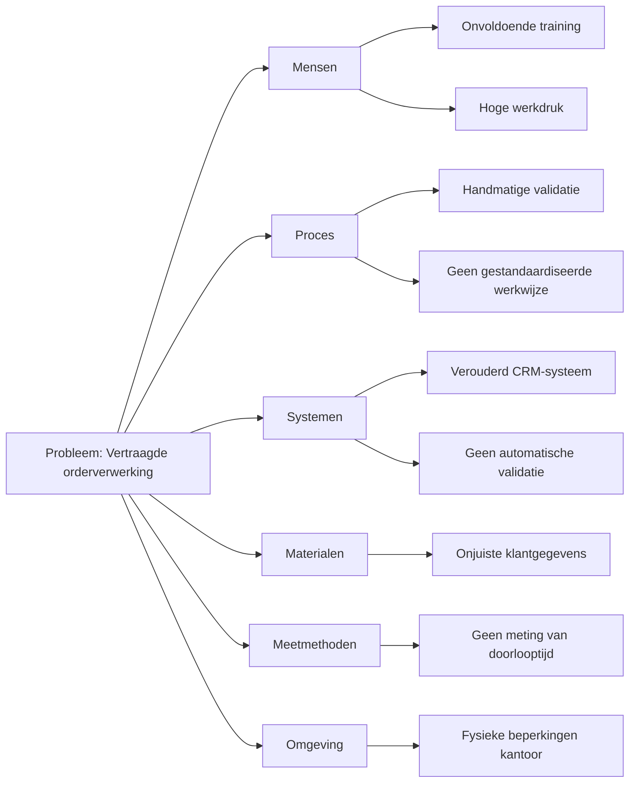
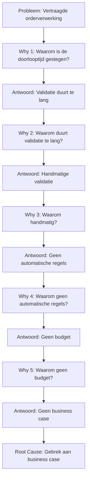
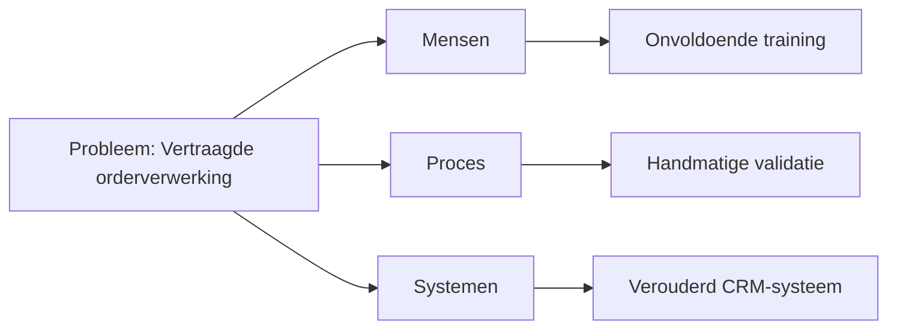
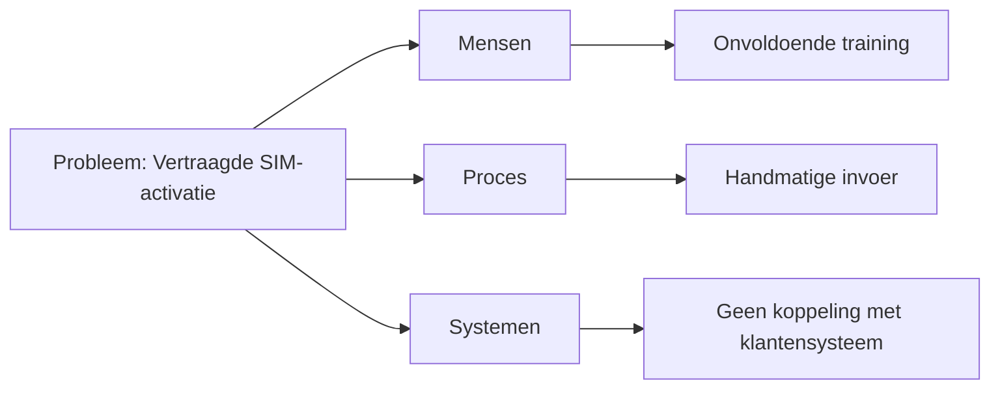

#### Inleiding

Dit Root Cause Analyse (RCA)-template helpt je om de onderliggende oorzaken van problemen in {{procesnaam}} systematisch te identificeren. Het doel is om:  
- Symptomen en oorzaken van problemen duidelijk te scheiden.  
- Root causes te achterhalen met behulp van gestructureerde analysemethoden (5 Why's, Fishbone, Pareto).  
- Permanente oplossingen te ontwikkelen in plaats van tijdelijke fixes.  
- Data en feiten te gebruiken voor objectieve analyse.  
- Lessons learned vast te leggen voor toekomstige preventie.

#### Eigenschappen

| Veld              | Waarde                                                                  | Toelichting                                                                              |
| ----------------- | ----------------------------------------------------------------------- | ---------------------------------------------------------------------------------------- |
| PMD-nummer    | 03.09.01                                                                | Uniek identificatienummer voor deze RCA in het Proces Management Document (PMD).         |
| Versie        | 1                                                                       | Huidige versie van dit document. Wordt geüpdaterd bij elke wijziging.                    |
| Status        | concept                                                                 | Mogelijke statussen: *concept*, *in review*, *goedgekeurd*, *gepubliceerd*, *verouderd*. |
| Auteur        | [Naam]                                                                  | De persoon of afdeling die deze RCA heeft opgesteld (meestal de procesanalist).          |
| Eigenaar      | [Naam proceseigenaar]                                                   | Verantwoordelijk voor de inhoud en actualiteit van de RCA.                               |
| Datum         | 17/04/2026                                                              | Datum van de laatste update.                                                             |
| Gekoppeld aan | [Bijv. "Procesverbetering (PMD-03.09.00), Procesreview (PMD-03.08.03)"] | Referentie naar gerelateerde documenten.                                                 |

## 1. Algemeen Overzicht

Geef hier een kort overzicht van de RCA.

| Veld             | Waarde                                     | Toelichting                                      |
| -------------------- | ---------------------------------------------- | ---------------------------------------------------- |
| Procesnaam       | [Naam van het proces, bijv. "Orderverwerking"] | Naam van het proces waar het probleem zich voordoet. |
| Proces-ID        | [Bijv. "PR-001"]                               | Unieke identifier.                                   |
| Probleem-ID      | [Bijv. "PROB-001"]                             | Unieke identifier voor het probleem.                 |
| Datum ontdekking | [Bijv. "10/04/2026"]                           | Datum waarop het probleem is ontdekt.                |
| Datum analyse    | [Bijv. "17/04/2026"]                           | Datum waarop de RCA is uitgevoerd.                   |

## 2. Probleemomschrijving

Beschrijf hier het probleem op een duidelijke, objectieve manier. Gebruik de 5W2H-methode (What, When, Where, Who, Why, How, How much) voor een complete beschrijving.

| Veld    | Waarde                                                         |
| ----------- | ------------------------------------------------------------------ |
| Wat     | [Bijv. "Vertraagde orderverwerking"]                               |
| Wanneer | [Bijv. "Sinds begin Q2 2026"]                                      |
| Waar    | [Bijv. "In het Order Team, tijdens de validatiestap"]              |
| Wie     | [Bijv. "Order Medewerkers, Klanten"]                               |
| Waarom  | [Bijv. "Onbekend, onderzocht via RCA"]                             |
| Hoe     | [Bijv. "Handmatige validatie van klantgegevens"]                   |
| Hoeveel | [Bijv. "Gemiddelde doorlooptijd gestegen van 18u naar 22u (+22%)"] |

Voorbeeld (Orderverwerking):

> *"Sinds begin Q2 2026 ervaart het Order Team vertragingen in de orderverwerking. De gemiddelde doorlooptijd is gestegen van 18 uur naar 22 uur (+22%), wat leidt tot klachten van klanten en een daling in klanttevredenheid (NPS van 8,5 naar 8,2). Het probleem doet zich voor tijdens de validatiestap van klantgegevens, waar Order Medewerkers handmatig gegevens controleren in het CRM-systeem."*

## 3. Impactanalyse

Beschrijf hier de impact van het probleem op verschillende gebieden (financieel, operationeel, klant, medewerker, etc.).

| Impactcategorie | Beschrijving                                       | Kwantificeerbaar? | Waarde             | Severiteit |
| ------------------- | ------------------------------------------------------ | --------------------- | ---------------------- | -------------- |
| Financieel      | Extra kosten door handmatig werk en klantcompensaties. | Ja                    | €10.000/maand          | Hoog           |
| Operationeel    | Vertraging in levering en productie.                   | Ja                    | +4u doorlooptijd       | Hoog           |
| Klant           | Lagere klanttevredenheid en verlies van klanten.       | Ja                    | NPS -0,3               | Hoog           |
| Medewerker      | Frustratie en werkdruk bij Order Team.                 | Nee                   | -                      | Middel         |
| Compliance      | Risico op niet-naleving van SLA's.                     | Ja                    | 2 SLA-overschrijdingen | Hoog           |

Severiteit:

- Hoog: Kritische impact op bedrijfsprestaties.
- Middel: Belangrijke impact, maar niet kritiek.
- Laag: Beperkte impact.

## 4. 5 Why's Analyse

Gebruik de 5 Why's-methode om de root cause van het probleem te achterhalen. Beantwoord elke "Why?" met een feitengebaseerd antwoord.

| Why   | Antwoord                                      | Onderbouwing                                                 | Categorie |
| --------- | ------------------------------------------------- | ---------------------------------------------------------------- | ------------- |
| Why 1 | Waarom is de doorlooptijd gestegen?               | Omdat de validatie van klantgegevens te lang duurt.              | Proces        |
| Why 2 | Waarom duurt de validatie te lang?                | Omdat de validatie handmatig wordt uitgevoerd.                   | Proces        |
| Why 3 | Waarom wordt de validatie handmatig uitgevoerd?   | Omdat er geen automatische validatieregels zijn geïmplementeerd. | Technisch     |
| Why 4 | Waarom zijn er geen automatische validatieregels? | Omdat er geen budget was voor automatisering.                    | Financieel    |
| Why 5 | Waarom was er geen budget voor automatisering?    | Omdat er geen business case was opgesteld die de ROI aantoonde.  | Strategisch   |

Root Cause:  
*"Gebrek aan een business case voor automatisering van de validatiestap, wat heeft geleid tot handmatige validatie en vertraging in de orderverwerking."*

Tip voor Martin:  
Gebruik je Lean Six Sigma Green Belt-kennis om diepgaande root causes te identificeren. Vaak liggen root causes in proces, mensen, systemen, of strategie.

## 5. Fishbone-diagram (Ishikawa)

Gebruik een Fishbone-diagram (ook wel Ishikawa-diagram genoemd) om alle mogelijke oorzaken van het probleem in kaart te brengen. Categorieën zijn typisch:

- Mensen (People)
- Proces (Process)
- Systemen (Systems)
- Materialen (Materials)
- Meetmethoden (Measurement)
- Omgeving (Environment)

Voorbeeld (Mermaid Fishbone-diagram):

Toelichting:

- Mensen: Onvoldoende training, hoge werkdruk.
- Proces: Handmatige validatie, geen gestandaardiseerde werkwijze.
- Systemen: Verouderd CRM-systeem, geen automatische validatie.
- Materialen: Onjuiste klantgegevens.
- Meetmethoden: Geen meting van doorlooptijd.
- Omgeving: Fysieke beperkingen op kantoor.

## 6. Pareto-analyse (80/20-regel)

Gebruik een Pareto-analyse om te bepalen welke oorzaken de grootste impact hebben. Focus op de 20% van de oorzaken die 80% van het probleem veroorzaken.

| Oorzaak                       | Frequentie | Impact (1-10) | Totaal (Frequentie × Impact) | Cumulatief % | Prioriteit |
| --------------------------------- | -------------- | ----------------- | -------------------------------- | ---------------- | -------------- |
| Handmatige validatie              | 10             | 9                 | 90                               | 45%              | Hoog           |
| Onvoldoende training              | 8              | 7                 | 56                               | 75%              | Hoog           |
| Verouderd CRM-systeem             | 5              | 6                 | 30                               | 90%              | Middel         |
| Geen gestandaardiseerde werkwijze | 4              | 5                 | 20                               | 100%             | Laag           |

Conclusie:  
*"Handmatige validatie en onvoldoende training zijn de twee belangrijkste oorzaken (75% van de impact) en moeten als eerste worden aangepakt."*

## 7. Oplossingen en Actieplan

Stel hier oplossingen voor om de root cause(s) aan te pakken. Gebruik de PDCA-cyclus (Plan-Do-Check-Act) voor structuur.

| Oplossing                       | Root Cause           | Actie                                         | Verantwoordelijke | Deadline | Status | Verwachte impact       | Kosten | Prioriteit |
| ----------------------------------- | ------------------------ | ------------------------------------------------- | --------------------- | ------------ | ---------- | -------------------------- | ---------- | -------------- |
| Ontwikkel business case             | Gebrek aan business case | Ontwikkel een business case voor automatisering.  | Proceseigenaar        | 30/04/2026   | Gepland    | Budget voor automatisering | €1.000     | Hoog           |
| Implementeer automatische validatie | Handmatige validatie     | Implementeer automatische validatieregels in CRM. | IT-afdeling           | 30/06/2026   | Gepland    | ⬇️ Doorlooptijd met 50%    | €5.000     | Hoog           |
| Organiseer training                 | Onvoldoende training     | Organiseer training voor Order Team.              | Kwaliteitsmanager     | 15/05/2026   | Gepland    | ⬇️ Fouten met 30%          | €2.000     | Hoog           |

## 8. Validatie van Oplossingen

Beschrijf hier hoe de oplossingen worden gevalideerd om ervoor te zorgen dat ze de root cause aanpakken.

| Oplossing          | Validatiemethode                       | Verantwoordelijke | Frequentie | Succescriteria     |
| ---------------------- | ------------------------------------------ | --------------------- | -------------- | ---------------------- |
| Automatische validatie | Meting doorlooptijd voor/na implementatie. | Proceseigenaar        | Maandelijks    | Doorlooptijd < 24 uur. |
| Training Order Team    | Meting foutpercentage voor/na training.    | Kwaliteitsmanager     | Maandelijks    | Foutpercentage < 1%.   |

## 9. Lessons Learned

Documenteer hier wat er is geleerd tijdens de RCA, zodat toekomstige problemen kunnen worden voorkomen.

| Categorie      | Beschrijving                                                 | Actie voor toekomst                        |
| ------------------ | ---------------------------------------------------------------- | ---------------------------------------------- |
| Succesfactoren | Gebruik van 5 Why's en Fishbone-diagram voor diepgaande analyse. | Behoud deze methoden voor toekomstige RCA's.   |
| Valkuilen      | Onvoldoende data beschikbaar voor analyse.                       | Zorg voor complete brondata voordat RCA start. |
| Verbeterpunten | Te late ontdekking van het probleem.                             | Implementeer real-time monitoring van KPI's.   |

## 10. Stappen voor het Uitvoeren van een Root Cause Analyse

Volg deze stappen om een effectieve RCA uit te voeren:

1. Definieer het probleem:
  - Beschrijf het probleem duidelijk met de 5W2H-methode.
1. Analyseer de impact:
  - Bepaal de impact op verschillende gebieden (financieel, operationeel, klant, etc.).
1. Voer 5 Why's-analyse uit:
  - Stel herhaaldelijk "waarom?" om de root cause te achterhalen.
1. Maak een Fishbone-diagram:
  - Breng alle mogelijke oorzaken in kaart per categorie.
1. Voer Pareto-analyse uit:
  - Identificeer de 20% oorzaken die 80% van het probleem veroorzaken.
1. Stel oplossingen voor:
  - Ontwikkel oplossingen voor de root causes.
1. Valideer oplossingen:
  - Bepaal hoe de oplossingen worden getest en gemeten.
1. Documenteer lessons learned:
  - Leg ervaringen vast voor toekomstige RCA's.
1. Valideer met stakeholders:
  - Laat de RCA en oplossingen reviewen door alle betrokken partijen.

## 11. Tips voor een Effectieve Root Cause Analyse

- Wees objectief: Baseer de analyse op feiten en data, niet op aannames.  
- Gebruik meerdere methoden: Combineer 5 Why's, Fishbone, en Pareto voor een compleet beeld.  
- Focus op root causes: Los onderliggende oorzaken op, niet alleen symptomen.  
- Betrek stakeholders: Zorg dat alle betrokkenen meedenken over oorzaken en oplossingen.  
- Gebruik data: Onderbouw oorzaken met KPI-data, proceslogs, of enquêtes.  
- Valideer oplossingen: Test of oplossingen daadwerkelijk de root cause aanpakken.  
- Documenteer lessons learned: Leg ervaringen vast voor toekomstige analyses.  
- Gebruik je Lean Six Sigma-kennis: Pas DMAIC (Define, Measure, Analyze, Improve, Control) toe voor gestructureerde probleemoplossing.

## 12. Visuele Weergave (Optioneel)

Voeg hier een visuele weergave toe van de RCA, bijv. een Fishbone-diagram, 5 Why's-stroomdiagram, of Pareto-grafiek. Gebruik Mermaid voor een eenvoudige weergave in Markdown.

Voorbeeld (Mermaid 5 Why's):

## 13. Stakeholders en Verantwoordelijkheden

Geef hier een overzicht van wie betrokken is bij de RCA.

| Rol               | Verantwoordelijkheid                                         | Betrokkenheid |
| --------------------- | ---------------------------------------------------------------- | ----------------- |
| Proceseigenaar    | Verantwoordelijk voor de uitvoering en follow-up van de RCA. | Continu           |
| Procesanalist     | Voert de RCA uit en documenteert bevindingen.                | Ad hoc            |
| Kwaliteitsmanager | Valideert de RCA en zorgt voor datakwaliteit.                | Periodiek         |
| IT-afdeling       | Levert technische data en ondersteunt bij oplossingen.       | Ad hoc            |
| Management        | Valideert de RCA op strategische alignement.                 | Periodiek         |
| Uitvoerend team   | Levert input voor de RCA.                                    | Ad hoc            |

## 14. Gerelateerde Documenten

Lijst hier alle gerelateerde documenten, zoals:

- [Link naar Procesverbetering (PMD-03.09.00)]
- [Link naar Procesreview (PMD-03.08.03)]
- [Link naar KPI's (PMD-03.08.01)]
- [Link naar Procesbeschrijving (PMD-03.07.01)]

## 15. Versiehistorie

| Versie | Datum  | Wijziging   | Auteur | Goedgekeurd door |
| ---------- | ---------- | --------------- | ---------- | -------------------- |
| 1.0        | 17/04/2026 | Initiële versie | [Naam]     | [Naam]               |

## 16. Instructies voor Gebruik

1. Definieer het probleem:
  - Beschrijf het probleem duidelijk met de 5W2H-methode.
1. Analyseer de impact:
  - Bepaal de impact op verschillende gebieden.
1. Voer 5 Why's-analyse uit:
  - Stel herhaaldelijk "waarom?" om de root cause te achterhalen.
1. Maak een Fishbone-diagram:
  - Breng alle mogelijke oorzaken in kaart.
1. Voer Pareto-analyse uit:
  - Identificeer de belangrijkste oorzaken.
1. Stel oplossingen voor:
  - Ontwikkel oplossingen voor de root causes.
1. Valideer oplossingen:
  - Bepaal hoe de oplossingen worden getest.
1. Documenteer lessons learned:
  - Leg ervaringen vast voor toekomstige RCA's.
1. Valideer met stakeholders:
  - Laat de RCA en oplossingen reviewen door alle betrokken partijen.

## 17. Voorbeeld: Ingevulde Root Cause Analyse (Orderverwerking)

#### Algemeen Overzicht

| Veld             | Waarde      | Toelichting                       |
| -------------------- | --------------- | ------------------------------------- |
| Procesnaam       | Orderverwerking | Naam van het proces.                  |
| Proces-ID        | PR-001          | Unieke identifier.                    |
| Probleem-ID      | PROB-001        | Unieke identifier voor het probleem.  |
| Datum ontdekking | 10/04/2026      | Datum waarop het probleem is ontdekt. |
| Datum analyse    | 17/04/2026      | Datum van de RCA.                     |

#### Probleemomschrijving

| Veld    | Waarde                                               |
| ----------- | -------------------------------------------------------- |
| Wat     | Vertraagde orderverwerking                               |
| Wanneer | Sinds begin Q2 2026                                      |
| Waar    | In het Order Team, tijdens de validatiestap              |
| Wie     | Order Medewerkers, Klanten                               |
| Waarom  | Onbekend, onderzocht via RCA                             |
| Hoe     | Handmatige validatie van klantgegevens                   |
| Hoeveel | Gemiddelde doorlooptijd gestegen van 18u naar 22u (+22%) |

#### Impactanalyse

| Impactcategorie | Beschrijving                                       | Kwantificeerbaar? | Waarde       | Severiteit |
| ------------------- | ------------------------------------------------------ | --------------------- | ---------------- | -------------- |
| Financieel          | Extra kosten door handmatig werk en klantcompensaties. | Ja                    | €10.000/maand    | Hoog           |
| Operationeel        | Vertraging in levering en productie.                   | Ja                    | +4u doorlooptijd | Hoog           |
| Klant               | Lagere klanttevredenheid en verlies van klanten.       | Ja                    | NPS -0,3         | Hoog           |

#### 5 Why's Analyse

| Why | Antwoord                                      | Onderbouwing                                                 | Categorie |
| ------- | ------------------------------------------------- | ---------------------------------------------------------------- | ------------- |
| Why 1   | Waarom is de doorlooptijd gestegen?               | Omdat de validatie van klantgegevens te lang duurt.              | Proces        |
| Why 2   | Waarom duurt de validatie te lang?                | Omdat de validatie handmatig wordt uitgevoerd.                   | Proces        |
| Why 3   | Waarom wordt de validatie handmatig uitgevoerd?   | Omdat er geen automatische validatieregels zijn geïmplementeerd. | Technisch     |
| Why 4   | Waarom zijn er geen automatische validatieregels? | Omdat er geen budget was voor automatisering.                    | Financieel    |
| Why 5   | Waarom was er geen budget voor automatisering?    | Omdat er geen business case was opgesteld die de ROI aantoonde.  | Strategisch   |

Root Cause:  
*"Gebrek aan een business case voor automatisering van de validatiestap, wat heeft geleid tot handmatige validatie en vertraging in de orderverwerking."*

#### Fishbone-diagram (Mermaid)

#### Pareto-analyse

| Oorzaak          | Frequentie | Impact (1-10) | Totaal (Frequentie × Impact) | Cumulatief % | Prioriteit |
| -------------------- | -------------- | ----------------- | -------------------------------- | ---------------- | -------------- |
| Handmatige validatie | 10             | 9                 | 90                               | 45%              | Hoog           |
| Onvoldoende training | 8              | 7                 | 56                               | 75%              | Hoog           |

Conclusie:  
*"Handmatige validatie en onvoldoende training zijn de twee belangrijkste oorzaken (75% van de impact)."*

#### Oplossingen en Actieplan

| Oplossing                       | Root Cause           | Actie                                         | Verantwoordelijke | Deadline | Status | Verwachte impact       | Kosten | Prioriteit |
| ----------------------------------- | ------------------------ | ------------------------------------------------- | --------------------- | ------------ | ---------- | -------------------------- | ---------- | -------------- |
| Ontwikkel business case             | Gebrek aan business case | Ontwikkel een business case voor automatisering.  | Proceseigenaar        | 30/04/2026   | Gepland    | Budget voor automatisering | €1.000     | Hoog           |
| Implementeer automatische validatie | Handmatige validatie     | Implementeer automatische validatieregels in CRM. | IT-afdeling           | 30/06/2026   | Gepland    | ⬇️ Doorlooptijd met 50%    | €5.000     | Hoog           |

#### Validatie van Oplossingen

| Oplossing          | Validatiemethode                       | Verantwoordelijke | Frequentie | Succescriteria     |
| ---------------------- | ------------------------------------------ | --------------------- | -------------- | ---------------------- |
| Automatische validatie | Meting doorlooptijd voor/na implementatie. | Proceseigenaar        | Maandelijks    | Doorlooptijd < 24 uur. |

#### Lessons Learned

| Categorie  | Beschrijving                                                 | Actie voor toekomst                        |
| -------------- | ---------------------------------------------------------------- | ---------------------------------------------- |
| Succesfactoren | Gebruik van 5 Why's en Fishbone-diagram voor diepgaande analyse. | Behoud deze methoden voor toekomstige RCA's.   |
| Valkuilen      | Onvoldoende data beschikbaar voor analyse.                       | Zorg voor complete brondata voordat RCA start. |

## 18. Voorbeeld: Root Cause Analyse voor SIM-activatie (Telecom)

Gebaseerd op je ervaring in de telecomsector, hier een praktisch voorbeeld voor een SIM-activatieproces.

#### Algemeen Overzicht

| Veld             | Waarde    | Toelichting                       |
| -------------------- | ------------- | ------------------------------------- |
| Procesnaam       | SIM-activatie | Naam van het proces.                  |
| Proces-ID        | PR-002        | Unieke identifier.                    |
| Probleem-ID      | PROB-002      | Unieke identifier voor het probleem.  |
| Datum ontdekking | 05/04/2026    | Datum waarop het probleem is ontdekt. |
| Datum analyse    | 17/04/2026    | Datum van de RCA.                     |

#### Probleemomschrijving

| Veld    | Waarde                                                |
| ----------- | --------------------------------------------------------- |
| Wat     | Vertraagde SIM-activatie                                  |
| Wanneer | Sinds begin Q2 2026                                       |
| Waar    | In het Technisch Team, tijdens de activatiestap           |
| Wie     | Technisch Team, Klanten                                   |
| Waarom  | Onbekend, onderzocht via RCA                              |
| Hoe     | Handmatige invoer van SIM-gegevens                        |
| Hoeveel | Gemiddelde activatietijd gestegen van 45m naar 60m (+33%) |

#### Impactanalyse

| Impactcategorie | Beschrijving                                       | Kwantificeerbaar? | Waarde         | Severiteit |
| ------------------- | ------------------------------------------------------ | --------------------- | ------------------ | -------------- |
| Financieel          | Extra kosten door handmatig werk en klantcompensaties. | Ja                    | €8.000/maand       | Hoog           |
| Operationeel        | Vertraging in klantactivatie.                          | Ja                    | +15m activatietijd | Hoog           |
| Klant               | Lagere klanttevredenheid (CSAT).                       | Ja                    | CSAT -2%           | Hoog           |

#### 5 Why's Analyse

| Why | Antwoord                                        | Onderbouwing                                               | Categorie |
| ------- | --------------------------------------------------- | -------------------------------------------------------------- | ------------- |
| Why 1   | Waarom is de activatietijd gestegen?                | Omdat de invoer van SIM-gegevens handmatig wordt uitgevoerd.   | Proces        |
| Why 2   | Waarom wordt de invoer handmatig uitgevoerd?        | Omdat er geen koppeling is met het klantensysteem.             | Technisch     |
| Why 3   | Waarom is er geen koppeling met het klantensysteem? | Omdat de integratie niet is geïmplementeerd.                   | Technisch     |
| Why 4   | Waarom is de integratie niet geïmplementeerd?       | Omdat er geen prioriteit was voor dit project.                 | Strategisch   |
| Why 5   | Waarom was er geen prioriteit?                      | Omdat de impact op klanttevredenheid niet was gekwantificeerd. | Strategisch   |

Root Cause:  
*"Gebrek aan kwantificering van de impact op klanttevredenheid, wat heeft geleid tot lage prioriteit voor integratie en handmatige invoer van SIM-gegevens."*

#### Fishbone-diagram (Mermaid)

#### Pareto-analyse

| Oorzaak                       | Frequentie | Impact (1-10) | Totaal (Frequentie × Impact) | Cumulatief % | Prioriteit |
| --------------------------------- | -------------- | ----------------- | -------------------------------- | ---------------- | -------------- |
| Handmatige invoer                 | 12             | 8                 | 96                               | 50%              | Hoog           |
| Geen koppeling met klantensysteem | 8              | 7                 | 56                               | 80%              | Hoog           |

Conclusie:  
*"Handmatige invoer en gebrek aan koppeling met het klantensysteem zijn de twee belangrijkste oorzaken (80% van de impact)."*

#### Oplossingen en Actieplan

| Oplossing          | Root Cause                    | Actie                                                      | Verantwoordelijke | Deadline | Status | Verwachte impact       | Kosten | Prioriteit |
| ---------------------- | --------------------------------- | -------------------------------------------------------------- | --------------------- | ------------ | ---------- | -------------------------- | ---------- | -------------- |
| Kwantificeer impact    | Gebrek aan kwantificering         | Voer een impactanalyse uit.                                    | Proceseigenaar        | 30/04/2026   | Gepland    | Prioriteit voor integratie | €500       | Hoog           |
| Implementeer koppeling | Geen koppeling met klantensysteem | Implementeer koppeling tussen provisioning- en klantensysteem. | IT-afdeling           | 30/06/2026   | Gepland    | ⬇️ Activatietijd met 40%   | €7.500     | Hoog           |

#### Validatie van Oplossingen

| Oplossing                | Validatiemethode                        | Verantwoordelijke | Frequentie | Succescriteria     |
| ---------------------------- | ------------------------------------------- | --------------------- | -------------- | ---------------------- |
| Koppeling met klantensysteem | Meting activatietijd voor/na implementatie. | Proceseigenaar        | Maandelijks    | Activatietijd < 1 uur. |

#### Lessons Learned

| Categorie  | Beschrijving                             | Actie voor toekomst                      |
| -------------- | -------------------------------------------- | -------------------------------------------- |
| Succesfactoren | Gebruik van 5 Why's voor diepgaande analyse. | Behoud deze methode voor toekomstige RCA's.  |
| Valkuilen      | Impact niet gekwantificeerd.                 | Kwantificeer altijd de impact van problemen. |