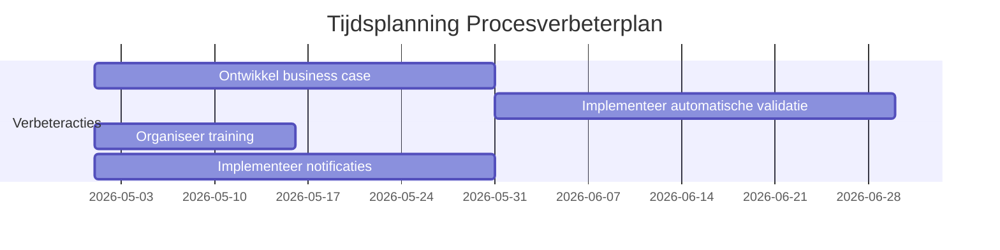
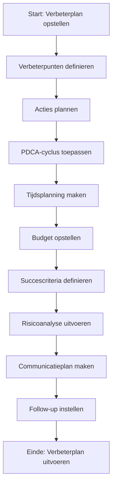
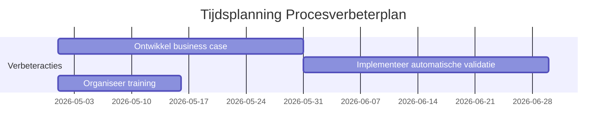
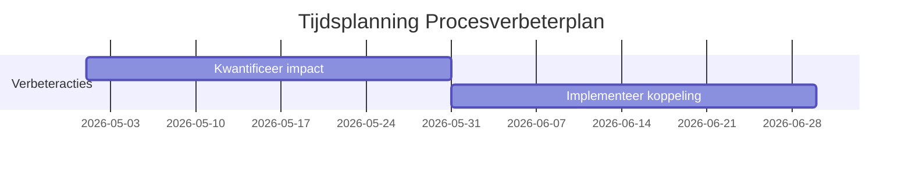

Dit Procesverbeterplan-template biedt een gestructureerde aanpak voor het plannen, uitvoeren, en monitoren van verbeteringen in {{procesnaam}}. Het doel is om:  
-  Duidelijke verbeterpunten te definiëren op basis van analyses (RCA, Procesreview).  
-  Concrete acties te plannen met verantwoordelijkheden, deadlines, en succescriteria.  
-  Voortgang te monitoren en resultaten te evalueren.  
-  Continue verbetering te waarborgen door feedback en lessen geleerd.  
-  Transparantie te creëren voor stakeholders (management, teams, klanten).

#### Eigenschappen

| Veld              | Waarde                                                                        | Toelichting                                                                                    |
| ----------------- | ----------------------------------------------------------------------------- | ---------------------------------------------------------------------------------------------- |
| PMD-nummer    | 03.09.02                                                                      | Uniek identificatienummer voor dit procesverbeterplan in het Proces Management Document (PMD). |
| Versie        | 1                                                                             | Huidige versie van dit document. Wordt geüpdaterd bij elke wijziging.                          |
| Status        | concept                                                                       | Mogelijke statussen: *concept*, *in review*, *goedgekeurd*, *gepubliceerd*, *verouderd*.       |
| Auteur        | [Naam]                                                                        | De persoon of afdeling die dit plan heeft opgesteld (meestal de procesanalist).                |
| Eigenaar      | [Naam proceseigenaar]                                                         | Verantwoordelijk voor de inhoud en actualiteit van het verbeterplan.                           |
| Datum         | 17/04/2026                                                                    | Datum van de laatste update.                                                                   |
| Gekoppeld aan | [Bijv. "Root Cause Analyse (PMD-03.09.01), Procesverbetering (PMD-03.09.00)"] | Referentie naar gerelateerde documenten.                                                       |

#### 1. Algemeen Overzicht

Geef hier een kort overzicht van het procesverbeterplan.

| Veld                      | Waarde                                                                                              | Toelichting                                       |
| ----------------------------- | ------------------------------------------------------------------------------------------------------- | ----------------------------------------------------- |
| Procesnaam                | [Naam van het proces, bijv. "Orderverwerking"]                                                          | Naam van het proces dat wordt verbeterd.              |
| Proces-ID                 | [Bijv. "PR-001"]                                                                                        | Unieke identifier.                                    |
| Doel van het verbeterplan | [Bijv. "Verminderen van doorlooptijd en fouten in de orderverwerking door automatisering en training."] | Wat het verbeterplan moet bereiken.                   |
| Scope                     | [Bijv. "Hele proces van ontvangst tot bevestiging van orders."]                                         | Wat valt binnen de scope van het verbeterplan.        |
| Betrokken partijen        | [Lijst van rollen, bijv. "Proceseigenaar, IT-afdeling, Kwaliteitsmanager, Order Team"]                  | Wie is betrokken bij het verbeterplan.                |
| Koppeling met strategie   | [Bijv. "Ondersteunt organisatiedoel 'Klanttevredenheid verhogen tot 90% in 2026'."]                     | Hoe het verbeterplan bijdraagt aan organisatiedoelen. |

#### 2. Inleiding en Context

Beschrijf hier de aanleiding voor het verbeterplan, inclusief probleemomschrijving, impact, en root causes (gebruik de Root Cause Analyse (PMD-03.09.01) als uitgangspunt).

| Veld                 | Waarde                                                                                        |
| ------------------------ | ------------------------------------------------------------------------------------------------- |
| Aanleiding           | [Bijv. "Stijgende doorlooptijd en dalende klanttevredenheid in Q1 2026."]                         |
| Probleemomschrijving | [Bijv. "Gemiddelde doorlooptijd gestegen van 18u naar 22u (+22%), NPS gedaald van 8,5 naar 8,2."] |
| Root Causes          | [Bijv. "Handmatige validatiestap, onvoldoende training, gebrek aan automatisering."]              |
| Impact               | [Bijv. "Vertraging in levering, hogere kosten, lagere klanttevredenheid."]                        |

#### 3. Verbeterpunten

Lijst hier de belangrijkste verbeterpunten op, gebaseerd op de Root Cause Analyse en Procesreview.

| Verbeterpunt            | Beschrijving                                          | Root Cause          | Gerelateerde KPI         | Prioriteit | Categorie |
| --------------------------- | --------------------------------------------------------- | ----------------------- | ---------------------------- | -------------- | ------------- |
| Automatiseren validatiestap | Implementeer automatische validatie van klantgegevens.    | Handmatige validatie    | Doorlooptijd orderverwerking | Hoog           | Proces        |
| Extra training Order Team   | Organiseer training voor nieuwe medewerkers.              | Onvoldoende training    | Aantal fouten per order      | Hoog           | Mensen        |
| Verbeter klantcommunicatie  | Implementeer automatische statusupdates.                  | Gebrek aan communicatie | Klanttevredenheid (NPS)      | Hoog           | Klant         |
| Upgrade CRM-systeem         | Upgrade naar nieuwste versie voor betere functionaliteit. | Verouderd CRM-systeem   | Systeembeschikbaarheid       | Middel         | Systemen      |

Prioriteit:

- Hoog: Kritisch voor procesprestaties, directe actie vereist.
- Middel: Belangrijk, maar niet kritiek.
- Laag: Wenselijk, maar niet urgent.

Categorie:

- Proces: Verbeteringen in de processtappen.
- Mensen: Verbeteringen in kennis, vaardigheden, of cultuur.
- Systemen: Verbeteringen in tools, software, of infrastructuur.
- Klant: Verbeteringen in klantervaring.

#### 4. Verbeteracties

Definieer hier concrete acties om de verbeterpunten te realiseren. Gebruik de PDCA-cyclus (Plan-Do-Check-Act) voor structuur.

| Actie                           | Verbeterpunt            | Beschrijving                                      | Verantwoordelijke | Startdatum | Deadline | Status | Benodigde middelen        | Kosten | Succescriteria           | Risico's           | Mitigerende maatregelen            |
| ----------------------------------- | --------------------------- | ----------------------------------------------------- | --------------------- | -------------- | ------------ | ---------- | ----------------------------- | ---------- | ---------------------------- | ---------------------- | -------------------------------------- |
| Ontwikkel business case             | Automatiseren validatiestap | Ontwikkel een business case voor automatisering.      | Proceseigenaar        | 01/05/2026     | 30/05/2026   | Gepland    | Tijd, expertise               | €1.000     | Business case goedgekeurd    | Geen budget            | Zoek alternatieve financieringsbronnen |
| Implementeer automatische validatie | Automatiseren validatiestap | Implementeer validatieregels in CRM.                  | IT-afdeling           | 01/06/2026     | 30/06/2026   | Gepland    | Ontwikkeltijd, testomgeving   | €5.000     | Validatie werkt foutloos     | Technische issues      | Test in sandbox-omgeving               |
| Organiseer training                 | Extra training Order Team   | Plan en voer training uit voor nieuwe medewerkers.    | Kwaliteitsmanager     | 01/05/2026     | 15/05/2026   | Gepland    | Trainingsmateriaal, trainer   | €2.000     | Alle medewerkers getraind    | Lage opkomst           | Maak training verplicht                |
| Implementeer notificaties           | Verbeter klantcommunicatie  | Ontwikkel en implementeer automatische statusupdates. | Sales Manager         | 01/05/2026     | 30/05/2026   | Gepland    | Ontwikkeltijd, CRM-integratie | €1.000     | Notificaties werken foutloos | Technische beperkingen | Pilot testen                           |

Status:

- Gepland: Actie is gepland maar nog niet gestart.
- In uitvoering: Actie is gestart maar nog niet afgerond.
- Afgerond: Actie is afgerond en succescriteria zijn behaald.
- Gepauzeerd: Actie is tijdelijk gestopt.
- Geannuleerd: Actie is geannuleerd.

#### 5. Tijdsplanning (Gantt Chart)

Voeg hier een tijdsplanning toe in de vorm van een Gantt Chart om de voortgang van acties visueel weer te geven. Gebruik Mermaid voor een eenvoudige weergave in Markdown.

Voorbeeld (Mermaid Gantt Chart):

#### 6. Budgetoverzicht

Geef hier een overzicht van de kosten die gepaard gaan met het verbeterplan.

| Categorie | Post               | Bedrag | Verantwoordelijke | Status    |
| ------------- | ---------------------- | ---------- | --------------------- | ------------- |
| Ontwikkeling  | Business case          | €1.000     | Proceseigenaar        | Goedgekeurd   |
| Ontwikkeling  | Automatische validatie | €5.000     | IT-afdeling           | In afwachting |
| Training      | Order Team             | €2.000     | Kwaliteitsmanager     | Goedgekeurd   |
| Ontwikkeling  | Notificaties           | €1.000     | Sales Manager         | Goedgekeurd   |
| Totaal    | &nbsp;                 | €9.000 | &nbsp;                | &nbsp;        |

#### 7. Succescriteria en KPI's

Definieer hier hoe het succes van het verbeterplan wordt gemeten. Koppel dit aan de KPI's uit de KPI-template (PMD-03.08.01).

| Succescriterium          | Gerelateerde KPI         | Huidige waarde | Doelwaarde | Meetfrequentie | Verantwoordelijke | Bron          |
| ---------------------------- | ---------------------------- | ------------------ | -------------- | ------------------ | --------------------- | ----------------- |
| Doorlooptijd orderverwerking | Doorlooptijd orderverwerking | 22 uur             | < 24 uur       | Dagelijks          | Proceseigenaar        | ERP-systeem       |
| Aantal fouten per order      | Aantal fouten per order      | 0,8%               | < 1%           | Wekelijks          | Kwaliteitsmanager     | Kwaliteitsrapport |
| Klanttevredenheid (NPS)      | Klanttevredenheid (NPS)      | 8,2                | > 8            | Maandelijks        | Sales Manager         | Klantenquête      |
| Systeembeschikbaarheid       | Systeembeschikbaarheid       | 99,2%              | > 99%          | Continu            | IT-afdeling           | Nagios            |

#### 8. Risicoanalyse

Identificeer hier potentiële risico's die de uitvoering van het verbeterplan kunnen beïnvloeden, en hoe deze kunnen worden gemitigeerd.

| Risico                  | Oorzaak                 | Impact             | Kans | Mitigerende maatregel      | Verantwoordelijke | Status    |
| --------------------------- | --------------------------- | ---------------------- | -------- | ------------------------------ | --------------------- | ------------- |
| Vertraging in implementatie | Technische issues           | Vertraagde verbetering | Middel   | Test in sandbox-omgeving       | IT-afdeling           | In uitvoering |
| Budgetoverschrijding        | Onvoorziene kosten          | Financiële impact      | Laag     | Maandelijkse budgetreview      | Proceseigenaar        | Gepland       |
| Lage opkomst training       | Gebrek aan motivatie        | Onvoldoende kennis     | Middel   | Maak training verplicht        | Kwaliteitsmanager     | Gepland       |
| Weerstand tegen verandering | Angst voor nieuwe werkwijze | Vertraagde adoptie     | Hoog     | Betrek medewerkers bij ontwerp | Proceseigenaar        | Gepland       |

Kans:

- Hoog: Risico is zeer waarschijnlijk.
- Middel: Risico is mogelijk.
- Laag: Risico is onwaarschijnlijk.

#### 9. Communicatieplan

Beschrijf hier hoe de communicatie rondom het verbeterplan wordt gemanaged.

| Doelgroep | Bericht                  | Kanaal          | Frequentie | Verantwoordelijke | Status |
| ------------- | ---------------------------- | ------------------- | -------------- | --------------------- | ---------- |
| Management    | Voortgangsrapportage         | E-mail, Presentatie | Maandelijks    | Proceseigenaar        | Gepland    |
| Order Team    | Training en updates          | Teammeeting, E-mail | Wekelijks      | Kwaliteitsmanager     | Gepland    |
| IT-afdeling   | Technische vereisten         | E-mail, Overleg     | Ad hoc         | Proceseigenaar        | Gepland    |
| Klanten       | Verbeterde klantcommunicatie | Nieuwsbrief, E-mail | Ad hoc         | Sales Manager         | Gepland    |

#### 10. Follow-up en Evaluatie

Beschrijf hier hoe de voortgang van het verbeterplan wordt gemonitord en geëvalueerd.

| Veld                        | Waarde                                                            |
| ------------------------------- | --------------------------------------------------------------------- |
| Follow-up frequentie        | [Bijv. "Wekelijks"]                                                   |
| Verantwoordelijke follow-up | [Bijv. "Proceseigenaar"]                                              |
| Evaluatiemomenten           | [Bijv. "Maandelijkse review, Afronding verbeterplan"]                 |
| Rapportage                  | [Bijv. "Wekelijkse statusupdate via e-mail, Maandelijkse rapportage"] |
| Escalatiepad                | [Bijv. "Proceseigenaar → Teamleider → Directie"]                      |

#### 11. Stappen voor het Opstellen van een Procesverbeterplan

Volg deze stappen om een effectief procesverbeterplan op te stellen:

1. Definieer het doel en scope:
  - Bepaal wat het verbeterplan moet bereiken en wat binnen de scope valt.
1. Analyseer het probleem:
  - Gebruik de Root Cause Analyse (PMD-03.09.01) om verbeterpunten te identificeren.
1. Stel verbeterpunten vast:
  - Definieer wat er moet worden verbeterd en waarom.
1. Ontwikkel verbeteracties:
  - Stel concrete acties op met PDCA-cyclus (Plan-Do-Check-Act).
1. Maak een tijdsplanning:
  - Plan de acties in de tijd (Gantt Chart).
1. Stel een budget op:
  - Bepaal de kosten van het verbeterplan.
1. Definieer succescriteria:
  - Koppel succescriteria aan KPI's.
1. Voer risicoanalyse uit:
  - Identificeer risico's en mitigerende maatregelen.
1. Maak een communicatieplan:
  - Bepaal hoe en wanneer communicatie plaatsvindt.
1. Stel follow-up in:
  - Bepaal hoe de voortgang wordt gemonitord.
1. Valideer met stakeholders:
  - Laat het verbeterplan reviewen door alle betrokken partijen.

#### 12. Tips voor een Effectief Procesverbeterplan

- Wees specifiek: Definieer duidelijke verbeterpunten en acties.  
- Gebruik data: Baseer het plan op feiten en analyses (RCA, KPI's).  
- Betrek stakeholders: Zorg dat alle betrokkenen meedenken over het plan.  
- Gebruik PDCA: Pas de PDCA-cyclus toe voor gestructureerde verbetering.  
- Monitor voortgang: Houd de voortgang van acties bij en pas aan waar nodig.  
- Communiceer duidelijk: Zorg voor transparante communicatie naar alle stakeholders.  
- Evalueer resultaten: Meet de impact van het verbeterplan op KPI's.  
- Documenteer lessons learned: Leg ervaringen vast voor toekomstige verbeterplannen.  
- Gebruik je Lean Six Sigma-kennis: Pas DMAIC toe voor datagestuurde verbetering.

#### 13. Visuele Weergave (Optioneel)

Voeg hier een visuele weergave toe van het verbeterplan, bijv. een Gantt Chart, stroomdiagram, of overzicht van verbeterpunten. Gebruik Mermaid voor een eenvoudige weergave in Markdown.

Voorbeeld (Mermaid Stroomdiagram):

#### 14. Stakeholders en Verantwoordelijkheden

Geef hier een overzicht van wie betrokken is bij het verbeterplan.

| Rol               | Verantwoordelijkheid                                                   | Betrokkenheid |
| --------------------- | -------------------------------------------------------------------------- | ----------------- |
| Proceseigenaar    | Verantwoordelijk voor de uitvoering en follow-up van het verbeterplan. | Continu           |
| Procesanalist     | Stelt het verbeterplan op en monitort voortgang.                       | Ad hoc            |
| IT-afdeling       | Ondersteunt bij technische verbeteringen.                              | Ad hoc            |
| Kwaliteitsmanager | Evalueert de impact op kwaliteit.                                      | Periodiek         |
| Management        | Valideert het verbeterplan op strategische alignement.                 | Periodiek         |
| Uitvoerend team   | Voert verbeteracties uit.                                              | Ad hoc            |

#### 15. Gerelateerde Documenten

Lijst hier alle gerelateerde documenten, zoals:

- [Link naar Root Cause Analyse (PMD-03.09.01)]
- [Link naar Procesverbetering (PMD-03.09.00)]
- [Link naar KPI's (PMD-03.08.01)]
- [Link naar Procesreview (PMD-03.08.03)]
- [Link naar RACI Matrix (PMD-03.07.03)]

#### 16. Versiehistorie

| Versie | Datum  | Wijziging   | Auteur | Goedgekeurd door |
| ---------- | ---------- | --------------- | ---------- | -------------------- |
| 1.0        | 17/04/2026 | Initiële versie | [Naam]     | [Naam]               |

#### 17. Instructies voor Gebruik

1. Definieer het doel en scope:
  - Bepaal wat het verbeterplan moet bereiken.
1. Analyseer het probleem:
  - Gebruik de Root Cause Analyse om verbeterpunten te identificeren.
1. Stel verbeterpunten vast:
  - Definieer wat er moet worden verbeterd.
1. Ontwikkel verbeteracties:
  - Stel concrete acties op met PDCA-cyclus.
1. Maak een tijdsplanning:
  - Plan de acties in de tijd (Gantt Chart).
1. Stel een budget op:
  - Bepaal de kosten van het verbeterplan.
1. Definieer succescriteria:
  - Koppel succescriteria aan KPI's.
1. Voer risicoanalyse uit:
  - Identificeer risico's en mitigerende maatregelen.
1. Maak een communicatieplan:
  - Bepaal hoe en wanneer communicatie plaatsvindt.
1. Stel follow-up in:
  - Bepaal hoe de voortgang wordt gemonitord.
1. Valideer met stakeholders:
  - Laat het verbeterplan reviewen door alle betrokken partijen.

#### 18. Voorbeeld: Ingevuld Procesverbeterplan (Orderverwerking)

###### Algemeen Overzicht

| Veld                      | Waarde                                                                                    | Toelichting                                       |
| ----------------------------- | --------------------------------------------------------------------------------------------- | ----------------------------------------------------- |
| Procesnaam                | Orderverwerking                                                                               | Naam van het proces.                                  |
| Proces-ID                 | PR-001                                                                                        | Unieke identifier.                                    |
| Doel van het verbeterplan | Verminderen van doorlooptijd en fouten in de orderverwerking door automatisering en training. | Wat het verbeterplan moet bereiken.                   |
| Scope                     | Hele proces van ontvangst tot bevestiging van orders.                                         | Wat valt binnen de scope.                             |
| Betrokken partijen        | Proceseigenaar, IT-afdeling, Kwaliteitsmanager, Order Team                                    | Wie is betrokken.                                     |
| Koppeling met strategie   | Ondersteunt organisatiedoel "Klanttevredenheid verhogen tot 90% in 2026".                     | Hoe het verbeterplan bijdraagt aan organisatiedoelen. |

###### Inleiding en Context

| Veld                 | Waarde                                                                              |
| ------------------------ | --------------------------------------------------------------------------------------- |
| Aanleiding           | Stijgende doorlooptijd en dalende klanttevredenheid in Q1 2026.                         |
| Probleemomschrijving | Gemiddelde doorlooptijd gestegen van 18u naar 22u (+22%), NPS gedaald van 8,5 naar 8,2. |
| Root Causes          | Handmatige validatiestap, onvoldoende training, gebrek aan automatisering.              |
| Impact               | Vertraging in levering, hogere kosten, lagere klanttevredenheid.                        |

###### Verbeterpunten

| Verbeterpunt            | Beschrijving                                       | Root Cause       | Gerelateerde KPI         | Prioriteit | Categorie |
| --------------------------- | ------------------------------------------------------ | -------------------- | ---------------------------- | -------------- | ------------- |
| Automatiseren validatiestap | Implementeer automatische validatie van klantgegevens. | Handmatige validatie | Doorlooptijd orderverwerking | Hoog           | Proces        |
| Extra training Order Team   | Organiseer training voor nieuwe medewerkers.           | Onvoldoende training | Aantal fouten per order      | Hoog           | Mensen        |

###### Verbeteracties

| Actie                           | Verbeterpunt            | Beschrijving                                 | Verantwoordelijke | Startdatum | Deadline | Status | Benodigde middelen      | Kosten | Succescriteria        | Risico's      | Mitigerende maatregelen            |
| ----------------------------------- | --------------------------- | ------------------------------------------------ | --------------------- | -------------- | ------------ | ---------- | --------------------------- | ---------- | ------------------------- | ----------------- | -------------------------------------- |
| Ontwikkel business case             | Automatiseren validatiestap | Ontwikkel een business case voor automatisering. | Proceseigenaar        | 01/05/2026     | 30/05/2026   | Gepland    | Tijd, expertise             | €1.000     | Business case goedgekeurd | Geen budget       | Zoek alternatieve financieringsbronnen |
| Implementeer automatische validatie | Automatiseren validatiestap | Implementeer validatieregels in CRM.             | IT-afdeling           | 01/06/2026     | 30/06/2026   | Gepland    | Ontwikkeltijd, testomgeving | €5.000     | Validatie werkt foutloos  | Technische issues | Test in sandbox-omgeving               |

###### Tijdsplanning (Mermaid)

###### Budgetoverzicht

| Categorie | Post               | Bedrag | Verantwoordelijke | Status    |
| ------------- | ---------------------- | ---------- | --------------------- | ------------- |
| Ontwikkeling  | Business case          | €1.000     | Proceseigenaar        | Goedgekeurd   |
| Ontwikkeling  | Automatische validatie | €5.000     | IT-afdeling           | In afwachting |
| Training      | Order Team             | €2.000     | Kwaliteitsmanager     | Goedgekeurd   |
| Totaal    | &nbsp;                 | €8.000 | &nbsp;                | &nbsp;        |

###### Succescriteria en KPI's

| Succescriterium          | Gerelateerde KPI         | Huidige waarde | Doelwaarde | Meetfrequentie | Verantwoordelijke | Bron          |
| ---------------------------- | ---------------------------- | ------------------ | -------------- | ------------------ | --------------------- | ----------------- |
| Doorlooptijd orderverwerking | Doorlooptijd orderverwerking | 22 uur             | < 24 uur       | Dagelijks          | Proceseigenaar        | ERP-systeem       |
| Aantal fouten per order      | Aantal fouten per order      | 0,8%               | < 1%           | Wekelijks          | Kwaliteitsmanager     | Kwaliteitsrapport |

###### Risicoanalyse

| Risico                  | Oorzaak        | Impact             | Kans | Mitigerende maatregel | Verantwoordelijke | Status    |
| --------------------------- | ------------------ | ---------------------- | -------- | ------------------------- | --------------------- | ------------- |
| Vertraging in implementatie | Technische issues  | Vertraagde verbetering | Middel   | Test in sandbox-omgeving  | IT-afdeling           | In uitvoering |
| Budgetoverschrijding        | Onvoorziene kosten | Financiële impact      | Laag     | Maandelijkse budgetreview | Proceseigenaar        | Gepland       |

###### Communicatieplan

| Doelgroep | Bericht          | Kanaal          | Frequentie | Verantwoordelijke | Status |
| ------------- | -------------------- | ------------------- | -------------- | --------------------- | ---------- |
| Management    | Voortgangsrapportage | E-mail, Presentatie | Maandelijks    | Proceseigenaar        | Gepland    |
| Order Team    | Training en updates  | Teammeeting, E-mail | Wekelijks      | Kwaliteitsmanager     | Gepland    |

###### Follow-up en Evaluatie

| Veld                        | Waarde                                                  |
| ------------------------------- | ----------------------------------------------------------- |
| Follow-up frequentie        | Wekelijks                                                   |
| Verantwoordelijke follow-up | Proceseigenaar                                              |
| Evaluatiemomenten           | Maandelijkse review, Afronding verbeterplan                 |
| Rapportage                  | Wekelijkse statusupdate via e-mail, Maandelijkse rapportage |
| Escalatiepad                | Proceseigenaar → Teamleider → Directie                      |

#### 19. Voorbeeld: Procesverbeterplan voor SIM-activatie (Telecom)

Gebaseerd op je ervaring in de telecomsector, hier een praktisch voorbeeld voor een SIM-activatieproces.

###### Algemeen Overzicht

| Veld                      | Waarde                                                                                  | Toelichting                                       |
| ----------------------------- | ------------------------------------------------------------------------------------------- | ----------------------------------------------------- |
| Procesnaam                | SIM-activatie                                                                               | Naam van het proces.                                  |
| Proces-ID                 | PR-002                                                                                      | Unieke identifier.                                    |
| Doel van het verbeterplan | Verminderen van activatietijd en fouten in SIM-activatie door automatisering en integratie. | Wat het verbeterplan moet bereiken.                   |
| Scope                     | Hele proces van aanvraag tot activatie van SIM-kaarten.                                     | Wat valt binnen de scope.                             |
| Betrokken partijen        | Proceseigenaar, Technisch Team, Klantenservice, IT-afdeling                                 | Wie is betrokken.                                     |
| Koppeling met strategie   | Ondersteunt organisatiedoel "Klanttevredenheid in telecomdiensten verhogen".                | Hoe het verbeterplan bijdraagt aan organisatiedoelen. |

###### Inleiding en Context

| Veld                 | Waarde                                                                                |
| ------------------------ | ----------------------------------------------------------------------------------------- |
| Aanleiding           | Stijgende activatietijd en dalende klanttevredenheid in Q1 2026.                          |
| Probleemomschrijving | Gemiddelde activatietijd gestegen van 45m naar 60m (+33%), CSAT gedaald van 90% naar 88%. |
| Root Causes          | Handmatige invoer, gebrek aan koppeling met klantensysteem, onvoldoende training.         |
| Impact               | Vertraagde activatie, hogere kosten, lagere klanttevredenheid.                            |

###### Verbeterpunten

| Verbeterpunt              | Beschrijving                                             | Root Cause       | Gerelateerde KPI | Prioriteit | Categorie |
| ----------------------------- | ------------------------------------------------------------ | -------------------- | -------------------- | -------------- | ------------- |
| Automatiseren activatieproces | Implementeer automatische activatie in provisioning-systeem. | Handmatige invoer    | Activatietijd        | Hoog           | Proces        |
| Implementeer koppeling        | Koppel provisioning-systeem met klantensysteem.              | Gebrek aan koppeling | Activatietijd        | Hoog           | Systemen      |

###### Verbeteracties

| Actie              | Verbeterpunt              | Beschrijving                                | Verantwoordelijke | Startdatum | Deadline | Status | Benodigde middelen      | Kosten | Succescriteria       | Risico's      | Mitigerende maatregelen |
| ---------------------- | ----------------------------- | ----------------------------------------------- | --------------------- | -------------- | ------------ | ---------- | --------------------------- | ---------- | ------------------------ | ----------------- | --------------------------- |
| Kwantificeer impact    | Automatiseren activatieproces | Voer een impactanalyse uit.                     | Proceseigenaar        | 01/05/2026     | 30/05/2026   | Gepland    | Tijd, expertise             | €500       | Impact gekwantificeerd   | Onvoldoende data  | Zorg voor complete brondata |
| Implementeer koppeling | Implementeer koppeling        | Koppel provisioning-systeem met klantensysteem. | IT-afdeling           | 01/06/2026     | 30/06/2026   | Gepland    | Ontwikkeltijd, testomgeving | €7.500     | Koppeling werkt foutloos | Technische issues | Test in sandbox-omgeving    |

###### Tijdsplanning (Mermaid)

###### Budgetoverzicht

| Categorie | Post          | Bedrag | Verantwoordelijke | Status    |
| ------------- | ----------------- | ---------- | --------------------- | ------------- |
| Analyse       | Impactanalyse     | €500       | Proceseigenaar        | Goedgekeurd   |
| Ontwikkeling  | Koppeling systeem | €7.500     | IT-afdeling           | In afwachting |
| Totaal    | &nbsp;            | €8.000 | &nbsp;                | &nbsp;        |

###### Succescriteria en KPI's

| Succescriterium      | Gerelateerde KPI     | Huidige waarde | Doelwaarde | Meetfrequentie | Verantwoordelijke | Bron             |
| ------------------------ | ------------------------ | ------------------ | -------------- | ------------------ | --------------------- | -------------------- |
| Activatietijd            | Activatietijd            | 60 min             | < 60 min       | Dagelijks          | Proceseigenaar        | Provisioning-systeem |
| Klanttevredenheid (CSAT) | Klanttevredenheid (CSAT) | 88%                | > 90%          | Maandelijks        | Klantenservice        | Klantenquête         |

###### Risicoanalyse

| Risico                  | Oorzaak          | Impact             | Kans | Mitigerende maatregel   | Verantwoordelijke | Status    |
| --------------------------- | -------------------- | ---------------------- | -------- | --------------------------- | --------------------- | ------------- |
| Vertraging in implementatie | Technische issues    | Vertraagde verbetering | Middel   | Test in sandbox-omgeving    | IT-afdeling           | In uitvoering |
| Onvoldoende data            | Ontbrekende brondata | Onnauwige analyse      | Laag     | Zorg voor complete brondata | Proceseigenaar        | Gepland       |

###### Communicatieplan

| Doelgroep  | Bericht          | Kanaal          | Frequentie | Verantwoordelijke | Status |
| -------------- | -------------------- | ------------------- | -------------- | --------------------- | ---------- |
| Management     | Voortgangsrapportage | E-mail, Presentatie | Maandelijks    | Proceseigenaar        | Gepland    |
| Technisch Team | Technische vereisten | E-mail, Overleg     | Ad hoc         | Proceseigenaar        | Gepland    |

###### Follow-up en Evaluatie

| Veld                        | Waarde                                                  |
| ------------------------------- | ----------------------------------------------------------- |
| Follow-up frequentie        | Wekelijks                                                   |
| Verantwoordelijke follow-up | Proceseigenaar                                              |
| Evaluatiemomenten           | Maandelijkse review, Afronding verbeterplan                 |
| Rapportage                  | Wekelijkse statusupdate via e-mail, Maandelijkse rapportage |
| Escalatiepad                | Proceseigenaar → Technisch Teamleider → Directie            |
