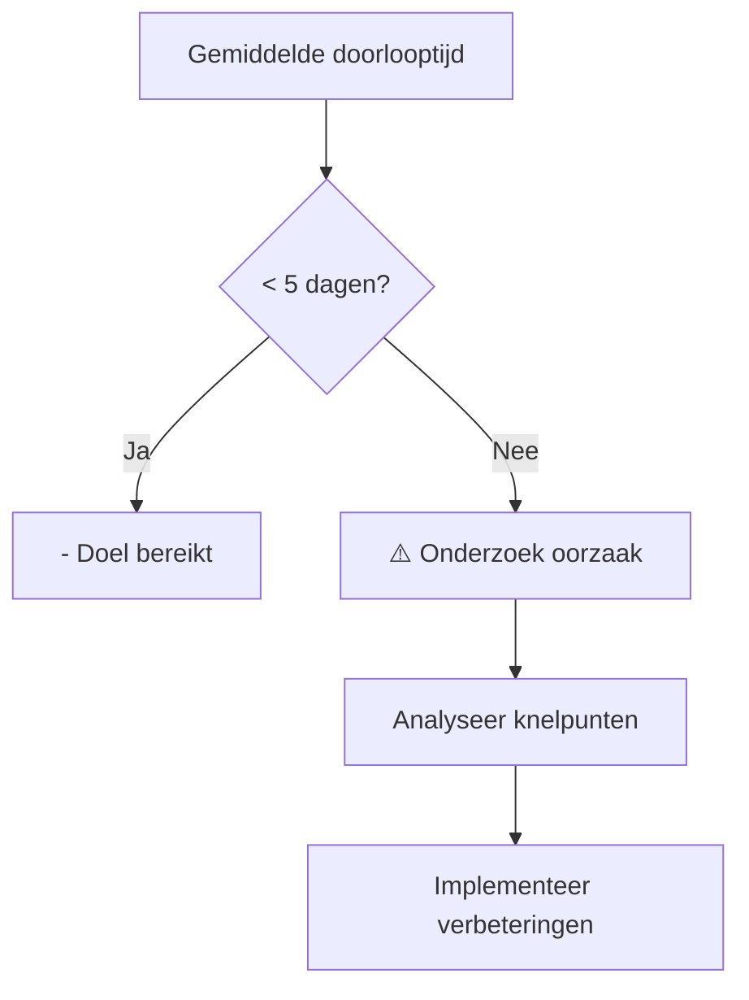

Rapportages en Key Performance Indicators (KPI’s) bieden objectieve, meetbare inzichten in de prestaties van processen. Deze bron is expliciet en essentieel voor het evalueren, sturen en verbeteren van processen. Voor een Procesdocumentalist zijn rapportages en KPI’s onmisbaar om datagedreven beslissingen te nemen en de effectiviteit van procesdocumentatie te meten.

#### Waarom zijn rapportages en KPI’s relevant?

Rapportages en KPI’s helpen om:  
- Prestaties te meten: "Doen we wat we beloven?"  
- Knelpunten te identificeren: "Waar gaat het mis?"  
- Verbeteringen te sturen: "Hoe kunnen we het beter doen?"  
- Compliance te bewaken: "Voldoen we aan afspraken en normen?"


| Type Informatie  | Voorbeelden                                          | Toepassing in procesdocumentatie                 |
| -------------------- | -------------------------------------------------------- | ---------------------------------------------------- |
| Prestatie-KPI’s  | Doorlooptijd, foutenpercentage, klanttevredenheid        | Meet of processen efficiënt en effectief zijn.       |
| Compliance-KPI’s | % GDPR-verzoeken binnen 30 dagen, aantal audits geslaagd | Bewaak of processen voldoen aan wet- en regelgeving. |
| Kwaliteits-KPI’s | Aantal herwerkingen, eerste-keer-good-rate               | Evalueer de kwaliteit van procesuitvoering.          |
| Financiële KPI’s | Kosten per proces, ROI van procesverbeteringen           | Meet de financiële impact van processen.             |


#### Hoe rapportages en KPI’s in kaart brengen?

##### Stap 1: Bepalen Welke KPI’s Relevant Zijn

Niet elke KPI is relevant voor elk proces. Gebruik de SMART-methode om KPI’s te selecteren:

- Specifiek: Duidelijk gedefinieerd (bijv. "Doorlooptijd klantverzoek").
- Meetbaar: Kwantificeerbaar (bijv. "in dagen").
- Acceptabel: Realistisch en haalbaar.
- Relevant: Gerelateerd aan procesdoelen.
- Tijdgebonden: Met een deadline (bijv. "binnen 5 werkdagen").

Voorbeeld: KPI’s voor een klantenserviceproces


| Procesdoel               | KPI                         | Doelwaarde | Meetfrequentie |
| ---------------------------- | ------------------------------- | -------------- | ------------------ |
| Snelle afhandeling verzoeken | Gemiddelde doorlooptijd verzoek | < 5 werkdagen  | Dagelijks          |
| Klanttevredenheid            | NPS-score (Net Promoter Score)  | > 8            | Maandelijks        |
| Kwaliteit                    | % verzoeken zonder herwerking   | > 95%          | Wekelijks          |


##### Stap 2: Data Verzamelen

Gebruik de volgende bronnen om data voor rapportages en KPI’s te verzamelen:

- Informatiesystemen:
  - CRM-systemen (bijv. Salesforce, HubSpot).
  - ERP-systemen (bijv. SAP, Oracle).
  - Helpdesk-systemen (bijv. Zendesk, ServiceNow).
- Handmatige registratie:
  - Excel-sheets, Google Sheets.
  - Papieren formulieren (digitaal omzetten via OCR).
- Automatische tools:
  - BI-tools (bijv. Power BI, Tableau) voor dashboards.
  - Procesmining-tools (bijv. Celonis, Minit) voor inzicht in procesflows.

##### Stap 3: Rapportages Ontwikkelen

Maak duidelijke, actiegerichte rapportages die inzicht bieden in:

1. Huidige prestaties: "Hoe doen we het nu?"
2. Trends: "Hoe ontwikkelen we ons over tijd?"
3. Afwijkingen: "Waar wijken we af van de doelwaarden?"

Voorbeeld: Dashboard voor een klantenserviceproces



Tools voor rapportages:

- Power BI: Interactieve dashboards met realtime data.
- Tableau: Visuele analyses en rapportages.
- Google Data Studio: Gratis tool voor datavisualisatie.
- Excel/Google Sheets: Eenvoudige rapportages met formules en grafieken.

##### Stap 4: KPI’s Integreren in Procesdocumentatie

1. BPMN-modellen:
  - Voeg KPI-meetpunten toe als events of taken in het proces.
  - Voorbeeld:
    ```mermaid
    graph TD
      A[Start: Verzoek ontvangen] --> B[Meet starttijd]
      B --> C[Verwerk verzoek]
      C --> D[Meet eindtijd]
      D --> E[Bereken doorlooptijd]
      E --> F{Eindig verzoek?}
      F -->|Ja| G[Stop]
      F -->|Nee| C
    ```
1. Templates:
  - Voeg een KPI-overzicht toe aan procesdocumenten:

    | KPI              | Doelwaarde | Huidige waarde | Trend | Verantwoordelijke | Actie bij afwijking |
    | -------------------- | -------------- | ------------------ | --------- | --------------------- | ----------------------- |
    | Doorlooptijd verzoek | < 5 dagen      | 6 dagen            | ⬆️        | Procesowner           | Onderzoek knelpunt      |
    | Klanttevredenheid    | > 8            | 7.5                | ⬇️        | Teamleider            | Training medewerkers    |

3. Koppeling met andere bronnen:
  - Wet- en regelgeving: Meet of processen voldoen aan compliance-eisen (bijv. "% verzoeken binnen SLA afgerond").
  - Observatie: Valideer of KPI’s overeenkomen met de daadwerkelijke procesuitvoering.

#### Valkuilen en Oplossingen


| Valkuil                           | Oplossing                                                                       |
| ------------------------------------- | ----------------------------------------------------------------------------------- |
| Te veel KPI’s meten.                  | Focus op 3-5 sleutel-KPI’s per proces.                                          |
| KPI’s zijn niet gekoppeld aan doelen. | Zorg dat elke KPI direct gerelateerd is aan een procesdoel.                     |
| Data is niet betrouwbaar.             | Gebruik geautomatiseerde systemen voor dataverzameling.                         |
| Rapportages worden niet gelezen.      | Maak visuele, beknopte rapportages met duidelijke actiepunten.                  |
| KPI’s leiden tot verkeerd gedrag.     | Zorg voor gebalanceerde KPI’s (bijv. niet alleen snelheid, maar ook kwaliteit). |


#### Praktische Tips voor de Procesdocumentalist

- Gebruik visuele hulpmiddelen:

- Maak dashboards met KPI’s (bijv. in Power BI of Tableau).
- Gebruik kleurcodering (groen/rood) om afwijkingen direct zichtbaar te maken.

- Automatiseer waar mogelijk:

- Gebruik API’s om data automatisch uit systemen te halen.
- Stel automatische alerts in bij afwijkingen (bijv. via Slack of e-mail).

- Betrek stakeholders:

- Bespreek maandelijks de KPI’s met het team en management.
- Pas KPI’s aan op basis van feedback en veranderende doelen.

- Documenteer de context:

- Leg uit waarom een KPI belangrijk is en hoe deze gemeten wordt.
- Voeg voorbeelden toe van hoe KPI’s in de praktijk werken.

#### Integratie met het 7x Framework

Rapportages en KPI’s passen binnen de volgende 7x Framework-pijlers:

1. Ontdekken & Begrijpen:
  - Identificeer kritische prestatie-indicatoren voor het proces.
1. Structureren & Ontwerpen:
  - Integreer KPI’s in procesmodellen (BPMN) en templates.
1. Implementeren & Opleveren:
  - Zorg voor toegankelijke rapportages (bijv. in Power BI of Confluence).
1. Ondersteunen & Verbeteren:
  - Gebruik KPI’s om continue verbeteringen te sturen (bijv. via PDCA-cyclus).

#### Voorbeeld: Telecomsector

In de telecomsector zijn de volgende KPI’s relevant:

- Netwerkprestaties: Uptime percentage, latentie, doorvoersnelheid.
- Klantenservice: Gemiddelde wachttijd, eerste-keer-oplossingspercentage.
- Financieel: Kosten per klant, ROI van marketingcampagnes.

Proces: Storingen oplossen


| KPI              | Doelwaarde | Huidige waarde | Trend | Actie                         |
| -------------------- | -------------- | ------------------ | --------- | --------------------------------- |
| Gemiddelde oplostijd | < 2 uur        | 2.5 uur            | ⬆️        | Onderzoek oorzaak vertraging      |
| Klanttevredenheid    | > 8            | 7.8                | ⬇️        | Verbeter communicatie met klanten |
| % storingen opgelost | > 95%          | 92%                | ⬇️        | Extra training voor technici      |


#### Tools en Resources

- Dataverzameling:
  - [Salesforce](https://www.salesforce.com) (CRM)
  - [SAP](https://www.sap.com) (ERP)
  - [Zendesk](https://www.zendesk.com) (Helpdesk)
- Datavisualisatie:
  - [Power BI](https://powerbi.microsoft.com)
  - [Tableau](https://www.tableau.com)
  - [Google Data Studio](https://datastudio.google.com)
- Procesmining:
  - [Celonis](https://www.celonis.com)
  - [Minit](https://www.minit.io)
- Automatisering:
  - [Zapier](https://zapier.com) (voor automatische datastromen)
  - [Make (voormalig Integromat)](https://www.make.com)

#### Samenvatting


| Aspect              | Toelichting                                                   |
| ----------------------- | ----------------------------------------------------------------- |
| Type bron           | Expliciet (meetbaar, objectief)                                   |
| Doel                | Prestaties meten, knelpunten identificeren, verbeteringen sturen. |
| Uitdaging           | KPI’s relevant en betrouwbaar maken.                              |
| Integratie          | BPMN-modellen, dashboards, templates, observatie.                 |
| Belangrijkste tools | Power BI, Tableau, Excel, procesmining-tools.                     |