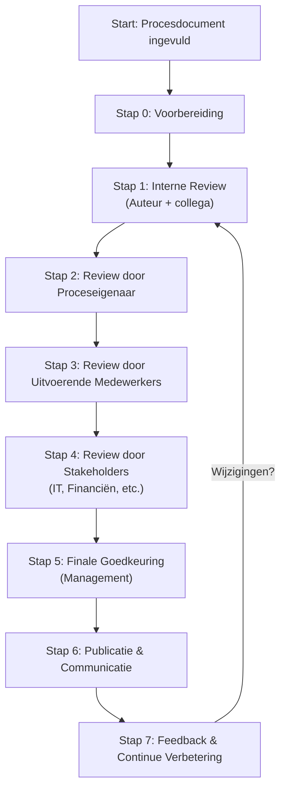

Het valideren van een procesdocument is essentieel om ervoor te zorgen dat:  
- Het document accuraat is en de werkelijke situatie weerspiegelt.  
- Het begrijpelijk is voor alle betrokkenen (uitvoerende medewerkers, management, stakeholders).  
- Het consistent is met andere processen en documentatie.  
- Het goedgekeurd is door de juiste verantwoordelijken.

Een goed gevalideerd procesdocument voorkomt misverstanden, verbetert de efficiëntie en zorgt voor vertrouwen in de documentatie.

#### Stappenplan voor Validatie

#####  Voorbereiding (Stap 0: Voorafgaand aan Validatie)

Voordat je begint met valideren, zorg ervoor dat:

- Het procesdocument volledig ingevuld is (alle templates zijn ingevuld).
- De inhoud is gebaseerd op betrouwbare bronnen (interviews, workshops, systeemdocumentatie).
- Het document visueel en tekstueel is gemodelleerd (bijv. BPMN-diagram, flowchart, tekstuele beschrijving).
- De doelgroep voor validatie is gedefinieerd (wie moet het document reviewen?).

Checklist Voorbereiding:

- Alle PDM-templates zijn ingevuld.
- Bronnen van procesinformatie zijn gedocumenteerd.
- Visuele modellen (BPMN, flowchart) zijn opgesteld.
- Doelgroep voor validatie is vastgesteld (bijv. proceseigenaar, uitvoerende medewerkers, IT, management).

##### Stap 1: Interne Review (Eerste Controle)

Doel: Zorgen dat het document intern consistent is en voldoet aan de PDM-standaarden.

###### Acties:

1. Zelfcontrole door de auteur:
  - Controleer of alle kernelementen (doel, context, stappen, rollen, KPI’s) zijn ingevuld.
  - Zorg ervoor dat de taal duidelijk en eenduidig is.
  - Controleer of visuele modellen (BPMN, flowchart) kloppen met de tekstuele beschrijving.
1. Review door een collega-documentalist:
  - Laat een tweede paar ogen (bijv. een andere procesdocumentalist) het document controleren op:
    - Consistentie (geen tegenstrijdigheden).
    - Vollledigheid (niets ontbreekt).
    - Stijl en opmaak (eenduidige terminologie, opmaak volgens PDM-standaarden).

Verantwoordelijke: Auteur + collega-documentalist.  
Tijdsduur: 1-2 dagen.

##### Stap 2: Review door Proceseigenaar

Doel: Zorgen dat het document accuraat is en de werkelijke uitvoering van het proces weerspiegelt.

###### Acties:

1. Stuur het document naar de proceseigenaar (de persoon die verantwoordelijk is voor het proces).
2. Vraag om feedback op:
  - Nauwkeurigheid: Klopt het document met de werkelijke uitvoering?
  - Vollledigheid: Ontbreken er stappen, rollen of verantwoordelijkheden?
  - Praktische bruikbaarheid: Is het document bruikbaar voor uitvoerende medewerkers?
1. Verwerk de feedback en pas het document aan waar nodig.

Verantwoordelijke: Proceseigenaar.  
Tijdsduur: 2-3 dagen.

#####  Stap 3: Review door Uitvoerende Medewerkers

Doel: Zorgen dat het document bruikbaar is voor degenen die het proces daadwerkelijk uitvoeren.

###### Acties:

1. Organiseer een review-sessie met uitvoerende medewerkers (bijv. een workshop of individuele feedbackronde).
2. Vraag om input op:
  - Begrijpelijkheid: Is het document duidelijk en eenvoudig te volgen?
  - Praktische toepasbaarheid: Kunnen medewerkers het document gebruiken tijdens hun werk?
  - Suggesties voor verbetering: Zijn er knelpunten of verbeterpunten die ontbreken?
1. Verwerk de feedback en pas het document aan.

Verantwoordelijke: Uitvoerende medewerkers.  
Tijdsduur: 3-5 dagen.

##### Stap 4: Review door Stakeholders (Cross-functionele Check)

Doel: Zorgen dat het document consistent is met andere processen en voldoet aan organisatiebrede eisen.

###### Acties:

1. Stuur het document naar relevante stakeholders (bijv. IT, Financiën, Kwaliteitsmanagement, HR).
2. Vraag om feedback op:
  - Consistentie met andere processen: Sluit het document aan op gerelateerde processen?
  - Compliance: Voldoet het document aan organisatiebrede richtlijnen en normen?
  - Systeemintegratie: Zijn alle gebruikte systemen (ERP, CRM) correct gedocumenteerd?
1. Verwerk de feedback en pas het document aan.

Verantwoordelijke: Relevante stakeholders.  
Tijdsduur: 3-5 dagen.

#####  Stap 5: Finale Goedkeuring door Management

Doel: Zorgen dat het document officieel goedgekeurd is en kan worden gepubliceerd.

###### Acties:

1. Stuur het document naar het management (bijv. afdelingshoofd, procesmanager).
2. Vraag om goedkeuring op:
  - Strategische alignement: Past het proces in de organisatiestrategie?
  - Risico’s: Zijn er risico’s die niet zijn gedekt?
  - Budget en middelen: Zijn de benodigde middelen (tijd, budget, systemen) beschikbaar?
1. Ontvang formele goedkeuring (bijv. via e-mail of handtekening).

Verantwoordelijke: Management.  
Tijdsduur: 2-3 dagen.

#####  Stap 6: Publicatie en Communicatie

Doel: Zorgen dat het document beschikbaar en bekend is bij alle betrokkenen.

###### Acties:

1. Publiceer het document op een centrale locatie (bijv. Confluence, SharePoint, intranet).
2. Archiveer oude versies (maar houd ze beschikbaar voor referentie).
3. Communiceer de publicatie aan alle betrokkenen (bijv. via e-mail, nieuwsbrief, teammeeting).
4. Zorg voor toegang: Maak het document makkelijk vindbaar en toegankelijk voor de doelgroep.

Verantwoordelijke: Auteur + communicatieteam.  
Tijdsduur: 1 dag.

##### Stap 7: Feedback en Continue Verbetering

Doel: Zorgen dat het document actueel blijft en continue wordt verbeterd.

###### Acties:

1. Verzamel feedback na publicatie (bijv. via een feedbackformulier of regelmatige reviews).
2. Houd een logboek bij van wijzigingen en verbeterpunten.
3. Plan periodieke reviews (bijv. elke 6 maanden) om het document te actualiseren.

Verantwoordelijke: Auteur + proceseigenaar.  
Tijdsduur: Doorlopend.

#### Validatieproces in Beeld

Hieronder vindt u een visuele weergave van het validatieproces in Mermaid.js. Je kunt dit diagram direct gebruiken in je documentatie (bijv. in Markdown of Confluence).

Toelichting

- Start: Het procesdocument is ingevuld en klaar voor validatie.
- Stap 0: Voorbereiding (checklist afwerken).
- Stap 1-5: Opeenvolgende reviewstappen (interne review → proceseigenaar → uitvoerende medewerkers → stakeholders → management).
- Stap 6: Publicatie en communicatie.
- Stap 7: Feedback en continue verbetering (terug naar Stap 1 als er wijzigingen zijn).

> [!tip]
> U kunt dit diagram aanpassen aan je eigen organisatie (bijv. extra stappen toevoegen of verantwoordelijken wijzigen).

####  Tips voor succesvolle validatie

1. Betrek de juiste mensen: Zorg dat alle relevante partijen (proceseigenaar, uitvoerende medewerkers, stakeholders) betrokken zijn bij de validatie.
2. Gebruik een gestructureerd feedbackformulier: Maak een checklist met vragen voor elke reviewstap (bijv. "Is het doel duidelijk?" of "Klopt de BPMN met de werkelijkheid?").
3. Houd rekening met tijd: Plan realistische deadlines voor elke stap en communiceer deze duidelijk.
4. Gebruik tools voor samenwerking: 
	- Gebruik Confluence, SharePoint of Google Docs voor het delen en reviewen van documenten.
	- Gebruik Jira of Trello voor het bijhouden van feedback en wijzigingen.
5. Documenteer alle feedback: Houd een logboek bij van alle opmerkingen en wijzigingen voor toekomstige referentie.
6. Test in de praktijk: Laat uitvoerende medewerkers het document gebruiken in de praktijk om te controleren of het werkt.

#### Voorbeeld: feedbackformulier voor validatie

Hieronder vindt u een voorbeeld van een feedbackformulier dat je kunt gebruiken tijdens de validatie.

| Categorie                | Vraag                                                           | Feedback | Actie |
| ---------------------------- | ------------------------------------------------------------------- | ------------ | --------- |
| Algemeen                 | Is het document duidelijk en begrijpelijk?                          | &nbsp;       | &nbsp;    |
| Nauwkeurigheid           | Klopt het document met de werkelijke uitvoering van het proces?     | &nbsp;       | &nbsp;    |
| Vollledigheid            | Ontbreken er stappen, rollen of verantwoordelijkheden?              | &nbsp;       | &nbsp;    |
| Consistentie             | Is het document consistent met andere processen?                    | &nbsp;       | &nbsp;    |
| Praktische bruikbaarheid | Is het document bruikbaar voor uitvoerende medewerkers?             | &nbsp;       | &nbsp;    |
| Visuele modellen         | Kloppen de BPMN/flowchart-diagrammen met de tekstuele beschrijving? | &nbsp;       | &nbsp;    |
| Taalkundig               | Zijn er taalfouten of onduidelijke formuleringen?                   | &nbsp;       | &nbsp;    |

>[!tip]
>Gebruik dit formulier digitaal (bijv. in Google Forms of Microsoft Forms) voor gemakkelijke verwerking.

#### Samenvatting: Stappenplan in het Kort

| Stap | Actie                           | Verantwoordelijke              | Tijdsduur | Doel                                           |
| -------- | ----------------------------------- | ---------------------------------- | ------------- | -------------------------------------------------- |
| 0        | Voorbereiding                       | Auteur                             | 1 dag         | Zorgen dat het document klaar is voor review.      |
| 1        | Interne Review                      | Auteur + collega                   | 1-2 dagen     | Interne consistentie en vollledigheid controleren. |
| 2        | Review door Proceseigenaar          | Proceseigenaar                     | 2-3 dagen     | Nauwkeurigheid en werkelijke uitvoering valideren. |
| 3        | Review door Uitvoerende Medewerkers | Uitvoerende medewerkers            | 3-5 dagen     | Praktische bruikbaarheid valideren.                |
| 4        | Review door Stakeholders            | Stakeholders (IT, Financiën, etc.) | 3-5 dagen     | Consistentie met andere processen valideren.       |
| 5        | Finale Goedkeuring                  | Management                         | 2-3 dagen     | Officiële goedkeuring ontvangen.                   |
| 6        | Publicatie & Communicatie           | Auteur + communicatieteam          | 1 dag         | Document beschikbaar en bekend maken.              |
| 7        | Feedback & Continue Verbetering     | Auteur + proceseigenaar            | Doorlopend    | Document actueel houden.                           |

#### Aan de Slag: Validatie in de Praktijk

Volg deze stappen om direct aan de slag te gaan met het valideren van een procesdocument:

1. Kies een procesdocument dat klaar is voor validatie.
2. Voer Stap 0 (Voorbereiding) uit: Zorg dat het document volledig is ingevuld.
3. Start met Stap 1 (Interne Review): Laat een collega het document controleren.
4. Gebruik het feedbackformulier om structuur te bieden aan de reviews.
5. Documenteer alle feedback en verwerk deze in het document.
6. Herhaal de stappen tot het document goedgekeurd is.
7. Publiceer het document en communiceer dit naar alle betrokkenen.

#### Gerelateerde Artikelen

- [Procesdocumentatiemodel (PDM)](01%20Aanpak/02%20Procesdocumentatiemodel/_index.md)
- [PDM Templates](01%20Aanpak/03%20Templates/_index.md)
- [Reviewproces](02.01.03%20Reviewproces.md)
- [Publicatieproces](02.01.04%20Publicatieproces.md)

