Een RACI-matrix is een tool om rollen en verantwoordelijkheden binnen een proces duidelijk te maken. De afkorting RACI staat voor:

- R (Responsible): Verantwoordelijk voor de uitvoering van de taak.
- A (Accountable): Eindverantwoordelijk voor de taak (vaak de proceseigenaar of manager).
- C (Consulted): Wordt geconsulteerd voor input of feedback.
- I (Informed): Wordt geïnformeerd over de uitkomst of status.

#### RACI-Matrix: Validatieproces van een Procesdocument

Hieronder vindt u de RACI-matrix voor het validatieproces, opgebouwd per stap.

##### Overzichtstabel

| Stap                                   | Actie                                         | Auteur | Collega-Documentalist | Proceseigenaar | Uitvoerende Medewerkers | Stakeholders (IT, Financiën, etc.) | Management |
| ------------------------------------------ | ------------------------------------------------- | ---------- | ------------------------- | ------------------ | --------------------------- | -------------------------------------- | -------------- |
| 0: Voorbereiding                       | Document voltooien en controleren                 | R          | C                         | I                  | I                           | I                                      | I              |
| 1: Interne Review                      | Interne consistentie en vollledigheid controleren | R          | A                         | C                  | I                           | I                                      | I              |
| 2: Review door Proceseigenaar          | Nauwkeurigheid en werkelijke uitvoering valideren | C          | I                         | A                  | C                           | I                                      | I              |
| 3: Review door Uitvoerende Medewerkers | Praktische bruikbaarheid valideren                | C          | I                         | C                  | R                           | I                                      | I              |
| 4: Review door Stakeholders            | Consistentie met andere processen valideren       | C          | I                         | C                  | I                           | R                                      | I              |
| 5: Finale Goedkeuring                  | Officiële goedkeuring verlenen                    | I          | I                         | C                  | I                           | C                                      | A              |
| 6: Publicatie & Communicatie           | Document publiceren en communiceren               | R          | C                         | I                  | I                           | I                                      | I              |
| 7: Feedback & Continue Verbetering     | Feedback verzamelen en document actualiseren      | R          | C                         | R                  | C                           | C                                      | I              |

#### Toelichting per Stap en Rol

#####  Stap 0: Voorbereiding

Actie: Document voltooien en controleren.

- Auteur (R): Zorgt ervoor dat het document volledig ingevuld is en alle templates zijn gebruikt.
- Collega-Documentalist (C): Wordt geconsulteerd voor een tweede mening over de structuur en inhoud.
- Proceseigenaar, Uitvoerende Medewerkers, Stakeholders, Management (I): Wordt geïnformeerd dat het document klaar is voor validatie.

#####  Stap 1: Interne Review

Actie: Interne consistentie en vollledigheid controleren.

- Auteur (R): Voert de eerste review uit en controleert op consistentie.
- Collega-Documentalist (A): Is eindverantwoordelijk voor de interne review en zorgt ervoor dat het document voldoet aan de PDM-standaarden.
- Proceseigenaar (C): Wordt geconsulteerd voor eventuele vragen over het proces.
- Uitvoerende Medewerkers, Stakeholders, Management (I): Wordt geïnformeerd over de status.

#####  Stap 2: Review door Proceseigenaar

Actie: Nauwkeurigheid en werkelijke uitvoering valideren.

- Proceseigenaar (A): Is eindverantwoordelijk voor de validatie en zorgt ervoor dat het document de werkelijke uitvoering weerspiegelt.
- Auteur (C): Wordt geconsulteerd voor eventuele aanpassingen.
- Uitvoerende Medewerkers (C): Wordt geconsulteerd voor input over de praktische uitvoering.
- Collega-Documentalist, Stakeholders, Management (I): Wordt geïnformeerd over de voortgang.

#####  Stap 3: Review door Uitvoerende Medewerkers

Actie: Praktische bruikbaarheid valideren.

- Uitvoerende Medewerkers (R): Zijn verantwoordelijk voor het geven van feedback over de praktische bruikbaarheid van het document.
- Auteur (C): Wordt geconsulteerd voor eventuele aanpassingen.
- Proceseigenaar (C): Wordt geconsulteerd voor input over de uitvoering.
- Collega-Documentalist, Stakeholders, Management (I): Wordt geïnformeerd over de feedback.

#####  Stap 4: Review door Stakeholders

Actie: Consistentie met andere processen valideren.

- Stakeholders (R): Zijn verantwoordelijk voor het controleren of het document consistent is met andere processen en organisatiebrede eisen.
- Auteur (C): Wordt geconsulteerd voor eventuele aanpassingen.
- Proceseigenaar (C): Wordt geconsulteerd voor input over het proces.
- Collega-Documentalist, Uitvoerende Medewerkers, Management (I): Wordt geïnformeerd over de feedback.

#####  Stap 5: Finale Goedkeuring

Actie: Officiële goedkeuring verlenen.

- Management (A): Is eindverantwoordelijk voor de officiële goedkeuring van het document.
- Proceseigenaar (C): Wordt geconsulteerd voor een laatste check.
- Stakeholders (C): Wordt geconsulteerd voor input over eventuele risico’s of compliance.
- Auteur, Collega-Documentalist, Uitvoerende Medewerkers (I): Wordt geïnformeerd over de goedkeuring.

#####  Stap 6: Publicatie & Communicatie

Actie: Document publiceren en communiceren.

- Auteur (R): Is verantwoordelijk voor het publiceren van het document op een centrale locatie.
- Collega-Documentalist (C): Wordt geconsulteerd voor input over de publicatie.
- Proceseigenaar, Uitvoerende Medewerkers, Stakeholders, Management (I): Wordt geïnformeerd over de publicatie.

#####  Stap 7: Feedback & Continue Verbetering

Actie: Feedback verzamelen en document actualiseren.

- Auteur (R): Is verantwoordelijk voor het verzamelen van feedback en het actualiseren van het document.
- Proceseigenaar (R): Is medeverantwoordelijk voor het actualiseren van het document op basis van feedback.
- Collega-Documentalist (C): Wordt geconsulteerd voor input over verbeterpunten.
- Uitvoerende Medewerkers, Stakeholders (C): Wordt geconsulteerd voor feedback.
- Management (I): Wordt geïnformeerd over wijzigingen.

#### RACI-Matrix in Beeld

Hieronder vindt u een visuele weergave van de RACI-matrix. Dit diagram helpt om de verantwoordelijkheden per stap duidelijk in beeld te brengen.

```mermaid
%% RACI-Matrix voor Validatieproces
gantt
    title RACI-Matrix: Validatieproces van een Procesdocument
    dateFormat  X
    axisFormat %s

    section Stappen
    Voorbereiding          :a1, 0, 1
    Interne Review        :a2, 1, 1
    Review Proceseigenaar  :a3, 2, 1
    Review Uitvoerend      :a4, 3, 1
    Review Stakeholders    :a5, 4, 1
    Finale Goedkeuring     :a6, 5, 1
    Publicatie             :a7, 6, 1
    Feedback               :a8, 7, 1

    section Rollen
    Auteur                 :r1, 0, 8
    Collega-Documentalist  :r2, 0, 8
    Proceseigenaar          :r3, 0, 8
    Uitvoerende Medewerkers:r4, 0, 8
    Stakeholders            :r5, 0, 8
    Management              :r6, 0, 8

    section Legenda
    R (Responsible)  :crit, 9, 1
    A (Accountable)  :crit, 10, 1
    C (Consulted)    :crit, 11, 1
    I (Informed)     :crit, 12, 1
```

#### Tips voor het gebruik van de RACI-Matrix

1. Duidelijkheid boven alles: Zorg ervoor dat één persoon per stap Accountable (A) is. Dit voorkomt verantwoordelijkheidsvacuüms.
2. Minimaliseer het aantal "R" per taak: Probeer één persoon verantwoordelijk (R) te maken per taak. Te veel "R"-rollen kunnen leiden tot verwarring.
3. Betrek de juiste mensen bij "C" (Consulted): Consulteer alleen diegenen die relevante input kunnen leveren. Te veel "C"-rollen vertragen het proces.
4. Houd "I" (Informed) beknopt: Informeer alleen diegenen die daadwerkelijk nodig zijn om op de hoogte te zijn. Te veel "I"-rollen leiden tot informatie-overload.
5. Gebruik de RACI-matrix als communicatietool: Deel de matrix met alle betrokkenen, zodat iedereen weet wat zijn/haar rol is.
6. Pas de matrix aan aan je organisatie: De bovenstaande matrix is een algemene voorbeeld. Pas de rollen en verantwoordelijkheden aan aan de specifieke structuur van je organisatie.

#### Voorbeeld: RACI-Matrix als downloadbaar template

Hieronder vindt u een eenvoudig template dat je kunt gebruiken om uw eigen RACI-matrix te maken. U kunt dit kopiëren naar Excel, Google Sheets of een projectmanagementtool zoals Jira.

| Stap / Actie      | Auteur | Collega-Documentalist | Proceseigenaar | Uitvoerende Medewerkers | Stakeholders | Management |
| --------------------- | ---------- | ------------------------- | ------------------ | --------------------------- | ---------------- | -------------- |
| Voorbereiding         | R          | C                         | I                  | I                           | I                | I              |
| Interne Review        | R          | A                         | C                  | I                           | I                | I              |
| Review Proceseigenaar | C          | I                         | A                  | C                           | I                | I              |
| Review Uitvoerend     | C          | I                         | C                  | R                           | I                | I              |
| Review Stakeholders   | C          | I                         | C                  | I                           | R                | I              |
| Finale Goedkeuring    | I          | I                         | C                  | I                           | C                | A              |
| Publicatie            | R          | C                         | I                  | I                           | I                | I              |
| Feedback              | R          | C                         | R                  | C                           | C                | I              |

#### Samenvatting: Belangrijkste Punten

- Een RACI-matrix helpt om rollen en verantwoordelijkheden duidelijk te definieren tijdens het validatieproces.
- Één persoon per stap moet Accountable (A) zijn om verantwoordelijkheidsvacuüms te voorkomen.
- Consulteer alleen relevante partijen om het proces efficiënt te houden.
- Informeer alleen diegenen die het nodig hebben om informatie-overload te voorkomen.
- Pas de matrix aan aan de specifieke behoeften en structuur van je organisatie.

#### Aan de Slag: RACI-Matrix Toepassen

Volg deze stappen om de RACI-matrix direct toe te passen in uw  organisatie:

1. Bepaal de stappen van je validatieproces (gebruik het eerdere stappenplan als basis).
2. Identificeer de rollen die betrokken zijn bij elke stap (bijv. auteur, proceseigenaar, management).
3. Vul de RACI-matrix in voor elke stap en rol.
4. Deel de matrix met alle betrokkenen en bespreek de rollen.
5. Pas de matrix aan op basis van feedback en ervaringen.

#### Gerelateerde Artikelen

- [Stappenplan: Valideren van een Procesdocument](#)
- [Procesdocumentatiemodel (PDM)](01%20Aanpak/02%20Procesdocumentatiemodel/_index.md)
- [PDM Templates](01%20Aanpak/03%20Templates/_index.md)
- [Reviewproces](02.01.03%20Reviewproces.md)