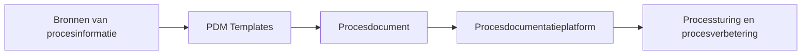

Het procesdocumentatieplatform is de digitale omgeving waarin alle procesdocumentatie binnen de organisatie samenkomt.

Binnen het [Procesdocumentatiemodel](01%20Aanpak/02%20Procesdocumentatiemodel/_index.md) vormt het platform de schakel tussen het procesdocument en het gebruik van procesinformatie in de praktijk.

Het platform is geen specifiek systeem of tool, maar een functionele laag binnen het procesdocumentatie-ecosysteem. Het kan worden gerealiseerd met bijvoorbeeld een intranet, document management systeem, wiki of gespecialiseerde BPM-omgeving.

#### Doel van het procesdocumentatieplatform

Het platform heeft drie hoofddoelen:

- Toegang bieden tot procesdocumentatie, zodat medewerkers snel kunnen vinden hoe processen werken.
- Consistente publicatie van procesinformatie, zodat altijd één actuele versie beschikbaar is.
- Ondersteunen van procesbeheer en -verbetering, door procesdocumentatie centraal en gestructureerd beschikbaar te stellen.

#### Plaats binnen het PDM

Het procesdocumentatieplatform vormt de stap na het procesdocument:

Het platform zorgt ervoor dat procesdocumenten bruikbaar worden in de organisatie.

#### Wat wordt beheerd op het platform?

Het procesdocumentatieplatform bevat onder andere:

- procesdocumenten
- procesmodellen
- templates
- versies en historie
- relaties tussen processen

Het platform vormt daarmee een centrale proceskennisomgeving.

#### Belang van het platform

Zonder een goed ingericht procesdocumentatieplatform ontstaat vaak:

- versnipperde documentatie
- onduidelijke versies
- beperkte toegankelijkheid
- lage gebruikswaarde van procesdocumentatie

Met een platform wordt procesdocumentatie een actief onderdeel van de organisatie-informatievoorziening.

#### Onderliggende pagina’s

{} [Structuur van het procesdocumentatieplatform](06.01%20Structuur%20van%20het%20procesdocumentatieplatform.md) 
{} [Versiebeheer en publicatie](06.02%20Versiebeheer%20en%20publicatie.md) 
{} [Toegang en informatievoorziening](06.03%20Toegang%20en%20informatievoorziening.md) 
{} [Relatie met procesarchitectuur](06.04%20Relatie%20met%20procesarchitectuur.md)