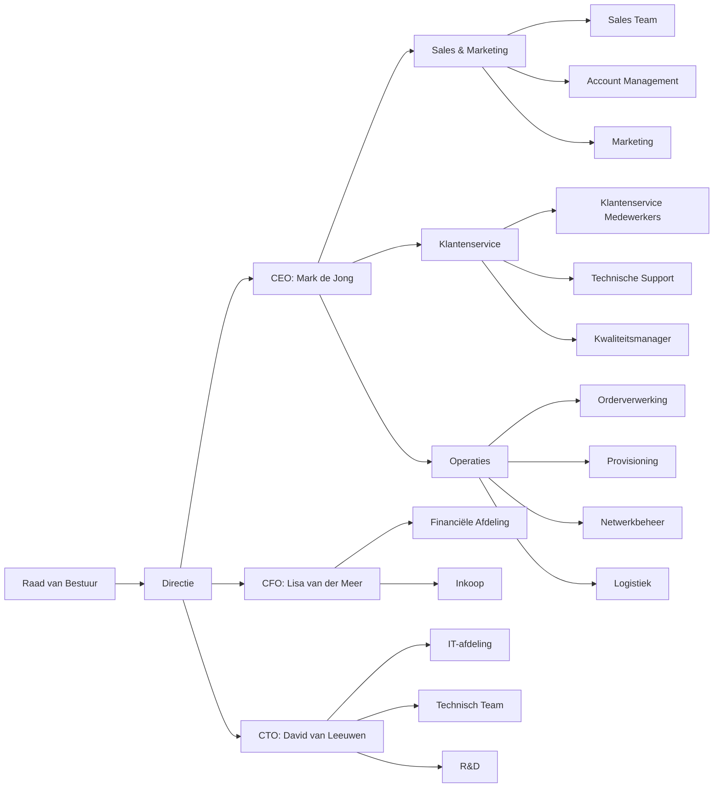

> Slogan: Slimme Connectie, Betrouwbare Dienstverlening

[[/images/markup/telecompro.jpeg]]

#### Bedrijfsprofiel

|Categorie|Beschrijving|
|---|---|
|Naam|TelecomPro B.V.|
|Sector|Telecom (B2B)|
|Opgericht|1995|
|Hoofdvestiging|Rotterdam, Nederland|
|Aantal medewerkers|250|
|Omzet (2025)|€85 miljoen|
|Kernactiviteiten|Levering van zakelijke telecomdiensten, waaronder:|

  - Missie : "Wij leveren betrouwbare, innovatieve telecomoplossingen die bedrijven helpen om efficiënter en flexibeler te werken."
  - Visie: "De voorkeurspartner zijn voor zakelijke telecom in Nederland door uitstekende service, technologische leiderschap, en klantgerichte oplossingen."
  - Kernwaarden: Betrouwbaarheid, Innovatie, Klantgerichtheid, Samenwerking, Kwaliteit
  - Doelgroep | MKB-bedrijven (50-500 medewerkers) en grote ondernemingen in Nederland. 
  - USP’s | - 24/7 klantenservice met SLA’s van 99,9% beschikbaarheid. 

#### Diensten
- Vaste telefonie (VoIP, SIP-trunking)
- Mobiele telefonie (SIM-only, bundels)
- Internet en data (fiber, DSL, 5G)
- Clouddiensten (UCaaS, CCaaS)
- Netwerkoplossingen (MPLS, SD-WAN) |  

- Maatwerkoplossingen op basis van klantbehoeften.
- Eenvoudige integratie met bestaande systemen (ERP, CRM).
- Transparante prijsstelling zonder verborgen kosten. |

#### Organisatiestructuur

Organigram TelecomPro B.V.

#### Strategische Doelen (2026-2028)

|Doel|KPI|Streefcijfer 2026|Huidige Status (Q1 2026)|
|---|---|---|---|
|Verhogen klanttevredenheid|NPS (Net Promoter Score)|> 8,5|8,2|
|Verminderen orderverwerkingtijd|Gemiddelde doorlooptijd|< 24 uur|28 uur|
|Verhogen first-time-right|Percentage orders zonder fouten|> 98%|95%|
|Verlagen kosten per order|Kosten per order|< €10|€12|
|Verhogen systeembeschikbaarheid|Uptime ERP/CRM|> 99,5%|99,2%|

#### Producten en Diensten

|Categorie|Product/Dienst|Beschrijving|Doelgroep|
|---|---|---|---|
|Vaste Telefonie|VoIP Business|Cloudgebaseerde telefonie met geavanceerde functionaliteiten.|MKB en grote ondernemingen.|
||SIP-Trunking|Directe koppeling met het telefoonnetwerk via internet.|Grote ondernemingen.|
|Mobiele Telefonie|SIM-only|Zakelijke mobiele abonnementen zonder toestel.|MKB.|
||Bundels|Mobiele abonnementen met toestel (iPhone, Samsung).|MKB en grote ondernemingen.|
|Internet & Data|Fiber Internet|Snelle en betrouwbare internetverbinding via glasvezel.|MKB en grote ondernemingen.|
||5G Data|Mobiele databundels voor bedrijven.|MKB.|
|Clouddiensten|UCaaS (Unified Communications)|Geïntegreerde communicatieoplossingen (bellen, chat, videoconferentie).|MKB en grote ondernemingen.|
||CCaaS (Contact Center)|Cloudgebaseerde klantenserviceoplossingen.|Grote ondernemingen.|
|Netwerkoplossingen|MPLS|Privé-netwerk voor veilige datacommunicatie.|Grote ondernemingen.|
||SD-WAN|Flexibele netwerkoplossing voor meervoudige locaties.|MKB en grote ondernemingen.|

#### Gebruikte Systemen

|Systeem|Type|Doel|Gebruikers|Leverancier|
|---|---|---|---|---|
|SAP ERP|ERP|Orderverwerking, financiële administratie, voorraadbeheer.|Order Team, Financiële Afdeling, Inkoop|SAP|
|Salesforce CRM|CRM|Klantbeheer, sales, marketing.|Sales Team, Account Management, Klantenservice|Salesforce|
|ServiceNow|Ticketingsysteem|Beheer van klantverzoeken en storingen.|Klantenservice, Technische Support|ServiceNow|
|Camunda|BPMN-tool|Procesmodellering en automatisering.|Procesanalist, IT-afdeling|Camunda|
|Nagios|Monitoring|Systeembeschikbaarheid en prestatiemeting.|IT-afdeling|Nagios|
|Power BI|BI-tool|Rapportage en dashboarding.|Proceseigenaar, Management|Microsoft|
|Microsoft Teams|Communicatie|Interne communicatie en samenwerking.|Alle medewerkers|Microsoft|
|Provisioning Systeem|Custom|Automatische inrichting van telecomdiensten (SIM-kaarten, VoIP).|Technisch Team, Provisioning|Eigen ontwikkeling|

##### Belangrijke Medewerkers (voor de Case Study)

|Naam|Rol|Afdeling|Verantwoordelijkheden|E-mail|
|---|---|---|---|---|
|Mark de Jong|CEO|Directie|Algehele strategie, visie, en leiderschap.|[mark.dejong@telecompro.nl](mailto:mark.dejong@telecompro.nl)|
|Lisa van der Meer|CFO|Financiële Afdeling|Financieel beheer, budgetten, KPI’s.|[lisa.vandermeer@telecompro.nl](mailto:lisa.vandermeer@telecompro.nl)|
|David van Leeuwen|CTO|IT-afdeling|Technologische strategie, systeembeheer.|[david.vanleeuwen@telecompro.nl](mailto:david.vanleeuwen@telecompro.nl)|
|Jan de Vries|Proceseigenaar Orderverwerking|Operaties|Verantwoordelijk voor het Orderverwerkingsproces.|[jan.devries@telecompro.nl](mailto:jan.devries@telecompro.nl)|
|Martin van Pelt|Procesanalist|Operaties|Procesdocumentatie, analyse, verbetering.|[martin.vanpelt@telecompro.nl](mailto:martin.vanpelt@telecompro.nl)|
|Sarah Koning|Kwaliteitsmanager|Kwaliteitsafdeling|Kwaliteitsborging, audits, compliance.|[sarah.koning@telecompro.nl](mailto:sarah.koning@telecompro.nl)|
|Lisa van der Meer|Sales Manager|Sales|Verantwoordelijk voor sales en klantacquisitie.|[lisa.vandermeer@telecompro.nl](mailto:lisa.vandermeer@telecompro.nl)|
|Emma van Dijk|Order Medewerker|Orderverwerking|Verwerking van klantorders.|[emma.vandijk@telecompro.nl](mailto:emma.vandijk@telecompro.nl)|
|David van Leeuwen|IT Medewerker|IT-afdeling|Ondersteuning van systemen.|[david.vanleeuwen@telecompro.nl](mailto:david.vanleeuwen@telecompro.nl)|
|Peter de Jong|Technisch Medewerker|Provisioning|Inrichting van telecomdiensten.|[peter.dejong@telecompro.nl](mailto:peter.dejong@telecompro.nl)|

#### Case Study: Orderverwerkingsproces bij TelecomPro B.V.

Doel: Demonstreren hoe het Procesdocumentatiemodel (PDM) van De Procesdocumentalist wordt toegepast op het Orderverwerkingsproces van TelecomPro.

##### Procesoverzicht

|Veld|Waarde|
|---|---|
|Procesnaam|Orderverwerking|
|Proces-ID|PR-001|
|Procescategorie|Primair|
|Domein|Operaties|
|Subdomein|Orderbeheer|
|Doel|Tijdige en accurate verwerking van klantorders, van ontvangst tot activatie van diensten.|
|Scope|Van ontvangst klantorder (via webshop, telefoon, of sales) tot activatie van de dienst (SIM-kaart, VoIP, internet).|
|Stakeholders|Klant, Sales Team, Order Team, Provisioning, Technisch Team, Financiële Afdeling, IT-afdeling.|

#####  Waarom dit Proces?

Het Orderverwerkingsproces is ideaal voor de case study omdat:

1. Cross-functioneel: Betrekt meerdere afdelingen (Sales, Orderverwerking, Provisioning, Technisch Team).
2. Complex: Bevat beslissingen, uitzonderingen, en knelpunten (bijv. kredietcontrole, voorraadcheck).
3. Meetbaar: Heeft duidelijke KPI’s (doorlooptijd, foutpercentage, klanttevredenheid).
4. Relevant: Is kritisch voor de bedrijfsvoering van TelecomPro.
5. Herkenbaar: Sluit aan bij jouw ervaring in de telecomsector.