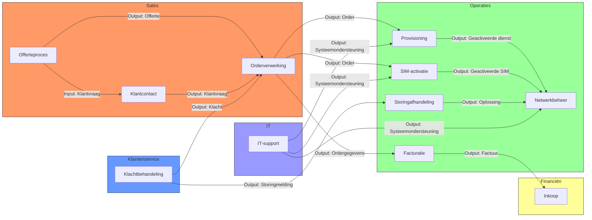

#### Inleiding

De Procesinteractie van TelecomPro B.V. beschrijft hoe processen met elkaar samenhangen en welke afhankelijkheden er bestaan. Het doel is om: 
- Inzicht te geven in de samenhang tussen processen. 
- Afhankelijkheden en interfaces tussen processen te identificeren. 
- Bottlenecks en knelpunten in processtromen te herkennen.

#### Eigenschappen

|Veld|Waarde|Toelichting|
|---|---|---|
|PMD-nummer|02.04.00|Uniek identificatienummer voor procesinteractie.|
|Versie|1.0|Huidige versie.|
|Status|Gepubliceerd|Status van het document.|
|Auteur|Martin van Pelt|Procesanalist.|
|Eigenaar|Jan de Vries|Proceseigenaar Operaties.|
|Datum|19/04/2026|Datum van laatste update.|

#### Procesinteractie

#### Toelichting Procesinteractie

##### Input/Output Relaties

|Proces|Input|Output|Volgende Proces|
|---|---|---|---|
|Offerteproces|Klantvraag|Offerte|Orderverwerking|
|Orderverwerking|Offerte, Klantvraag|Order|Provisioning, SIM-activatie, Facturatie|
|Provisioning|Order|Geactiveerde dienst|Netwerkbeheer|
|SIM-activatie|Order|Geactiveerde SIM|Netwerkbeheer|
|Netwerkbeheer|Geactiveerde dienst/SIM|Werkend netwerk|-|
|Facturatie|Ordergegevens|Factuur|Inkoop|
|Klachtbehandeling|Klacht|Storingmelding/Order|Storingafhandeling/Orderverwerking|
|Storingafhandeling|Storingmelding|Oplossing|Netwerkbeheer|
|IT-support|Systeemverzoek|Systeemondersteuning|Provisioning, SIM-activatie, Netwerkbeheer|

#### Afhankelijkheden en Interfaces

|Proces 1|Proces 2|Afhankelijkheid|Interface|Risico|Mitigatie|
|---|---|---|---|---|---|
|Orderverwerking|Provisioning|Order moet worden doorgegeven aan Provisioning.|SAP ERP → Provisioning-systeem|Vertraging in doorgave|Automatische koppeling tussen systemen.|
|Orderverwerking|Facturatie|Ordergegevens moeten worden doorgegeven aan Facturatie.|SAP ERP|Fouten in ordergegevens|Automatische validatie van ordergegevens.|
|Provisioning|Netwerkbeheer|Geactiveerde dienst moet worden doorgegeven aan Netwerkbeheer.|Provisioning-systeem → Netwerkbeheersysteem|Fouten in activatie|Automatische test na activatie.|
|Klachtbehandeling|Storingafhandeling|Storingmeldingen moeten worden doorgegeven aan Storingafhandeling.|ServiceNow|Vertraagde afhandeling|Prioritering van storingmeldingen.|
|IT-support|Provisioning|Systeemondersteuning is nodig voor Provisioning.|ServiceNow → Provisioning-systeem|Systeemstoring|24/7 IT-support beschikbaar.|

#### Gerelateerde Documenten

- [Procesarchitectuur](#) (PMD-02.00.00)
- [Proceslandkaart](#) (PMD-02.01.00)
- [Proceshiërarchie](#) (PMD-02.02.00)