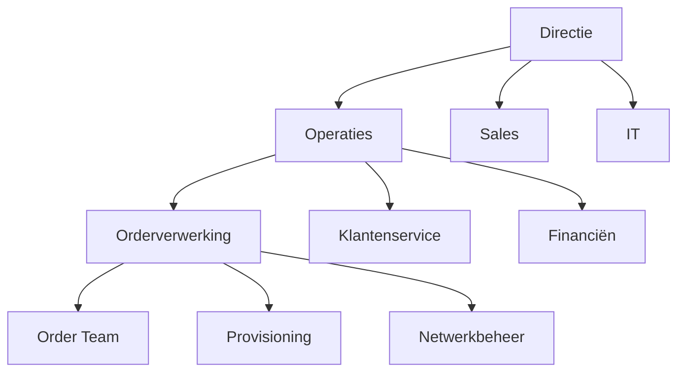

#### Inleiding

De Procescontext van het Orderverwerkingsproces (PR-001) bij TelecomPro B.V. beschrijft de interne en externe factoren die van invloed zijn op het proces. Het doel is om: -  Inzicht te geven in de omgeving waarin het proces functioneert. -  Afhankelijkheden en beïnvloedende factoren te identificeren. -  Risico’s en kansen voor het proces in kaart te brengen.

#### Eigenschappen

|Veld|Waarde|Toelichting|
|---|---|---|
|PMD-nummer|03.04.00|Uniek identificatienummer voor procescontext.|
|Versie|1.0|Huidige versie.|
|Status|Gepubliceerd|Status van het document.|
|Auteur|Martin van Pelt|Procesanalist.|
|Eigenaar|Jan de Vries|Proceseigenaar Operaties.|
|Datum|19/04/2026|Datum van laatste update.|

#### Interne Context

##### Organisatiestructuur


Toelichting:

- Orderverwerking valt onder Operaties, geleid door Jan de Vries (Proceseigenaar).
- Samenwerking met Sales (orderontvangst), Financiën (facturatie), IT (systeemondersteuning), en Klantenservice (klantcontact).

##### Betrokken Afdelingen

|Afdeling|Rol in Proces|Verantwoordelijkheid|Contactpersoon|
|---|---|---|---|
|Order Team|Uitvoerend|Verwerking van orders.|Emma van Dijk|
|Sales|Input|Ontvangst van orders.|Lisa van der Meer|
|Provisioning|Output|Activatie van diensten.|Peter de Jong|
|Financiën|Output|Facturatie.|Lisa van der Meer|
|IT|Ondersteunend|Systeemondersteuning.|David van Leeuwen|
|Klantenservice|Input/Output|Klantcontact en klachtbehandeling.|Emma van Dijk|

##### Gebruikte Systemen

|Systeem|Doel|Gebruikers|Kritikaliteit|
|---|---|---|---|
|SAP ERP|Orderverwerking, financiële administratie.|Order Team, Financiële Afdeling|Hoog|
|Salesforce CRM|Klantbeheer, orderontvangst.|Sales, Order Team|Hoog|
|Provisioning-systeem|Activatie van diensten (SIM, VoIP).|Provisioning, Technisch Team|Hoog|
|ServiceNow|Ticketingsysteem voor klantverzoeken.|Klantenservice, IT|Middel|
|Microsoft Teams|Interne communicatie.|Alle medewerkers|Laag|

##### Afhankelijkheden

|Afhankelijkheid|Type|Beschrijving|Impact bij uitval|Mitigatie|
|---|---|---|---|---|
|SAP ERP|Systeem|Orderverwerking is afhankelijk van SAP.|Proces stopt|Back-up procedure in Excel.|
|Salesforce CRM|Systeem|Orderontvangst is afhankelijk van CRM.|Orders kunnen niet worden geregistreerd.|Handmatige registratie in SAP.|
|Provisioning-systeem|Systeem|Activatie van diensten is afhankelijk van Provisioning.|Diensten kunnen niet worden geactiveerd.|Handmatige activatie (tijdrovend).|
|Sales Team|Afdeling|Orderontvangst is afhankelijk van Sales.|Orders komen niet binnen.|Directe klantcontact via Klantenservice.|

#### Externe Context

##### Markt en Concurrentie

|Factor|Beschrijving|Impact op Proces|Kans/Bedreiging|
|---|---|---|---|
|Concurrentie|Hoge concurrentie in de B2B telecommarkt.|Druk om snellere orderverwerking en betere service.|Bedreiging|
|Klantverwachtingen|Klanten verwachten snelle levering en 24/7 service.|Behoefte aan automatisering en efficiëntie.|Kans|
|Technologische ontwikkelingen|Opkomst van 5G, SD-WAN, en cloudtelefonie.|Behoefte aan nieuwe producten en aanpassingen in orderverwerking.|Kans|
|Regulering|Strengere GDPR- en telecomwetgeving.|Behoefte aan compliance in orderverwerking.|Bedreiging|

##### Leveranciers en Partners

|Partner|Rol|Afhankelijkheid|Impact bij uitval|Mitigatie|
|---|---|---|---|---|
|SAP|ERP-leverancier|Levering en ondersteuning van SAP ERP.|Proces stopt|Overstap naar alternatief ERP-systeem.|
|Salesforce|CRM-leverancier|Levering en ondersteuning van Salesforce CRM.|Orderontvangst stopt|Overstap naar alternatief CRM-systeem.|
|Ericsson|Netwerkleverancier|Levering van netwerkapparatuur.|Vertraging in levering|Alternatieve leveranciers.|
|Samsung|Toestelleverancier|Levering van mobiele toestellen.|Vertraging in levering|Alternatieve leveranciers.|

##### Klantsegmenten

|Segment|Beschrijving|Aandeel|Specifieke Behoeften|
|---|---|---|---|
|MKB|Bedrijven met 50-500 medewerkers.|60%|Flexibele bundels, schaalbaarheid.|
|Grote Ondernemingen|Bedrijven met >500 medewerkers.|30%|Maatwerkoplossingen, SLA’s.|
|Overheid|Overheidsinstanties.|10%|Veiligheid, compliance.|

#### SWOT-analyse

|Categorie|Beschrijving|Impact|Actie|
|---|---|---|---|
|Sterktes|Ervaren Order Team met kennis van telecomprocessen.|Hoog|Behoud en train nieuwe medewerkers.|
|Sterktes|Geavanceerde systemen (SAP, Salesforce).|Hoog|Optimaliseer gebruik van systemen.|
|Sterktes|Sterke samenwerking tussen afdelingen.|Hoog|Behoud goede communicatie.|
|Zwaktes|Handmatige validatiestap in orderverwerking.|Hoog|Automatiseren validatie.|
|Zwaktes|Gebrek aan real-time monitoring van KPI’s.|Middel|Implementeer Procesdashboard.|
|Kansen|Groeiende vraag naar 5G en cloudtelefonie.|Hoog|Ontwikkel nieuwe producten.|
|Kansen|Automatisering van processtappen.|Hoog|Implementeer RPA voor repetitieve taken.|
|Bedreigingen|Hoge concurrentie in de telecommarkt.|Hoog|Differentiëren op service en kwaliteit.|
|Bedreigingen|Strengere regulering (GDPR, telecomwet).|Middel|Zorg voor compliance.|

#### Visuele Weergave (Mermaid)

```mermaid
graph TD  
    A[Interne Context] --> B[Organisatiestructuur]  
    A --> C[Betrokken Afdelingen]  
    A --> D[Gebruikte Systemen]  
    A --> E[Afhankelijkheden]  
​  
    F[Externe Context] --> G[Markt en Concurrentie]  
    F --> H[Leveranciers en Partners]  
    F --> I[Klantsegmenten]  
​  
    J[SWOT-analyse] --> K[Sterktes]  
    J --> L[Zwaktes]  
    J --> M[Kansen]  
    J --> N[Bedreigingen]
```

#### Gerelateerde Documenten

- [Procesdoel](#) (PMD-03.03.00)
- [Procesinput-output](#) (PMD-03.02.01)
- [Procesbeschrijving](#) (PMD-03.07.01)