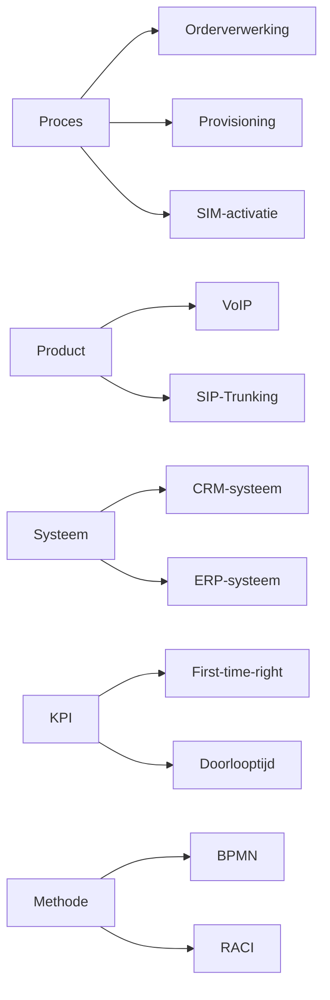

Dit glossarium bevat organisatiespecifieke begrippen die worden gebruikt in de procesdocumentatie van TelecomPro B.V.. Het doel is om:  
-  Eenduidigheid in terminologie te waarborgen.  
-  Misverstanden tussen afdelingen te voorkomen.  
-  Nieuwe medewerkers te helpen bij het begrijpen van procesdocumentatie.

## Eigenschappen

| Veld           | Waarde          | Toelichting                                     |
| -------------- | --------------- | ----------------------------------------------- |
| PMD-nummer | 03.05.01        | Uniek identificatienummer voor procesbegrippen. |
| Versie     | 1.0             | Huidige versie.                                 |
| Status     | Gepubliceerd    | Status van het document.                        |
| Auteur     | Martin van Pelt | Procesanalist.                                  |
| Eigenaar   | Jan de Vries    | Proceseigenaar Operaties.                       |
| Datum      | 19/04/2026      | Datum van laatste update.                       |

## Glossarium

| Term              | Definitie                                                                         | Categorie | Gebruik in           | Synoniemen        |
| --------------------- | ------------------------------------------------------------------------------------- | ------------- | ------------------------ | --------------------- |
| Orderverwerking   | Het proces van ontvangst tot bevestiging van een klantorder.                          | Proces        | Orderverwerking (PR-001) | Orderafhandeling      |
| Order             | Een verzoek van een klant voor een product of dienst.                                 | Proces        | Orderverwerking          | Bestelling            |
| Klantorder        | Een order die door een klant is geplaatst.                                            | Proces        | Orderverwerking          | -                     |
| Productieopdracht | Een opdracht voor Provisioning om een dienst te activeren.                            | Proces        | Orderverwerking          | Activatieopdracht     |
| Orderbevestiging  | Een bevestiging die naar de klant wordt gestuurd na ontvangst van de order.           | Document      | Orderverwerking          | Bevestigingsmail      |
| Validatie         | Controle of gegevens (bijv. klantgegevens) compleet en correct zijn.                  | Activiteit    | Orderverwerking          | Controle, Verificatie |
| Provisioning      | Het proces van het inrichten en activeren van telecomdiensten.                        | Proces        | Provisioning (PR-003)    | Activatie             |
| SIM-activatie     | Het proces van het activeren van een SIM-kaart.                                       | Proces        | SIM-activatie (PR-002)   | -                     |
| VoIP              | Voice over IP; telefonie via internet.                                                | Product       | Orderverwerking          | IP-telefonie          |
| SIP-Trunking      | Een dienst die bedrijven in staat stelt om telefoongesprekken via internet te voeren. | Product       | Orderverwerking          | -                     |
| CRM-systeem       | Customer Relationship Management-systeem voor klantbeheer.                            | Systeem       | Orderverwerking          | Salesforce            |
| ERP-systeem       | Enterprise Resource Planning-systeem voor bedrijfsprocessen.                          | Systeem       | Orderverwerking          | SAP                   |
| First-time-right  | Percentage orders dat in één keer correct wordt verwerkt.                             | KPI           | Orderverwerking          | FTR                   |
| Doorlooptijd      | Tijd tussen ontvangst en bevestiging van een order.                                   | KPI           | Orderverwerking          | Lead time             |
| Kredietstatus     | De kredietwaardigheid van een klant.                                                  | Data          | Orderverwerking          | Kredietcheck          |
| Voorraad          | Beschikbare hoeveelheid van een product of dienst.                                    | Data          | Orderverwerking          | Stock                 |
| SLA               | Service Level Agreement; afspraken over prestatieniveaus.                             | Contract      | Alle processen           | Service Level         |
| GDPR              | General Data Protection Regulation; Europese privacywetgeving.                        | Wettelijk     | Alle processen           | AVG                   |
| ISO 9001          | Internationale norm voor kwaliteitsmanagement.                                        | Norm          | Alle processen           | -                     |
| BPMN              | Business Process Model and Notation; standaard voor procesmodellering.                | Methode       | Procesmodellering        | -                     |
| RACI              | Responsible, Accountable, Consulted, Informed; methode voor rolverdeling.             | Methode       | Procesrollen             | -                     |

## Visuele Weergave (Mermaid)

## Gerelateerde Documenten

- [Proceseigenschappen](#) (PMD-03.05.00)
- [Procesbeschrijving](#) (PMD-03.07.01)