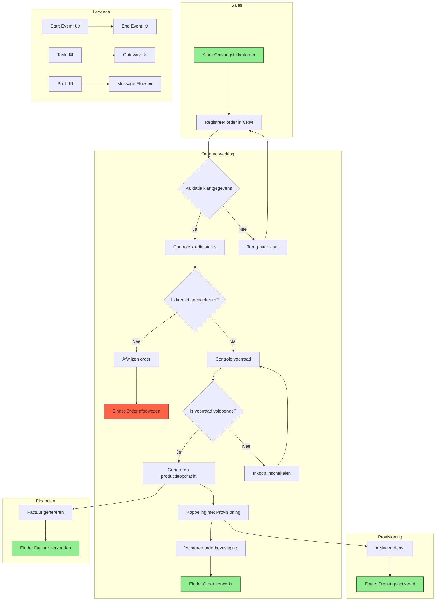

Dit BPMN-diagram visualiseert het Orderverwerkingsproces (PR-001) bij TelecomPro B.V. op een gedetailleerde en gestandaardiseerde manier. Het diagram toont:  
- Hoofdstroom van het proces (90% van de orders).  
- Uitzonderingen (bijv. onvolledige orders, kredietproblemen, onvoldoende voorraad).  
- Beslissingen (bijv. validatie, voorraadcontrole, kredietcheck).  
- Verantwoordelijkheden per stap (via Pools/Lanes).  
- Systemen die worden gebruikt (SAP ERP, Salesforce CRM, Provisioning-systeem).

#### Eigenschappen

| Veld          | Waarde                                                          | Toelichting                              |
| ----------------- | ------------------------------------------------------------------- | -------------------------------------------- |
| PMD-nummer    | 03.06.01                                                            | Uniek identificatienummer voor BPMN-diagram. |
| Versie        | 1.0                                                                 | Huidige versie.                              |
| Status        | Gepubliceerd                                                        | Status van het document.                     |
| Auteur        | Martin van Pelt                                                     | Procesanalist.                               |
| Eigenaar      | Jan de Vries                                                        | Proceseigenaar Operaties.                    |
| Datum         | 19/04/2026                                                          | Datum van laatste update.                    |
| Gekoppeld aan | Procesmodellering (PMD-03.06.00), Procesbeschrijving (PMD-03.07.01) | Gerelateerde documenten.                     |

#### BPMN-diagram (Mermaid)

#### Toelichting BPMN-diagram

##### Hoofdstroom (90% van de orders)

1. Start: Ontvangst klantorder
  - Trigger: Klant plaatst een order via webshop, telefoon, of sales.
  - Systeem: Salesforce CRM.
  - Verantwoordelijke: Sales Team.
1. Registreer order in CRM
  - Activiteit: Order Medewerker registreert de order in Salesforce CRM.
  - Input: Klantorder (digitaal formulier of telefoongesprek).
  - Output: Geregistreerde order in CRM.
  - Systeem: Salesforce CRM.
  - Verantwoordelijke: Order Team.
1. Validatie klantgegevens
  - Beslissing (Exclusive Gateway): Zijn de klantgegevens (naam, adres, contactgegevens) compleet en correct?
    - Ja: Doorgaan naar Controle kredietstatus.
    - Nee: Terug naar klant voor aanvulling gegevens.
1. Controle kredietstatus
  - Activiteit: Order Medewerker controleert of de klant kredietwaardig is.
  - Systeem: SAP ERP (koppeling met CRM).
  - Verantwoordelijke: Order Team.
1. Is krediet goedgekeurd? (Exclusive Gateway)
  - Beslissing: Is de kredietstatus van de klant goedgekeurd?
    - Ja: Doorgaan naar Controle voorraad.
    - Nee: Order wordt afgewezen.
1. Controle voorraad
  - Activiteit: Order Medewerker controleert of de gevraagde producten/diensten op voorraad zijn.
  - Systeem: SAP ERP.
  - Verantwoordelijke: Order Team.
1. Is voorraad voldoende? (Exclusive Gateway)
  - Beslissing: Is de voorraad voldoende voor de order?
    - Ja: Doorgaan naar Genereren productieopdracht.
    - Nee: Inkoop inschakelen om voorraad aan te vullen.
1. Genereren productieopdracht
  - Activiteit: Order Medewerker zet de klantorder om in een productieopdracht in SAP ERP.
  - Output: Productieopdracht (digitaal).
  - Systeem: SAP ERP.
  - Verantwoordelijke: Order Team.
1. Koppeling met Provisioning
  - Activiteit: Productieopdracht wordt automatisch doorgegeven aan het Provisioning-systeem.
  - Systeem: SAP ERP → Provisioning-systeem.
  - Verantwoordelijke: Order Team.
1. Versturen orderbevestiging
  - Activiteit: Order Medewerker verstuurt een orderbevestiging naar de klant.
    - Output: Orderbevestiging (e-mail).
    - Systeem: Salesforce CRM.
    - Verantwoordelijke: Order Team.
1. Einde: Order verwerkt
  - Resultaat: Order is succesvol verwerkt en de klant heeft een bevestiging ontvangen.

##### Uitzonderingen

1. Terug naar klant (Validatie klantgegevens)
  - Oorzaak: Klantgegevens zijn onvolledig of onjuist.
  - Actie: Order Medewerker neemt contact op met de klant voor aanvulling.
  - Verantwoordelijke: Order Team.
1. Afwijzen order (Kredietcontrole)
  - Oorzaak: Klant is niet kredietwaardig.
  - Actie: Order wordt afgewezen en de klant wordt geïnformeerd via e-mail.
  - Verantwoordelijke: Order Team.
1. Inkoop inschakelen (Voorraadcontrole)
  - Oorzaak: Voorraad is onvoldoende voor de order.
  - Actie: Inkoop wordt ingeschakeld om voorraad aan te vullen.
  - Verantwoordelijke: Inkoop.

##### Beslissingen

| Beslissing          | Type Gateway | Criteria                               | Opties | Verantwoordelijke |
| ----------------------- | ---------------- | ------------------------------------------ | ---------- | --------------------- |
| Is de order compleet?   | Exclusive (XOR)  | Alle verplichte velden zijn ingevuld.      | Ja / Nee   | Order Medewerker      |
| Is krediet goedgekeurd? | Exclusive (XOR)  | Klant heeft een goede kredietstatus.   | Ja / Nee   | Order Medewerker      |
| Is voorraad voldoende?  | Exclusive (XOR)  | Voorraad is beschikbaar voor de order. | Ja / Nee   | Order Medewerker      |

#### Symbolen en Legenda

| Symbool | Naam          | Beschrijving               | Voorbeeld                 |
| ----------- | ----------------- | ------------------------------ | ----------------------------- |
| ⭕           | Start Event       | Begin van het proces.          | Ontvangst klantorder          |
| ⊙           | End Event         | Einde van het proces.          | Order verwerkt                |
| 🟦          | Task              | Een activiteit of stap.        | Registreer order in CRM       |
| ✕           | Exclusive Gateway | Keuzepunt (XOR).               | Is de order compleet?         |
| ⊕           | Inclusive Gateway | Parallelle paden (OR).         | -                             |
| +           | Parallel Gateway  | Synchrone paden (AND).         | -                             |
| 🟨          | Pool              | Een afdeling of rol.           | Sales, Orderverwerking        |
| ➡️          | Sequence Flow     | Volgorde van activiteiten.     | Pijlen tussen stappen         |
| 📄          | Data Object       | Gegevens die worden gebruikt.  | Klantorder, Productieopdracht |
| 🟪          | Message Flow      | Communicatie tussen processen. | Koppeling met Provisioning    |

#### Verantwoordelijkheden per Pool/Lane

| Pool/Lane       | Beschrijving                                       | Verantwoordelijke | Betrokken Activiteiten                                                                                                                              |
| ------------------- | ------------------------------------------------------ | --------------------- | ------------------------------------------------------------------------------------------------------------------------------------------------------- |
| Sales           | Afdeling verantwoordelijk voor orderontvangst.         | Sales Team            | Ontvangst klantorder, Registreer order in CRM                                                                                                           |
| Orderverwerking | Afdeling verantwoordelijk voor orderverwerking.        | Order Team            | Validatie klantgegevens, Controle kredietstatus, Controle voorraad, Genereren productieopdracht, Koppeling met Provisioning, Versturen orderbevestiging |
| Provisioning    | Afdeling verantwoordelijk voor activatie van diensten. | Provisioning          | Activeer dienst                                                                                                                                         |
| Financiën       | Afdeling verantwoordelijk voor facturatie.             | Financiële Afdeling   | Factuur genereren                                                                                                                                       |

#### Systemen en Tools

| Systeem/Tool         | Doel                                                   | Gebruik in Proces                                                        | Verantwoordelijke           |
| ------------------------ | ---------------------------------------------------------- | ---------------------------------------------------------------------------- | ------------------------------- |
| Salesforce CRM       | Klantbeheer en orderontvangst.                             | Registreer order in CRM, Validatie klantgegevens, Versturen orderbevestiging | Order Team, Sales Team          |
| SAP ERP              | Orderverwerking, voorraadbeheer, financiële administratie. | Controle kredietstatus, Controle voorraad, Genereren productieopdracht       | Order Team, Financiële Afdeling |
| Provisioning-systeem | Activatie van telecomdiensten.                             | Koppeling met Provisioning, Activeer dienst                                  | Provisioning                    |
| E-mail (Outlook)     | Communicatie met klanten.                                  | Versturen orderbevestiging                                                   | Order Team                      |
#### Gerelateerde Documenten

- [Procesmodellering](#) (PMD-03.06.00)
- [Procesbeschrijving](#) (PMD-03.07.01)
- [Swimlane Diagram](#) (PMD-03.06.03)
- [Flowchart](#) (PMD-03.06.02)

#### Versiehistorie

| Versie | Datum  | Wijziging   | Auteur      | Goedgekeurd door |
| ---------- | ---------- | --------------- | --------------- | -------------------- |
| 1.0        | 19/04/2026 | Initiële versie | Martin van Pelt | Jan de Vries         |