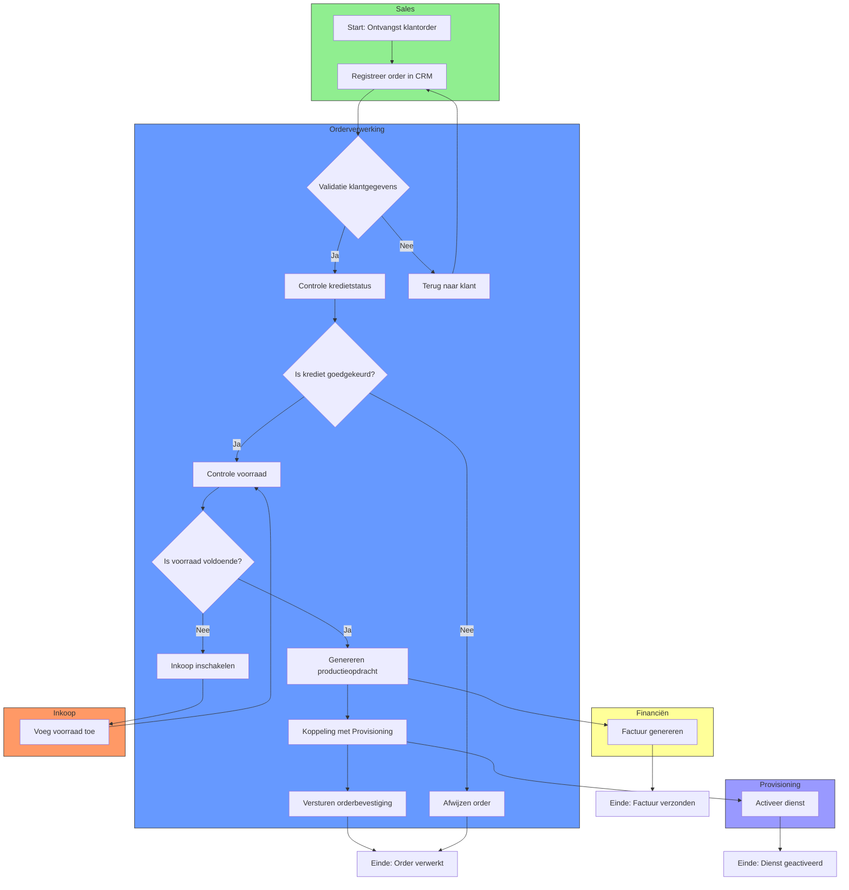

Dit Swimlane-diagram visualiseert het Orderverwerkingsproces (PR-001) bij TelecomPro B.V. met een duidelijke verdeling van verantwoordelijkheden per afdeling. Het doel is om:  
- Verantwoordelijkheden per afdeling visueel in kaart te brengen.  
- Samenwerking tussen afdelingen te verduidelijken.  
- Bottlenecks en knelpunten in de processtroom te identificeren.

#### Eigenschappen

| Veld          | Waarde                                                                               | Toelichting                                  |
| ----------------- | ---------------------------------------------------------------------------------------- | ------------------------------------------------ |
| PMD-nummer    | 03.06.03                                                                                 | Uniek identificatienummer voor Swimlane-diagram. |
| Versie        | 1.0                                                                                      | Huidige versie.                                  |
| Status        | Gepubliceerd                                                                             | Status van het document.                         |
| Auteur        | Martin van Pelt                                                                          | Procesanalist.                                   |
| Eigenaar      | Jan de Vries                                                                             | Proceseigenaar Operaties.                        |
| Datum         | 19/04/2026                                                                               | Datum van laatste update.                        |
| Gekoppeld aan | Procesmodellering (PMD-03.06.00), BPMN (PMD-03.06.01), Procesbeschrijving (PMD-03.07.01) | Gerelateerde documenten.                         |

#### Diagram

#### Toelichting Swimlane-diagram

##### Swimlanes (Afdelingen)

| Swimlane        | Beschrijving                                           | Verantwoordelijke | Betrokken Activiteiten                                                                                                                              |
| ------------------- | ---------------------------------------------------------- | --------------------- | ------------------------------------------------------------------------------------------------------------------------------------------------------- |
| Sales           | Afdeling verantwoordelijk voor orderontvangst.         | Sales Team            | Ontvangst klantorder, Registreer order in CRM                                                                                                           |
| Orderverwerking | Afdeling verantwoordelijk voor orderverwerking.        | Order Team            | Validatie klantgegevens, Controle kredietstatus, Controle voorraad, Genereren productieopdracht, Koppeling met Provisioning, Versturen orderbevestiging |
| Provisioning    | Afdeling verantwoordelijk voor activatie van diensten. | Provisioning          | Activeer dienst                                                                                                                                         |
| Financiën       | Afdeling verantwoordelijk voor facturatie.             | Financiële Afdeling   | Factuur genereren                                                                                                                                       |
| Inkoop          | Afdeling verantwoordelijk voor voorraadbeheer.         | Inkoop                | Voeg voorraad toe                                                                                                                                       |

##### Processtroom per Swimlane

###### Sales

1. Start: Ontvangst klantorder
  - Klant plaatst een order via webshop, telefoon, of sales.
1. Registreer order in CRM
  - Sales Medewerker registreert de order in Salesforce CRM.

###### Orderverwerking

1. Validatie klantgegevens
  - Order Medewerker controleert of klantgegevens compleet en correct zijn.
  - Beslissing: Is de order compleet?
    - Ja: Doorgaan naar Controle kredietstatus.
    - Nee: Terug naar klant voor aanvulling gegevens.
1. Controle kredietstatus
  - Order Medewerker controleert of de klant kredietwaardig is.
  - Beslissing: Is krediet goedgekeurd?
    - Ja: Doorgaan naar Controle voorraad.
    - Nee: Order wordt afgewezen.
1. Controle voorraad
  - Order Medewerker controleert of de voorraad voldoende is.
  - Beslissing: Is voorraad voldoende?
    - Ja: Doorgaan naar Genereren productieopdracht.
    - Nee: Inkoop inschakelen.
1. Genereren productieopdracht
  - Order Medewerker zet de klantorder om in een productieopdracht in SAP ERP.
1. Koppeling met Provisioning
  - Productieopdracht wordt automatisch doorgegeven aan Provisioning.
1. Versturen orderbevestiging
  - Order Medewerker verstuurt een orderbevestiging naar de klant.

###### Provisioning

1. Activeer dienst
  - Provisioning Medewerker activeert de telecomdienst (SIM, VoIP, internet).

###### Financiën

1. Factuur genereren
  - Financieel Medewerker genereert een factuur voor de klant.

###### Inkoop

1. Voeg voorraad toe
  - Inkoop Medewerker schakelt leveranciers in om voorraad aan te vullen.

#### Gerelateerde Documenten

- [Procesmodellering](#) (PMD-03.06.00)
- [BPMN](#) (PMD-03.06.01)
- [Procesbeschrijving](#) (PMD-03.07.01)
- [RACI Matrix](#) (PMD-03.07.03)

#### Versiehistorie

| Versie | Datum  | Wijziging   | Auteur      | Goedgekeurd door |
| ---------- | ---------- | --------------- | --------------- | -------------------- |
| 1.0        | 19/04/2026 | Initiële versie | Martin van Pelt | Jan de Vries         |