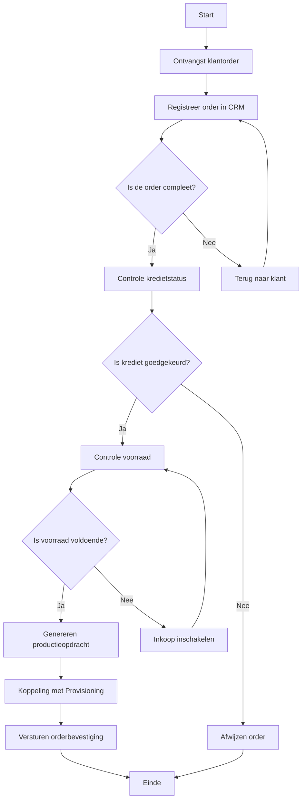

Dit Flowchart biedt een eenvoudige, visuele weergave van het Orderverwerkingsproces (PR-001) bij TelecomPro B.V.. Het doel is om:  
- Processtappen op een begrijpelijke manier weer te geven.  
- Beslissingen en uitzonderingen in kaart te brengen.  
- Training en communicatie te ondersteunen met een duidelijke visuele weergave.

#### Eigenschappen

| Veld          | Waarde                                                                               | Toelichting                           |
| ----------------- | ---------------------------------------------------------------------------------------- | ----------------------------------------- |
| PMD-nummer    | 03.06.02                                                                                 | Uniek identificatienummer voor Flowchart. |
| Versie        | 1.0                                                                                      | Huidige versie.                           |
| Status        | Gepubliceerd                                                                             | Status van het document.                  |
| Auteur        | Martin van Pelt                                                                          | Procesanalist.                            |
| Eigenaar      | Jan de Vries                                                                             | Proceseigenaar Operaties.                 |
| Datum         | 19/04/2026                                                                               | Datum van laatste update.                 |
| Gekoppeld aan | Procesmodellering (PMD-03.06.00), BPMN (PMD-03.06.01), Procesbeschrijving (PMD-03.07.01) | Gerelateerde documenten.                  |

#### Diagram

#### Toelichting Flowchart

##### Symbolen en Legenda

| Symbool   | Naam   | Beschrijving               | Voorbeeld                                 |
| ------------- | ---------- | ------------------------------ | --------------------------------------------- |
| Ovaal     | Start/End  | Begin of einde van het proces. | Start, Einde                                  |
| Rechthoek | Activiteit | Een stap in het proces.        | Ontvangst klantorder, Registreer order in CRM |
| Ruit      | Beslissing | Een keuzepunt in het proces.   | Is de order compleet?                         |
| Pijl      | Stroom     | Richting van de processtroom.  | →                                             |
| Lijn      | Verbinding | Verbinding tussen symbolen.    | -                                             |

##### Processtappen

| Stap                    | Symbool | Beschrijving                                                | Verantwoordelijke | Systeem/Tool               |
| --------------------------- | ----------- | --------------------------------------------------------------- | --------------------- | ------------------------------ |
| Start                       | Ovaal       | Begin van het proces.                                           | -                     | -                              |
| Ontvangst klantorder        | Rechthoek   | Klant plaatst een order via webshop, telefoon, of sales.        | Sales Team            | Webshop, Salesforce CRM        |
| Registreer order in CRM     | Rechthoek   | Order Medewerker registreert de order in Salesforce CRM.        | Order Team            | Salesforce CRM                 |
| Is de order compleet?       | Ruit        | Beslissing: Zijn alle verplichte velden ingevuld?               | Order Team            | Salesforce CRM                 |
| Controle kredietstatus      | Rechthoek   | Order Medewerker controleert of de klant kredietwaardig is.     | Order Team            | SAP ERP                        |
| Is krediet goedgekeurd?     | Ruit        | Beslissing: Is de kredietstatus goedgekeurd?                    | Order Team            | SAP ERP                        |
| Controle voorraad           | Rechthoek   | Order Medewerker controleert of de voorraad voldoende is.       | Order Team            | SAP ERP                        |
| Is voorraad voldoende?      | Ruit        | Beslissing: Is de voorraad voldoende voor de order?             | Order Team            | SAP ERP                        |
| Genereren productieopdracht | Rechthoek   | Order Medewerker zet de klantorder om in een productieopdracht. | Order Team            | SAP ERP                        |
| Koppeling met Provisioning  | Rechthoek   | Productieopdracht wordt doorgegeven aan Provisioning.           | Order Team            | SAP ERP → Provisioning-systeem |
| Versturen orderbevestiging  | Rechthoek   | Order Medewerker verstuurt een orderbevestiging naar de klant.  | Order Team            | Salesforce CRM                 |
| Einde                       | Ovaal       | Einde van het proces.                                           | -                     | -                              |

##### Beslissingen

| Beslissing          | Opties | Actie bij "Ja"                        | Actie bij "Nee" |
| ----------------------- | ---------- | ----------------------------------------- | ------------------- |
| Is de order compleet?   | Ja / Nee   | Doorgaan naar Controle kredietstatus      | Terug naar klant    |
| Is krediet goedgekeurd? | Ja / Nee   | Doorgaan naar Controle voorraad           | Afwijzen order      |
| Is voorraad voldoende?  | Ja / Nee   | Doorgaan naar Genereren productieopdracht | Inkoop inschakelen  |

#### Gerelateerde Documenten

- [Procesmodellering](#) (PMD-03.06.00)
- [BPMN](#) (PMD-03.06.01)
- [Swimlane Diagram](#) (PMD-03.06.03)
- [Procesbeschrijving](#) (PMD-03.07.01)

#### Versiehistorie

| Versie | Datum  | Wijziging   | Auteur      | Goedgekeurd door |
| ---------- | ---------- | --------------- | --------------- | -------------------- |
| 1.0        | 19/04/2026 | Initiële versie | Martin van Pelt | Jan de Vries         |