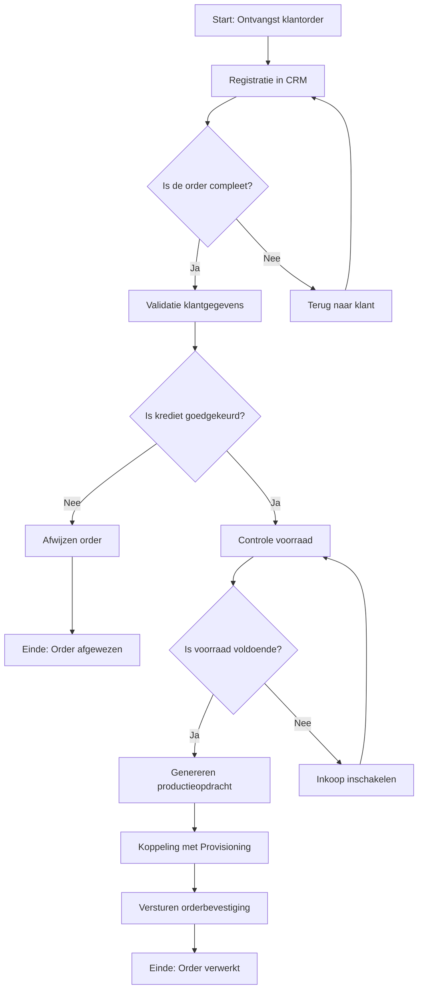
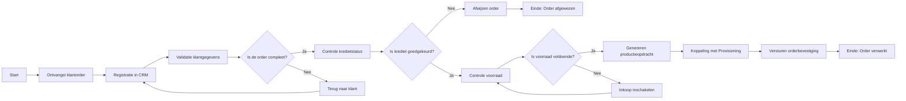

Dit document biedt een uitgebreide uitwerking van het Orderverwerkingsproces (PR-001) bij TelecomPro B.V., inclusief:  
-  Gedetailleerde processtappen met verantwoordelijkheden en systemen.  
-  Uitzonderingen en varianten van het proces.  
-  Koppeling met andere processen en documentatie.

## Eigenschappen

| Veld           | Waarde          | Toelichting                                      |
| -------------- | --------------- | ------------------------------------------------ |
| PMD-nummer | 03.07.00        | Uniek identificatienummer voor procesuitwerking. |
| Versie     | 1.0             | Huidige versie.                                  |
| Status     | Gepubliceerd    | Status van het document.                         |
| Auteur     | Martin van Pelt | Procesanalist.                                   |
| Eigenaar   | Jan de Vries    | Proceseigenaar Operaties.                        |
| Datum      | 19/04/2026      | Datum van laatste update.                        |

## Procesoverzicht

| Veld                 | Waarde                                           |
| ------------------------ | ---------------------------------------------------- |
| Procesnaam           | Orderverwerking                                      |
| Proces-ID            | PR-001                                               |
| Doel                 | Tijdige en accurate verwerking van klantorders.      |
| Scope                | Van ontvangst klantorder tot activatie van diensten. |
| Betrokken afdelingen | Sales, Order Team, Provisioning, Financiën, IT       |

## Processtappen

| Stap | Activiteit              | Beschrijving                                                                   | Verantwoordelijke | Systeem/Tool               | Duur | Input                  | Output                   | Beslissing          | Uitzonderingen                     |
| -------- | --------------------------- | ---------------------------------------------------------------------------------- | --------------------- | ------------------------------ | -------- | -------------------------- | ---------------------------- | ----------------------- | -------------------------------------- |
| 1        | Ontvangst klantorder        | Klant plaatst een order via webshop, telefoon, of sales.                           | Sales Team            | Webshop, Salesforce CRM        | 5 min    | Klantorder                 | Geregistreerde order         | -                       | Spoedorders, grote orders (>100 stuks) |
| 2        | Registratie in CRM          | Order Medewerker registreert de order in Salesforce CRM.                           | Order Team            | Salesforce CRM                 | 10 min   | Klantorder                 | Geregistreerde order in CRM  | -                       | Onvolledige orders                     |
| 3        | Validatie klantgegevens     | Controle of klantgegevens (naam, adres, contactgegevens) compleet en correct zijn. | Order Team            | Salesforce CRM                 | 15 min   | Geregistreerde order       | Gevalideerde klantgegevens   | Is de order compleet?   | Onjuiste klantgegevens                 |
| 4        | Controle kredietstatus      | Controle of de klant kredietwaardig is.                                            | Order Team            | SAP ERP                        | 10 min   | Gevalideerde klantgegevens | Goedgekeurde/afgewezen order | Is krediet goedgekeurd? | Klant niet kredietwaardig              |
| 5        | Controle voorraad           | Controle of de gevraagde producten/diensten op voorraad zijn.                      | Order Team            | SAP ERP                        | 10 min   | Goedgekeurde order         | Bevestigde voorraad          | Is voorraad voldoende?  | Onvoldoende voorraad                   |
| 6        | Genereren productieopdracht | Order Medewerker zet de klantorder om in een productieopdracht.                    | Order Team            | SAP ERP                        | 15 min   | Bevestigde voorraad        | Productieopdracht            | -                       | -                                      |
| 7        | Koppeling met Provisioning  | Productieopdracht wordt automatisch doorgegeven aan Provisioning.                  | Order Team            | SAP ERP → Provisioning-systeem | 5 min    | Productieopdracht          | Activatieopdracht            | -                       | Systeemstoring                         |
| 8        | Versturen orderbevestiging  | Order Medewerker verstuurt een orderbevestiging naar de klant.                     | Order Team            | Salesforce CRM                 | 5 min    | Activatieopdracht          | Orderbevestiging             | -                       | -                                      |

## Uitzonderingen en Varianten

| Uitzondering          | Oorzaak                                          | Actie                                      | Verantwoordelijke | Impact                     |
| ------------------------- | ---------------------------------------------------- | ---------------------------------------------- | --------------------- | ------------------------------ |
| Onvolledige klantgegevens | Klantgegevens zijn niet compleet.                    | Terug naar klant voor aanvulling.              | Order Team            | Vertraging in orderverwerking. |
| Klant niet kredietwaardig | Klant heeft een slechte kredietstatus.               | Order afwijzen en klant informeren.            | Order Team            | Verloren order.                |
| Onvoldoende voorraad      | Voorraad is niet voldoende voor de order.            | Inkoop inschakelen om voorraad aan te vullen.  | Order Team            | Vertraging in orderverwerking. |
| Systeemstoring            | SAP ERP of Provisioning-systeem is niet beschikbaar. | Handmatige verwerking en later synchroniseren. | IT-afdeling           | Vertraging in orderverwerking. |
| Spoedorder                | Klant heeft een spoedorder geplaatst.                | Prioriteit geven aan de order.                 | Order Team            | Snellere verwerking.           |
| Grote order (>100 stuks)  | Order omvat meer dan 100 stuks.                      | Extra goedkeuring vereist van Sales Manager.   | Sales Manager         | Vertraging in orderverwerking. |

## Beslissingsbomen (Mermaid)

## Koppeling met Andere Processen

| Proces                     | Relatie   | Input/Output                                          | Verantwoordelijke |
| ------------------------------ | ------------- | --------------------------------------------------------- | --------------------- |
| Offerteproces (PR-007)     | Upstream      | Output: Offerte → Input: Klantorder                       | Sales Team            |
| Provisioning (PR-003)      | Downstream    | Input: Productieopdracht → Output: Geactiveerde dienst    | Provisioning          |
| Facturatie (PR-005)        | Downstream    | Input: Ordergegevens → Output: Factuur                    | Financiële Afdeling   |
| Inkoop (PR-008)            | Ondersteunend | Input: Onvoldoende voorraad → Output: Aangevulde voorraad | Inkoop                |
| Klachtbehandeling (PR-006) | Gerelateerd   | Input: Klacht → Output: Herhaling orderverwerking         | Klantenservice        |

## Visuele Weergave (Mermaid - Processtroom)

## Gerelateerde Documenten

- [Procesbeschrijving](#) (PMD-03.07.01)
- [Werkinstructie](#) (PMD-03.07.02)
- [RACI Matrix](#) (PMD-03.07.03)
- [Procesrollen](#) (PMD-03.07.04)