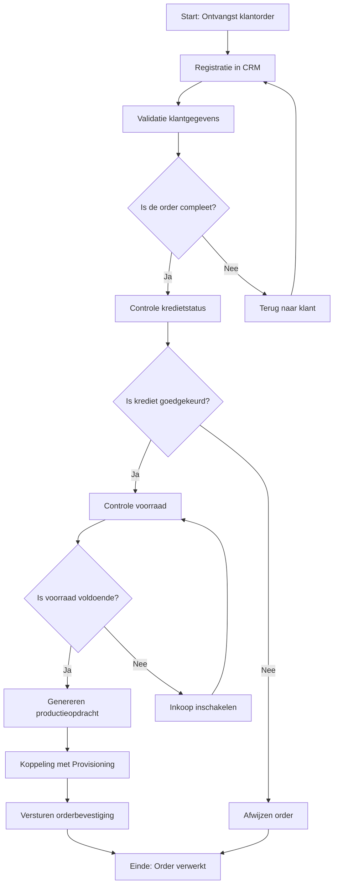

Dit document biedt een gedetailleerde beschrijving van het Orderverwerkingsproces (PR-001) bij TelecomPro B.V.. Het doel is om:  
- Duidelijkheid te scheppen over hoe het proces werkt.  
- Verantwoordelijkheden, systemen, en KPI’s in kaart te brengen.  
- Basis te leggen voor procesmodellering, werkinstructies, en verbeterinitiatieven.  
- Consistentie te waarborgen in de uitvoering van het proces.

#### Eigenschappen

| Veld          | Waarde                                                                                                                                         | Toelichting                                    |
| ----------------- | -------------------------------------------------------------------------------------------------------------------------------------------------- | -------------------------------------------------- |
| PMD-nummer    | 03.07.01                                                                                                                                           | Uniek identificatienummer voor procesbeschrijving. |
| Versie        | 1.0                                                                                                                                                | Huidige versie.                                    |
| Status        | Gepubliceerd                                                                                                                                       | Status van het document.                           |
| Auteur        | Martin van Pelt                                                                                                                                    | Procesanalist.                                     |
| Eigenaar      | Jan de Vries                                                                                                                                       | Proceseigenaar Operaties.                          |
| Datum         | 19/04/2026                                                                                                                                         | Datum van laatste update.                          |
| Gekoppeld aan | Procesdoel (PMD-03.03.00), Procesuitwerking (PMD-03.07.00), Werkinstructie (PMD-03.07.02), RACI Matrix (PMD-03.07.03), Procesrollen (PMD-03.07.04) | Gerelateerde documenten.                           |

#### Basisgegevens

| Veld            | Waarde                                                                                                          | Toelichting               |
| ------------------- | ------------------------------------------------------------------------------------------------------------------- | ----------------------------- |
| Procesnaam      | Orderverwerking                                                                                                     | Naam van het proces.          |
| Proces-ID       | PR-001                                                                                                              | Unieke identifier.            |
| Procescategorie | Primair                                                                                                             | Kernproces voor TelecomPro.   |
| Domein          | Operaties                                                                                                           | Functioneel domein.           |
| Subdomein       | Orderbeheer                                                                                                         | Subdomein binnen Operaties.   |
| Doel            | Tijdige en accurate verwerking van klantorders, van ontvangst tot activatie van diensten.                           | Wat het proces moet bereiken. |
| Scope           | Van ontvangst klantorder (via webshop, telefoon, of sales) tot activatie van de dienst (SIM-kaart, VoIP, internet). | Wat valt binnen de scope.     |
| Koppeling met   | Order-to-Cash (PR-000), Provisioning (PR-003), Facturatie (PR-005), Klachtbehandeling (PR-006)                      | Gerelateerde processen.       |

#### 2. Procesdoel

*(Zie [Procesdoel](#) (PMD-03.03.00) voor een gedetailleerde beschrijving.)*

Samenvatting:

- Hoofddoel: Zorgen voor tijdige, accurate, en efficiënte verwerking van klantorders.
- Waarde voor organisatie: Verhogen van klanttevredenheid en efficiëntie, verlagen van kosten.
- Waarde voor klant: Snelle en betrouwbare orderbevestiging en activatie van diensten.
- Waarde voor medewerkers: Duidelijke werkinstructies en verantwoordelijkheden.

#### Processtappen

##### Overzichtstabel Processtappen

| Stap | Activiteit              | Beschrijving                                                                   | Verantwoordelijke | Systeem/Tool               | Duur | Input                                          | Output                   | Kwaliteitsvoorwaarden                               | Beslissing          | Uitzonderingen                     |
| -------- | --------------------------- | ---------------------------------------------------------------------------------- | --------------------- | ------------------------------ | -------- | -------------------------------------------------- | ---------------------------- | ------------------------------------------------------- | ----------------------- | -------------------------------------- |
| 1        | Ontvangst klantorder        | Klant plaatst een order via webshop, telefoon, of sales.                           | Sales Team            | Webshop, Salesforce CRM        | 5 min    | Klantorder (digitaal formulier of telefoongesprek) | Geregistreerde order in CRM  | Alle verplichte velden zijn ingevuld.                   | -                       | Spoedorders, grote orders (>100 stuks) |
| 2        | Registratie in CRM          | Order Medewerker registreert de order in Salesforce CRM.                           | Order Team            | Salesforce CRM                 | 10 min   | Klantorder                                         | Geregistreerde order in CRM  | Order is compleet en correct geregistreerd.             | -                       | Onvolledige orders                     |
| 3        | Validatie klantgegevens     | Controle of klantgegevens (naam, adres, contactgegevens) compleet en correct zijn. | Order Team            | Salesforce CRM                 | 15 min   | Geregistreerde order                               | Gevalideerde klantgegevens   | Klant-ID is geldig, adresgegevens zijn correct.         | Is de order compleet?   | Onjuiste klantgegevens                 |
| 4        | Controle kredietstatus      | Controle of de klant kredietwaardig is.                                            | Order Team            | SAP ERP                        | 10 min   | Gevalideerde klantgegevens                         | Goedgekeurde/afgewezen order | Kredietstatus is actueel en geverifieerd.               | Is krediet goedgekeurd? | Klant niet kredietwaardig              |
| 5        | Controle voorraad           | Controle of de gevraagde producten/diensten op voorraad zijn.                      | Order Team            | SAP ERP                        | 10 min   | Goedgekeurde order                                 | Bevestigde voorraad          | Voorraadniveaus zijn actueel.                           | Is voorraad voldoende?  | Onvoldoende voorraad                   |
| 6        | Genereren productieopdracht | Order Medewerker zet de klantorder om in een productieopdracht.                    | Order Team            | SAP ERP                        | 15 min   | Bevestigde voorraad                                | Productieopdracht            | Productieopdracht is compleet en foutloos.              | -                       | -                                      |
| 7        | Koppeling met Provisioning  | Productieopdracht wordt automatisch doorgegeven aan Provisioning.                  | Order Team            | SAP ERP → Provisioning-systeem | 5 min    | Productieopdracht                                  | Activatieopdracht            | Koppeling is succesvol.                                 | -                       | Systeemstoring                         |
| 8        | Versturen orderbevestiging  | Order Medewerker verstuurt een orderbevestiging naar de klant.                     | Order Team            | Salesforce CRM                 | 5 min    | Activatieopdracht                                  | Orderbevestiging (e-mail)    | Orderbevestiging is accuraat, tijdig, en professioneel. | -                       | -                                      |

##### Gedetailleerde Beschrijving per Stap

###### Stap 1: Ontvangst klantorder

- Activiteit:
  - Klant plaatst een order via webshop, telefoon, of sales.
  - Sales Medewerker registreert de basisgegevens van de klant en de order.
- Verantwoordelijke: Sales Team.
- Systeem/Tool: Webshop, Salesforce CRM.
- Input:
  - Klantorder (digitaal formulier via webshop of telefoongesprek).
  - Klantgegevens (naam, adres, contactgegevens, klant-ID).
- Output:
  - Geregistreerde order in Salesforce CRM.
- Kwaliteitsvoorwaarden:
  - Alle verplichte velden zijn ingevuld.
  - Klant-ID is geldig en uniek.
- Uitzonderingen:
  - Spoedorders: Orders met hoge prioriteit (bijv. klanten met SLA).
  - Grote orders (>100 stuks): Orders die extra goedkeuring vereisen.
- Tips/Waarschuwingen:
  - Controleer of de klant-ID al bestaat in het systeem. Zo niet, maak een nieuwe klant aan.
  - Bij onbekende klanten: vraag om bedrijfsgegevens (KvK-nummer, BTW-nummer).
- Voorbeeld:
  > *"Order #2026-0045 van Klant X (Klant-ID: KL-1001) wordt geregistreerd met product VoIP Business (Product-ID: PB-001) via de webshop."*

###### Stap 2: Registratie in CRM

- Activiteit:
  - Order Medewerker controleert en voltooit de registratie van de order in Salesforce CRM.
  - Eventueel ontbrekende gegevens worden aanvullend ingevuld.
- Verantwoordelijke: Order Team.
- Systeem/Tool: Salesforce CRM.
- Input:
  - Geregistreerde order (uit Stap 1).
- Output:
  - Volledige order in Salesforce CRM, inclusief alle klant- en productgegevens.
- Kwaliteitsvoorwaarden:
  - Order is compleet (alle verplichte velden zijn ingevuld).
  - Order is correct (geen fouten in klant- of productgegevens).
- Uitzonderingen:
  - Onvolledige orders: Orders waar gegevens ontbreken.
- Tips/Waarschuwingen:
  - Gebruik de "Valideer"-knop in Salesforce CRM voor automatische controle.
  - Controleer of de productcodes correct zijn.
- Voorbeeld:
  > *"Order #2026-0045 is volledig geregistreerd in Salesforce CRM met klantgegevens (KL-1001) en productgegevens (PB-001)."*

###### Stap 3: Validatie klantgegevens

- Activiteit:
  - Order Medewerker controleert of de klantgegevens (naam, adres, contactgegevens) compleet en correct zijn.
  - Gebruik de "Valideer"-functie in Salesforce CRM voor automatische controle.
- Verantwoordelijke: Order Team.
- Systeem/Tool: Salesforce CRM.
- Input:
  - Geregistreerde order (uit Stap 2).
- Output:
  - Gevalideerde klantgegevens.
- Kwaliteitsvoorwaarden:
  - Klant-ID is geldig en uniek.
  - Adresgegevens zijn correct en compleet.
- Beslissing:
  - Is de order compleet?
    - Ja: Doorgaan naar Stap 4 (Controle kredietstatus).
    - Nee: Terug naar klant voor aanvulling gegevens (via e-mail of telefoon).
- Uitzonderingen:
  - Onjuiste klantgegevens: Klantgegevens zijn onvolledig of onjuist.
- Tips/Waarschuwingen:
  - Bij onjuiste gegevens: neem direct contact op met de klant.
  - Gebruik de "Klantzoeken"-functie om dubbele klant-ID’s te voorkomen.
- Voorbeeld:
  > *"Klantgegevens van Klant X (Klant-ID: KL-1001) zijn gevalideerd: naam (TelecomPro B.V.), adres (Dam 1, Rotterdam), en contactgegevens (010-1234567) zijn correct."*

###### Stap 4: Controle kredietstatus

- Activiteit:
  - Order Medewerker controleert of de klant kredietwaardig is in SAP ERP.
  - Gebruik de "Kredietcheck"-functie in SAP ERP.
- Verantwoordelijke: Order Team.
- Systeem/Tool: SAP ERP.
- Input:
  - Gevalideerde klantgegevens (uit Stap 3).
- Output:
  - Goedgekeurde of afgewezen order.
- Kwaliteitsvoorwaarden:
  - Kredietstatus is actueel (max. 30 dagen oud).
  - Kredietlimiet is niet overschreden.
- Beslissing:
  - Is krediet goedgekeurd?
    - Ja: Doorgaan naar Stap 5 (Controle voorraad).
    - Nee: Order wordt afgewezen en de klant wordt geïnformeerd via e-mail (gebruik template "Order Afgewezen").
- Uitzonderingen:
  - Klant niet kredietwaardig: Klant heeft een slechte kredietstatus.
- Tips/Waarschuwingen:
  - Bij afgewezen krediet: informeer de klant met een duidelijke uitleg en bied alternatieven (bijv. voorschotbetaling).
  - Raadpleeg de Financiële Afdeling bij twijfel.
- Voorbeeld:
  > *"Kredietstatus van Klant X (Klant-ID: KL-1001) is goedgekeurd (limiet: €10.000, gebruikt: €5.000)."*

###### Stap 5: Controle voorraad

- Activiteit:
  - Order Medewerker controleert of de gevraagde producten/diensten op voorraad zijn in SAP ERP.
  - Gebruik de "Voorraadcheck"-functie in SAP ERP.
- Verantwoordelijke: Order Team.
- Systeem/Tool: SAP ERP.
- Input:
  - Goedgekeurde order (uit Stap 4).
- Output:
  - Bevestigde voorraad.
- Kwaliteitsvoorwaarden:
  - Voorraadniveaus zijn actueel (real-time).
  - Voorraad is voldoende voor de order.
- Beslissing:
  - Is voorraad voldoende?
    - Ja: Doorgaan naar Stap 6 (Genereren productieopdracht).
    - Nee: Inkoop inschakelen om voorraad aan te vullen (automatische notificatie naar Inkoop).
- Uitzonderingen:
  - Onvoldoende voorraad: Voorraad is niet voldoende voor de order.
- Tips/Waarschuwingen:
  - Bij onvoldoende voorraad: neem contact op met Inkoop voor spoedlevering.
  - Controleer of de leverdatum realistisch is.
- Voorbeeld:
  > *"Voorraad van VoIP Business (Product-ID: PB-001) is voldoende (100 stuks beschikbaar, order: 50 stuks)."*

###### Stap 6: Genereren productieopdracht

- Activiteit:
  - Order Medewerker zet de klantorder om in een productieopdracht in SAP ERP.
  - Vul de productgegevens (aantal, type, leverdatum) in.
- Verantwoordelijke: Order Team.
- Systeem/Tool: SAP ERP.
- Input:
  - Bevestigde voorraad (uit Stap 5).
- Output:
  - Productieopdracht (digitaal).
- Kwaliteitsvoorwaarden:
  - Productieopdracht is compleet (alle velden ingevuld).
  - Productgegevens zijn correct (geen fouten in aantallen of types).
- Tips/Waarschuwingen:
  - Controleer of de leverdatum realistisch is (rekening houdend met voorraad en productietijd).
  - Gebruik de "Genereren Opdracht"-knop in SAP ERP.
- Voorbeeld:
  > *"Productieopdracht #PO-2026-0045 is gegenereerd voor 50 stuks VoIP Business (Product-ID: PB-001), leverdatum: 25/04/2026."*

###### Stap 7: Koppeling met Provisioning

- Activiteit:
  - De productieopdracht wordt automatisch doorgegeven aan het Provisioning-systeem.
  - Order Medewerker controleert of de koppeling succesvol is verlopen.
- Verantwoordelijke: Order Team.
- Systeem/Tool: SAP ERP → Provisioning-systeem.
- Input:
  - Productieopdracht (uit Stap 6).
- Output:
  - Activatieopdracht (in Provisioning-systeem).
- Kwaliteitsvoorwaarden:
  - Koppeling is succesvol (geen foutmeldingen).
  - Activatieopdracht bevat alle benodigde gegevens.
- Uitzonderingen:
  - Systeemstoring: SAP ERP of Provisioning-systeem is niet beschikbaar.
- Tips/Waarschuwingen:
  - Bij systeemstoring: neem contact op met IT-afdeling en gebruik de back-up procedure (handmatige registratie in Excel).
  - Controleer of de Activatie-ID correct is doorgegeven.
- Voorbeeld:
  > *"Productieopdracht #PO-2026-0045 is gekoppeld aan Provisioning-systeem (Activatie-ID: ACT-2026-045)."*

###### Stap 8: Versturen orderbevestiging

- Activiteit:
  - Order Medewerker verstuurt een orderbevestiging naar de klant via e-mail.
  - Gebruik de standaard template voor orderbevestigingen.
- Verantwoordelijke: Order Team.
- Systeem/Tool: Salesforce CRM.
- Input:
  - Activatieopdracht (uit Stap 7).
- Output:
  - Orderbevestiging (e-mail).
- Kwaliteitsvoorwaarden:
  - Orderbevestiging is accuraat (geen fouten in klantgegevens of producten).
  - Orderbevestiging is tijdig verzonden (binnen 1 uur na registratie).
- Tips/Waarschuwingen:
  - Controleer of de klantgegevens in de bevestiging correct zijn.
  - Voeg extra informatie toe (bijv. leverdatum, contactgegevens).
- Voorbeeld:
  > *"Orderbevestiging voor Order #2026-0045 is verstuurd naar Klant X (e-mail: [klant@bedrijf.nl](mailto:klant@bedrijf.nl))."*

#### Betrokken Systemen

| Systeem              | Doel                                                   | Gebruikers                  | Toegang  | Verantwoordelijke | Kritikaliteit | Handleiding                                                              |
| ------------------------ | ---------------------------------------------------------- | ------------------------------- | ------------ | --------------------- | ----------------- | ---------------------------------------------------------------------------- |
| Salesforce CRM       | Beheer van klantgegevens en orders.                        | Sales Team, Order Team          | Webinterface | IT-afdeling           | Hoog              | [Handleiding CRM](https://telecompro.nl/handleidingen/crm)                   |
| SAP ERP              | Orderverwerking, voorraadbeheer, financiële administratie. | Order Team, Financiële Afdeling | Webinterface | IT-afdeling           | Hoog              | [Handleiding ERP](https://telecompro.nl/handleidingen/erp)                   |
| Provisioning-systeem | Activatie van telecomdiensten (SIM, VoIP, internet).       | Provisioning, Order Team        | Webinterface | IT-afdeling           | Hoog              | [Handleiding Provisioning](https://telecompro.nl/handleidingen/provisioning) |
| Webshop              | Ontvangst van online orders.                               | Klanten, Sales Team             | Webinterface | IT-afdeling           | Middel            | -                                                                            |
| E-mail (Outlook)     | Communicatie met klanten.                                  | Order Team, Sales Team          | Outlook      | IT-afdeling           | Middel            | [IT-beleid](https://telecompro.nl/beleid/it)                                 |

#### KPI’s

*(Zie [KPI’s](#) (PMD-03.08.01) voor een gedetailleerd overzicht.)*

| KPI                      | Definitie                                                  | Doelwaarde | Huidige waarde | Meetfrequentie | Verantwoordelijke | Bron     | Impact |
| ---------------------------- | -------------------------------------------------------------- | -------------- | ------------------ | ------------------ | --------------------- | ------------ | ---------- |
| Doorlooptijd orderverwerking | Gemiddelde tijd tussen ontvangst en bevestiging van een order. | < 24 uur       | 28 uur             | Dagelijks          | Proceseigenaar        | SAP ERP      | Hoog       |
| Aantal fouten per order      | Percentage orders met fouten.                                  | < 1%           | 1,5%               | Wekelijks          | Kwaliteitsmanager     | SAP ERP      | Hoog       |
| First-time-right             | Percentage orders dat in één keer correct wordt verwerkt.      | > 98%          | 95%                | Wekelijks          | Proceseigenaar        | SAP ERP      | Hoog       |
| Klanttevredenheid (NPS)      | Net Promoter Score voor orderafhandeling.                      | > 8,5          | 8,2                | Maandelijks        | Sales Manager         | Klantenquête | Hoog       |
| Kosten per order             | Gemiddelde kosten voor het verwerken van een order.            | < €10          | €12                | Maandelijks        | Financiële Afdeling   | SAP ERP      | Hoog       |
| Systeembeschikbaarheid       | Percentage tijd dat SAP ERP en CRM-systeem beschikbaar zijn.   | > 99,5%        | 99,2%              | Continu            | IT-afdeling           | Nagios       | Hoog       |

#### Risico’s

| Risico                  | Oorzaak                                                    | Impact                                       | Kans | Mitigerende maatregel                        | Verantwoordelijke | Status    |
| --------------------------- | -------------------------------------------------------------- | ------------------------------------------------ | -------- | ------------------------------------------------ | --------------------- | ------------- |
| Vertraagde orderverwerking  | Handmatige validatiestap duurt te lang.                        | Vertraging in levering, lagere klanttevredenheid | Hoog     | Automatiseren validatiestap.                     | IT-afdeling           | In uitvoering |
| Fouten in klantgegevens     | Onjuiste invoer door medewerker.                               | Onjuiste orderverwerking, herwerk nodig          | Middel   | Dubbelcheck door tweede medewerker.              | Order Team            | Gepland       |
| Systeemstoring              | SAP ERP of Provisioning-systeem is niet beschikbaar.           | Proces stopt, vertraging in orderverwerking      | Laag     | Back-up procedure in Excel.                      | IT-afdeling           | Gepland       |
| Onvoldoende voorraad        | Voorraad is niet voldoende voor de order.                      | Vertraging in orderverwerking                    | Middel   | Inkoop inschakelen.                              | Inkoop                | Gepland       |
| Weerstand tegen verandering | Medewerkers zijn terughoudend om nieuwe werkwijzen te omarmen. | Vertraagde adoptie van verbeteringen             | Hoog     | Betrek medewerkers bij ontwerp en implementatie. | Proceseigenaar        | Gepland       |

Kans:
- Hoog: Risico is zeer waarschijnlijk.
- Middel: Risico is mogelijk.
- Laag: Risico is onwaarschijnlijk.

#### 7. Relaties met Andere Processen

| Proces                     | Relatie   | Input/Output                                          | Verantwoordelijke | PMD-nummer |
| ------------------------------ | ------------- | --------------------------------------------------------- | --------------------- | -------------- |
| Offerteproces (PR-007)     | Upstream      | Output: Offerte → Input: Klantorder                       | Sales Team            | PMD-03.07.01   |
| Provisioning (PR-003)      | Downstream    | Input: Productieopdracht → Output: Geactiveerde dienst    | Provisioning          | PMD-03.07.01   |
| Facturatie (PR-005)        | Downstream    | Input: Ordergegevens → Output: Factuur                    | Financiële Afdeling   | PMD-03.07.01   |
| Inkoop (PR-008)            | Ondersteunend | Input: Onvoldoende voorraad → Output: Aangevulde voorraad | Inkoop                | PMD-03.07.01   |
| Klachtbehandeling (PR-006) | Gerelateerd   | Input: Klacht → Output: Herhaling orderverwerking         | Klantenservice        | PMD-03.07.01   |

#### 8. Visuele Weergave (Mermaid)

#### 📎11. Gerelateerde Documenten

- [Procesdoel](#) (PMD-03.03.00)
- [Procesuitwerking](#) (PMD-03.07.00)
- [Werkinstructie](#) (PMD-03.07.02)
- [RACI Matrix](#) (PMD-03.07.03)
- [Procesrollen](#) (PMD-03.07.04)
- [KPI’s](#) (PMD-03.08.01)

#### 12. Versiehistorie

| Versie | Datum  | Wijziging   | Auteur      | Goedgekeurd door |
| ---------- | ---------- | --------------- | --------------- | -------------------- |
| 1.0        | 19/04/2026 | Initiële versie | Martin van Pelt | Jan de Vries         |