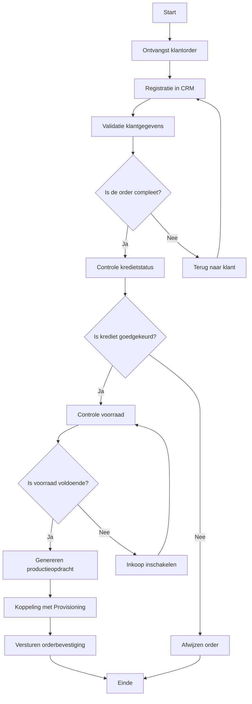

Deze Werkinstructie biedt een praktische, stapsgewijze handleiding voor het uitvoeren van het Orderverwerkingsproces (PR-001) bij TelecomPro B.V.. Het document is bedoeld voor Order Medewerkers en bevat:  
-  Duidelijke stappen met verantwoordelijkheden en systemen.  
-  Schermvoorbeelden en tips voor efficiënte uitvoering.  
-  Controlepunten en veelgemaakte fouten met oplossingen.

#### Eigenschappen

| Veld              | Waarde                                                         | Toelichting                                    |
| ----------------- | -------------------------------------------------------------- | ---------------------------------------------- |
| PMD-nummer    | 03.07.02                                                       | Uniek identificatienummer voor werkinstructie. |
| Versie        | 1.0                                                            | Huidige versie.                                |
| Status        | Gepubliceerd                                                   | Status van het document.                       |
| Auteur        | Martin van Pelt                                                | Procesanalist.                                 |
| Eigenaar      | Jan de Vries                                                   | Proceseigenaar Operaties.                      |
| Datum         | 19/04/2026                                                     | Datum van laatste update.                      |
| Gekoppeld aan | Procesbeschrijving (PMD-03.07.01), Procesrollen (PMD-03.07.04) | Gerelateerde documenten.                       |

#### Basisgegevens

| Veld              | Waarde                                                    |
| --------------------- | ------------------------------------------------------------- |
| Werkinstructie-ID | WI-001                                                        |
| Procesnaam        | Orderverwerking                                               |
| Proces-ID         | PR-001                                                        |
| Doelgroep         | Order Team                                                    |
| Toepassingsmoment | Bij het verwerken van klantorders (webshop, telefoon, sales). |

#### Doel en Toepassingsgebied

| Aspect                     | Beschrijving                                                                                                                    |
| ------------------------------ | ----------------------------------------------------------------------------------------------------------------------------------- |
| Doel                       | Zorgen voor een gestandaardiseerde, foutloze, en efficiënte verwerking van klantorders.                                         |
| Waarde voor de organisatie | Verminderen van fouten en vertragingen in de orderafhandeling, wat leidt tot hogere klanttevredenheid en lagere kosten. |
| Waarde voor de medewerker  | Duidelijke handleiding voor nieuwe en ervaren medewerkers, wat leidt tot minder stress en hogere productiviteit.        |
| Koppeling met procesdoel   | Ondersteunt het procesdoel "Tijdige en accurate verwerking van klantorders".                                                    |

#### Voorbereiding

| Veld                   | Waarde                                                                                                                                           |
| -------------------------- | ---------------------------------------------------------------------------------------------------------------------------------------------------- |
| Benodigde kennis       | Kennis van Salesforce CRM, SAP ERP, basis kennis van telecomproducten (VoIP, SIM, internet).                                                         |
| Benodigde toegang      | Toegang tot Salesforce CRM, SAP ERP, e-mail (Outlook).                                                                                               |
| Benodigde materialen   | Laptop, telefoon, headset, orderformulieren (digitaal).                                                                                              |
| Voorbereidende stappen | 1. Inloggen in Salesforce CRM en SAP ERP. 2. Openen van het orderdashboard. 3. Controleren of alle systeemnotificaties zijn gelezen. |

#### Stappen

##### Stap 1: Ontvangst klantorder

- Actie:
  - Open Salesforce CRM en selecteer "Nieuwe Order" in het dashboard.
  - Vul de basisgegevens van de klant in (naam, klant-ID, contactgegevens).
- Verantwoordelijke: Order Medewerker.
- Systeem/Tool: Salesforce CRM.
- Input: Klantorder (digitaal formulier via webshop, telefoongesprek, of sales).
- Output: Geregistreerde order in CRM.
- Tijdsduur: 5 minuten.
- Kwaliteitsvoorwaarden:
  - Alle verplichte velden zijn ingevuld.
  - Klant-ID is geldig en uniek.
- Schermvoorbeeld:
  ```mermaid
  graph TD
      A[Salesforce Dashboard] --> B[Klik op 'Nieuwe Order']
      B --> C[Vul klantgegevens in]
  ```
- Tips/Waarschuwingen:
  - Controleer of de klant-ID al bestaat in het systeem. Zo niet, maak een nieuwe klant aan.
  - Bij onbekende klanten: vraag om bedrijfsgegevens (KvK-nummer, BTW-nummer).
- Voorbeeld:
  > *"Order #2026-0045 van Klant X (Klant-ID: KL-1001) wordt geregistreerd met product VoIP Business (Product-ID: PB-001)."*

##### Stap 2: Validatie klantgegevens

- Actie:
  - Controleer of de klantgegevens (naam, adres, contactgegevens) compleet en correct zijn.
  - Gebruik de "Valideer"-knop in Salesforce CRM voor automatische controle.
- Verantwoordelijke: Order Medewerker.
- Systeem/Tool: Salesforce CRM.
- Input: Geregistreerde order.
- Output: Gevalideerde klantgegevens.
- Tijdsduur: 15 minuten.
- Kwaliteitsvoorwaarden:
  - Klant-ID is geldig.
  - Adresgegevens zijn correct en compleet.
- Beslissing:
  - Is de order compleet?
    - Ja: Doorgaan naar Stap 3.
    - Nee: Terug naar klant voor aanvulling gegevens (via e-mail of telefoon).
- Tips/Waarschuwingen:
  - Bij onjuiste gegevens: neem direct contact op met de klant.
  - Gebruik de "Klantzoeken"-functie om dubbele klant-ID’s te voorkomen.
- Voorbeeld:
  > *"Klantgegevens van Klant X (Klant-ID: KL-1001) zijn gevalideerd: naam, adres (Dam 1, Rotterdam), en contactgegevens (010-1234567) zijn correct."*

##### Stap 3: Controle kredietstatus

- Actie:
  - Open SAP ERP en zoek de klant op via Klant-ID.
  - Controleer de kredietstatus in het klantendossier.
- Verantwoordelijke: Order Medewerker.
- Systeem/Tool: SAP ERP.
- Input: Gevalideerde klantgegevens.
- Output: Goedgekeurde of afgewezen order.
- Tijdsduur: 10 minuten.
- Kwaliteitsvoorwaarden:
  - Kredietstatus is actueel (max. 30 dagen oud).
  - Kredietlimiet is niet overschreden.
- Beslissing:
  - Is krediet goedgekeurd?
    - Ja: Doorgaan naar Stap 4.
    - Nee: Order afwijzen en klant informeren via e-mail (gebruik template "Order Afgewezen").
- Tips/Waarschuwingen:
  - Bij afgewezen krediet: informeer de klant met een duidelijke uitleg en bied alternatieven (bijv. voorschotbetaling).
  - Gebruik de "Kredietcheck"-functie in SAP ERP.
- Voorbeeld:
  > *"Kredietstatus van Klant X (Klant-ID: KL-1001) is goedgekeurd (limiet: €10.000, gebruikt: €5.000)."*

##### Stap 4: Controle voorraad

- Actie:
  - Open SAP ERP en zoek de producten/diensten uit de order op.
  - Controleer of de voorraad voldoende is.
- Verantwoordelijke: Order Medewerker.
- Systeem/Tool: SAP ERP.
- Input: Goedgekeurde order.
- Output: Bevestigde voorraad.
- Tijdsduur: 10 minuten.
- Kwaliteitsvoorwaarden:
  - Voorraadniveaus zijn actueel (real-time).
  - Voorraad is voldoende voor de order.
- Beslissing:
  - Is voorraad voldoende?
    - Ja: Doorgaan naar Stap 5.
    - Nee: Inkoop inschakelen (stuur een automatische notificatie naar Inkoop via SAP).
- Tips/Waarschuwingen:
  - Bij onvoldoende voorraad: neem contact op met Inkoop voor spoedlevering.
  - Gebruik de "Voorraadcheck"-functie in SAP ERP.
- Voorbeeld:
  > *"Voorraad van VoIP Business (Product-ID: PB-001) is voldoende (100 stuks beschikbaar, order: 50 stuks)."*

##### Stap 5: Genereren productieopdracht

- Actie:
  - Zet de klantorder om in een productieopdracht in SAP ERP.
  - Vul de productgegevens (aantal, type, leverdatum) in.
- Verantwoordelijke: Order Medewerker.
- Systeem/Tool: SAP ERP.
- Input: Bevestigde voorraad.
- Output: Productieopdracht (digitaal).
- Tijdsduur: 15 minuten.
- Kwaliteitsvoorwaarden:
  - Productieopdracht is compleet (alle velden ingevuld).
  - Productgegevens zijn correct (geen fouten in aantallen of types).
- Tips/Waarschuwingen:
  - Controleer of de leverdatum realistisch is (rekening houdend met voorraad en productietijd).
  - Gebruik de "Genereren Opdracht"-knop in SAP ERP.
- Voorbeeld:
  > *"Productieopdracht #PO-2026-0045 is gegenereerd voor 50 stuks VoIP Business (Product-ID: PB-001), leverdatum: 25/04/2026."*

##### Stap 6: Koppeling met Provisioning

- Actie:
  - De productieopdracht wordt automatisch doorgegeven aan het Provisioning-systeem.
  - Controleer of de koppeling succesvol is verlopen.
- Verantwoordelijke: Order Medewerker.
- Systeem/Tool: SAP ERP → Provisioning-systeem.
- Input: Productieopdracht.
- Output: Activatieopdracht (in Provisioning-systeem).
- Tijdsduur: 5 minuten.
- Kwaliteitsvoorwaarden:
  - Koppeling is succesvol (geen foutmeldingen).
  - Activatieopdracht bevat alle benodigde gegevens.
- Tips/Waarschuwingen:
  - Bij systeemstoring: neem contact op met IT-afdeling en gebruik de back-up procedure (handmatige registratie in Excel).
  - Controleer of de Activatie-ID correct is doorgegeven.
- Voorbeeld:
  > *"Productieopdracht #PO-2026-0045 is gekoppeld aan Provisioning-systeem (Activatie-ID: ACT-2026-045)."*

##### Stap 7: Versturen orderbevestiging

- Actie:
  - Open Salesforce CRM en selecteer de order.
  - Klik op "Verstuur Orderbevestiging" om een automatische e-mail naar de klant te versturen.
  - Controleer of de e-mail correct is verzonden.
- Verantwoordelijke: Order Medewerker.
- Systeem/Tool: Salesforce CRM.
- Input: Activatieopdracht.
- Output: Orderbevestiging (e-mail).
- Tijdsduur: 5 minuten.
- Kwaliteitsvoorwaarden:
  - Orderbevestiging is accuraat (geen fouten in klantgegevens of producten).
  - Orderbevestiging is tijdig verzonden (binnen 1 uur na registratie).
- Tips/Waarschuwingen:
  - Gebruik de standaard template voor orderbevestigingen.
  - Controleer of de klantgegevens in de bevestiging correct zijn.
- Voorbeeld:
  > *"Orderbevestiging voor Order #2026-0045 is verstuurd naar Klant X (e-mail: [klant@bedrijf.nl](mailto:klant@bedrijf.nl))."*

#### Benodigde Systemen

| Systeem              | Doel                                                   | Toegang  | Verantwoordelijke | Handleiding                                                              | Link                                 |
| ------------------------ | ---------------------------------------------------------- | ------------ | --------------------- | ---------------------------------------------------------------------------- | ---------------------------------------- |
| Salesforce CRM       | Beheer van klantgegevens en orders.                        | Webinterface | IT-afdeling           | [Handleiding CRM](https://telecompro.nl/handleidingen/crm)                   | [Salesforce](https://www.salesforce.com) |
| SAP ERP              | Orderverwerking, voorraadbeheer, financiële administratie. | Webinterface | IT-afdeling           | [Handleiding ERP](https://telecompro.nl/handleidingen/erp)                   | [SAP](https://www.sap.com)               |
| Provisioning-systeem | Activatie van telecomdiensten.                             | Webinterface | IT-afdeling           | [Handleiding Provisioning](https://telecompro.nl/handleidingen/provisioning) | Intern                                   |
| E-mail (Outlook)     | Communicatie met klanten.                                  | Outlook      | IT-afdeling           | [IT-beleid](https://telecompro.nl/beleid/it)                                 | [Outlook](https://outlook.office.com)    |

#### Controlepunten

| Controlepunt           | Stap | Type Controle | Frequentie | Verantwoordelijke  | Controlemethode | Acceptatiecriteria                     |
| -------------------------- | -------- | ----------------- | -------------- | ---------------------- | ------------------- | ------------------------------------------ |
| Volledigheid klantgegevens | Stap 2   | Handmatig         | Per order      | Order Medewerker       | Visuele controle    | Alle verplichte velden zijn ingevuld.      |
| Juistheid klantgegevens    | Stap 2   | Automatisch       | Per order      | Salesforce CRM         | Systeemvalidatie    | Geen foutmeldingen in het systeem.         |
| Kredietstatus              | Stap 3   | Automatisch       | Per order      | SAP ERP                | Systeemvalidatie    | Kredietstatus is goedgekeurd.              |
| Voorraadniveaus            | Stap 4   | Automatisch       | Per order      | SAP ERP                | Systeemvalidatie    | Voorraad is voldoende.                     |
| Productieopdracht          | Stap 5   | Handmatig         | Per order      | Order Medewerker       | Visuele controle    | Productieopdracht is compleet en foutloos. |
| Koppeling met Provisioning | Stap 6   | Automatisch       | Per order      | SAP ERP → Provisioning | Systeemvalidatie    | Koppeling is succesvol.                    |

#### Veelgemaakte Fouten en Oplossingen

| Fout                    | Oorzaak                                          | Impact                                 | Oplossing                    | Preventieve maatregel                        |
| --------------------------- | ---------------------------------------------------- | ------------------------------------------ | -------------------------------- | ------------------------------------------------ |
| Onvolledige klantgegevens   | Medewerker vergeet velden in te vullen.              | Vertraging in orderverwerking.             | Handmatig aanvullen.             | Gebruik verplichte velden in Salesforce CRM. |
| Foutieve productcodes       | Onjuiste selectie uit dropdown-menu.                 | Onjuiste orderverwerking.                  | Handmatig corrigeren.            | Voeg validatie toe in SAP ERP.               |
| Vertraging door systeemfout | SAP ERP of Provisioning-systeem is niet beschikbaar. | Proces stopt.                              | Handmatige registratie in Excel. | Zorg voor back-up procedures.                |
| Onvoldoende voorraad        | Voorraad is niet voldoende voor de order.            | Vertraging in orderverwerking.             | Inkoop inschakelen.              | Automatische waarschuwing bij lage voorraad. |
| Verkeerde klant-ID          | Medewerker selecteert verkeerde klant-ID.            | Order wordt aan verkeerde klant gekoppeld. | Handmatig corrigeren.            | Gebruik barcode-scanner voor klant-ID.       |

#### Escalatieprocedure

| Probleem        | Escalatieniveau | Actie                          | Verantwoordelijke | Contactgegevens                                           | Tijdslimiet |
| ------------------- | ------------------- | ---------------------------------- | --------------------- | ------------------------------------------------------------- | --------------- |
| Onbekende klant     | Niveau 1            | Neem contact op met Sales Manager. | Order Medewerker      | [sales@telecompro.nl](mailto:sales@telecompro.nl)             | 1 uur           |
| Systeemstoring      | Niveau 2            | Meld storing bij IT-afdeling.      | Order Medewerker      | [it-support@telecompro.nl](mailto:it-support@telecompro.nl)   | 30 minuten      |
| Complexe klantvraag | Niveau 3            | Escaleren naar Proceseigenaar.     | Teamleider            | [jan.devries@telecompro.nl](mailto:jan.devries@telecompro.nl) | 2 uur           |
| Kredietprobleem     | Niveau 2            | Raadpleeg Financiële Afdeling.     | Order Medewerker      | [finance@telecompro.nl](mailto:finance@telecompro.nl)         | 1 uur           |

#### Bijlagen

| Bijlage               | Type   | Beschrijving                                              | Locatie                                                                   |
| ------------------------- | ---------- | ------------------------------------------------------------- | ----------------------------------------------------------------------------- |
| Salesforce Orderformulier | Afbeelding | Schermvoorbeeld van het orderformulier in Salesforce.         | Bijlage 1                                                                     |
| SAP ERP Orderopdracht     | Afbeelding | Schermvoorbeeld van de orderopdracht in SAP.                  | Bijlage 2                                                                     |
| Orderbevestiging Template | Document   | Standaard template voor orderbevestiging.                     | [Template Orderbevestiging](https://telecompro.nl/templates/orderbevestiging) |
| Back-up Procedure         | Document   | Procedure voor handmatige orderverwerking bij systeemstoring. | [Back-up Procedure](https://telecompro.nl/procedures/backup)                  |

#### Visuele Weergave (Mermaid)



#### Gerelateerde Documenten

- [Procesbeschrijving](#) (PMD-03.07.01)
- [Procesrollen](#) (PMD-03.07.04)
- [RACI Matrix](#) (PMD-03.07.03)