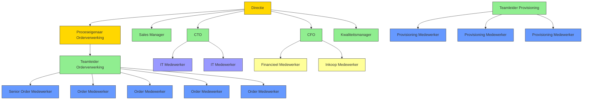
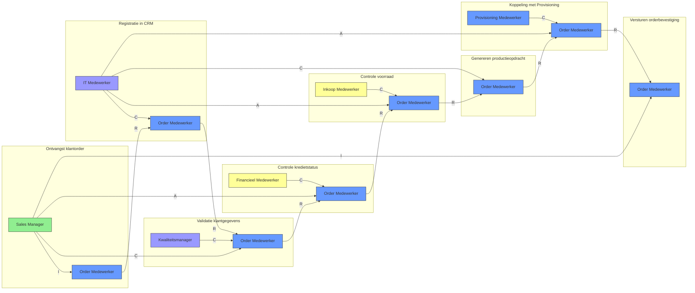

## Inleiding

Dit document biedt een compleet overzicht van alle rollen binnen het Orderverwerkingsproces (PR-001) bij TelecomPro B.V.. Het doel is om:  
-  Duidelijkheid te scheppen over wie wat doet in het proces.  
-  Verantwoordelijkheden, competenties, systemen, en KPI’s per rol te definieren.  
-  Samenwerking tussen afdelingen te verbeteren door transparante rolomschrijvingen.  
-  Basis te leggen voor training, werving, en prestatiebeoordeling.

## Overzichtstabel Procesrollen

| Rol                            | Rol-ID | Afdeling | Type      | Aantal FTE | Rapporteert aan        | Samenvatting                                                               |
| ---------------------------------- | ---------- | ------------ | ------------- | -------------- | -------------------------- | ------------------------------------------------------------------------------ |
| Proceseigenaar Orderverwerking | ROL-001    | Operaties    | Sturend       | 1              | Directie (Mark de Jong)    | Verantwoordelijk voor beheer, optimalisatie en training van het orderproces.   |
| Teamleider Orderverwerking     | ROL-002    | Operaties    | Sturend       | 1              | Proceseigenaar             | Coördineert het Order Team en zorgt voor planning en kwaliteitscontrole.       |
| Order Medewerker               | ROL-003    | Operaties    | Uitvoerend    | 5              | Teamleider Orderverwerking | Voert dagelijkse orderverwerking uit: registratie, validatie, en bevestiging.  |
| Senior Order Medewerker        | ROL-004    | Operaties    | Uitvoerend    | 2              | Teamleider Orderverwerking | Verwerkt complexe orders en ondersteunt nieuwe medewerkers.                    |
| Sales Manager                  | ROL-005    | Sales        | Sturend       | 1              | Directie (Mark de Jong)    | Goedkeurt orders, beheert klantrelaties en onderhandelt contracten.            |
| IT Medewerker                  | ROL-006    | IT           | Ondersteunend | 2              | CTO (David van Leeuwen)    | Ondersteunt systemen (SAP, CRM, Provisioning) en lost technische problemen op. |
| Kwaliteitsmanager              | ROL-007    | Kwaliteit    | Sturend       | 1              | Directie (Mark de Jong)    | Monitort proceskwaliteit, voert audits uit en stelt verbeterpunten voor.       |
| Financieel Medewerker          | ROL-008    | Financiën    | Ondersteunend | 1              | CFO (Lisa van der Meer)    | Controleert kredietstatus en beheert facturatie.                               |
| Inkoop Medewerker              | ROL-009    | Financiën    | Ondersteunend | 1              | CFO (Lisa van der Meer)    | Schakelt inkoop in bij onvoldoende voorraad.                                   |
| Provisioning Medewerker        | ROL-010    | Operaties    | Uitvoerend    | 3              | Teamleider Provisioning    | Activeert telecomdiensten (SIM, VoIP, internet).                               |

## Gedetailleerde Rolomschrijvingen

### Proceseigenaar Orderverwerking (ROL-001)

#### Algemeen
| Veld            | Waarde                   |
| ------------------- | ---------------------------- |
| Rol-ID          | ROL-001                      |
| Afdeling        | Operaties                    |
| Type rol        | Sturend                      |
| Aantal FTE      | 1,0                          |
| Rapporteert aan | Directie (Mark de Jong)      |
| Salarisniveau   | Niveau 5 (Senior Management) |
| Locatie         | Rotterdam (Hoofdkantoor)     |

#### Verantwoordelijkheden

| Categorie             | Verantwoordelijkheid    | Beschrijving                                                                                                           | Frequentie | Gerelateerde Activiteiten     |
| ------------------------- | --------------------------- | -------------------------------------------------------------------------------------------------------------------------- | -------------- | --------------------------------- |
| Procesbeheer          | Eigenaar procesdocumentatie | Verantwoordelijk voor het opstellen, bijwerken en valideren van alle procesdocumentatie (BPMN, Werkinstructies, RACI). | Continu        | Alle documentatie in PDM.         |
| Procesoptimalisatie   | Continue verbetering        | Analyseren van KPI’s en implementeren van verbeteracties.                                                          | Maandelijks    | Procesreview, Root Cause Analyse. |
| Training & Coaching   | Training medewerkers        | Trainen van Order Medewerkers in het proces en systemen.                                                               | Ad hoc         | Werkinstructies, workshops.       |
| Stakeholdermanagement | Afstemming met afdelingen   | Coördineren met Sales, IT, Financiën en Provisioning.                                                                  | Continu        | Overleggen, meetings.             |
| Rapportage            | Prestatierapportage         | Rapportage van procesprestaties aan directie.                                                                          | Maandelijks    | Procesdashboard, KPI-rapportage.  |
| Compliance            | Naleving normen             | Zorgen voor naleving van ISO 9001 en interne richtlijnen.                                                              | Continu        | Audits, compliance-checks.        |

#### Betrokken Processen

| Procesnaam    | PMD-nummer | Rol in proces | Betrokkenheid | Tijdsbesteding |
| ----------------- | -------------- | ----------------- | ----------------- | ------------------ |
| Orderverwerking   | PMD-03.07.01   | Sturend           | Continu           | 60%                |
| Procesverbetering | PMD-03.09.00   | Uitvoerend        | Ad hoc            | 20%                |
| Procesreview      | PMD-03.08.03   | Uitvoerend        | Maandelijks       | 10%                |
| Wijzigingsbeheer  | PMD-03.10.00   | Uitvoerend        | Ad hoc            | 10%                |

#### Competenties

| Competentie       | Niveau | Beschrijving                                                        | Training        | Certificering         | Meetbaar?                            |
| --------------------- | ---------- | ----------------------------------------------------------------------- | ------------------- | ------------------------- | ---------------------------------------- |
| Procesmanagement      | Expert     | Ervaring met het beheren en optimaliseren van processen.            | Interne training    | PRINCE2 Foundation        | Ja (KPI: Aantal verbeteringen)           |
| BPMN-modellering      | Gevorderd  | Kennis van BPMN 2.0 en procesmodellering.                           | Camunda training    | -                         | Ja (KPI: Aantal gemodelleerde processen) |
| Lean Six Sigma        | Gevorderd  | Toepassen van DMAIC-methode voor procesverbetering.                 | Green Belt training | Lean Six Sigma Green Belt | Ja (KPI: Aantal verbeterprojecten)       |
| Kwaliteitsmanagement  | Gevorderd  | Kennis van ISO 9001 en kwaliteitsnormen.                            | Interne training    | -                         | Ja (KPI: Aantal audits)                  |
| Stakeholdermanagement | Gevorderd  | Vermogen om effectief te communiceren met verschillende afdelingen. | Interne training    | -                         | Nee                                      |
| Projectmanagement     | Gevorderd  | Beheer van procesverbeterprojecten.                                 | Interne training    | PRINCE2 Practitioner      | Ja (KPI: Projectsucces)                  |

#### Tools en Systemen

| Tool/Systeem                     | Doel                            | Toegang     | Handleiding                                 | Frequentie | Kritikaliteit |
| ------------------------------------ | ----------------------------------- | --------------- | ----------------------------------------------- | -------------- | ----------------- |
| PMD (Proces Management Document) | Beheer van procesdocumentatie.      | Webinterface    | [Link](https://telecompro.nl/pdm)               | Dagelijks      | Hoog              |
| Camunda                          | BPMN-modellering en automatisering. | Webinterface    | [Link](https://camunda.com)                     | Wekelijks      | Hoog              |
| Power BI                         | Rapportage en dashboards.           | Webinterface    | [Link](https://powerbi.microsoft.com)           | Maandelijks    | Hoog              |
| Salesforce CRM                   | Beheer van klantgegevens.           | Webinterface    | [Link](https://telecompro.nl/handleidingen/crm) | Ad hoc         | Middel            |
| SAP ERP                          | Orderverwerking en voorraadbeheer.  | Webinterface    | [Link](https://telecompro.nl/handleidingen/erp) | Ad hoc         | Middel            |
| Microsoft Teams                  | Interne communicatie.               | Desktop/ Mobile | [Link](https://teams.microsoft.com)             | Dagelijks      | Laag              |

#### KPI’s

| KPI                      | Definitie                                                  | Doelwaarde | Huidige waarde | Meetfrequentie | Bron          | Impact |
| ---------------------------- | -------------------------------------------------------------- | -------------- | ------------------ | ------------------ | ----------------- | ---------- |
| Doorlooptijd orderverwerking | Gemiddelde tijd tussen ontvangst en bevestiging van een order. | < 24 uur       | 28 uur             | Dagelijks          | SAP ERP           | Hoog       |
| First-time-right             | Percentage orders dat in één keer correct wordt verwerkt.      | > 98%          | 95%                | Wekelijks          | SAP ERP           | Hoog       |
| Aantal procesverbeteringen   | Aantal geïmplementeerde verbeteringen per kwartaal.            | > 4            | 3                  | Kwartaallijks      | PMD               | Hoog       |
| Klanttevredenheid (NPS)      | Net Promoter Score voor orderafhandeling.                      | > 8,5          | 8,2                | Maandelijks        | Klantenquête      | Hoog       |
| Aantal audits                | Aantal uitgevoerde interne audits per jaar.                    | > 4            | 4                  | Jaarlijks          | Kwaliteitssysteem | Middel     |

#### Carrièrepad

| Niveau | Rol                        | Ervaring | Vereiste Competenties         | Training         |
| ---------- | ------------------------------ | ------------ | --------------------------------- | -------------------- |
| Junior | Order Medewerker               | 0-2 jaar     | Basis kennis CRM/ERP              | Interne training     |
| Medior | Senior Order Medewerker        | 2-5 jaar     | Gevorderd CRM/ERP, klantenservice | On-the-job training  |
| Senior | Teamleider Orderverwerking     | 5-10 jaar    | Leiderschap, proceskennis         | Leiderschapstraining |
| Expert | Proceseigenaar Orderverwerking | 10+ jaar     | Procesmanagement, Lean Six Sigma  | PRINCE2, Green Belt  |

### Teamleider Orderverwerking (ROL-002)

#### Algemeen

| Veld            | Waarde                               |
| ------------------- | ---------------------------------------- |
| Rol-ID          | ROL-002                                  |
| Afdeling        | Operaties                                |
| Type rol        | Sturend                                  |
| Aantal FTE      | 1,0                                      |
| Rapporteert aan | Proceseigenaar Orderverwerking (ROL-001) |
| Salarisniveau   | Niveau 4 (Management)                    |
| Locatie         | Rotterdam (Hoofdkantoor)                 |

#### Verantwoordelijkheden

| Categorie          | Verantwoordelijkheid | Beschrijving                                                                | Frequentie | Gerelateerde Activiteiten |
| ---------------------- | ------------------------ | ------------------------------------------------------------------------------- | -------------- | ----------------------------- |
| Teamcoördinatie    | Planning en inzet        | Plannen van werkzaamheden en toewijzen van taken aan Order Medewerkers. | Dagelijks      | Werkverdeling, roosterbeheer. |
| Kwaliteitscontrole | Controle werk            | Controleren van de kwaliteit van verwerkte orders.                          | Dagelijks      | Steekproefsgewijze controle.  |
| Training           | Begeleiding medewerkers  | Trainen en coachen van nieuwe en bestaande medewerkers.                     | Ad hoc         | Onboarding, bijscholing.      |
| Rapportage         | Teamprestaties           | Rapportage van teamprestaties aan Proceseigenaar.                           | Wekelijks      | Teammeetings, KPI-rapportage. |
| Probleemoplossing  | Escalatie                | Oplossen van complexe problemen of escaleren naar Proceseigenaar.       | Ad hoc         | Incidentafhandeling.          |

#### Betrokken Processen

| Procesnaam    | PMD-nummer | Rol in proces | Betrokkenheid | Tijdsbesteding |
| ----------------- | -------------- | ----------------- | ----------------- | ------------------ |
| Orderverwerking   | PMD-03.07.01   | Sturend           | Continu           | 80%                |
| Procesverbetering | PMD-03.09.00   | Ondersteunend     | Ad hoc            | 10%                |
| Wijzigingsbeheer  | PMD-03.10.00   | Ondersteunend     | Ad hoc            | 10%                |

#### Competenties

| Competentie            | Niveau | Beschrijving                                    | Training         | Certificering | Meetbaar?                         |
| -------------------------- | ---------- | --------------------------------------------------- | -------------------- | ----------------- | ------------------------------------- |
| Leiderschap                | Gevorderd  | Vermogen om een team te leiden en te motiveren. | Leiderschapstraining | -                 | Nee                                   |
| Planning                   | Gevorderd  | Vermogen om werkzaamheden efficiënt te plannen. | Interne training     | -                 | Ja (KPI: Teamproductiviteit)          |
| Coaching                   | Gevorderd  | Vermogen om medewerkers te begeleiden.          | Interne training     | -                 | Nee                                   |
| Kwaliteitscontrole         | Gevorderd  | Vermogen om kwaliteit te waarborgen.            | Interne training     | -                 | Ja (KPI: First-time-right)            |
| Probleemoplossend vermogen | Gevorderd  | Vermogen om complexe problemen op te lossen.    | Workshop             | -                 | Ja (KPI: Aantal opgeloste incidenten) |

#### Tools en Systemen

|Tool/Systeem    | Doel                            | Toegang    | Handleiding                                 | Frequentie | Kritikaliteit |
| ------------------- | ----------------------------------- | -------------- | ----------------------------------------------- | -------------- | ----------------- |
| Salesforce CRM  | Beheer van klantgegevens en orders. | Webinterface   | [Link](https://telecompro.nl/handleidingen/crm) | Dagelijks      | Hoog              |
| SAP ERP         | Orderverwerking en voorraadbeheer.  | Webinterface   | [Link](https://telecompro.nl/handleidingen/erp) | Dagelijks      | Hoog              |
| Microsoft Teams | Interne communicatie.               | Desktop/Mobile | [Link](https://teams.microsoft.com)             | Dagelijks      | Middel            |
| Power BI        | Rapportage en dashboards.           | Webinterface   | [Link](https://powerbi.microsoft.com)           | Wekelijks      | Middel            |

#### KPI’s

| KPI                     | Definitie                                             | Doelwaarde | Huidige waarde | Meetfrequentie | Bron                        | Impact |
| --------------------------- | --------------------------------------------------------- | -------------- | ------------------ | ------------------ | ------------------------------- | ---------- |
| Teamproductiviteit          | Aantal verwerkte orders per teamlid per dag.              | > 40           | 38                 | Dagelijks          | SAP ERP                         | Hoog       |
| First-time-right            | Percentage orders dat in één keer correct wordt verwerkt. | > 98%          | 95%                | Wekelijks          | SAP ERP                         | Hoog       |
| Aantal opgeloste incidenten | Aantal complexe problemen dat is opgelost.                | > 90%          | 85%                | Wekelijks          | ServiceNow                      | Hoog       |
| Medewerkerstevredenheid     | Tevredenheidsscore van het Order Team.                    | > 8            | 7,5                | Kwartaallijks      | Medewerkerstevredenheidsenquête | Middel     |

### Order Medewerker (ROL-003)

#### Algemeen

| Veld            | Waarde                           |
| ------------------- | ------------------------------------ |
| Rol-ID          | ROL-003                              |
| Afdeling        | Operaties                            |
| Type rol        | Uitvoerend                           |
| Aantal FTE      | 5                                    |
| Rapporteert aan | Teamleider Orderverwerking (ROL-002) |
| Salarisniveau   | Niveau 2 (Uitvoerend)                |
| Locatie         | Rotterdam (Hoofdkantoor)             |

#### Verantwoordelijkheden

| Categorie         | Verantwoordelijkheid    | Beschrijving                                                     | Frequentie | Gerelateerde Activiteiten |
| --------------------- | --------------------------- | -------------------------------------------------------------------- | -------------- | ----------------------------- |
| Orderontvangst    | Registratie orders          | Registreren van klantorders in Salesforce CRM.                   | Dagelijks      | Ontvangst klantorder          |
| Validatie         | Controle klantgegevens      | Valideren van klantgegevens (naam, adres, contactgegevens).      | Dagelijks      | Validatie klantgegevens       |
| Kredietcontrole   | Controle kredietstatus      | Controleren of de klant kredietwaardig is in SAP ERP.            | Dagelijks      | Controle kredietstatus        |
| Voorraadcontrole  | Controle voorraad           | Controleren of de gevraagde producten/diensten op voorraad zijn. | Dagelijks      | Controle voorraad             |
| Opdrachtgeneratie | Genereren productieopdracht | Omzetten van klantorder naar productieopdracht in SAP ERP.       | Dagelijks      | Genereren productieopdracht   |
| Systeemkoppeling  | Koppeling met Provisioning  | Doorgeven van productieopdracht aan Provisioning-systeem.        | Dagelijks      | Koppeling met Provisioning    |
| Communicatie      | Versturen orderbevestiging  | Versturen van orderbevestiging naar de klant.                    | Dagelijks      | Versturen orderbevestiging    |
| Afwijzing         | Afwijzen order              | Afwijzen van orders bij onvoldoende krediet of voorraad.         | Ad hoc         | Afwijzen order                |

#### Betrokken Processen

| Procesnaam  | PMD-nummer | Rol in proces | Betrokkenheid | Tijdsbesteding |
| --------------- | -------------- | ----------------- | ----------------- | ------------------ |
| Orderverwerking | PMD-03.07.01   | Uitvoerend        | Dagelijks         | 100%               |

#### Competenties

| Competentie            | Niveau | Beschrijving                                               | Training        | Certificering                  | Meetbaar?                     |
| -------------------------- | ---------- | -------------------------------------------------------------- | ------------------- | ---------------------------------- | --------------------------------- |
| Kennis Salesforce CRM      | Gevorderd  | Ervaring met Salesforce CRM voor orderbeheer.              | Interne training    | Salesforce Certified Administrator | Ja (KPI: Aantal verwerkte orders) |
| Kennis SAP ERP             | Gevorderd  | Ervaring met SAP ERP voor orderverwerking.                 | Interne training    | -                                  | Ja (KPI: Doorlooptijd per order)  |
| Klantenservice             | Gevorderd  | Vaardigheid in klantcontact (telefoon, e-mail).            | On-the-job training | -                                  | Ja (KPI: Klanttevredenheid)       |
| Accuraatheid               | Gevorderd  | Vermogen om foutloos te werken.                            | Interne training    | -                                  | Ja (KPI: Aantal fouten per order) |
| Probleemoplossend vermogen | Basis      | Vermogen om eenvoudige problemen zelfstandig op te lossen. | Workshop            | -                                  | Nee                               |

#### Tools en Systemen

| Tool/Systeem     | Doel                            | Toegang    | Handleiding                                 | Frequentie | Kritikaliteit |
| -------------------- | ----------------------------------- | -------------- | ----------------------------------------------- | -------------- | ----------------- |
| Salesforce CRM   | Beheer van klantgegevens en orders. | Webinterface   | [Link](https://telecompro.nl/handleidingen/crm) | Dagelijks      | Hoog              |
| SAP ERP          | Orderverwerking en voorraadbeheer.  | Webinterface   | [Link](https://telecompro.nl/handleidingen/erp) | Dagelijks      | Hoog              |
| E-mail (Outlook) | Communicatie met klanten.           | Outlook        | [Link](https://telecompro.nl/beleid/it)         | Dagelijks      | Middel            |
| Microsoft Teams  | Interne communicatie.               | Desktop/Mobile | [Link](https://teams.microsoft.com)             | Dagelijks      | Laag              |

#### KPI’s

| KPI                         | Definitie                                      | Doelwaarde | Huidige waarde | Meetfrequentie | Bron     | Impact |
| ------------------------------- | -------------------------------------------------- | -------------- | ------------------ | ------------------ | ------------ | ---------- |
| Aantal verwerkte orders per dag | Aantal orders dat dagelijks wordt verwerkt.        | 50             | 45                 | Dagelijks          | SAP ERP      | Hoog       |
| Doorlooptijd per order          | Gemiddelde tijd per order.                         | < 30 minuten   | 35 minuten         | Dagelijks          | SAP ERP      | Hoog       |
| Aantal fouten per order         | Percentage orders met fouten.                      | < 1%           | 1,5%               | Wekelijks          | SAP ERP      | Hoog       |
| Klanttevredenheid (CSAT)        | Customer Satisfaction Score voor orderafhandeling. | > 90%          | 88%                | Maandelijks        | Klantenquête | Hoog       |

### Senior Order Medewerker (ROL-004)

#### Algemeen

| Veld            | Waarde                           |
| ------------------- | ------------------------------------ |
| Rol-ID          | ROL-004                              |
| Afdeling        | Operaties                            |
| Type rol        | Uitvoerend                           |
| Aantal FTE      | 2                                    |
| Rapporteert aan | Teamleider Orderverwerking (ROL-002) |
| Salarisniveau   | Niveau 3 (Senior Uitvoerend)         |
| Locatie         | Rotterdam (Hoofdkantoor)             |

#### Verantwoordelijkheden

| Categorie          | Verantwoordelijkheid       | Beschrijving                                                               | Frequentie | Gerelateerde Activiteiten   |
| ---------------------- | ------------------------------ | ------------------------------------------------------------------------------ | -------------- | ------------------------------- |
| Complexe orders    | Verwerking complexe orders     | Verwerken van complexe orders (bijv. grote orders, maatwerk).              | Dagelijks      | Alle stappen in Orderverwerking |
| Ondersteuning      | Begeleiding nieuwe medewerkers | Begeleiden van nieuwe Order Medewerkers.                                   | Ad hoc         | Training, coaching              |
| Kwaliteitscontrole | Controle werk                  | Controleren van de kwaliteit van verwerkte orders door nieuwe medewerkers. | Dagelijks      | Steekproefsgewijze controle     |
| Probleemoplossing  | Oplossen complexe problemen    | Oplossen van complexe problemen in de orderverwerking.                     | Ad hoc         | Incidentafhandeling             |

#### Betrokken Processen

| Procesnaam    | PMD-nummer | Rol in proces | Betrokkenheid | Tijdsbesteding |
| ----------------- | -------------- | ----------------- | ----------------- | ------------------ |
| Orderverwerking   | PMD-03.07.01   | Uitvoerend        | Dagelijks         | 90%                |
| Procesverbetering | PMD-03.09.00   | Ondersteunend     | Ad hoc            | 10%                |

#### Competenties

| Competentie            | Niveau | Beschrijving                                       | Training        | Certificering                           | Meetbaar?                               |
| -------------------------- | ---------- | ------------------------------------------------------ | ------------------- | ------------------------------------------- | ------------------------------------------- |
| Kennis Salesforce CRM      | Expert     | Diepgaande kennis van Salesforce CRM.              | Interne training    | Salesforce Certified Advanced Administrator | Ja (KPI: Aantal complexe orders)            |
| Kennis SAP ERP             | Expert     | Diepgaande kennis van SAP ERP.                     | Interne training    | -                                           | Ja (KPI: Doorlooptijd complexe orders)      |
| Klantenservice             | Expert     | Vaardigheid in complex klantcontact.               | On-the-job training | -                                           | Ja (KPI: Klanttevredenheid complexe orders) |
| Accuraatheid               | Expert     | Vermogen om foutloos te werken bij complexe taken. | Interne training    | -                                           | Ja (KPI: Aantal fouten complexe orders)     |
| Probleemoplossend vermogen | Gevorderd  | Vermogen om complexe problemen op te lossen.       | Workshop            | -                                           | Ja (KPI: Aantal opgeloste incidenten)       |
| Mentorschap                | Gevorderd  | Vermogen om nieuwe medewerkers te begeleiden.      | Interne training    | -                                           | Nee                                         |

#### Tools en Systemen

| Tool/Systeem     | Doel                            | Toegang    | Handleiding                                 | Frequentie | Kritikaliteit |
| -------------------- | ----------------------------------- | -------------- | ----------------------------------------------- | -------------- | ----------------- |
| Salesforce CRM   | Beheer van klantgegevens en orders. | Webinterface   | [Link](https://telecompro.nl/handleidingen/crm) | Dagelijks      | Hoog              |
| SAP ERP          | Orderverwerking en voorraadbeheer.  | Webinterface   | [Link](https://telecompro.nl/handleidingen/erp) | Dagelijks      | Hoog              |
| E-mail (Outlook) | Communicatie met klanten.           | Outlook        | [Link](https://telecompro.nl/beleid/it)         | Dagelijks      | Middel            |
| Microsoft Teams  | Interne communicatie.               | Desktop/Mobile | [Link](https://teams.microsoft.com)             | Dagelijks      | Laag              |

#### KPI’s

| KPI                           | Definitie                              | Doelwaarde | Huidige waarde | Meetfrequentie | Bron     | Impact |
| --------------------------------- | ------------------------------------------ | -------------- | ------------------ | ------------------ | ------------ | ---------- |
| Aantal verwerkte complexe orders  | Aantal complexe orders dat wordt verwerkt. | > 10 per dag   | 8                  | Dagelijks          | SAP ERP      | Hoog       |
| Doorlooptijd complexe orders      | Gemiddelde tijd per complexe order.        | < 45 minuten   | 50 minuten         | Dagelijks          | SAP ERP      | Hoog       |
| Aantal fouten complexe orders     | Percentage complexe orders met fouten.     | < 0,5%         | 0,7%               | Wekelijks          | SAP ERP      | Hoog       |
| Klanttevredenheid complexe orders | CSAT voor complexe orders.                 | > 95%          | 92%                | Maandelijks        | Klantenquête | Hoog       |
| Aantal opgeloste incidenten       | Aantal complexe problemen dat is opgelost. | > 95%          | 90%                | Wekelijks          | ServiceNow   | Hoog       |

### Sales Manager (ROL-005)

#### Algemeen

| Veld            | Waarde               |
| ------------------- | ------------------------ |
| Rol-ID          | ROL-005                  |
| Afdeling        | Sales                    |
| Type rol        | Sturend                  |
| Aantal FTE      | 1                        |
| Rapporteert aan | Directie (Mark de Jong)  |
| Salarisniveau   | Niveau 4 (Management)    |
| Locatie         | Rotterdam (Hoofdkantoor) |

#### Verantwoordelijkheden

| Categorie        | Verantwoordelijkheid  | Beschrijving                                             | Frequentie | Gerelateerde Activiteiten |
| -------------------- | ------------------------- | ------------------------------------------------------------ | -------------- | ----------------------------- |
| Ordergoedkeuring | Goedkeuring orders        | Goedkeuren van orders met hoge waarde of complexe eisen. | Dagelijks      | Controle kredietstatus        |
| Klantrelaties    | Beheer klantrelaties      | Beheren van klantrelaties en contracten.                 | Continu        | Ontvangst klantorder          |
| Onderhandeling   | Onderhandelen contracten  | Onderhandelen met klanten over prijs en voorwaarden.     | Ad hoc         | Offerteproces                 |
| Rapportage       | Salesprestaties           | Rapportage van salesprestaties aan directie.             | Maandelijks    | KPI-rapportage                |
| Samenwerking     | Afstemming met Order Team | Afstemmen met Order Team over orderverwerking.           | Continu        | Overleggen, meetings          |

#### Betrokken Processen

| Procesnaam  | PMD-nummer | Rol in proces | Betrokkenheid | Tijdsbesteding |
| --------------- | -------------- | ----------------- | ----------------- | ------------------ |
| Orderverwerking | PMD-03.07.01   | Ondersteunend     | Ad hoc            | 30%                |
| Offerteproces   | PMD-03.07.01   | Uitvoerend        | Dagelijks         | 70%                |

#### Competenties

| Competentie     | Niveau | Beschrijving                                  | Training     | Certificering | Meetbaar?                    |
| ------------------- | ---------- | ------------------------------------------------- | ---------------- | ----------------- | -------------------------------- |
| Sales               | Expert     | Ervaring met verkoop en klantacquisitie.      | Interne training | -                 | Ja (KPI: Aantal geslaagde deals) |
| Klantbeheer         | Expert     | Vaardigheid in het beheren van klantrelaties. | Interne training | -                 | Ja (KPI: Klanttevredenheid)      |
| Onderhandelen       | Expert     | Vermogen om effectief te onderhandelen.       | Workshop         | -                 | Ja (KPI: Contractwaarde)         |
| Marktkennis         | Expert     | Kennis van de telecommarkt.                   | Interne training | -                 | Nee                              |
| Commercieel inzicht | Gevorderd  | Vermogen om commerciële kansen te herkennen.  | Interne training | -                 | Ja (KPI: Omzetgroei)             |

#### Tools en Systemen

| Tool/Systeem     | Doel                           | Toegang    | Handleiding                                 | Frequentie | Kritikaliteit |
| -------------------- | ---------------------------------- | -------------- | ----------------------------------------------- | -------------- | ----------------- |
| Salesforce CRM   | Beheer van klantgegevens en sales. | Webinterface   | [Link](https://telecompro.nl/handleidingen/crm) | Dagelijks      | Hoog              |
| Power BI         | Rapportage en dashboards.          | Webinterface   | [Link](https://powerbi.microsoft.com)           | Maandelijks    | Hoog              |
| Microsoft Teams  | Interne communicatie.              | Desktop/Mobile | [Link](https://teams.microsoft.com)             | Dagelijks      | Middel            |
| E-mail (Outlook) | Communicatie met klanten.          | Outlook        | [Link](https://telecompro.nl/beleid/it)         | Dagelijks      | Middel            |

#### KPI’s

| KPI                 | Definitie                             | Doelwaarde | Huidige waarde | Meetfrequentie | Bron       | Impact |
| ----------------------- | ----------------------------------------- | -------------- | ------------------ | ------------------ | -------------- | ---------- |
| Klanttevredenheid (NPS) | Net Promoter Score voor orderafhandeling. | > 8,5          | 8,2                | Maandelijks        | Klantenquête   | Hoog       |
| Aantal geslaagde deals  | Aantal deals dat succesvol is afgerond.   | > 20 per maand | 18                 | Maandelijks        | Salesforce CRM | Hoog       |
| Omzet per klant         | Gemiddelde omzet per klant.               | > €500         | €450               | Maandelijks        | Salesforce CRM | Hoog       |
| Contractwaarde          | Gemiddelde waarde van nieuwe contracten.  | > €1.000       | €900               | Maandelijks        | Salesforce CRM | Hoog       |
| Klantretentie           | Percentage klanten dat behouden blijft.   | > 90%          | 88%                | Kwartaallijks      | Salesforce CRM | Hoog       |

### IT Medewerker (ROL-006)

#### Algemeen 

| Veld            | Waarde                   |
| ------------------- | ---------------------------- |
| Rol-ID          | ROL-006                      |
| Afdeling        | IT                           |
| Type rol        | Ondersteunend                |
| Aantal FTE      | 2                            |
| Rapporteert aan | CTO (David van Leeuwen)      |
| Salarisniveau   | Niveau 3 (Senior Uitvoerend) |
| Locatie         | Rotterdam (Hoofdkantoor)     |

#### Verantwoordelijkheden

| Categorie            | Verantwoordelijkheid               | Beschrijving                                            | Frequentie | Gerelateerde Activiteiten |
| ------------------------ | -------------------------------------- | ----------------------------------------------------------- | -------------- | ----------------------------- |
| Systeemondersteuning | Ondersteuning systemen                 | Ondersteunen van systemen (SAP, CRM, Provisioning).     | Continu        | Alle activiteiten             |
| Systeemonderhoud     | Onderhoud systemen                     | Onderhouden van systemen en databases.                  | Wekelijks      | -                             |
| Probleemoplossing    | Oplossen technische problemen          | Oplossen van technische problemen in systemen.          | Ad hoc         | Koppeling met Provisioning    |
| Implementatie        | Implementeren nieuwe functionaliteiten | Implementeren van nieuwe functionaliteiten in systemen. | Ad hoc         | Pilot testen                  |
| Monitoring           | Monitoring systemen                    | Monitoren van systeembeschikbaarheid en prestaties.     | Continu        | Nagios                        |

#### Betrokken Processen

| Procesnaam  | PMD-nummer | Rol in proces | Betrokkenheid | Tijdsbesteding |
| --------------- | -------------- | ----------------- | ----------------- | ------------------ |
| Orderverwerking | PMD-03.07.01   | Ondersteunend     | Ad hoc            | 40%                |
| Provisioning    | PMD-03.07.01   | Ondersteunend     | Ad hoc            | 40%                |
| Systeembeheer   | -              | Uitvoerend        | Continu           | 20%                |

#### Competenties

| Competentie             | Niveau | Beschrijving                                   | Training     | Certificering | Meetbaar?                      |
| --------------------------- | ---------- | -------------------------------------------------- | ---------------- | ----------------- | ---------------------------------- |
| Technische kennis           | Expert     | Kennis van IT-systemen en netwerken.           | Interne training | -                 | Ja (KPI: Systeembeschikbaarheid)   |
| Systeembeheer               | Expert     | Ervaring met het beheren van systemen.         | Interne training | -                 | Ja (KPI: Aantal opgeloste tickets) |
| Probleemoplossend vermogen  | Expert     | Vermogen om technische problemen op te lossen. | Workshop         | -                 | Ja (KPI: Gemiddelde oplostijd)     |
| Kennis SAP ERP              | Gevorderd  | Ervaring met SAP ERP.                          | Interne training | -                 | Ja (KPI: Systeemprestaties)        |
| Kennis Salesforce CRM       | Gevorderd  | Ervaring met Salesforce CRM.                   | Interne training | -                 | Ja (KPI: Systeemprestaties)        |
| Kennis Provisioning-systeem | Gevorderd  | Ervaring met het Provisioning-systeem.         | Interne training | -                 | Ja (KPI: Activatietijd)            |

#### Tools en Systemen

| Tool/Systeem         | Doel                           | Toegang  | Handleiding                                          | Frequentie | Kritikaliteit |
| ------------------------ | ---------------------------------- | ------------ | -------------------------------------------------------- | -------------- | ----------------- |
| SAP ERP              | Orderverwerking en voorraadbeheer. | Webinterface | [Link](https://telecompro.nl/handleidingen/erp)          | Dagelijks      | Hoog              |
| Salesforce CRM       | Beheer van klantgegevens.          | Webinterface | [Link](https://telecompro.nl/handleidingen/crm)          | Dagelijks      | Hoog              |
| Provisioning-systeem | Activatie van telecomdiensten.     | Webinterface | [Link](https://telecompro.nl/handleidingen/provisioning) | Dagelijks      | Hoog              |
| Nagios               | Monitoring van systemen.           | Webinterface | [Link](https://www.nagios.org)                           | Continu        | Hoog              |
| ServiceNow           | Beheer van tickets.                | Webinterface | [Link](https://www.servicenow.com)                       | Dagelijks      | Middel            |

#### KPI’s

| KPI                  | Definitie                                                    | Doelwaarde | Huidige waarde | Meetfrequentie | Bron   | Impact |
| ------------------------ | ---------------------------------------------------------------- | -------------- | ------------------ | ------------------ | ---------- | ---------- |
| Systeembeschikbaarheid   | Percentage tijd dat systemen beschikbaar zijn.                   | > 99,5%        | 99,2%              | Continu            | Nagios     | Hoog       |
| Aantal opgeloste tickets | Aantal technische problemen dat is opgelost.                     | > 95%          | 90%                | Wekelijks          | ServiceNow | Hoog       |
| Gemiddelde oplostijd     | Gemiddelde tijd om een technisch probleem op te lossen.          | < 2 uur        | 2,5 uur            | Wekelijks          | ServiceNow | Hoog       |
| Systeemprestaties        | Prestaties van SAP ERP, Salesforce CRM, en Provisioning-systeem. | > 90%          | 88%                | Maandelijks        | Nagios     | Hoog       |

### Kwaliteitsmanager (ROL-007)

#### Algemeen

| Veld            | Waarde               |
| ------------------- | ------------------------ |
| Rol-ID          | ROL-007                  |
| Afdeling        | Kwaliteit                |
| Type rol        | Sturend                  |
| Aantal FTE      | 1                        |
| Rapporteert aan | Directie (Mark de Jong)  |
| Salarisniveau   | Niveau 4 (Management)    |
| Locatie         | Rotterdam (Hoofdkantoor) |

#### Verantwoordelijkheden

| Categorie         | Verantwoordelijkheid     | Beschrijving                                                            | Frequentie | Gerelateerde Activiteiten |
| --------------------- | ---------------------------- | --------------------------------------------------------------------------- | -------------- | ----------------------------- |
| Kwaliteitsborging | Monitoring proceskwaliteit   | Monitoren van de kwaliteit van het Orderverwerkingsproces.              | Continu        | Procesreview, audits          |
| Audits            | Uitvoeren audits             | Uitvoeren van interne audits.                                           | Kwartaallijks  | ISO 9001 audits               |
| Verbeterpunten    | Identificeren verbeterpunten | Identificeren van verbeterpunten en voorstellen voor optimalisatie. | Maandelijks    | Root Cause Analyse            |
| Training          | Kwaliteitstraining           | Trainen van medewerkers in kwaliteitsnormen.                            | Ad hoc         | Kwaliteitstraining            |
| Rapportage        | Kwaliteitsrapportage         | Rapportage van kwaliteitsprestaties aan directie.                       | Maandelijks    | KPI-rapportage                |

#### Betrokken Processen

| Procesnaam    | PMD-nummer | Rol in proces | Betrokkenheid | Tijdsbesteding |
| ----------------- | -------------- | ----------------- | ----------------- | ------------------ |
| Orderverwerking   | PMD-03.07.01   | Sturend           | Continu           | 50%                |
| Procesverbetering | PMD-03.09.00   | Uitvoerend        | Ad hoc            | 30%                |
| Procesreview      | PMD-03.08.03   | Uitvoerend        | Maandelijks       | 20%                |

#### Competenties

| Competentie        | Niveau | Beschrijving                                                            | Training     | Certificering         | Meetbaar?                       |
| ---------------------- | ---------- | --------------------------------------------------------------------------- | ---------------- | ------------------------- | ----------------------------------- |
| Kwaliteitsmanagement   | Expert     | Kennis van ISO 9001 en kwaliteitsnormen.                                | Interne training | ISO 9001 Lead Auditor     | Ja (KPI: Aantal audits)             |
| Procesanalyse          | Expert     | Vermogen om processen te analyseren en verbeterpunten te identificeren. | Interne training | Lean Six Sigma Green Belt | Ja (KPI: Aantal verbeterpunten)     |
| Auditvaardigheden      | Expert     | Vermogen om audits uit te voeren.                                       | Interne training | ISO 9001 Lead Auditor     | Ja (KPI: Aantal uitgevoerde audits) |
| Trainingsvaardigheden  | Gevorderd  | Vermogen om effectief te trainen.                                       | Interne training | -                         | Nee                                 |
| Rapportagevaardigheden | Gevorderd  | Vermogen om duidelijke rapportages te schrijven.                        | Interne training | -                         | Ja (KPI: Kwaliteit rapportages)     |

#### Tools en Systemen

| Tool/Systeem      | Doel                           | Toegang    | Handleiding                         | Frequentie | Kritikaliteit |
| --------------------- | ---------------------------------- | -------------- | --------------------------------------- | -------------- | ----------------- |
| Kwaliteitssysteem | Beheer van kwaliteitsdocumentatie. | Webinterface   | [Link](https://telecompro.nl/kwaliteit) | Dagelijks      | Hoog              |
| Power BI          | Rapportage en dashboards.          | Webinterface   | [Link](https://powerbi.microsoft.com)   | Maandelijks    | Hoog              |
| Camunda           | BPMN-modellering.                  | Webinterface   | [Link](https://camunda.com)             | Ad hoc         | Middel            |
| Microsoft Teams   | Interne communicatie.              | Desktop/Mobile | [Link](https://teams.microsoft.com)     | Dagelijks      | Middel            |

#### KPI’s

| KPI                 | Definitie                                             | Doelwaarde | Huidige waarde | Meetfrequentie | Bron          | Impact |
| ----------------------- | --------------------------------------------------------- | -------------- | ------------------ | ------------------ | ----------------- | ---------- |
| Aantal fouten per order | Percentage orders met fouten.                             | < 1%           | 1,5%               | Wekelijks          | SAP ERP           | Hoog       |
| First-time-right        | Percentage orders dat in één keer correct wordt verwerkt. | > 98%          | 95%                | Wekelijks          | SAP ERP           | Hoog       |
| Aantal audits           | Aantal uitgevoerde interne audits per jaar.               | > 4            | 4                  | Jaarlijks          | Kwaliteitssysteem | Hoog       |
| Klanttevredenheid (NPS) | Net Promoter Score voor orderafhandeling.                 | > 8,5          | 8,2                | Maandelijks        | Klantenquête      | Hoog       |
| Aantal verbeterpunten   | Aantal geïdentificeerde verbeterpunten per kwartaal.      | > 5            | 4                  | Kwartaallijks      | PMD               | Hoog       |

### Financieel Medewerker (ROL-008)

#### Algemeen

| Veld            | Waarde                   |
| ------------------- | ---------------------------- |
| Rol-ID          | ROL-008                      |
| Afdeling        | Financiën                    |
| Type rol        | Ondersteunend                |
| Aantal FTE      | 1                            |
| Rapporteert aan | CFO (Lisa van der Meer)      |
| Salarisniveau   | Niveau 3 (Senior Uitvoerend) |
| Locatie         | Rotterdam (Hoofdkantoor)     |

#### Verantwoordelijkheden

| Categorie       | Verantwoordelijkheid | Beschrijving                                | Frequentie | Gerelateerde Activiteiten |
| ------------------- | ------------------------ | ----------------------------------------------- | -------------- | ----------------------------- |
| Kredietcontrole | Controle kredietstatus   | Controleren of klanten kredietwaardig zijn. | Dagelijks      | Controle kredietstatus        |
| Facturatie      | Beheer facturatie        | Beheren van facturatieproces voor orders.   | Dagelijks      | Facturatie                    |
| Budgetbeheer    | Beheer budgetten         | Beheren van budgetten voor orderverwerking. | Maandelijks    | Budgetrapportage              |
| Rapportage      | Financiële rapportage    | Rapportage van financiële prestaties.       | Maandelijks    | Financiële rapportage         |

#### Betrokken Processen

| Procesnaam  | PMD-nummer | Rol in proces | Betrokkenheid | Tijdsbesteding |
| --------------- | -------------- | ----------------- | ----------------- | ------------------ |
| Orderverwerking | PMD-03.07.01   | Ondersteunend     | Dagelijks         | 50%                |
| Facturatie      | PMD-03.07.01   | Uitvoerend        | Dagelijks         | 50%                |

#### Competenties

| Competentie        | Niveau | Beschrijving                                     | Training     | Certificering | Meetbaar?                    |
| ---------------------- | ---------- | ---------------------------------------------------- | ---------------- | ----------------- | -------------------------------- |
| Financieel beheer      | Expert     | Kennis van financiële processen.                 | Interne training | -                 | Ja (KPI: Kosten per order)       |
| Kennis SAP ERP         | Gevorderd  | Ervaring met SAP ERP voor financiële processen.  | Interne training | -                 | Ja (KPI: Facturatieaccuraatheid) |
| Analysevaardigheden    | Gevorderd  | Vermogen om financiële data te analyseren.       | Interne training | -                 | Ja (KPI: Budgetnaleving)         |
| Rapportagevaardigheden | Gevorderd  | Vermogen om financiële rapportages te schrijven. | Interne training | -                 | Ja (KPI: Kwaliteit rapportages)  |

#### Tools en Systemen

| Tool/Systeem | Doel                                     | Toegang  | Handleiding                                 | Frequentie | Kritikaliteit |
| ---------------- | -------------------------------------------- | ------------ | ----------------------------------------------- | -------------- | ----------------- |
| SAP ERP      | Financiële administratie en orderverwerking. | Webinterface | [Link](https://telecompro.nl/handleidingen/erp) | Dagelijks      | Hoog              |
| Power BI     | Financiële rapportage.                       | Webinterface | [Link](https://powerbi.microsoft.com)           | Maandelijks    | Hoog              |
| Excel        | Financiële analyse.                          | Desktop      | [Link](https://www.microsoft.com/excel)         | Dagelijks      | Middel            |

#### KPI’s

| KPI                | Definitie                                       | Doelwaarde | Huidige waarde | Meetfrequentie | Bron | Impact |
| ---------------------- | --------------------------------------------------- | -------------- | ------------------ | ------------------ | -------- | ---------- |
| Kosten per order       | Gemiddelde kosten voor het verwerken van een order. | < €10          | €12                | Maandelijks        | SAP ERP  | Hoog       |
| Facturatieaccuraatheid | Percentage correcte facturen.                       | > 99%          | 98%                | Maandelijks        | SAP ERP  | Hoog       |
| Budgetnaleving         | Naleving van het budget voor orderverwerking.       | 100%           | 95%                | Maandelijks        | SAP ERP  | Hoog       |
| Betalingstermijn       | Gemiddelde betalingstermijn van klanten.            | < 30 dagen     | 35 dagen           | Maandelijks        | SAP ERP  | Middel     |

### Inkoop Medewerker (ROL-009)

#### Algemeen

| Veld            | Waarde                   |
| ------------------- | ---------------------------- |
| Rol-ID          | ROL-009                      |
| Afdeling        | Financiën                    |
| Type rol        | Ondersteunend                |
| Aantal FTE      | 1                            |
| Rapporteert aan | CFO (Lisa van der Meer)      |
| Salarisniveau   | Niveau 3 (Senior Uitvoerend) |
| Locatie         | Rotterdam (Hoofdkantoor)     |

#### Verantwoordelijkheden

| Categorie          | Verantwoordelijkheid | Beschrijving                                              | Frequentie | Gerelateerde Activiteiten |
| ---------------------- | ------------------------ | ------------------------------------------------------------- | -------------- | ----------------------------- |
| Inkoop             | Aankopen producten       | Aankopen van producten/diensten bij onvoldoende voorraad. | Ad hoc         | Controle voorraad             |
| Leveranciersbeheer | Beheer leveranciers      | Beheren van relaties met leveranciers.                    | Continu        | Leverancierscontact           |
| Onderhandeling     | Onderhandelen contracten | Onderhandelen met leveranciers over prijs en voorwaarden. | Ad hoc         | Inkoopcontracten              |
| Voorraadbeheer     | Beheer voorraad          | Beheren van voorraadniveaus.                              | Dagelijks      | Controle voorraad             |

#### Betrokken Processen

| Procesnaam  | PMD-nummer | Rol in proces | Betrokkenheid | Tijdsbesteding |
| --------------- | -------------- | ----------------- | ----------------- | ------------------ |
| Orderverwerking | PMD-03.07.01   | Ondersteunend     | Ad hoc            | 30%                |
| Inkoop          | -              | Uitvoerend        | Dagelijks         | 70%                |

#### Competenties

| Competentie    | Niveau | Beschrijving                                         | Training     | Certificering | Meetbaar?                      |
| ------------------ | ---------- | -------------------------------------------------------- | ---------------- | ----------------- | ---------------------------------- |
| Inkoop             | Expert     | Ervaring met inkoopprocessen.                        | Interne training | -                 | Ja (KPI: Leveringstijd)            |
| Leveranciersbeheer | Expert     | Vaardigheid in het beheren van leveranciersrelaties. | Interne training | -                 | Ja (KPI: Leverancierstevredenheid) |
| Onderhandelen      | Gevorderd  | Vermogen om effectief te onderhandelen.              | Workshop         | -                 | Ja (KPI: Inkoopkosten)             |
| Voorraadbeheer     | Gevorderd  | Vermogen om voorraadniveaus te beheren.              | Interne training | -                 | Ja (KPI: Voorraadnauwkeurigheid)   |

#### Tools en Systemen

| Tool/Systeem     | Doel                       | Toegang  | Handleiding                                 | Frequentie | Kritikaliteit |
| -------------------- | ------------------------------ | ------------ | ----------------------------------------------- | -------------- | ----------------- |
| SAP ERP          | Inkoop en voorraadbeheer.      | Webinterface | [Link](https://telecompro.nl/handleidingen/erp) | Dagelijks      | Hoog              |
| Excel            | Inkoopanalyse.                 | Desktop      | [Link](https://www.microsoft.com/excel)         | Dagelijks      | Middel            |
| E-mail (Outlook) | Communicatie met leveranciers. | Outlook      | [Link](https://telecompro.nl/beleid/it)         | Dagelijks      | Middel            |

#### KPI’s| KPI                  | Definitie                              | Doelwaarde | Huidige waarde | Meetfrequentie | Bron            | Impact |
| ------------------------ | ------------------------------------------ | -------------- | ------------------ | ------------------ | ------------------- | ---------- |
| Leveringstijd            | Gemiddelde tijd tussen inkoop en levering. | < 5 dagen      | 7 dagen            | Wekelijks          | SAP ERP             | Hoog       |
| Inkoopkosten             | Gemiddelde kosten per inkooporder.         | < €50          | €55                | Maandelijks        | SAP ERP             | Hoog       |
| Leverancierstevredenheid | Tevredenheidsscore van leveranciers.       | > 8            | 7,5                | Kwartaallijks      | Leveranciersenquête | Middel     |
| Voorraadnauwkeurigheid   | Nauwkeurigheid van voorraadgegevens.       | > 99%          | 98%                | Maandelijks        | SAP ERP             | Hoog       |

### Provisioning Medewerker (ROL-010)

#### Algemeen

| Veld            | Waarde               |
| ------------------- | ------------------------ |
| Rol-ID          | ROL-010                  |
| Afdeling        | Operaties                |
| Type rol        | Uitvoerend               |
| Aantal FTE      | 3                        |
| Rapporteert aan | Teamleider Provisioning  |
| Salarisniveau   | Niveau 2 (Uitvoerend)    |
| Locatie         | Rotterdam (Hoofdkantoor) |

#### Verantwoordelijkheden

| Categorie         | Verantwoordelijkheid    | Beschrijving                                                 | Frequentie | Gerelateerde Activiteiten |
| --------------------- | --------------------------- | ---------------------------------------------------------------- | -------------- | ----------------------------- |
| Activatie         | Activatie diensten          | Activeren van telecomdiensten (SIM-kaarten, VoIP, internet). | Dagelijks      | Koppeling met Provisioning    |
| Configuratie      | Configureren systemen       | Configureren van systemen voor nieuwe diensten.              | Dagelijks      | Provisioning                  |
| Testen            | Testen activaties           | Testen of diensten correct zijn geactiveerd.                 | Dagelijks      | Provisioning                  |
| Probleemoplossing | Oplossen activatieproblemen | Oplossen van problemen bij activatie.                        | Ad hoc         | Storingafhandeling            |

#### Betrokken Processen

| Procesnaam  | PMD-nummer | Rol in proces | Betrokkenheid | Tijdsbesteding |
| --------------- | -------------- | ----------------- | ----------------- | ------------------ |
| Orderverwerking | PMD-03.07.01   | Ondersteunend     | Dagelijks         | 40%                |
| Provisioning    | PMD-03.07.01   | Uitvoerend        | Dagelijks         | 60%                |

#### Competenties

| Competentie            | Niveau | Beschrijving                                   | Training     | Certificering | Meetbaar?                                 |
| -------------------------- | ---------- | -------------------------------------------------- | ---------------- | ----------------- | --------------------------------------------- |
| Technische kennis          | Gevorderd  | Kennis van telecomsystemen.                    | Interne training | -                 | Ja (KPI: Activatietijd)                       |
| Provisioning               | Gevorderd  | Ervaring met provisioning van telecomdiensten. | Interne training | -                 | Ja (KPI: Aantal succesvolle activaties)       |
| Probleemoplossend vermogen | Gevorderd  | Vermogen om technische problemen op te lossen. | Workshop         | -                 | Ja (KPI: Aantal opgeloste activatieproblemen) |
| Accuraatheid               | Gevorderd  | Vermogen om foutloos te werken.                | Interne training | -                 | Ja (KPI: Aantal activatiefouten)              |

#### Tools en Systemen

| Tool/Systeem         | Doel                       | Toegang  | Handleiding                                          | Frequentie | Kritikaliteit |
| ------------------------ | ------------------------------ | ------------ | -------------------------------------------------------- | -------------- | ----------------- |
| Provisioning-systeem | Activatie van telecomdiensten. | Webinterface | [Link](https://telecompro.nl/handleidingen/provisioning) | Dagelijks      | Hoog              |
| SAP ERP              | Ordergegevens.                 | Webinterface | [Link](https://telecompro.nl/handleidingen/erp)          | Dagelijks      | Hoog              |
| Nagios               | Monitoring van systemen.       | Webinterface | [Link](https://www.nagios.org)                           | Continu        | Middel            |
| ServiceNow           | Beheer van tickets.            | Webinterface | [Link](https://www.servicenow.com)                       | Dagelijks      | Middel            |

#### KPI’s

| KPI                             | Definitie                               | Doelwaarde | Huidige waarde | Meetfrequentie | Bron             | Impact |
| ----------------------------------- | ------------------------------------------- | -------------- | ------------------ | ------------------ | -------------------- | ---------- |
| Activatietijd                       | Gemiddelde tijd om een dienst te activeren. | < 1 uur        | 1,5 uur            | Dagelijks          | Provisioning-systeem | Hoog       |
| Aantal succesvolle activaties       | Percentage succesvolle activaties.          | > 99%          | 98%                | Dagelijks          | Provisioning-systeem | Hoog       |
| Aantal activatiefouten              | Percentage activaties met fouten.           | < 0,5%         | 0,7%               | Wekelijks          | Provisioning-systeem | Hoog       |
| Aantal opgeloste activatieproblemen | Aantal problemen dat is opgelost.           | > 95%          | 90%                | Wekelijks          | ServiceNow           | Hoog       |

## Visuele Weergaven

### Organigram (Mermaid)

### Rolverdeling per Processtap (Mermaid)

### Gerelateerde Documenten

- [RACI Matrix](#) (PMD-03.07.03)
- [Procesbeschrijving](#) (PMD-03.07.01)
- [Werkinstructie](#) (PMD-03.07.02)
- [Procesdoel](#) (PMD-03.03.00)
- [Processturing](#) (PMD-03.08.00)