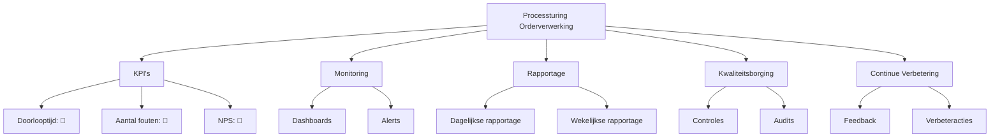

Dit Processturing-document beschrijft hoe het Orderverwerkingsproces (PR-001) bij TelecomPro B.V. wordt gestuurd, gemonitord en verbeterd. Het doel is om:  
- Prestaties van het proces meetbaar te maken met KPI’s.  
- Real-time inzicht te bieden via monitoring en dashboards.  
- Rapportage te standaardiseren voor transparantie naar stakeholders.  
- Kwaliteitsborging te waarborgen door controles en audits.  
- Continue verbetering te faciliteren met feedback en actieplannen.

#### Eigenschappen

| Veld          | Waarde                                                                        | Toelichting                               |
| ----------------- | --------------------------------------------------------------------------------- | --------------------------------------------- |
| PMD-nummer    | 03.08.00                                                                          | Uniek identificatienummer voor processturing. |
| Versie        | 1.0                                                                               | Huidige versie.                               |
| Status        | Gepubliceerd                                                                      | Status van het document.                      |
| Auteur        | Martin van Pelt                                                                   | Procesanalist.                                |
| Eigenaar      | Jan de Vries                                                                      | Proceseigenaar Operaties.                     |
| Datum         | 19/04/2026                                                                        | Datum van laatste update.                     |
| Gekoppeld aan | KPI's (PMD-03.08.01), Procesdashboard (PMD-03.08.02), Procesreview (PMD-03.08.03) | Gerelateerde documenten.                      |

#### Algemeen Overzicht

| Veld                | Waarde                                                                                                           | Toelichting                  |
| ----------------------- | -------------------------------------------------------------------------------------------------------------------- | -------------------------------- |
| Procesnaam          | Orderverwerking                                                                                                      | Naam van het proces.             |
| Proces-ID           | PR-001                                                                                                               | Unieke identifier.               |
| Doel van de sturing | Zorgen voor tijdige, accurate en efficiënte orderverwerking door monitoring, rapportage en verbeteracties.       | Wat de sturing moet bereiken.    |
| Scope               | Van ontvangst klantorder tot activatie van diensten.                                                                 | Wat valt binnen de scope.        |
| Stakeholders        | Proceseigenaar, Order Team, Sales Manager, IT-afdeling, Kwaliteitsmanager, Financiële Afdeling, Inkoop, Provisioning | Wie is betrokken bij de sturing. |

#### KPI Overzicht

*(Zie ook [KPI's](#) (PMD-03.08.01) voor een gedetailleerd overzicht.)*

| KPI                         | Huidige waarde | Norm (Doelwaarde) | Streefwaarde | Trend | Status | Verantwoordelijke | Bron     | Meetfrequentie |
| ------------------------------- | ------------------ | --------------------- | ---------------- | --------- | ---------- | --------------------- | ------------ | ------------------ |
| Doorlooptijd orderverwerking    | 28 uur             | < 24 uur              | < 12 uur         | ⬆️        | 🔴         | Proceseigenaar        | SAP ERP      | Dagelijks          |
| Aantal fouten per order         | 1,5%               | < 1%                  | < 0,5%           | ⬆️        | 🔴         | Kwaliteitsmanager     | SAP ERP      | Wekelijks          |
| First-time-right                | 95%                | > 98%                 | > 99%            | ⬇️        | 🟡         | Proceseigenaar        | SAP ERP      | Wekelijks          |
| Klanttevredenheid (NPS)         | 8,2                | > 8,5                 | > 9,0            | ⬇️        | 🔴         | Sales Manager         | Klantenquête | Maandelijks        |
| Kosten per order                | €12                | < €10                 | < €8             | ⬆️        | 🔴         | Financiële Afdeling   | SAP ERP      | Maandelijks        |
| Systeembeschikbaarheid          | 99,2%              | > 99,5%               | > 99,9%          | ⬇️        | 🟡         | IT-afdeling           | Nagios       | Continu            |
| Aantal verwerkte orders per dag | 45                 | > 50                  | > 60             | ⬇️        | 🟡         | Teamleider            | SAP ERP      | Dagelijks          |

Legenda Status:

- 🟢 Groen: Norm bereikt of overschreden.
- 🟡 Oranje: Waarschuwing (dicht bij norm, maar niet bereikt).
- 🔴 Rood: Afwijking (norm niet bereikt).

#### Monitoring

##### Dashboards

*(Zie ook [Procesdashboard](#) (PMD-03.08.02) voor een gedetailleerd dashboard.)

| Dashboard             | Doel                                 | Gebruikers                         | Frequentie | Tools       | Verantwoordelijke |
| ------------------------- | ---------------------------------------- | -------------------------------------- | -------------- | --------------- | --------------------- |
| Orderverwerkingsdashboard | Overzicht van KPI’s en procesprestaties. | Proceseigenaar, Order Team, Management | Dagelijks      | Power BI        | Proceseigenaar        |
| Kwaliteitsdashboard       | Overzicht van fouten en verbeterpunten.  | Kwaliteitsmanager, Proceseigenaar      | Wekelijks      | Power BI        | Kwaliteitsmanager     |
| Systeemstatusdashboard    | Overzicht van systeembeschikbaarheid.    | IT-afdeling, Proceseigenaar            | Continu        | Nagios, Grafana | IT-afdeling           |

##### Alerts

| Alert                   | KPI                      | Drempelwaarde | Trigger                      | Actie                 | Verantwoordelijke | Escalatie        | Kanaal        |
| --------------------------- | ---------------------------- | ----------------- | -------------------------------- | ------------------------- | --------------------- | -------------------- | ----------------- |
| Vertraagde orderverwerking  | Doorlooptijd orderverwerking | > 24 uur          | Doorlooptijd overschrijdt norm   | Onderzoek oorzaak         | Proceseigenaar        | Teamleider Operaties | E-mail, Teams     |
| Hoog foutpercentage         | Aantal fouten per order      | > 1%              | Foutpercentage overschrijdt norm | Extra training Order Team | Kwaliteitsmanager     | Proceseigenaar       | E-mail            |
| Lage klanttevredenheid      | Klanttevredenheid (NPS)      | < 8,5             | NPS daalt onder norm             | Klantfeedback analyseren  | Sales Manager         | Directie             | E-mail, Dashboard |
| Hoge kosten per order       | Kosten per order             | > €10             | Kosten overschrijden norm        | Onderzoek kostenposten    | Financiële Afdeling   | Proceseigenaar       | E-mail            |
| Lage systeembeschikbaarheid | Systeembeschikbaarheid       | < 99,5%           | Systeembeschikbaarheid daalt     | IT-onderhoud plannen      | IT-afdeling           | Extern supportteam   | SMS, E-mail       |

##### Rapportage

| Rapportage                   | Frequentie | Inhoud                                         | Doelgroep                          | Verantwoordelijke | Format        | Distributie    |
| -------------------------------- | -------------- | -------------------------------------------------- | -------------------------------------- | --------------------- | ----------------- | ------------------ |
| Dagelijkse procesrapportage      | Dagelijks      | KPI’s, afwijkingen, actiepunten                    | Proceseigenaar, Order Team, Management | Proceseigenaar        | E-mail, Dashboard | E-mail, SharePoint |
| Wekelijkse kwaliteitsrapportage  | Wekelijks      | Foutenanalyse, verbeterpunten                      | Kwaliteitsmanager, Proceseigenaar      | Kwaliteitsmanager     | PDF               | E-mail, Confluence |
| Maandelijkse prestatierapportage | Maandelijks    | KPI-trends, verbeteracties, ROI                    | Management, Directie                   | Proceseigenaar        | Presentatie       | Managementmeeting  |
| Ad-hoc incidentrapportage        | Ad hoc         | Oorzaakanalyse, oplossing, preventieve maatregelen | Betrokken partijen                     | Proceseigenaar        | Word/PDF          | E-mail             |

#### Kwaliteitsborging

#### Controles

| Controle          | Type    | Frequentie | Verantwoordelijke | Methode      | Acceptatiecriteria                |
| --------------------- | ----------- | -------------- | --------------------- | ---------------- | ------------------------------------- |
| Volledigheidscontrole | Handmatig   | Per order      | Order Medewerker      | Visuele controle | Alle verplichte velden zijn ingevuld. |
| Juistheidscontrole    | Automatisch | Per order      | SAP ERP               | Systeemvalidatie | Geen foutmeldingen in het systeem.    |
| Tijdigheidscontrole   | Handmatig   | Dagelijks      | Teamleider            | Tijdsregistratie | Order verwerkt binnen 24 uur.         |
| Systeemcontrole       | Automatisch | Continu        | IT-afdeling           | Nagios           | Systeembeschikbaarheid > 99,5%.       |
| Kredietcontrole       | Automatisch | Per order      | Financiële Afdeling   | SAP ERP          | Kredietstatus is goedgekeurd.         |

##### Audits

| Audit              | Type         | Frequentie | Verantwoordelijke | Scope                | Doel                             | Rapportage        |
| ---------------------- | ---------------- | -------------- | --------------------- | ------------------------ | ------------------------------------ | --------------------- |
| Interne procesaudit    | Interne audit    | Halfjaarlijks  | Kwaliteitsmanager     | Hele proces              | Naleving van processtappen en KPI’s  | Auditrapport          |
| Externe ISO 9001 audit | Externe audit    | Jaarlijks      | Kwaliteitsmanager     | Kwaliteitsmanagement     | Naleving van ISO 9001-normen         | Certificeringsrapport |
| Systeemaudit           | Technische audit | Kwartaallijks  | IT-afdeling           | ERP-systeem, CRM-systeem | Systeemveiligheid en beschikbaarheid | Technisch rapport     |

#### Continue Verbetering

##### Feedback Mechanismen

Mechanisme     | Type                 | Frequentie | Verantwoordelijke | Doel                     | Actie               |
| ------------------ | ------------------------ | -------------- | --------------------- | ---------------------------- | ----------------------- |
| Medewerkerfeedback | Kwalitatief              | Maandelijks    | Teamleider            | Verbeterpunten identificeren | Werkoverleg             |
| Klantfeedback      | Kwalitatief/Kwantitatief | Continu        | Sales Manager         | Klanttevredenheid meten      | Klantenquête, follow-up |
| Systeemfeedback    | Kwantitatief             | Continu        | IT-afdeling           | Systeemprestaties meten      | Monitoring, onderhoud   |
| Procesaudit        | Kwalitatief              | Halfjaarlijks  | Kwaliteitsmanager     | Naleving en verbeterpunten   | Auditrapport, actieplan |

##### Verbeteracties
|Verbeterpunt             | KPI                      | Oorzaak                        | Actie                                   | Verantwoordelijke | Deadline | Status    | Impact                    | Kosten | Prioriteit |
| ---------------------------- | ---------------------------- | ---------------------------------- | ------------------------------------------- | --------------------- | ------------ | ------------- | ----------------------------- | ---------- | -------------- |
| Automatiseren validatiestap  | Doorlooptijd orderverwerking | Handmatige validatie duurt te lang | Implementeer automatische validatie in CRM  | IT-afdeling           | 30/06/2026   | In uitvoering | ⬇️ Doorlooptijd met 50%       | €5.000     | Hoog           |
| Extra training Order Team    | Aantal fouten per order      | Onvoldoende training               | Organiseer training voor nieuwe medewerkers | Kwaliteitsmanager     | 15/05/2026   | Gepland       | ⬇️ Fouten met 30%             | €2.000     | Hoog           |
| Verbeter klantcommunicatie   | Klanttevredenheid (NPS)      | Onduidelijke communicatie          | Implementeer automatische statusupdates     | Sales Manager         | 30/05/2026   | Gepland       | ⬆️ NPS met 0,5 punt           | €1.000     | Hoog           |
| Optimaliseren systeemupdates | Systeembeschikbaarheid       | Planned downtime                   | Verplaats updates naar buiten kantooruren   | IT-afdeling           | 30/04/2026   | In uitvoering | ⬆️ Beschikbaarheid naar 99,5% | €0         | Middel         |
| Kostenanalyse                | Kosten per order             | Onbekende kostenposten             | Onderzoek kostenposten en optimaliseer      | Financiële Afdeling   | 15/06/2026   | Gepland       | ⬇️ Kosten met 10%             | €1.500     | Hoog           |

#### Visuele Weergave (Mermaid)

#### Stakeholders en Verantwoordelijkheden|

|Rol               | Verantwoordelijkheid                                                 | Betrokkenheid |
| --------------------- | ------------------------------------------------------------------------ | ----------------- |
| Proceseigenaar    | Verantwoordelijk voor de inhoud en actualiteit van de processturing. | Continu           |
| Procesanalist     | Stelt de processturing op en zorgt voor consistentie.                | Ad hoc            |
| Kwaliteitsmanager | Monitort de kwaliteit en voert audits uit.                           | Periodiek         |
| IT-afdeling       | Ondersteunt bij monitoring en systeembeschikbaarheid.                | Continu           |
| Management        | Valideert de processturing op strategische alignement.               | Periodiek         |
| Order Team        | Voert het proces uit volgens de gedefinieerde sturing.               | Dagelijks         |

#### Gerelateerde Documenten

- [KPI's](#) (PMD-03.08.01)
- [KPI Definitie](#) (PMD-03.08.04)
- [Procesdashboard](#) (PMD-03.08.02)
- [Procesreview](#) (PMD-03.08.03)
- [Procesbeschrijving](#) (PMD-03.07.01)

#### Versiehistorie

| Versie | Datum  | Wijziging   | Auteur      | Goedgekeurd door |
| ---------- | ---------- | --------------- | --------------- | -------------------- |
| 1.0        | 19/04/2026 | Initiële versie | Martin van Pelt | Jan de Vries         |