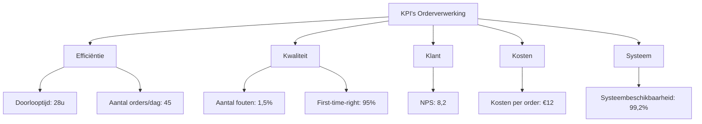

---
title: KPI's - Orderverwerking  
weight: 1  
description: Overzicht van Key Performance Indicators (KPI's) voor het Orderverwerkingsproces bij TelecomPro B.V.  
--- 

Dit document biedt een overzicht van KPI’s voor het Orderverwerkingsproces (PR-001) bij TelecomPro B.V.. KPI’s helpen om:  
- Prestaties van het proces objectief meetbaar te maken.  
- Doelen te koppelen aan concrete, meetbare resultaten.  
- Transparantie te creëren voor stakeholders (management, teams, klanten).  
- Continue verbetering te faciliteren door afwijkingen te analyseren en acties te ondernemen.

#### Eigenschappen

| Veld          | Waarde                                                                                 | Toelichting                       |
| ----------------- | ------------------------------------------------------------------------------------------ | ------------------------------------- |
| PMD-nummer    | 03.08.01                                                                                   | Uniek identificatienummer voor KPI's. |
| Versie        | 1.0                                                                                        | Huidige versie.                       |
| Status        | Gepubliceerd                                                                               | Status van het document.              |
| Auteur        | Martin van Pelt                                                                            | Procesanalist.                        |
| Eigenaar      | Jan de Vries                                                                               | Proceseigenaar Operaties.             |
| Datum         | 19/04/2026                                                                                 | Datum van laatste update.             |
| Gekoppeld aan | KPI Definitie (PMD-03.08.04), Processturing (PMD-03.08.00), Procesdashboard (PMD-03.08.02) | Gerelateerde documenten.              |

#### Algemeen Overzicht

| Veld              | Waarde                                                                                    | Toelichting               |
| --------------------- | --------------------------------------------------------------------------------------------- | ----------------------------- |
| Procesnaam        | Orderverwerking                                                                               | Naam van het proces.          |
| Proces-ID         | PR-001                                                                                        | Unieke identifier.            |
| Doel van de KPI’s | Meten van de efficiëntie, kwaliteit, en klanttevredenheid van het Orderverwerkingsproces. | Wat de KPI’s moeten bereiken. |
| Scope             | Van ontvangst klantorder tot activatie van diensten.                                          | Wat valt binnen de scope.     |

#### KPI Overzichtstabel
| KPI                         | Definitie                                                                     | Doel                   | Meetmethode                   | Meetfrequentie | Norm (Doelwaarde) | Streefwaarde | Huidige waarde | Trend | Verantwoordelijke | Bron     | Actie bij afwijking          | Koppeling met strategie                   |
| ------------------------------- | --------------------------------------------------------------------------------- | -------------------------- | --------------------------------- | ------------------ | --------------------- | ---------------- | ------------------ | --------- | --------------------- | ------------ | -------------------------------- | --------------------------------------------- |
| Doorlooptijd orderverwerking    | Gemiddelde tijd tussen ontvangst en bevestiging van een order.                    | Snelle orderafhandeling    | Automatische meting via SAP ERP   | Dagelijks          | < 24 uur              | < 12 uur         | 28 uur             | ⬆️        | Proceseigenaar        | SAP ERP      | Onderzoek oorzaak vertraging     | Ondersteunt doel "Klanttevredenheid verhogen" |
| Aantal fouten per order         | Percentage orders met fouten (onjuiste klantgegevens, verkeerde productselectie). | Minimaliseren van fouten   | Handmatige controle + systeemlogs | Wekelijks          | < 1%                  | < 0,5%           | 1,5%               | ⬆️        | Kwaliteitsmanager     | SAP ERP      | Extra training voor Order Team   | Ondersteunt doel "Kwaliteit verbeteren"       |
| First-time-right                | Percentage orders dat in één keer correct wordt verwerkt.                         | Verhogen efficiëntie       | Systeemmeting (SAP)               | Wekelijks          | > 98%                 | > 99%            | 95%                | ⬇️        | Proceseigenaar        | SAP ERP      | Analyse van fouten               | Ondersteunt doel "Efficiëntie verhogen"       |
| Klanttevredenheid (NPS)         | Net Promoter Score voor orderafhandeling.                                         | Hoge klanttevredenheid     | Klantenquête                      | Maandelijks        | > 8,5                 | > 9,0            | 8,2                | ⬇️        | Sales Manager         | Klantenquête | Klantfeedback analyseren         | Ondersteunt doel "Klanttevredenheid verhogen" |
| Kosten per order                | Gemiddelde kosten voor het verwerken van een order.                               | Efficiënte orderverwerking | Financiële rapportage             | Maandelijks        | < €10                 | < €8             | €12                | ⬆️        | Financiële Afdeling   | SAP ERP      | Onderzoek kostenposten           | Ondersteunt doel "Kosten verlagen"            |
| Systeembeschikbaarheid          | Percentage tijd dat SAP ERP en CRM-systeem beschikbaar zijn.                      | Betrouwbare systeemtoegang | Automatische monitoring           | Continu            | > 99,5%               | > 99,9%          | 99,2%              | ⬇️        | IT-afdeling           | Nagios       | IT-onderhoud plannen             | Ondersteunt doel "Betrouwbaarheid verhogen"   |
| Aantal verwerkte orders per dag | Aantal orders dat dagelijks wordt verwerkt.                                       | Verhogen productiviteit    | Systeemmeting (SAP)               | Dagelijks          | > 50                  | > 60             | 45                 | ⬇️        | Teamleider            | SAP ERP      | Onderzoek capaciteitsbeperkingen | Ondersteunt doel "Productiviteit verhogen"    |

#### KPI Categorisatie

| Categorie   | KPI’s                                                     | Doel                                         |
| --------------- | ------------------------------------------------------------- | ------------------------------------------------ |
| Efficiëntie | Doorlooptijd orderverwerking, Aantal verwerkte orders per dag | Meten van snelheid en productiviteit.        |
| Kwaliteit   | Aantal fouten per order, First-time-right                     | Meten van nauwkeurigheid en betrouwbaarheid. |
| Klant       | Klanttevredenheid (NPS)                                       | Meten van klanttevredenheid.                 |
| Kosten      | Kosten per order                                              | Meten van kostenefficiëntie.                 |
| Systeem     | Systeembeschikbaarheid                                        | Meten van systeembetrouwbaarheid.            |

#### KPI Definities

*(Zie [KPI Definitie](#) (PMD-03.08.04) voor gedetailleerde definities van elke KPI.)*

#### Visuele Weergave (Mermaid)

#### Stakeholders en Verantwoordelijkheden

| Rol               | Verantwoordelijkheid                                         | Betrokkenheid |
| --------------------- | ---------------------------------------------------------------- | ----------------- |
| Proceseigenaar    | Verantwoordelijk voor de inhoud en actualiteit van de KPI’s. | Continu           |
| Procesanalist     | Definieert en documenteert de KPI’s.                         | Ad hoc            |
| IT-afdeling       | Levert technische data en ondersteunt bij automatisering.    | Ad hoc            |
| Kwaliteitsmanager | Valideert de KPI’s en zorgt voor datakwaliteit.              | Periodiek         |
| Management        | Valideert de KPI’s op strategische alignement.               | Periodiek         |

#### Gerelateerde Documenten

- [KPI Definitie](#) (PMD-03.08.04)
- [Processturing](#) (PMD-03.08.00)
- [Procesdashboard](#) (PMD-03.08.02)
- [Procesreview](#) (PMD-03.08.03)

#### Versiehistorie

| Versie | Datum  | Wijziging   | Auteur      | Goedgekeurd door |
| ---------- | ---------- | --------------- | --------------- | -------------------- |
| 1.0        | 19/04/2026 | Initiële versie | Martin van Pelt | Jan de Vries         |