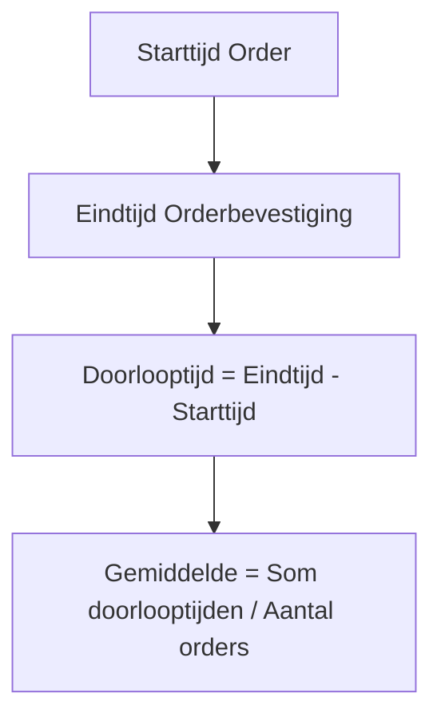

Dit document biedt een gedetailleerde definitie van de KPI "Doorlooptijd Orderverwerking" voor het Orderverwerkingsproces (PR-001) bij TelecomPro B.V.. Het doel is om:  
- Duidelijkheid te scheppen over wat de KPI meet en hoe deze wordt berekend.  
- Consistentie te waarborgen in de meting en interpretatie van de KPI.  
- Basis te leggen voor processturing, monitoring, en continue verbetering.

#### Eigenschappen

| Veld          | Waarde                                                                         | Toelichting                               |
| ----------------- | ---------------------------------------------------------------------------------- | --------------------------------------------- |
| PMD-nummer    | 03.08.04                                                                           | Uniek identificatienummer voor KPI-definitie. |
| Versie        | 1.0                                                                                | Huidige versie.                               |
| Status        | Gepubliceerd                                                                       | Status van het document.                      |
| Auteur        | Martin van Pelt                                                                    | Procesanalist.                                |
| Eigenaar      | Jan de Vries                                                                       | Proceseigenaar Operaties.                     |
| Datum         | 19/04/2026                                                                         | Datum van laatste update.                     |
| Gekoppeld aan | KPI's (PMD-03.08.01), Processturing (PMD-03.08.00), Procesdashboard (PMD-03.08.02) | Gerelateerde documenten.                      |

#### Basisgegevens

| Veld       | Waarde                   | Toelichting                                            |
| -------------- | ---------------------------- | ---------------------------------------------------------- |
| KPI-ID     | KPI-001                      | Unieke identifier.                                         |
| KPI naam   | Doorlooptijd Orderverwerking | Naam van de KPI.                                           |
| Procesnaam | Orderverwerking              | Proces waar de KPI toe behoort.                            |
| Proces-ID  | PR-001                       | Referentie naar het proces.                                |
| Categorie  | Efficiëntie                  | Type KPI (Efficiëntie, Kwaliteit, Klant, Kosten, Systeem). |

#### KPI Naam

Doorlooptijd Orderverwerking

#### Definitie

| Veld              | Waarde                                                                                                                                                                                           |
| --------------------- | ---------------------------------------------------------------------------------------------------------------------------------------------------------------------------------------------------- |
| Exacte betekenis  | De gemiddelde tijd in uren tussen het moment waarop een klantorder wordt ontvangen (via webshop, telefoon, of sales) en het moment waarop de orderbevestiging naar de klant wordt verstuurd. |
| Scope             | Alle orders die via de webshop, telefoon, of sales worden ontvangen, exclusief bulkorders (>100 stuks).                                                                                      |
| Doel van de KPI   | Meten van de efficiëntie van het Orderverwerkingsproces.                                                                                                                                         |
| Toepassingsgebied | Order Team, Sales Team, Provisioning.                                                                                                                                                                |

#### Formule

| Veld                | Waarde                                                                                          |
| ----------------------- | --------------------------------------------------------------------------------------------------- |
| Formule             | `(Som van doorlooptijden alle orders) / (Aantal orders)`                                            |
| Eenheid             | uren                                                                                                |
| Berekeningsmethode  | Automatisch via SAP ERP (tijdstempel ontvangst order - tijdstempel versturen orderbevestiging). |
| Voorbeeldberekening | `(24u + 20u + 30u + 25u) / 4 = 24,75u`                                                              |

#### Brondata

| Veld             | Waarde                         |
| -------------------- | ---------------------------------- |
| Bronsysteem      | SAP ERP                            |
| Rapportage       | Dagelijkse KPI-rapportage          |
| Handmatige input | Geen (fully automated)             |
| Data-eigenaar    | IT-afdeling                        |
| Datakwaliteit    | Gevalideerd, real-time, consistent |

#### Norm / Target

| Veld                    | Waarde                                                                    | Toelichting                    |
| --------------------------- | ----------------------------------------------------------------------------- | ---------------------------------- |
| Minimum                 | Niet van toepassing                                                           | -                                  |
| Norm (Doelwaarde)       | < 24 uur                                                                      | Gemiddelde doorlooptijd.           |
| Streefwaarde            | < 12 uur                                                                      | Ambitieuze doelwaarde.             |
| Maximum                 | 48 uur                                                                        | Maximale acceptabele doorlooptijd. |
| Koppeling met strategie | Ondersteunt organisatiedoel "Klanttevredenheid verhogen tot 90% in 2026". | &nbsp;                             |

#### Meetfrequentie

| Veld              | Waarde                   | Toelichting |
| --------------------- | ---------------------------- | --------------- |
| Frequentie        | Dagelijks                    | -               |
| Meetmoment        | Einde van de dag (17:00 uur) | -               |
| Verantwoordelijke | Proceseigenaar               | -               |\

#### Eigenaar

| Veld                  | Waarde                                                    | Toelichting |
| ------------------------- | ------------------------------------------------------------- | --------------- |
| Eigenaar              | Proceseigenaar Orderverwerking (Jan de Vries)                 | -               |
| Verantwoordelijkheden | Meting, analyse, rapportage, verbeteracties                   | -               |
| Contactgegevens       | [jan.devries@telecompro.nl](mailto:jan.devries@telecompro.nl) | -               |

#### Kwaliteitsvoorwaarden

| Veld          | Waarde                                           |
| ----------------- | ---------------------------------------------------- |
| Datakwaliteit | Data moet compleet, accuraat, en real-time zijn. |
| Meetmethode   | Automatische meting via SAP ERP.                 |
| Validatie     | Maandelijkse controle door Kwaliteitsmanager.    |

#### Visuele Weergave (Mermaid)

#### Gerelateerde Documenten

- [KPI's](#) (PMD-03.08.01)
- [Processturing](#) (PMD-03.08.00)
- [Procesdashboard](#) (PMD-03.08.02)

#### Versiehistorie

| Versie | Datum  | Wijziging   | Auteur      | Goedgekeurd door |
| ---------- | ---------- | --------------- | --------------- | -------------------- |
| 1.0        | 19/04/2026 | Initiële versie | Martin van Pelt | Jan de Vries         |