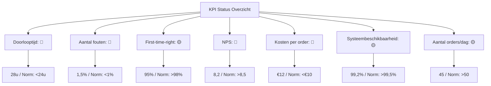
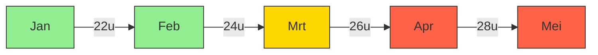
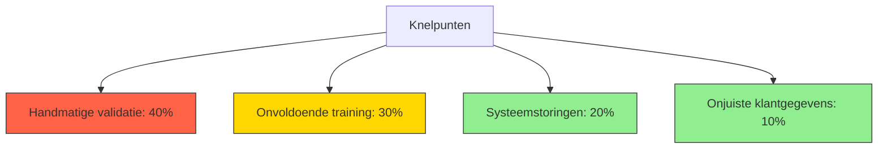

Dit Procesdashboard biedt een centrale, visuele weergave van de prestaties, trends, en verbeterpunten van het Orderverwerkingsproces (PR-001) bij TelecomPro B.V.. Het doel is om:  
- Real-time inzicht te bieden in de prestaties van het proces.  
- Trends en patronen te identificeren voor proactieve sturing.  
- Afwijkingen snel te signaleren en acties te ondernemen.  
- Transparantie te creëren voor stakeholders (management, teams, klanten).  
- Basis te leggen voor continue verbetering en datagestuurde besluitvorming.

#### Eigenschappen

| Veld          | Waarde                                                                       | Toelichting                                 |
| ----------------- | -------------------------------------------------------------------------------- | ----------------------------------------------- |
| PMD-nummer    | 03.08.02                                                                         | Uniek identificatienummer voor procesdashboard. |
| Versie        | 1.0                                                                              | Huidige versie.                                 |
| Status        | Gepubliceerd                                                                     | Status van het document.                        |
| Auteur        | Martin van Pelt                                                                  | Procesanalist.                                  |
| Eigenaar      | Jan de Vries                                                                     | Proceseigenaar Operaties.                       |
| Datum         | 19/04/2026                                                                       | Datum van laatste update.                       |
| Gekoppeld aan | KPI's (PMD-03.08.01), Processturing (PMD-03.08.00), KPI Definitie (PMD-03.08.04) | Gerelateerde documenten.                        |

#### Algemeen Overzicht

| Veld                   | Waarde                                                                   | Toelichting                    |
| -------------------------- | ---------------------------------------------------------------------------- | ---------------------------------- |
| Procesnaam             | Orderverwerking                                                              | Naam van het proces.               |
| Proces-ID              | PR-001                                                                       | Unieke identifier.                 |
| Doel van het dashboard | Real-time monitoring van orderverwerkingsprestaties voor proactieve sturing. | Wat het dashboard moet bereiken.   |
| Doelgroep              | Proceseigenaar, Order Team, Management, IT-afdeling, Kwaliteitsmanager       | Voor wie het dashboard bedoeld is. |

#### Dashboard Structuur

Een effectief procesdashboard bevat de volgende onderdelen:

1. KPI-overzicht: Huidige waarden, normen, en trends van KPI's.
2. Visuele weergave: Grafieken, diagrammen, en meters voor snelle interpretatie.
3. Analyse: Diepgaande analyse van trends, afwijkingen, en oorzaken.
4. Verbeteracties: Actiepunten voor het verbeteren van procesprestaties.
5. Alerts: Waarschuwingen voor kritische afwijkingen.

#### KPI Overzicht

| KPI                         | Huidige waarde | Norm | Trend | Status | Verantwoordelijke | Bron     | Laatste meting |
| ------------------------------- | ------------------ | -------- | --------- | ---------- | --------------------- | ------------ | ------------------ |
| Doorlooptijd orderverwerking    | 28 uur             | < 24 uur | ⬆️        | 🔴         | Proceseigenaar        | SAP ERP      | 19/04/2026         |
| Aantal fouten per order         | 1,5%               | < 1%     | ⬆️        | 🔴         | Kwaliteitsmanager     | SAP ERP      | 18/04/2026         |
| First-time-right                | 95%                | > 98%    | ⬇️        | 🟡         | Proceseigenaar        | SAP ERP      | 18/04/2026         |
| Klanttevredenheid (NPS)         | 8,2                | > 8,5    | ⬇️        | 🔴         | Sales Manager         | Klantenquête | 15/04/2026         |
| Kosten per order                | €12                | < €10    | ⬆️        | 🔴         | Financiële Afdeling   | SAP ERP      | 19/04/2026         |
| Systeembeschikbaarheid          | 99,2%              | > 99,5%  | ⬇️        | 🟡         | IT-afdeling           | Nagios       | 19/04/2026         |
| Aantal verwerkte orders per dag | 45                 | > 50     | ⬇️        | 🟡         | Teamleider            | SAP ERP      | 19/04/2026         |

Legenda Status:

- 🟢 Groen: Norm bereikt of overschreden.
- 🟡 Oranje: Waarschuwing (dicht bij norm, maar niet bereikt).
- 🔴 Rood: Afwijking (norm niet bereikt).

#### Visuele Weergave

##### KPI Meter (Mermaid)

##### Trendgrafiek (Mermaid)

##### Pareto-diagram (Mermaid)

#### Analyse

##### Trendanalyse

| KPI                      | Trend | Oorzaak              | Impact               | Root Cause            | Onderbouwing                                 |
| ---------------------------- | --------- | ------------------------ | ------------------------ | ------------------------- | ------------------------------------------------ |
| Doorlooptijd orderverwerking | ⬆️        | Handmatige validatiestap | Vertraging in levering   | Gebrek aan automatisering | Handmatige validatie duurt gemiddeld 30 minuten. |
| Aantal fouten per order      | ⬆️        | Onvoldoende training     | Onjuiste orderverwerking | Gebrek aan kennis         | Nieuwe medewerkers zijn niet voldoende getraind. |
| First-time-right             | ⬇️        | Onjuiste klantgegevens   | Herwerk nodig            | Gebrek aan validatie      | Geen automatische controle op klantgegevens.     |
| Klanttevredenheid (NPS)      | ⬇️        | Vertraagde levering      | Lagere klanttevredenheid | Hoge doorlooptijd         | Klanten klagen over late leveringen.             |
| Kosten per order             | ⬆️        | Onbekende kostenposten   | Hogere kosten            | Gebrek aan inzicht        | Geen gedetailleerde kostenanalyse.               |

##### Correlatieanalyse

| KPI 1                    | KPI 2                    | Correlatie | Uitleg                                                    |
| ---------------------------- | ---------------------------- | -------------- | ------------------------------------------------------------- |
| Doorlooptijd orderverwerking | Klanttevredenheid (NPS)      | Negatief       | Langere doorlooptijd leidt tot lagere klanttevredenheid.      |
| Aantal fouten per order      | First-time-right             | Negatief       | Meer fouten leiden tot lagere first-time-right.               |
| Systeembeschikbaarheid       | Doorlooptijd orderverwerking | Negatief       | Lagere systeembeschikbaarheid leidt tot langere doorlooptijd. |

#### Verbeteracties

| Verbeterpunt             | KPI                      | Oorzaak               | Actie                                   | Verantwoordelijke | Deadline | Status    | Impact                    | Kosten | Prioriteit |
| ---------------------------- | ---------------------------- | ------------------------- | ------------------------------------------- | --------------------- | ------------ | ------------- | ----------------------------- | ---------- | -------------- |
| Automatiseren validatiestap  | Doorlooptijd orderverwerking | Handmatige validatie      | Implementeer automatische validatie in CRM  | IT-afdeling           | 30/06/2026   | In uitvoering | ⬇️ Doorlooptijd met 50%       | €5.000     | Hoog           |
| Extra training Order Team    | Aantal fouten per order      | Onvoldoende training      | Organiseer training voor nieuwe medewerkers | Kwaliteitsmanager     | 15/05/2026   | Gepland       | ⬇️ Fouten met 30%             | €2.000     | Hoog           |
| Verbeter klantcommunicatie   | Klanttevredenheid (NPS)      | Onduidelijke communicatie | Implementeer automatische statusupdates     | Sales Manager         | 30/05/2026   | Gepland       | ⬆️ NPS met 0,5 punt           | €1.000     | Hoog           |
| Optimaliseren systeemupdates | Systeembeschikbaarheid       | Planned downtime          | Verplaats updates naar buiten kantooruren   | IT-afdeling           | 30/04/2026   | In uitvoering | ⬆️ Beschikbaarheid naar 99,5% | €0         | Middel         |
| Kostenanalyse                | Kosten per order             | Onbekende kostenposten    | Onderzoek kostenposten en optimaliseer      | Financiële Afdeling   | 15/06/2026   | Gepland       | ⬇️ Kosten met 10%             | €1.500     | Hoog           |

#### Alerts en Waarschuwingen

| Alert                   | KPI                      | Drempelwaarde | Trigger                      | Actie                | Verantwoordelijke | Escalatie        | Kanaal        |
| --------------------------- | ---------------------------- | ----------------- | -------------------------------- | ------------------------ | --------------------- | -------------------- | ----------------- |
| Vertraagde orderverwerking  | Doorlooptijd orderverwerking | > 24 uur          | Doorlooptijd overschrijdt norm   | Onderzoek oorzaak        | Proceseigenaar        | Teamleider Operaties | E-mail, Teams     |
| Hoog foutpercentage         | Aantal fouten per order      | > 1%              | Foutpercentage overschrijdt norm | Extra training           | Kwaliteitsmanager     | Proceseigenaar       | E-mail            |
| Lage klanttevredenheid      | Klanttevredenheid (NPS)      | < 8,5             | NPS daalt onder norm             | Klantfeedback analyseren | Sales Manager         | Directie             | E-mail, Dashboard |
| Hoge kosten per order       | Kosten per order             | > €10             | Kosten overschrijden norm        | Onderzoek kostenposten   | Financiële Afdeling   | Proceseigenaar       | E-mail            |
| Lage systeembeschikbaarheid | Systeembeschikbaarheid       | < 99,5%           | Systeembeschikbaarheid daalt     | IT-onderhoud plannen     | IT-afdeling           | Extern supportteam   | SMS, E-mail       |

#### Stakeholders en Verantwoordelijkheden

| Rol               | Verantwoordelijkheid                                              | Betrokkenheid |
| --------------------- | --------------------------------------------------------------------- | ----------------- |
| Proceseigenaar    | Verantwoordelijk voor de inhoud en actualiteit van het dashboard. | Continu           |
| Procesanalist     | Stelt het dashboard op en voert analyses uit.                     | Ad hoc            |
| Kwaliteitsmanager | Monitort KPI's en voert verbeteracties uit.                       | Periodiek         |
| IT-afdeling       | Ondersteunt bij automatisering en tooling.                        | Ad hoc            |
| Management        | Gebruikt het dashboard voor strategische besluitvorming.          | Periodiek         |
| Order Team        | Levert data voor het dashboard.                                   | Dagelijks         |

#### Gerelateerde Documenten

- [KPI's](#) (PMD-03.08.01)
- [KPI Definitie](#) (PMD-03.08.04)
- [Processturing](#) (PMD-03.08.00)

#### Versiehistorie

| Versie | Datum  | Wijziging   | Auteur      | Goedgekeurd door |
| ---------- | ---------- | --------------- | --------------- | -------------------- |
| 1.0        | 19/04/2026 | Initiële versie | Martin van Pelt | Jan de Vries         |