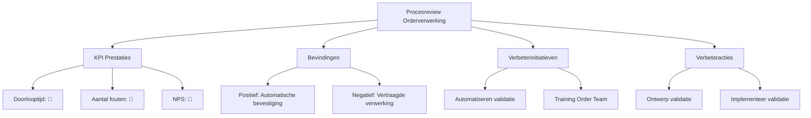

#### Inleiding

Dit Procesreview-template biedt een gestructureerde aanpak voor het evalueren en verbeteren van het Orderverwerkingsproces (PR-001) bij TelecomPro B.V.. Het doel is om:  
- Prestaties van het proces objectief te beoordelen op basis van KPI's en bevindingen.  
- Knippunten en kansen voor verbetering te identificeren.  
- Actieplannen op te stellen voor continue verbetering.  
- Verantwoordelijkheid en follow-up te waarborgen voor het implementeren van verbeteringen.  
- Transparantie te creëren voor stakeholders (management, teams, klanten).

#### Eigenschappen

| Veld          | Waarde                                                                         | Toelichting                              |
| ----------------- | ---------------------------------------------------------------------------------- | -------------------------------------------- |
| PMD-nummer    | 03.08.03                                                                           | Uniek identificatienummer voor procesreview. |
| Versie        | 1.0                                                                                | Huidige versie.                              |
| Status        | Gepubliceerd                                                                       | Status van het document.                     |
| Auteur        | Martin van Pelt                                                                    | Procesanalist.                               |
| Eigenaar      | Jan de Vries                                                                       | Proceseigenaar Operaties.                    |
| Datum         | 19/04/2026                                                                         | Datum van laatste update.                    |
| Gekoppeld aan | KPI's (PMD-03.08.01), Processturing (PMD-03.08.00), Procesdashboard (PMD-03.08.02) | Gerelateerde documenten.                     |

#### Algemeen Overzicht

| Veld               | Waarde                                                          | Toelichting                       |
| ---------------------- | ------------------------------------------------------------------- | ------------------------------------- |
| Procesnaam         | Orderverwerking                                                     | Naam van het proces.                  |
| Proces-ID          | PR-001                                                              | Unieke identifier.                    |
| Datum review       | 19/04/2026                                                          | Datum waarop de review is uitgevoerd. |
| Type review        | Maandelijkse review                                                 | Type review.                          |
| Doel van de review | Evaluatie van procesprestaties en identificatie van verbeterpunten. | Wat de review moet bereiken.          |
| Scope              | Hele proces van ontvangst tot bevestiging van orders.               | Wat valt binnen de scope.             |

#### Voorbereiding

| Veld                 | Waarde                                                                                                                |
| ------------------------ | ------------------------------------------------------------------------------------------------------------------------- |
| Benodigde documenten | Procesbeschrijving (PMD-03.07.01), KPI-rapport (PMD-03.08.01), Procesdashboard (PMD-03.08.02), RACI Matrix (PMD-03.07.03) |
| Benodigde data       | KPI-waarden, proceslogs, klantfeedback, systeemdata                                                                       |
| Betrokken partijen   | Proceseigenaar, Procesanalist, Kwaliteitsmanager, IT-afdeling, Sales Manager, Teamleider Orderverwerking                  |
| Agenda               | KPI-prestaties, bevindingen, verbeteracties, actieplan                                                                    |

#### KPI Prestaties

| KPI                         | Huidige waarde | Norm | Trend | Status | Afwijking | Oorzaak              | Impact               |
| ------------------------------- | ------------------ | -------- | --------- | ---------- | ------------- | ------------------------ | ------------------------ |
| Doorlooptijd orderverwerking    | 28 uur             | < 24 uur | ⬆️        | 🔴         | +4 uur        | Handmatige validatiestap | Vertraging in levering   |
| Aantal fouten per order         | 1,5%               | < 1%     | ⬆️        | 🔴         | +0,5%         | Onvoldoende training     | Onjuiste orderverwerking |
| First-time-right                | 95%                | > 98%    | ⬇️        | 🟡         | -3%           | Onjuiste klantgegevens   | Herwerk nodig            |
| Klanttevredenheid (NPS)         | 8,2                | > 8,5    | ⬇️        | 🔴         | -0,3          | Vertraagde levering      | Lagere klanttevredenheid |
| Kosten per order                | €12                | < €10    | ⬆️        | 🔴         | +€2           | Onbekende kostenposten   | Hogere kosten            |
| Systeembeschikbaarheid          | 99,2%              | > 99,5%  | ⬇️        | 🟡         | -0,3%         | Planned downtime         | Onderbreking van proces  |
| Aantal verwerkte orders per dag | 45                 | > 50     | ⬇️        | 🟡         | -5            | Capaciteitsbeperkingen   | Lagere productiviteit    |

Legenda Status:

- 🟢 Groen: Norm bereikt of overschreden.
- 🟡 Oranje: Waarschuwing (dicht bij norm, maar niet bereikt).
- 🔴 Rood: Afwijking (norm niet bereikt).

#### Bevindingen

##### Positieve Bevindingen

| Bevinding                 | Beschrijving                                          | Oorzaak                           | Impact                                 |
| ----------------------------- | --------------------------------------------------------- | ------------------------------------- | ------------------------------------------ |
| Automatische orderbevestiging | Orderbevestigingen worden automatisch verstuurd.          | Geïmplementeerd in Salesforce CRM     | Vermindering van handmatig werk.           |
| Hoog opgeleid Order Team      | Order Team heeft ervaring met CRM en ERP.                 | Interne training en werving           | Efficiënte orderverwerking.                |
| Goede samenwerking IT         | IT-afdeling is proactief betrokken bij procesverbetering. | Duidelijke communicatie en prioriteit | Snelle oplossing van technische problemen. |

##### Negatieve Bevindingen (Verbeterpunten)

| Bevinding               | Beschrijving                               | Oorzaak (5 Why's)                                                                                                                                | Impact               | Prioriteit |
| --------------------------- | ---------------------------------------------- | ---------------------------------------------------------------------------------------------------------------------------------------------------- | ------------------------ | -------------- |
| Vertraagde orderverwerking  | Doorlooptijd is gestegen van 24u naar 28u.     | 1. Handmatige validatiestap. 2. Geen automatisering. 3. Beperkte IT-capaciteit. 4. Geen budget voor automatisering. 5. Geen business case opgesteld. | Vertraging in levering   | Hoog           |
| Hoog foutpercentage         | Aantal fouten per order is gestegen naar 1,5%. | 1. Onvoldoende training. 2. Nieuwe medewerkers. 3. Geen gestandaardiseerde werkwijze. 4. Geen checklists. 5. Geen kwaliteitscontroles.               | Onjuiste orderverwerking | Hoog           |
| Lage klanttevredenheid      | NPS is gedaald naar 8,2.                       | 1. Vertraagde levering. 2. Onjuiste orders. 3. Gebrek aan communicatie. 4. Geen proactieve updates. 5. Geen klantfeedbackmechanisme.                 | Lagere klanttevredenheid | Hoog           |
| Hoge kosten per order       | Kosten per order zijn gestegen naar €12.       | 1. Onbekende kostenposten. 2. Gebrek aan kostenanalyse. 3. Geen inzicht in proceskosten.                                                             | Hogere kosten            | Hoog           |
| Lage systeembeschikbaarheid | Systeembeschikbaarheid is gedaald naar 99,2%.  | 1. Planned downtime. 2. Systeemupdates. 3. Gebrek aan monitoring.                                                                                    | Onderbreking van proces  | Middel         |

#### SWOT-analyse
| Categorie    | Beschrijving                | Impact               | Actie                     |
| ---------------- | ------------------------------- | ------------------------ | ----------------------------- |
| Sterktes     | Automatische orderbevestiging   | Efficiëntie              | Behoud en optimaliseer.       |
| Sterktes     | Hoog opgeleid Order Team        | Kwaliteit                | Investeer in training.        |
| Sterktes     | Goede samenwerking IT           | Snelle probleemoplossing | Behoud goede samenwerking.    |
| Zwaktes      | Handmatige validatiestap        | Vertraging               | Automatiseren.                |
| Zwaktes      | Onvoldoende training            | Fouten                   | Organiseer training.          |
| Zwaktes      | Gebrek aan real-time monitoring | Gebrek aan inzicht       | Implementeer dashboard.       |
| Kansen       | Nieuwe CRM-functionaliteiten    | Efficiëntie              | Benutten voor automatisering. |
| Kansen       | Groeiende markt                 | Omzet                    | Schaal proces op.             |
| Bedreigingen | Concurrentie                    | Marktpositie             | Differentiëren op kwaliteit.  |
| Bedreigingen | Systeemveroudering              | Betrouwbaarheid          | Upgraden systeem.             |

#### Verbeterinitiatieven

| Initiatief               | Doel                        | Knelpunt/Trend      | Methode                                  | Verantwoordelijke | Budget | Tijdsduur | Verwachte impact          | Prioriteit |
| ---------------------------- | ------------------------------- | ----------------------- | -------------------------------------------- | --------------------- | ---------- | ------------- | ----------------------------- | -------------- |
| Automatiseren validatiestap  | Verminderen doorlooptijd        | Handmatige validatie    | Implementeer automatische validatie in CRM.  | IT-afdeling           | €5.000     | 2 maanden     | ⬇️ Doorlooptijd met 50%       | Hoog           |
| Training Order Team          | Verminderen fouten              | Onvoldoende training    | Organiseer training voor nieuwe medewerkers. | Kwaliteitsmanager     | €2.000     | 1 maand       | ⬇️ Fouten met 30%             | Hoog           |
| Verbeter klantcommunicatie   | Verhogen klanttevredenheid      | Gebrek aan communicatie | Implementeer automatische statusupdates.     | Sales Manager         | €1.000     | 1 maand       | ⬆️ NPS met 0,5 punt           | Hoog           |
| Kostenanalyse                | Verlagen kosten per order       | Onbekende kostenposten  | Onderzoek kostenposten en optimaliseer.      | Financiële Afdeling   | €1.500     | 1 maand       | ⬇️ Kosten met 10%             | Hoog           |
| Optimaliseren systeemupdates | Verhogen systeembeschikbaarheid | Planned downtime        | Verplaats updates naar buiten kantooruren.   | IT-afdeling           | €0         | 1 maand       | ⬆️ Beschikbaarheid naar 99,5% | Middel         |

#### Verbeteracties

| Actie                      | Initiatief              | Beschrijving                                      | Verantwoordelijke | Startdatum | Deadline | Status | Afhankelijkheden        | Risico's                     | Mitigerende maatregelen | Succescriteria               |
| ------------------------------ | --------------------------- | ----------------------------------------------------- | --------------------- | -------------- | ------------ | ---------- | --------------------------- | -------------------------------- | --------------------------- | -------------------------------- |
| Ontwerp automatische validatie | Automatiseren validatiestap | Ontwikkel automatische validatieregels in CRM.        | IT-afdeling           | 01/05/2026     | 15/05/2026   | Gepland    | Budgetgoedkeuring           | Vertraging door andere projecten | Prioriteit verhogen         | Validatieregels werken foutloos. |
| Implementeer validatie         | Automatiseren validatiestap | Implementeer validatieregels in productie.            | IT-afdeling           | 16/05/2026     | 30/06/2026   | Gepland    | Ontwerp validatie           | Technische issues                | Test in sandbox-omgeving    | Validatie werkt in productie.    |
| Organiseer training            | Training Order Team         | Plan en voer training uit voor nieuwe medewerkers.    | Kwaliteitsmanager     | 01/05/2026     | 15/05/2026   | Gepland    | Beschikbaarheid trainers    | Lage opkomst                     | Verplichte training         | Alle medewerkers getraind.       |
| Implementeer notificaties      | Verbeter klantcommunicatie  | Ontwikkel en implementeer automatische statusupdates. | Sales Manager         | 01/05/2026     | 30/05/2026   | Gepland    | IT-ondersteuning            | Technische beperkingen           | Pilot testen                | Notificaties werken foutloos.    |
| Onderzoek kostenposten         | Kostenanalyse               | Analyseer kostenposten en optimaliseer.               | Financiële Afdeling   | 01/05/2026     | 15/06/2026   | Gepland    | Toegang tot financiële data | Onvolledige data                 | Gebruik SAP ERP             | Kosten per order < €10.          |

#### Actieplan

| Actie                      | Verantwoordelijke | Startdatum | Deadline | Status | Afhankelijkheden        | Risico's                     | Mitigerende maatregelen |
| ------------------------------ | --------------------- | -------------- | ------------ | ---------- | --------------------------- | -------------------------------- | --------------------------- |
| Ontwerp automatische validatie | IT-afdeling           | 01/05/2026     | 15/05/2026   | Gepland    | Budgetgoedkeuring           | Vertraging door andere projecten | Prioriteit verhogen         |
| Implementeer validatie         | IT-afdeling           | 16/05/2026     | 30/06/2026   | Gepland    | Ontwerp validatie           | Technische issues                | Test in sandbox-omgeving    |
| Organiseer training            | Kwaliteitsmanager     | 01/05/2026     | 15/05/2026   | Gepland    | Beschikbaarheid trainers    | Lage opkomst                     | Verplichte training         |
| Implementeer notificaties      | Sales Manager         | 01/05/2026     | 30/05/2026   | Gepland    | IT-ondersteuning            | Technische beperkingen           | Pilot testen                |
| Onderzoek kostenposten         | Financiële Afdeling   | 01/05/2026     | 15/06/2026   | Gepland    | Toegang tot financiële data | Onvolledige data                 | Gebruik SAP ERP             |

#### Follow-up

| Veld                        | Waarde                                                                                |
| ------------------------------- | ----------------------------------------------------------------------------------------- |
| Follow-up frequentie        | Wekelijks                                                                                 |
| Verantwoordelijke follow-up | Proceseigenaar                                                                            |
| Rapportage                  | Wekelijkse statusupdate via e-mail                                                        |
| Escalatiepad                | Proceseigenaar → Teamleider → Directie                                                    |
| Afsluiting                  | Review wordt afgerond wanneer alle acties zijn geïmplementeerd en KPI's de norm bereiken. |

#### Visuele Weergave (Mermaid)

#### Stakeholders en Verantwoordelijkheden

| Rol               | Verantwoordelijkheid                                            | Betrokkenheid |
| --------------------- | ------------------------------------------------------------------- | ----------------- |
| Proceseigenaar    | Verantwoordelijk voor de uitvoering en follow-up van de review. | Continu           |
| Procesanalist     | Voert de review uit en documenteert bevindingen.                | Ad hoc            |
| Kwaliteitsmanager | Evalueert KPI-prestaties en stelt verbeteracties voor.          | Periodiek         |
| IT-afdeling       | Levert technische data en ondersteunt bij verbeteracties.       | Ad hoc            |
| Management        | Valideert de review en goedgekeurt verbeteracties.              | Periodiek         |
| Order Team        | Levert input voor de review en voert verbeteracties uit.        | Ad hoc            |

#### Gerelateerde Documenten

- [KPI's](#) (PMD-03.08.01)
- [Processturing](#) (PMD-03.08.00)
- [Procesdashboard](#) (PMD-03.08.02)
- [KPI Definitie](#) (PMD-03.08.04)

#### Versiehistorie

| Versie | Datum  | Wijziging   | Auteur      | Goedgekeurd door |
| ---------- | ---------- | --------------- | --------------- | -------------------- |
| 1.0        | 19/04/2026 | Initiële versie | Martin van Pelt | Jan de Vries         |